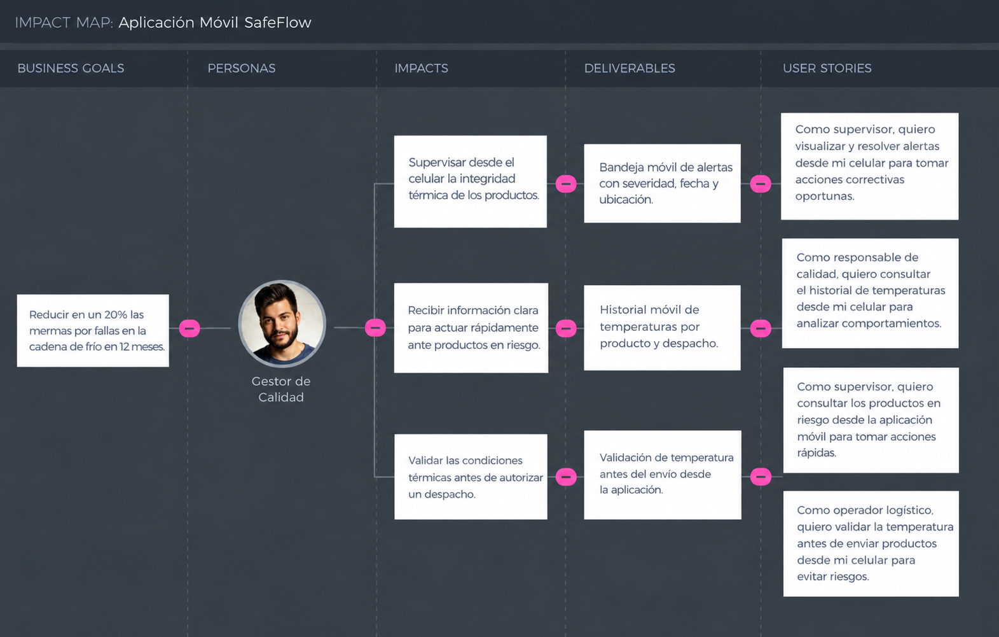
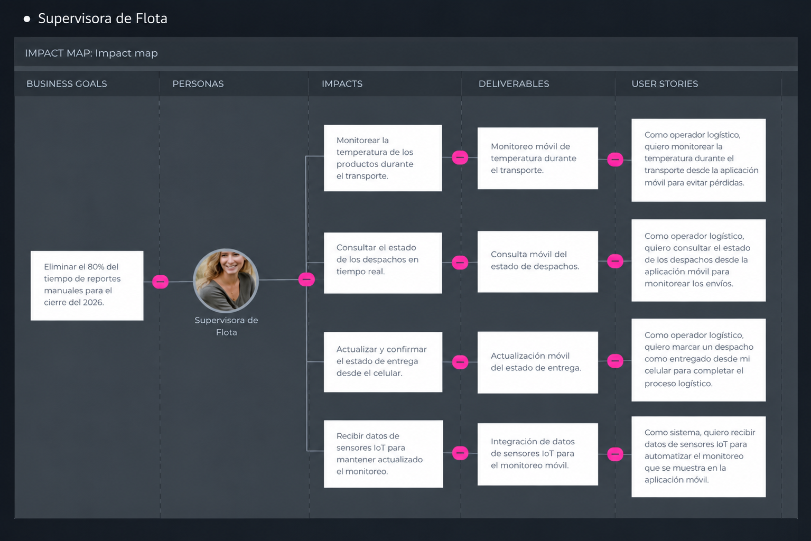

         

<h3 align="center"> Universidad Peruana de Ciencias Aplicadas </h3>

<h3 align="center">Carrera de Ingeniería de Software </h3>

<h3 align="center">
    <b>
        1ACC0238 
    </b>    
</h3>

<h3 align="center"> 
    <b>
        Aplicaciones para Dispositivos Móviles
    </b>
</h3>
<h3 align="center"> NRC </h3>

<h3 align="center">  
    <b>
        3690
    </b>
</h3>

<h3 align="center"> 
    <b>
        Informe de Trabajo Final
    </b>
</h3>

<h3 align="center"> Docente</h3>
<h3 align="center"> 
    <b>
        Mayta Guillermo, Jorge Luis 
    </b>
</h3>

<h3 align="center"> Equipo </h3>
<h3 align="center">  
    <b>
        Cryologic System
    </b>
</h3>

<h3 align="center"> Proyecto</h3>
<h3 align="center">  
    <b>
        SafeFlow
    </b>
</h3>

 

<h3 align="center">  
    <b>
        Integrantes
    </b>
</h3>

 
| Code       |      Member |
| :---:      |     :--- |
| U202218531 | Andy Alejandro Mio Mejia |
| U********* | --------- |
| U********* | --------- |
| U********* | --------- |
| U********* | --------- |

<h3 align="center">
    <b>
        Periodo 202620
    </b>
</h3>
<h3 align="center">
    <b>
        Julio 2026
    </b>
</h3>

## Registro de Versiones del Informe

    
| Versión |   Fecha    |                Autor                |                                                  Descripción de modificación                                                   |
|:-------:|:----------:|:-----------------------------------:|:------------------------------------------------------------------------------------------------------------------------------:|
|   AV1   | 12-09-2026 |   Mio Mejia, Andy Alejandro   |                                                   Descripción de la Startup                                                    |
|   AV1   | 12-09-2026 |   Mio Mejia, Andy Alejandro    |                                               Creación de la carpeta de Imagenes                                               |
|   AV1   | 12-09-2026 |   Mio Mejia, Andy Alejandro    |                                             Creacion de Ramas en los Repositorios                                              |                                              |
|   AV1   | 12-09-2026 |   Mio Mejia, Andy Alejandro    |                                                    Source Code Management.                                                     |              

## Project Report Collaboration Insights

A lo largo del desarrollo del trabajo, se ha evidenciado una participación activa, coordinada y progresiva por parte de todos los integrantes del equipo. Cada fase fue abordada de manera estructurada, siguiendo las buenas prácticas de trabajo colaborativo con control de versiones en GitHub, planificación por entregables, y asignación clara de responsabilidades según las competencias de cada integrante.

El uso de repositorios específicos por subcomponente también contribuyó a mantener una mejor trazabilidad del trabajo colaborativo, integrando ramas por entregables y controlando versiones según el avance de cada sprint.

A continuación, se detallan los repositorios utilizados a lo largo del proyecto:

#### Link del Repositorio del Reporte: [Repositorio del Informe](https://github.com/upc-pre-202620-1acc0238-4950-cryologic/safeflow-report.git)
#### Link del Repositorio de la Landing Page:  [Repositorio del Landing]()
#### Link del Repositorio del Frontend:  [Repositorio del Frontend]()
#### Link del Repositorio del Backend:  [Repositorio del Backend]()

A continuación, se detallan los Link de lo Desarrollado:

#### Link de la Landing Page:  [Link de la Landing Page]()
#### Link de la Plataforma Web:  [Link de la App Web]()

   

| Integrante | Tareas Asignadas                                                                                                                                                                                             |
|------------|------------------------------------------------------------------------------------------------------------------------------------------------------------------------------------------------------------------------------------------------------------------------------------------------------------------------------------------------------------------------------------------------------------------------------------------------------------------------------------------------------------------------------------------------------------------------------------------------------------------------------------------------------------------------------------------------------------------------------------------------------------------------------------------------------------------------------------------------------------------------------------------------------------------------------------------------------------------------------------------------------------------------------------|
| Andy Alejandro Mio Mejia | ****************** |
|  ******************  | ******************                                                                                                                                                                                                                                                                                                                                                                                                                                                                                    |
| ****************** | ****************** |
| ******************    | ******************                                                                                                                                                                                                                                   |
| ******************    | ******************                                                                                                       |

El proceso de colaboración en el informe se realizó mediante commits constantes al repositorio de la organización.

## **Github Collaboration Insights**

Los integrantes son:

* Andy Alejandro Mio Mejia   (AndyMio17)
* ******************   (********)
* ****************** (********)
* ****************** (********)
* ****************** (********)

   

### Github Collaboration  Informe

  
        

### Github Collaboration  Landing

  
        

### Github Collaboration  Frontend

  
        

### Github Collaboration  Backend

  
        

# Contenido

## Tabla de Contenidos

[Registro de versiones del informe](#registro-de-versiones-del-informe)

[Project Report Collaboration Insights](#project-report-collaboration-insights)

[Contenido](#contenido)

[Student Outcome](#student-outcome)

[Capítulo I: Presentación](#capitulo-i-introduccion)

- [1.1. Startup Profile](#11-startup-profile)
  - [1.1.1. Descripción de la Startup](#111-descripción-de-la-startup)
  - [1.1.2. Perfiles de integrantes del equipo](#112-perfiles-de-integrantes-del-equipo)
- [1.2. Solution Profile](#12-solution-profile)
  - [1.2.1. Antecedentes y problemática](#121-antecedentes-y-problemática)
  - [1.2.2. Lean UX Process](#122-lean-ux-process)
    - [1.2.2.1. Lean UX Problem Statements](#1221-lean-ux-problem-statements)
    - [1.2.2.2. Lean UX Assumptions](#1222-lean-ux-assumptions)
    - [1.2.2.3. Lean UX Hypothesis Statements](#1223-lean-ux-hypothesis-statements)
    - [1.2.2.4. Lean UX Canvas](#1224-lean-ux-canvas)
- [1.3. Segmentos objetivo](#13-segmentos-objetivo)

[Capítulo II: Requirements Elicitation & Analysis](#capítulo-ii-requirements-elicitation--analysis-1)

- [Contenido](#contenido)
  - [Tabla de Contenidos](#tabla-de-contenidos)
- [Student Outcome](#student-outcome)
    - [1. Integrante 1](#1-integrante-1)
    - [2. Integrante 2](#2-integrante-2)
    - [3. Integrante 3](#3-integrante-3)
    - [4. Integrante 4](#4-integrante-4)
    - [5. Integrante 5](#5-integrante-5)
- [Capítulo I: Presentación](#capítulo-i-presentación)
  - [1.1. Startup Profile](#11-startup-profile)
    - [1.1.1. Descripción de la Startup](#111-descripción-de-la-startup)
    - [1.1.2. Perfiles de integrantes del equipo](#112-perfiles-de-integrantes-del-equipo)
  - [1.2. Solution Profile](#12-solution-profile)
    - [1.2.1. Antecedentes y problemática](#121-antecedentes-y-problemática)
    - [1.2.2. Lean UX Process](#122-lean-ux-process)
      - [1.2.2.1. Lean UX Problem Statements](#1221-lean-ux-problem-statements)
      - [1.2.2.2. Lean UX Assumptions](#1222-lean-ux-assumptions)
      - [1.2.2.3. Lean UX Hypothesis Statements](#1223-lean-ux-hypothesis-statements)
      - [1.2.2.4. Lean UX Canvas](#1224-lean-ux-canvas)
  - [1.3. Segmentos objetivo](#13-segmentos-objetivo)
- [Capítulo II: Requirements Elicitation \& Analysis](#capítulo-ii-requirements-elicitation--analysis)
  - [2.1. Competidores](#21-competidores)
    - [2.1.1. Análisis competitivo](#211-análisis-competitivo)
    - [2.1.2. Estrategias y tácticas frente a competidores](#212-estrategias-y-tácticas-frente-a-competidores)
  - [2.2. Entrevistas](#22-entrevistas)
    - [2.2.1. Diseño de entrevistas](#221-diseño-de-entrevistas)
    - [2.2.2. Registro de entrevistas](#222-registro-de-entrevistas)
    - [2.2.3. Análisis de entrevistas](#223-análisis-de-entrevistas)
  - [2.3. Needfinding](#23-needfinding)
    - [2.3.1. User Personas](#231-user-personas)
    - [2.3.2. User Task Matrix](#232-user-task-matrix)
    - [2.3.3. User Journey Mapping](#233-user-journey-mapping)
    - [2.3.4. Empathy Mapping](#234-empathy-mapping)
    - [2.3.5. Big Picture EventStorming](#235-big-picture-eventstorming)
    - [2.3.6. Ubiquitous Language](#236-ubiquitous-language)
  - [2.4. Requirements specification](#24-requirements-specification)
    - [2.4.1. User Stories](#241-user-stories)
    - [2.4.2. Impact Mapping](#242-impact-mapping)
    - [2.4.3. Product Backlog](#243-product-backlog)
  - [2.5. Strategic-Level Domain-Driven Design](#25-strategic-level-domain-driven-design)
    - [2.5.1. EventStorming](#251-eventstorming)
      - [2.5.1.1. Candidate Context Discovery](#2511-candidate-context-discovery)
      - [2.5.1.2. Domain Message Flows Modeling](#2512-domain-message-flows-modeling)
      - [2.5.1.3. Context Canvases](#2513-context-canvases)
    - [2.5.2. Context Mapping](#252-context-mapping)
    - [2.5.3. Software Architecture](#253-software-architecture)
      - [2.5.3.1. Software Architecture Context Level Diagrams](#2531-software-architecture-context-level-diagrams)
      - [2.5.3.2. Software Architecture Container Level Diagrams](#2532-software-architecture-container-level-diagrams)
      - [2.5.3.3. Software Architecture Deployment Diagrams](#2533-software-architecture-deployment-diagrams)
  - [2.6. Tactical-Level Domain-Driven Design](#26-tactical-level-domain-driven-design)
    - [2.6.1. Bounded Context: iam](#261-bounded-context-iam)
      - [2.6.1.1. Domain Layer](#2611-domain-layer)
      - [2.6.1.2. Interface Layer](#2612-interface-layer)
      - [2.6.1.3. Application Layer](#2613-application-layer)
      - [2.6.1.4. Infrastructure Layer](#2614-infrastructure-layer)
      - [2.6.1.5. Bounded Context Software Architecture Component Level Diagrams](#2615-bounded-context-software-architecture-component-level-diagrams)
      - [2.6.1.6. Bounded Context Software Architecture Code Level Diagrams](#2616-bounded-context-software-architecture-code-level-diagrams)
        - [2.6.1.6.1. Bounded Context Domain Layer Class Diagrams](#26161-bounded-context-domain-layer-class-diagrams)
        - [2.6.1.6.2. Bounded Context Database Design Diagram](#26162-bounded-context-database-design-diagram)
    - [2.6.2. Bounded Context: alerts](#262-bounded-context-alerts)
      - [2.6.2.1. Domain Layer](#2621-domain-layer)
      - [2.6.2.2. Interface Layer](#2622-interface-layer)
      - [2.6.2.3. Application Layer](#2623-application-layer)
      - [2.6.2.4. Infrastructure Layer](#2624-infrastructure-layer)
      - [2.6.2.5. Bounded Context Software Architecture Component Level Diagrams](#2625-bounded-context-software-architecture-component-level-diagrams)
      - [2.6.2.6. Bounded Context Software Architecture Code Level Diagrams](#2626-bounded-context-software-architecture-code-level-diagrams)
        - [2.6.2.6.1. Bounded Context Domain Layer Class Diagrams](#26261-bounded-context-domain-layer-class-diagrams)
        - [2.6.2.6.2. Bounded Context Database Design Diagram](#26262-bounded-context-database-design-diagram)
    - [2.6.3. Bounded Context: analytics](#263-bounded-context-analytics)
      - [2.6.3.1. Domain Layer](#2631-domain-layer)
      - [2.6.3.2. Interface Layer](#2632-interface-layer)
      - [2.6.3.3. Application Layer](#2633-application-layer)
      - [2.6.3.4. Infrastructure Layer](#2634-infrastructure-layer)
      - [2.6.3.5. Bounded Context Software Architecture Component Level Diagrams](#2635-bounded-context-software-architecture-component-level-diagrams)
      - [2.6.3.6. Bounded Context Software Architecture Code Level Diagrams](#2636-bounded-context-software-architecture-code-level-diagrams)
        - [2.6.3.6.1. Bounded Context Domain Layer Class Diagrams](#26361-bounded-context-domain-layer-class-diagrams)
        - [2.6.3.6.2. Bounded Context Database Design Diagram](#26362-bounded-context-database-design-diagram)
    - [2.6.4. Bounded Context: environmental-monitoring](#264-bounded-context-environmental-monitoring)
      - [2.6.4.1. Domain Layer](#2641-domain-layer)
      - [2.6.4.2. Interface Layer](#2642-interface-layer)
      - [2.6.4.3. Application Layer](#2643-application-layer)
      - [2.6.4.4. Infrastructure Layer](#2644-infrastructure-layer)
      - [2.6.4.5. Bounded Context Software Architecture Component Level Diagrams](#2645-bounded-context-software-architecture-component-level-diagrams)
      - [2.6.4.6. Bounded Context Software Architecture Code Level Diagrams](#2646-bounded-context-software-architecture-code-level-diagrams)
        - [2.6.4.6.1. Bounded Context Domain Layer Class Diagrams](#26461-bounded-context-domain-layer-class-diagrams)
        - [2.6.4.6.2. Bounded Context Database Design Diagram](#26462-bounded-context-database-design-diagram)
    - [2.6.5. Bounded Context: inventory](#265-bounded-context-inventory)
      - [2.6.5.1. Domain Layer](#2651-domain-layer)
      - [2.6.5.2. Interface Layer](#2652-interface-layer)
      - [2.6.5.3. Application Layer](#2653-application-layer)
      - [2.6.5.4. Infrastructure Layer](#2654-infrastructure-layer)
      - [2.6.5.5. Bounded Context Software Architecture Component Level Diagrams](#2655-bounded-context-software-architecture-component-level-diagrams)
      - [2.6.5.6. Bounded Context Software Architecture Code Level Diagrams](#2656-bounded-context-software-architecture-code-level-diagrams)
        - [2.6.5.6.1. Bounded Context Domain Layer Class Diagrams](#26561-bounded-context-domain-layer-class-diagrams)
        - [2.6.5.6.2. Bounded Context Database Design Diagram](#26562-bounded-context-database-design-diagram)
    - [2.6.6. Bounded Context: logistics](#266-bounded-context-logistics)
      - [2.6.6.1. Domain Layer](#2661-domain-layer)
      - [2.6.6.2. Interface Layer](#2662-interface-layer)
      - [2.6.6.3. Application Layer](#2663-application-layer)
      - [2.6.6.4. Infrastructure Layer](#2664-infrastructure-layer)
      - [2.6.6.5. Bounded Context Software Architecture Component Level Diagrams](#2665-bounded-context-software-architecture-component-level-diagrams)
      - [2.6.6.6. Bounded Context Software Architecture Code Level Diagrams](#2666-bounded-context-software-architecture-code-level-diagrams)
        - [2.6.6.6.1. Bounded Context Domain Layer Class Diagrams](#26661-bounded-context-domain-layer-class-diagrams)
        - [2.6.6.6.2. Bounded Context Database Design Diagram](#26662-bounded-context-database-design-diagram)
    - [2.6.7. Bounded Context: reporting](#267-bounded-context-reporting)
      - [2.6.7.1. Domain Layer](#2671-domain-layer)
      - [2.6.7.2. Interface Layer](#2672-interface-layer)
      - [2.6.7.3. Application Layer](#2673-application-layer)
      - [2.6.7.4. Infrastructure Layer](#2674-infrastructure-layer)
      - [2.6.7.5. Bounded Context Software Architecture Component Level Diagrams](#2675-bounded-context-software-architecture-component-level-diagrams)
      - [2.6.7.6. Bounded Context Software Architecture Code Level Diagrams](#2676-bounded-context-software-architecture-code-level-diagrams)
        - [2.6.7.6.1. Bounded Context Domain Layer Class Diagrams](#26761-bounded-context-domain-layer-class-diagrams)
        - [2.6.7.6.2. Bounded Context Database Design Diagram](#26762-bounded-context-database-design-diagram)

<!--
 
Capítulo III: Solution UI/UX Design 
3.1. Product design 
3.1.1. Style Guidelines 
3.1.1.1. General Style Guidelines 
3.1.2. Information Architecture 
3.1.2.1. Organization Systems 
3.1.2.2. Labelling Systems 
3.1.2.3. SEO Tags and Meta Tags 
3.1.2.4. Searching Systems 
3.1.2.5. Navigation Systems 
3.1.3. Landing Page UI Design 
3.1.3.1. Landing Page Wireframe 
3.1.3.2. Landing Page Mock-up 
3.1.4. Mobile Applications UX/UI Design 
3.1.4.1. Mobile Applications Wireframes
3.1.4.2. Mobile Applications Wireflow Diagrams 
3.1.4.3. Mobile Applications Mock-ups 
3.1.4.4. Mobile Applications User Flow Diagrams 
3.1.4.5. Mobile Applications Prototyping 

Capítulo IV: Product Implementation & Validation 
4. Product Implementation & Validation 
4.1. Software Configuration Management 
4.1.1. Software Development Environment Configuration 
4.1.2. Source Code Management 
4.1.3. Source Code Style Guide & Conventions 
4.1.4. Software Deployment Configuration 
4.2. Landing Page & Mobile Application Implementation 
4.2.1. Sprint n 
4.2.1.1. Sprint Planning n 
4.2.1.2. Aspect Leaders and Collaborators 
4.2.1.3. Sprint Backlog n 
4.2.1.4. Development Evidence for Sprint Review
4.2.1.5. Testing Suite Evidence for Sprint Review 
4.2.1.6. Execution Evidence for Sprint Review 
4.2.1.7. Services Documentation Evidence for Sprint Review 
4.2.1.8. Software Deployment Evidence for Sprint Review
4.2.1.9. Team Collaboration Insights during Sprint
4.3. Validation Interviews 
4.3.1. Diseño de Entrevistas 
4.3.2. Registro de Entrevistas 
4.3.3. Evaluaciones según heurísticas

Conclusiones 
Conclusiones y recomendaciones. 
Video App Validation 
Video About the product 
Video About the team 
Glosario 
Bibliografía 
Anexos
 -->

[Capítulo III: Solution UI/UX Design](#capítulo-iii-solution-uiux-design)

- [3.1. Product Design](#31-product-design)
  - [3.1.1. Style Guidelines](#311-style-guidelines)
    - [3.1.1.1. General Style Guidelines](#3111-general-style-guidelines)
  - [3.1.2. Information Architecture](#312-information-architecture)
    - [3.1.2.1. Organization Systems](#3121-organization-systems)
    - [3.1.2.2. Labelling Systems](#3122-labelling-systems)
    - [3.1.2.3. SEO Tags and Meta Tags](#3123-seo-tags-and-meta-tags)
    - [3.1.2.4. Searching Systems](#3124-searching-systems)
    - [3.1.2.5. Navigation Systems](#3125-navigation-systems)
  - [3.1.3. Landing Page UI Design](#313-landing-page-ui-design)
    - [3.1.3.1. Landing Page Wireframe](#3131-landing-page-wireframe)
    - [3.1.3.2. Landing Page Mock-up](#3132-landing-page-mock-up)
  - [3.1.4. Mobile Applications UX/UI Design](#314-mobile-applications-uxui-design)
    - [3.1.4.1. Mobile Applications Wireframes](#3141-mobile-applications-wireframes)
    - [3.1.4.2. Mobile Applications Wireflow Diagrams](#3142-mobile-applications-wireflow-diagrams)
    - [3.1.4.3. Mobile Applications Mock-ups](#3143-mobile-applications-mock-ups)
    - [3.1.4.4. Mobile Applications User Flow Diagrams](#3144-mobile-applications-user-flow-diagrams)
    - [3.1.4.5. Mobile Applications Prototyping](#3145-mobile-applications-prototyping)

[Capítulo IV: Product Implementation & Validation](#capítulo-iv-product-implementation-validation)

- [4. Product Implementation & Validation](#4-product-implementation-validation)
  - [4.1. Software Configuration Management](#41-software-configuration-management)
    - [4.1.1. Software Development Environment Configuration](#411-software-development-environment-configuration)
    - [4.1.2. Source Code Management](#412-source-code-management)
    - [4.1.3. Source Code Style Guide & Conventions](#413-source-code-style-guide--conventions)
    - [4.1.4. Software Deployment Configuration](#414-software-deployment-configuration)
  - [4.2. Landing Page & Mobile Application Implementation](#42-landing-page--mobile-application-implementation)
    - [4.2.1. Sprint n](#421-sprint-n)
      - [4.2.1.1. Sprint Planning n](#4211-sprint-planning-n)
      - [4.2.1.2. Aspect Leaders and Collaborators](#4212-aspect-leaders-and-collaborators)
      - [4.2.1.3. Sprint Backlog n](#4213-sprint-backlog-n)
      - [4.2.1.4. Development Evidence for Sprint Review](#4214-development-evidence-for-sprint-review)
      - [4.2.1.5. Testing Suite Evidence for Sprint Review](#4215-testing-suite-evidence-for-sprint-review)
      - [4.2.1.6. Execution Evidence for Sprint Review](#4216-execution-evidence-for-sprint-review)
      - [4.2.1.7. Services Documentation Evidence for Sprint Review](#4217-services-documentation-evidence-for-sprint-review)
      - [4.2.1.8. Software Deployment Evidence for Sprint Review](#4218-software-deployment-evidence-for-sprint-review)
      - [4.2.1.9. Team Collaboration Insights during Sprint](#4219-team-collaboration-insights-during-sprint)
  - [4.3. Validation Interviews](#43-validation-interviews)
    - [4.3.1. Diseño de Entrevistas](#431-diseño-de-entrevistas)
    - [4.3.2. Registro de Entrevistas](#432-registro-de-entrevistas)
    - [4.3.3. Evaluaciones según heurísticas](#433-evaluaciones-según-heurísticas)

[Conclusiones y recomendaciones](#conclusiones-y-recomendaciones)

[Video App Validation](#video-app-validation)

[Video About the product](#video-about-the-product)

[Video About the team](#video-about-the-team)

[Glosario](#glosario)

[Bibliografía](#bibliografía)

[Anexos](#anexos)

# Student Outcome

A continuación, cada integrante del equipo detallará su contribución al proyecto en base a los criterios del Student Outcome (Trabajo en equipo, liderazgo, entorno colaborativo y cumplimiento de metas).

### 1. Integrante 1
* **Criterio específico:** [Por completar]
* **Acciones realizadas:** 
  * [Por completar]
* **Conclusiones:** [Por completar]

### 2. Integrante 2
* **Criterio específico:** [Por completar]
* **Acciones realizadas:** 
  * [Por completar]
* **Conclusiones:** [Por completar]

### 3. Integrante 3
* **Criterio específico:** [Por completar]
* **Acciones realizadas:** 
  * [Por completar]
* **Conclusiones:** [Por completar]

### 4. Integrante 4
* **Criterio específico:** [Por completar]
* **Acciones realizadas:** 
  * [Por completar]
* **Conclusiones:** [Por completar]

### 5. Integrante 5
* **Criterio específico:** [Por completar]
* **Acciones realizadas:** 
  * [Por completar]
* **Conclusiones:** [Por completar]

# Capítulo I: Presentación

## 1.1. Startup Profile

### 1.1.1. Descripción de la Startup

### 1.1.2. Perfiles de integrantes del equipo

## 1.2. Solution Profile

### 1.2.1. Antecedentes y problemática

### 1.2.2. Lean UX Process

#### 1.2.2.1. Lean UX Problem Statements

#### 1.2.2.2. Lean UX Assumptions

#### 1.2.2.3. Lean UX Hypothesis Statements

#### 1.2.2.4. Lean UX Canvas

## 1.3. Segmentos objetivo

# Capítulo II: Requirements Elicitation & Analysis

## 2.1. Competidores

### 2.1.1. Análisis competitivo

### 2.1.2. Estrategias y tácticas frente a competidores

## 2.2. Entrevistas

### 2.2.1. Diseño de entrevistas

### 2.2.2. Registro de entrevistas

### 2.2.3. Análisis de entrevistas

## 2.3. Needfinding

### 2.3.1. User Personas
Segmento 1

### 2.3.2. User Task Matrix

### 2.3.3. User Journey Mapping

### 2.3.4. Empathy Mapping

### 2.3.5. Big Picture EventStorming

### 2.3.6. Ubiquitous Language

## 2.4. Requirements specification

### 2.4.1. User Stories

<table>
  <tr><th>Epic ID</th><th>Nombre del Epic</th></tr>
  <tr><td>EP-01</td><td>Gestión de Inventario</td></tr>
  <tr><td>EP-02</td><td>Monitoreo de Temperatura</td></tr>
  <tr><td>EP-03</td><td>Gestión de Alertas</td></tr>
  <tr><td>EP-04</td><td>Gestión Logística</td></tr>
  <tr><td>EP-05</td><td>Gestión del Sistema (Usuarios, Reportes y Dashboard)</td></tr>
  <tr><td>EP-06</td><td>Acceso y captación de usuarios</td></tr>
</table>

| ID | Título | Descripción | Criterios de Aceptación | Epic |
|-----|--------|-------------|--------------------------|------|
| US-01 | Registrar producto | Como operador logístico, quiero registrar productos con sus rangos de temperatura desde la aplicación móvil para garantizar su correcta conservación. | **E1-Éxito:** Datos válidos guardados desde el formulario móvil registran el producto. **E2-Error:** Campos obligatorios vacíos muestran validación. **E3-Error:** Un rango mínimo mayor al máximo muestra error. | EP-01 |
| US-02 | Registrar ingreso de stock | Como operador logístico, quiero registrar el ingreso de productos al inventario desde mi celular para actualizar las cantidades disponibles. | **E1-Éxito:** Producto existente y cantidad válida actualizan el inventario. **E2-Error:** Una cantidad cero o negativa muestra validación. **E3-Error:** Un producto inexistente muestra el error correspondiente. | EP-01 |
| US-03 | Visualizar temperatura en tiempo real | Como operador logístico, quiero visualizar la temperatura en tiempo real desde la aplicación móvil para detectar anomalías durante la operación. | **E1-Éxito:** Los sensores activos muestran lecturas actualizadas. **E2-Alterno:** Una lectura fuera de rango se destaca y genera notificación. **E3-Error:** Una desconexión muestra la última lectura y el estado del sensor. | EP-02 |
| US-04 | Detectar anomalías de temperatura | Como sistema, quiero detectar automáticamente temperaturas fuera del rango permitido para prevenir riesgos en los productos. | **E1-Éxito:** Una temperatura fuera de rango marca el producto como "En Riesgo". **E2-Éxito:** Un patrón crítico eleva la severidad y notifica a los responsables. **E3-Alterno:** Una lectura dentro de tolerancia se registra como advertencia. | EP-02 |
| US-05 | Generar alertas | Como sistema, quiero generar alertas automáticas para notificar anomalías de la cadena de frío en los dispositivos autorizados. | **E1-Éxito:** La anomalía crea una alerta única con estado "Activa". **E2-Éxito:** Los usuarios autorizados reciben una notificación. **E3-Alterno:** Las alertas repetidas se agrupan para evitar notificaciones innecesarias. | EP-03 |
| US-06 | Gestionar alertas | Como supervisor, quiero visualizar y resolver alertas desde mi celular para tomar acciones correctivas oportunas. | **E1-Éxito:** La bandeja muestra descripción, severidad, fecha y ubicación. **E2-Éxito:** Registrar la acción correctiva cambia la alerta a "Resuelta" y conserva el historial. **E3-Alterno:** Sin alertas activas se muestra el historial. | EP-03 |
| US-07 | Monitorear transporte | Como operador logístico, quiero monitorear la temperatura durante el transporte desde la aplicación móvil para evitar pérdidas. | **E1-Éxito:** Las lecturas se vinculan al despacho con sensor asignado. **E2-Éxito:** El historial se muestra ordenado por fecha y hora. **E3-Error:** Un sensor desconectado muestra su estado y notifica al usuario. | EP-04 |
| US-10 | Consultar inventario | Como operador logístico, quiero consultar el inventario desde mi celular para conocer el estado de los productos. | **E1-Éxito:** La lista muestra nombre, cantidad, estado y rango de temperatura. **E2-Alterno:** Sin productos se muestra un estado vacío con opción de agregar. **E3-Éxito:** Los filtros muestran solo productos del estado seleccionado. | EP-01 |
| US-13 | Visualizar dashboard | Como usuario, quiero ver un resumen general del sistema en la aplicación móvil para tomar decisiones rápidas. | **E1-Éxito:** El inicio muestra indicadores de productos, alertas y despachos. **E2-Alterno:** Cada rol visualiza solo sus indicadores permitidos. **E3-Alterno:** Sin datos se muestra un estado vacío con una acción sugerida. | EP-05 |
| US-17 | Visualizar historial de temperatura | Como responsable de calidad, quiero consultar el historial de temperaturas desde mi celular para analizar comportamientos. | **E1-Éxito:** El detalle muestra lecturas, fechas, horas y estados. **E2-Alterno:** Sin registros se muestra un mensaje informativo. **E3-Éxito:** Un rango de fechas filtra las lecturas correspondientes. | EP-02 |
| US-18 | Controlar acceso por rol | Como administrador, quiero restringir las funciones según el rol para proteger la información de SafeFlow. | **E1-Éxito:** El supervisor visualiza solo sus funciones autorizadas. **E2-Éxito:** El operador accede únicamente a acciones operativas. **E3-Error:** Una función no autorizada es bloqueada con un mensaje informativo. | EP-05 |
| US-19 | Registrar lote de producto | Como operador logístico, quiero registrar el lote de un producto desde mi celular para asegurar su trazabilidad. | **E1-Éxito:** Un lote válido queda vinculado al producto. **E2-Error:** Un lote vacío muestra validación. **E3-Alterno:** Un lote duplicado permite revisar el registro existente. | EP-01 |
| US-20 | Consultar productos en riesgo | Como supervisor, quiero consultar los productos en riesgo desde la aplicación móvil para tomar acciones rápidas. | **E1-Éxito:** La vista muestra la anomalía y temperatura actual. **E2-Alterno:** Sin productos en riesgo se muestra un mensaje informativo. **E3-Éxito:** El detalle incluye el historial de anomalías. | EP-01 |
| US-24 | Actualizar estado de entrega | Como operador logístico, quiero marcar un despacho como entregado desde mi celular para completar el proceso logístico. | **E1-Éxito:** Un despacho en tránsito cambia a "Entregado" y registra fecha y hora. **E2-Error:** Sin autorización se muestra un error de permisos. **E3-Alterno:** Un despacho ya entregado muestra una advertencia. | EP-04 |
| US-25 | Consultar estado de despacho | Como operador logístico, quiero consultar el estado de los despachos desde la aplicación móvil para monitorear los envíos. | **E1-Éxito:** La lista muestra estado, producto y temperatura. **E2-Alterno:** Sin despachos se muestra un estado vacío. **E3-Éxito:** El filtro muestra solo los despachos del estado seleccionado. | EP-04 |
| US-30 | Registrarse en la aplicación | Como visitante, quiero registrarme desde la aplicación móvil para acceder a SafeFlow. | **E1-Éxito:** Datos válidos y términos aceptados crean la cuenta y solicitan verificación. **E2-Error:** Un correo existente ofrece iniciar sesión o recuperar la cuenta. **E3-Error:** Una contraseña débil muestra sus requisitos. | EP-05 |
| US-31 | Iniciar sesión | Como usuario, quiero iniciar sesión en la aplicación móvil para acceder a las funciones de SafeFlow. | **E1-Éxito:** Credenciales válidas permiten acceder al inicio. **E2-Error:** Credenciales incorrectas muestran un mensaje de error. **E3-Error:** Los intentos fallidos excesivos bloquean temporalmente la cuenta y ofrecen recuperarla. | EP-05 |
| US-34 | Acceder desde dispositivos móviles | Como usuario, quiero utilizar SafeFlow desde mi celular o tableta para supervisar la operación desde cualquier lugar. | **E1-Éxito:** El celular muestra vistas funcionales y usables con una mano. **E2-Éxito:** La tableta aprovecha el espacio disponible. **E3-Éxito:** Una notificación permite abrir directamente el detalle relacionado. | EP-06 |
| US-42 | Cerrar sesión | Como usuario, quiero cerrar sesión para proteger mi información en el dispositivo. | **E1-Éxito:** Cerrar sesión finaliza la sesión y muestra el acceso. **E2-Éxito:** Una sesión expirada solicita autenticarse nuevamente. **E3-Alterno:** Cerrar sesión elimina las credenciales almacenadas localmente. | EP-05 |
| US-47 | Validar condiciones antes del envío | Como operador logístico, quiero validar la temperatura antes de enviar productos desde mi celular para evitar riesgos. | **E1-Éxito:** Una temperatura normal permite continuar con el despacho. **E2-Alterno:** Una temperatura en riesgo muestra advertencia y solicita confirmación autorizada. **E3-Error:** Sin datos de temperatura se bloquea el envío. | EP-04 |
| US-52 | Integrar con sensores IoT | Como sistema, quiero recibir datos de sensores IoT para automatizar el monitoreo que se muestra en la aplicación móvil. | **E1-Éxito:** Los datos de un sensor activo se registran y actualizan la aplicación. **E2-Error:** Los datos inválidos se rechazan y registran el error. **E3-Error:** La desconexión de un sensor genera una alerta. | EP-02 |
| US-55 | Visualizar alertas en el inicio | Como usuario, quiero ver las alertas activas en el inicio de la aplicación móvil para reaccionar rápidamente. | **E1-Éxito:** Las alertas activas se muestran destacadas por severidad. **E2-Alterno:** Sin alertas se muestra el estado "Sin alertas". **E3-Éxito:** Seleccionar una alerta abre su detalle y permite registrar una acción. | EP-05 |

### 2.4.2. Impact Mapping 

* Gestor de Calidad

* Supervisora de Flota

### 2.4.3. Product Backlog

<table style="width:100%; border-collapse: collapse;">
  <thead>
    <tr style="background-color: #f2f2f2;">
      <th style="border: 1px solid #dddddd; padding: 8px;"># Orden</th>
      <th style="border: 1px solid #dddddd; padding: 8px;">User Story Id</th>
      <th style="border: 1px solid #dddddd; padding: 8px;">Título</th>
      <th style="border: 1px solid #dddddd; padding: 8px;">Descripción</th>
      <th style="border: 1px solid #dddddd; padding: 8px;">Story Points (1/2/3/5/8)</th>
    </tr>
  </thead>
  <tbody>
    <tr><td><b>1</b></td><td>US-31</td><td>Iniciar sesión</td><td>Como usuario, quiero iniciar sesión en la aplicación móvil para acceder a las funciones de SafeFlow.</td><td style="text-align: center;">2</td></tr>
    <tr><td><b>2</b></td><td>US-18</td><td>Controlar acceso por rol</td><td>Como administrador, quiero restringir las funciones según el rol para proteger la información de SafeFlow.</td><td style="text-align: center;">5</td></tr>
    <tr><td><b>3</b></td><td>US-30</td><td>Registrarse en la aplicación</td><td>Como visitante, quiero registrarme desde la aplicación móvil para acceder a SafeFlow.</td><td style="text-align: center;">3</td></tr>
    <tr><td><b>4</b></td><td>US-13</td><td>Visualizar dashboard</td><td>Como usuario, quiero ver un resumen general del sistema en la aplicación móvil para tomar decisiones rápidas.</td><td style="text-align: center;">5</td></tr>
    <tr><td><b>5</b></td><td>US-55</td><td>Visualizar alertas en el inicio</td><td>Como usuario, quiero ver las alertas activas en el inicio de la aplicación móvil para reaccionar rápidamente.</td><td style="text-align: center;">2</td></tr>
    <tr><td><b>6</b></td><td>US-03</td><td>Visualizar temperatura en tiempo real</td><td>Como operador logístico, quiero visualizar la temperatura en tiempo real desde la aplicación móvil para detectar anomalías.</td><td style="text-align: center;">5</td></tr>
    <tr><td><b>7</b></td><td>US-04</td><td>Detectar anomalías de temperatura</td><td>Como sistema, quiero detectar automáticamente temperaturas fuera del rango permitido para prevenir riesgos.</td><td style="text-align: center;">5</td></tr>
    <tr><td><b>8</b></td><td>US-05</td><td>Generar alertas</td><td>Como sistema, quiero generar alertas automáticas para notificar anomalías de la cadena de frío.</td><td style="text-align: center;">3</td></tr>
    <tr><td><b>9</b></td><td>US-06</td><td>Gestionar alertas</td><td>Como supervisor, quiero visualizar y resolver alertas desde mi celular para tomar acciones correctivas.</td><td style="text-align: center;">3</td></tr>
    <tr><td><b>10</b></td><td>US-52</td><td>Integrar con sensores IoT</td><td>Como sistema, quiero recibir datos de sensores IoT para automatizar el monitoreo móvil.</td><td style="text-align: center;">8</td></tr>
    <tr><td><b>11</b></td><td>US-07</td><td>Monitorear transporte</td><td>Como operador logístico, quiero monitorear la temperatura durante el transporte desde la aplicación móvil para evitar pérdidas.</td><td style="text-align: center;">5</td></tr>
    <tr><td><b>12</b></td><td>US-17</td><td>Visualizar historial de temperatura</td><td>Como responsable de calidad, quiero consultar el historial de temperaturas desde mi celular para analizar comportamientos.</td><td style="text-align: center;">3</td></tr>
    <tr><td><b>13</b></td><td>US-01</td><td>Registrar producto</td><td>Como operador logístico, quiero registrar productos con sus rangos de temperatura desde la aplicación móvil.</td><td style="text-align: center;">3</td></tr>
    <tr><td><b>14</b></td><td>US-02</td><td>Registrar ingreso de stock</td><td>Como operador logístico, quiero registrar el ingreso de productos al inventario desde mi celular.</td><td style="text-align: center;">3</td></tr>
    <tr><td><b>15</b></td><td>US-10</td><td>Consultar inventario</td><td>Como operador logístico, quiero consultar el inventario desde mi celular para conocer el estado de los productos.</td><td style="text-align: center;">2</td></tr>
    <tr><td><b>16</b></td><td>US-19</td><td>Registrar lote de producto</td><td>Como operador logístico, quiero registrar el lote de un producto desde mi celular para asegurar su trazabilidad.</td><td style="text-align: center;">3</td></tr>
    <tr><td><b>17</b></td><td>US-20</td><td>Consultar productos en riesgo</td><td>Como supervisor, quiero consultar los productos en riesgo desde la aplicación móvil para tomar acciones rápidas.</td><td style="text-align: center;">2</td></tr>
    <tr><td><b>18</b></td><td>US-47</td><td>Validar condiciones antes del envío</td><td>Como operador logístico, quiero validar la temperatura antes de enviar productos desde mi celular.</td><td style="text-align: center;">3</td></tr>
    <tr><td><b>19</b></td><td>US-24</td><td>Actualizar estado de entrega</td><td>Como operador logístico, quiero marcar un despacho como entregado desde mi celular para completar el proceso.</td><td style="text-align: center;">2</td></tr>
    <tr><td><b>20</b></td><td>US-25</td><td>Consultar estado de despacho</td><td>Como operador logístico, quiero consultar el estado de los despachos desde la aplicación móvil.</td><td style="text-align: center;">2</td></tr>
    <tr><td><b>21</b></td><td>US-34</td><td>Acceder desde dispositivos móviles</td><td>Como usuario, quiero utilizar SafeFlow desde mi celular o tableta para supervisar la operación desde cualquier lugar.</td><td style="text-align: center;">3</td></tr>
    <tr><td><b>22</b></td><td>US-42</td><td>Cerrar sesión</td><td>Como usuario, quiero cerrar sesión para proteger mi información en el dispositivo.</td><td style="text-align: center;">1</td></tr>
  </tbody>
</table>

## 2.5. Strategic-Level Domain-Driven Design

### 2.5.1. EventStorming

#### 2.5.1.1. Candidate Context Discovery

#### 2.5.1.2. Domain Message Flows Modeling

#### 2.5.1.3. Context Canvases

### 2.5.2. Context Mapping

### 2.5.3. Software Architecture

#### 2.5.3.1. Software Architecture Context Level Diagrams

#### 2.5.3.2. Software Architecture Container Level Diagrams

#### 2.5.3.3. Software Architecture Deployment Diagrams

## 2.6. Tactical-Level Domain-Driven Design

### 2.6.1. Bounded Context: iam

#### 2.6.1.1. Domain Layer

#### 2.6.1.2. Interface Layer

#### 2.6.1.3. Application Layer

#### 2.6.1.4. Infrastructure Layer

#### 2.6.1.5. Bounded Context Software Architecture Component Level Diagrams

#### 2.6.1.6. Bounded Context Software Architecture Code Level Diagrams

##### 2.6.1.6.1. Bounded Context Domain Layer Class Diagrams

##### 2.6.1.6.2. Bounded Context Database Design Diagram

### 2.6.2. Bounded Context: alerts

#### 2.6.2.1. Domain Layer

#### 2.6.2.2. Interface Layer

#### 2.6.2.3. Application Layer

#### 2.6.2.4. Infrastructure Layer

#### 2.6.2.5. Bounded Context Software Architecture Component Level Diagrams

#### 2.6.2.6. Bounded Context Software Architecture Code Level Diagrams

##### 2.6.2.6.1. Bounded Context Domain Layer Class Diagrams

##### 2.6.2.6.2. Bounded Context Database Design Diagram

### 2.6.3. Bounded Context: analytics

#### 2.6.3.1. Domain Layer

#### 2.6.3.2. Interface Layer

#### 2.6.3.3. Application Layer

#### 2.6.3.4. Infrastructure Layer

#### 2.6.3.5. Bounded Context Software Architecture Component Level Diagrams

#### 2.6.3.6. Bounded Context Software Architecture Code Level Diagrams

##### 2.6.3.6.1. Bounded Context Domain Layer Class Diagrams

##### 2.6.3.6.2. Bounded Context Database Design Diagram

### 2.6.4. Bounded Context: environmental-monitoring

#### 2.6.4.1. Domain Layer

#### 2.6.4.2. Interface Layer

#### 2.6.4.3. Application Layer

#### 2.6.4.4. Infrastructure Layer

#### 2.6.4.5. Bounded Context Software Architecture Component Level Diagrams

#### 2.6.4.6. Bounded Context Software Architecture Code Level Diagrams

##### 2.6.4.6.1. Bounded Context Domain Layer Class Diagrams

##### 2.6.4.6.2. Bounded Context Database Design Diagram

### 2.6.5. Bounded Context: inventory

#### 2.6.5.1. Domain Layer

#### 2.6.5.2. Interface Layer

#### 2.6.5.3. Application Layer

#### 2.6.5.4. Infrastructure Layer

#### 2.6.5.5. Bounded Context Software Architecture Component Level Diagrams

#### 2.6.5.6. Bounded Context Software Architecture Code Level Diagrams

##### 2.6.5.6.1. Bounded Context Domain Layer Class Diagrams

##### 2.6.5.6.2. Bounded Context Database Design Diagram

### 2.6.6. Bounded Context: logistics

#### 2.6.6.1. Domain Layer

#### 2.6.6.2. Interface Layer

#### 2.6.6.3. Application Layer

#### 2.6.6.4. Infrastructure Layer

#### 2.6.6.5. Bounded Context Software Architecture Component Level Diagrams

#### 2.6.6.6. Bounded Context Software Architecture Code Level Diagrams

##### 2.6.6.6.1. Bounded Context Domain Layer Class Diagrams

##### 2.6.6.6.2. Bounded Context Database Design Diagram

### 2.6.7. Bounded Context: reporting

#### 2.6.7.1. Domain Layer

#### 2.6.7.2. Interface Layer

#### 2.6.7.3. Application Layer

#### 2.6.7.4. Infrastructure Layer

#### 2.6.7.5. Bounded Context Software Architecture Component Level Diagrams

#### 2.6.7.6. Bounded Context Software Architecture Code Level Diagrams

##### 2.6.7.6.1. Bounded Context Domain Layer Class Diagrams

##### 2.6.7.6.2. Bounded Context Database Design Diagram

