

         

<h3 align="center"> Universidad Peruana de Ciencias Aplicadas </h3>

<h3 align="center">Carrera de Ingeniería de Software </h3>

<h3 align="center">
    <b>
        1ACC0238 
    </b>    
</h3>

<h3 align="center"> 
    <b>
        Aplicaciones para Dispositivos Móviles
    </b>
</h3>
<h3 align="center"> NRC </h3>

<h3 align="center">  
    <b>
        3690
    </b>
</h3>

<h3 align="center"> 
    <b>
        Informe de Trabajo Final
    </b>
</h3>

<h3 align="center"> Docente</h3>
<h3 align="center"> 
    <b>
        Mayta Guillermo, Jorge Luis 
    </b>
</h3>

<h3 align="center"> Equipo </h3>
<h3 align="center">  
    <b>
        Cryologic System
    </b>
</h3>

<h3 align="center"> Proyecto</h3>
<h3 align="center">  
    <b>
        SafeFlow
    </b>
</h3>

 

<h3 align="center">  
    <b>
        Integrantes
    </b>
</h3>

 
| Code       |      Member |
| :---:      |     :--- |
| U202218531 | Andy Alejandro Mio Mejia |
| U202123362 | Sebastian Alonso Bustinza Muñoz |
| U202316049 | Jefferson Bayron Morales Yapuchura |
| U202219199 | Abraam Bernabe Acosta Elera |

<h3 align="center">
    <b>
        Periodo 202620
    </b>
</h3>
<h3 align="center">
    <b>
        Julio 2026
    </b>
</h3>

## Registro de Versiones del Informe

    
| Versión |   Fecha    |                Autor                |                                                  Descripción de modificación                                                   |
|:-------:|:----------:|:-----------------------------------:|:------------------------------------------------------------------------------------------------------------------------------:|
|   AV1   | 12-09-2026 |   Mio Mejia, Andy Alejandro   |                                                   Descripción de la Startup                                                    |
|   AV1   | 12-09-2026 |   Mio Mejia, Andy Alejandro    |                                               Creación de la carpeta de Imagenes                                               |
|   AV1   | 12-09-2026 |   Mio Mejia, Andy Alejandro    |                                             Creacion de Ramas en los Repositorios                                              |                                              |
|   AV1   | 12-09-2026 |   Mio Mejia, Andy Alejandro    |                                                    Source Code Management.                                                     |              
|   AV1   | 18-09-2026 |   Bustinza Muñoz, Sebastian Alonso    |                                                    Needfinding                                                     |
|   AV1   | 18-09-2026 |   Morales Yapuchura, Jefferson Bayron   |                                                      Análisis competitivo                                              |
|   AV1   | 18-09-2026 |   Morales Yapuchura, Jefferson Bayron   |                             Estrategias y tácticas frente a competidores                                               |
|   AV1   | 18-09-2026 |   Morales Yapuchura, Jefferson Bayron   |               Diseño de entrevistas                                                                                    |
|   AV1   | 18-09-2026 |   Morales Yapuchura, Jefferson Bayron   |              Registro de entrevistas                                                                                   |
|   AV1   | 18-09-2026 |   Morales Yapuchura, Jefferson Bayron   |              Análisis de entrevistas                                                                                   |
|   AV1   | 18-09-2026 |   Acosta Elera, Abraam Bernabe          |              Desarrollo de User Stories                                                                                |
|   AV1   | 18-09-2026 |   Acosta Elera, Abraam Bernabe          |              Desarrollo de Impact Mapping                                                                               |
|   AV1   | 18-09-2026 |   Acosta Elera, Abraam Bernabe          |              Desarrollo de Product Backlog                                                                               |
|   AV1   | 18-09-2026 |   Acosta Elera, Abraam Bernabe          |              Desarrollo de EventStorming                                                                                 |
|   AV1   | 18-09-2026 |   Acosta Elera, Abraam Bernabe          |              Desarrollo de Candidate Context Discovery                                                                    |
|   AV1   | 18-09-2026 |   Acosta Elera, Abraam Bernabe          |              Desarrollo de Domain Message Flows Modeling                                                                  |
|   AV1   | 18-09-2026 |   Acosta Elera, Abraam Bernabe          |              Desarrollo de Bounded Context Canvases                                                                       |
|   AV1   | 18-09-2026 |   Acosta Elera, Abraam Bernabe          |              Desarrollo de Context Mapping                                                                                |
|   AV1   | 18-09-2026 |   Acosta Elera, Abraam Bernabe          |              Desarrollo de Software Architecture                                                                           |

## Project Report Collaboration Insights

A lo largo del desarrollo del trabajo, se ha evidenciado una participación activa, coordinada y progresiva por parte de todos los integrantes del equipo. Cada fase fue abordada de manera estructurada, siguiendo las buenas prácticas de trabajo colaborativo con control de versiones en GitHub, planificación por entregables, y asignación clara de responsabilidades según las competencias de cada integrante.

El uso de repositorios específicos por subcomponente también contribuyó a mantener una mejor trazabilidad del trabajo colaborativo, integrando ramas por entregables y controlando versiones según el avance de cada sprint.

A continuación, se detallan los repositorios utilizados a lo largo del proyecto:

#### Link del Repositorio del Reporte: [Repositorio del Informe](https://github.com/upc-pre-202620-1acc0238-4950-cryologic/safeflow-report.git)
#### Link del Repositorio del Frontend:  [Repositorio del Frontend]()
#### Link del Repositorio del Backend:  [Repositorio del Backend]()

A continuación, se detallan los Link de lo Desarrollado:

#### Link de la Plataforma Mobile:  [Link de la App Mobile]()

   

| Integrante | Tareas Asignadas |
|------------|------------------|
| Andy Alejandro Mio Mejia | Desarrollo del capítulo de presentación, abarcando el Startup Profile, Solution Profile, aplicación del proceso Lean UX y la definición de los segmentos objetivo. |
| Abraam Bernabe Acosta Elera | Definición de requerimientos mediante User Stories, Impact Mapping y Product Backlog, junto con el diseño estratégico y arquitectura de software aplicando Domain-Driven Design. |
| Sebastian Alonso Bustinza Muñoz | Ejecución del proceso de Needfinding mediante la elaboración de User Personas, User Task Matrix, User Journey Mapping, Empathy Mapping y EventStorming. |
| Morales Yapuchura, Jefferson Bayron | Realización del análisis competitivo del producto, además del diseño, registro y análisis de entrevistas con usuarios clave. |

El proceso de colaboración en el informe se realizó mediante commits constantes al repositorio de la organización.

## **Github Collaboration Insights**

Los integrantes son:

* Andy Alejandro Mio Mejia   (AndyMio17)
* Sebastian Alonso Bustinza Muñoz   (sebastianbustinza809)
* Jefferson Bayron Morales Yapuchura (Fenfito)
* Abraam Bernabe Acosta Elera (AbraamBernabe)

   

### Github Collaboration  Informe

  
        
           

# Contenido

## Tabla de Contenidos

[Registro de versiones del informe](#registro-de-versiones-del-informe)

[Project Report Collaboration Insights](#project-report-collaboration-insights)

[Contenido](#contenido)

[Student Outcome](#student-outcome)

[Capítulo I: Presentación](#capitulo-i-introduccion)

- [1.1. Startup Profile](#11-startup-profile)
  - [1.1.1. Descripción de la Startup](#111-descripción-de-la-startup)
  - [1.1.2. Perfiles de integrantes del equipo](#112-perfiles-de-integrantes-del-equipo)
- [1.2. Solution Profile](#12-solution-profile)
  - [1.2.1. Antecedentes y problemática](#121-antecedentes-y-problemática)
  - [1.2.2. Lean UX Process](#122-lean-ux-process)
    - [1.2.2.1. Lean UX Problem Statements](#1221-lean-ux-problem-statements)
    - [1.2.2.2. Lean UX Assumptions](#1222-lean-ux-assumptions)
    - [1.2.2.3. Lean UX Hypothesis Statements](#1223-lean-ux-hypothesis-statements)
    - [1.2.2.4. Lean UX Canvas](#1224-lean-ux-canvas)
- [1.3. Segmentos objetivo](#13-segmentos-objetivo)

[Capítulo II: Requirements Elicitation & Analysis](#capítulo-ii-requirements-elicitation--analysis-1)

- [Contenido](#contenido)
  - [Tabla de Contenidos](#tabla-de-contenidos)
- [Student Outcome](#student-outcome)
    - [1. Integrante 1](#1-integrante-1)
    - [2. Integrante 2](#2-integrante-2)
    - [3. Integrante 3](#3-integrante-3)
    - [4. Integrante 4](#4-integrante-4)
    - [5. Integrante 5](#5-integrante-5)
- [Capítulo I: Presentación](#capítulo-i-presentación)
  - [1.1. Startup Profile](#11-startup-profile)
    - [1.1.1. Descripción de la Startup](#111-descripción-de-la-startup)
    - [1.1.2. Perfiles de integrantes del equipo](#112-perfiles-de-integrantes-del-equipo)
  - [1.2. Solution Profile](#12-solution-profile)
    - [1.2.1. Antecedentes y problemática](#121-antecedentes-y-problemática)
    - [1.2.2. Lean UX Process](#122-lean-ux-process)
      - [1.2.2.1. Lean UX Problem Statements](#1221-lean-ux-problem-statements)
      - [1.2.2.2. Lean UX Assumptions](#1222-lean-ux-assumptions)
      - [1.2.2.3. Lean UX Hypothesis Statements](#1223-lean-ux-hypothesis-statements)
      - [1.2.2.4. Lean UX Canvas](#1224-lean-ux-canvas)
  - [1.3. Segmentos objetivo](#13-segmentos-objetivo)
- [Capítulo II: Requirements Elicitation \& Analysis](#capítulo-ii-requirements-elicitation--analysis)
  - [2.1. Competidores](#21-competidores)
    - [2.1.1. Análisis competitivo](#211-análisis-competitivo)
    - [2.1.2. Estrategias y tácticas frente a competidores](#212-estrategias-y-tácticas-frente-a-competidores)
  - [2.2. Entrevistas](#22-entrevistas)
    - [2.2.1. Diseño de entrevistas](#221-diseño-de-entrevistas)
    - [2.2.2. Registro de entrevistas](#222-registro-de-entrevistas)
      - [Segmento objetivo #1: Empresas del sector farmacéutico](#segmento-objetivo-1-empresas-del-sector-farmacéutico)
      - [Segmento objetivo #2: Operadores logísticos (3PL / transporte especializado)](#segmento-objetivo-2-operadores-logísticos-3pl--transporte-especializado)
    - [2.2.3. Análisis de entrevistas](#223-análisis-de-entrevistas)
    - [Segmento 1: Empresas del sector farmacéutico](#segmento-1-empresas-del-sector-farmacéutico)
    - [Segmento 2: Operadores logísticos (3PL / transporte especializado)](#segmento-2-operadores-logísticos-3pl--transporte-especializado)
  - [2.3. Needfinding](#23-needfinding)
    - [2.3.1. User Personas](#231-user-personas)
      - [Segmento 2 Supervisora de Operaciones y Flota](#segmento-2-supervisora-de-operaciones-y-flota)
    - [2.3.2. User Task Matrix](#232-user-task-matrix)
    - [Conclusiones](#conclusiones)
    - [2.3.3. User Journey Mapping](#233-user-journey-mapping)
      - [Segmento 1  Gestor de Aseguramiento de Calidad](#segmento-1--gestor-de-aseguramiento-de-calidad)
      - [Segmento 2 Supervisor de Operaciones y Flota](#segmento-2-supervisor-de-operaciones-y-flota)
    - [2.3.4. Empathy Mapping](#234-empathy-mapping)
      - [Gestores de Aseguramiento de Calidad](#gestores-de-aseguramiento-de-calidad)
      - [Supervisores de Operaciones y Flota](#supervisores-de-operaciones-y-flota)
    - [2.3.5. Big Picture EventStorming](#235-big-picture-eventstorming)
    - [2.3.6. Ubiquitous Language](#236-ubiquitous-language)
  - [2.4. Requirements specification](#24-requirements-specification)
    - [2.4.1. User Stories](#241-user-stories)
    - [2.4.2. Impact Mapping](#242-impact-mapping)
    - [2.4.3. Product Backlog](#243-product-backlog)
  - [2.5. Strategic-Level Domain-Driven Design](#25-strategic-level-domain-driven-design)
    - [2.5.1. EventStorming](#251-eventstorming)
      - [EventStorming Inicial](#eventstorming-inicial)
      - [EventStorming Final](#eventstorming-final)
      - [2.5.1.1. Candidate Context Discovery](#2511-candidate-context-discovery)
      - [2.5.1.2. Domain Message Flows Modeling](#2512-domain-message-flows-modeling)
      - [2.5.1.3. Context Canvases](#2513-context-canvases)
      - [Bounded Context Canvas: IAM](#bounded-context-canvas-iam)
      - [Bounded Context Canvas: Inventory](#bounded-context-canvas-inventory)
      - [Bounded Context Canvas: Environmental Monitoring](#bounded-context-canvas-environmental-monitoring)
      - [Bounded Context Canvas: Alerts](#bounded-context-canvas-alerts)
      - [Bounded Context Canvas: Logistics](#bounded-context-canvas-logistics)
      - [Bounded Context Canvas: Reporting](#bounded-context-canvas-reporting)
    - [2.5.2. Context Mapping](#252-context-mapping)
      - [Relaciones principales entre bounded contexts](#relaciones-principales-entre-bounded-contexts)
      - [Alternativas evaluadas](#alternativas-evaluadas)
      - [Mapa de contexto seleccionado](#mapa-de-contexto-seleccionado)
    - [2.5.3. Software Architecture](#253-software-architecture)
      - [2.5.3.1. Software Architecture Context Level Diagrams](#2531-software-architecture-context-level-diagrams)
      - [2.5.3.2. Software Architecture Container Level Diagrams](#2532-software-architecture-container-level-diagrams)
      - [2.5.3.3. Software Architecture Deployment Diagrams](#2533-software-architecture-deployment-diagrams)
  - [2.6. Tactical-Level Domain-Driven Design](#26-tactical-level-domain-driven-design)
    - [2.6.1. Bounded Context: iam](#261-bounded-context-iam)
      - [2.6.1.1. Domain Layer](#2611-domain-layer)
      - [2.6.1.2. Interface Layer](#2612-interface-layer)
      - [2.6.1.3. Application Layer](#2613-application-layer)
      - [2.6.1.4. Infrastructure Layer](#2614-infrastructure-layer)
      - [2.6.1.5. Bounded Context Software Architecture Component Level Diagrams](#2615-bounded-context-software-architecture-component-level-diagrams)
      - [2.6.1.6. Bounded Context Software Architecture Code Level Diagrams](#2616-bounded-context-software-architecture-code-level-diagrams)
        - [2.6.1.6.1. Bounded Context Domain Layer Class Diagrams](#26161-bounded-context-domain-layer-class-diagrams)
        - [2.6.1.6.2. Bounded Context Database Design Diagram](#26162-bounded-context-database-design-diagram)
    - [2.6.2. Bounded Context: inventory](#262-bounded-context-inventory)
      - [2.6.2.1. Domain Layer](#2621-domain-layer)
      - [2.6.2.2. Interface Layer](#2622-interface-layer)
      - [2.6.2.3. Application Layer](#2623-application-layer)
      - [2.6.2.4. Infrastructure Layer](#2624-infrastructure-layer)
      - [2.6.2.5. Bounded Context Software Architecture Component Level Diagrams](#2625-bounded-context-software-architecture-component-level-diagrams)
      - [2.6.2.6. Bounded Context Software Architecture Code Level Diagrams](#2626-bounded-context-software-architecture-code-level-diagrams)
        - [2.6.2.6.1. Bounded Context Domain Layer Class Diagrams](#26261-bounded-context-domain-layer-class-diagrams)
        - [2.6.2.6.2. Bounded Context Database Design Diagram](#26262-bounded-context-database-design-diagram)
    - [2.6.3. Bounded Context: environmental-monitoring](#263-bounded-context-environmental-monitoring)
      - [2.6.3.1. Domain Layer](#2631-domain-layer)
      - [2.6.3.2. Interface Layer](#2632-interface-layer)
      - [2.6.3.3. Application Layer](#2633-application-layer)
      - [2.6.3.4. Infrastructure Layer](#2634-infrastructure-layer)
      - [2.6.3.5. Bounded Context Software Architecture Component Level Diagrams](#2635-bounded-context-software-architecture-component-level-diagrams)
      - [2.6.3.6. Bounded Context Software Architecture Code Level Diagrams](#2636-bounded-context-software-architecture-code-level-diagrams)
        - [2.6.3.6.1. Bounded Context Domain Layer Class Diagrams](#26361-bounded-context-domain-layer-class-diagrams)
        - [2.6.3.6.2. Bounded Context Database Design Diagram](#26362-bounded-context-database-design-diagram)
    - [2.6.4. Bounded Context: alerts](#264-bounded-context-alerts)
      - [2.6.4.1. Domain Layer](#2641-domain-layer)
      - [2.6.4.2. Interface Layer](#2642-interface-layer)
      - [2.6.4.3. Application Layer](#2643-application-layer)
      - [2.6.4.4. Infrastructure Layer](#2644-infrastructure-layer)
      - [2.6.4.5. Bounded Context Software Architecture Component Level Diagrams](#2645-bounded-context-software-architecture-component-level-diagrams)
      - [2.6.4.6. Bounded Context Software Architecture Code Level Diagrams](#2646-bounded-context-software-architecture-code-level-diagrams)
        - [2.6.4.6.1. Bounded Context Domain Layer Class Diagrams](#26461-bounded-context-domain-layer-class-diagrams)
        - [2.6.4.6.2. Bounded Context Database Design Diagram](#26462-bounded-context-database-design-diagram)
    - [2.6.5. Bounded Context: logistics](#265-bounded-context-logistics)
      - [2.6.5.1. Domain Layer](#2651-domain-layer)
      - [2.6.5.2. Interface Layer](#2652-interface-layer)
      - [2.6.5.3. Application Layer](#2653-application-layer)
      - [2.6.5.4. Infrastructure Layer](#2654-infrastructure-layer)
      - [2.6.5.5. Bounded Context Software Architecture Component Level Diagrams](#2655-bounded-context-software-architecture-component-level-diagrams)
      - [2.6.5.6. Bounded Context Software Architecture Code Level Diagrams](#2656-bounded-context-software-architecture-code-level-diagrams)
        - [2.6.5.6.1. Bounded Context Domain Layer Class Diagrams](#26561-bounded-context-domain-layer-class-diagrams)
        - [2.6.5.6.2. Bounded Context Database Design Diagram](#26562-bounded-context-database-design-diagram)
    - [2.6.6. Bounded Context: reporting](#266-bounded-context-reporting)
      - [2.6.6.1. Domain Layer](#2661-domain-layer)
      - [2.6.6.2. Interface Layer](#2662-interface-layer)
      - [2.6.6.3. Application Layer](#2663-application-layer)
      - [2.6.6.4. Infrastructure Layer](#2664-infrastructure-layer)
      - [2.6.6.5. Bounded Context Software Architecture Component Level Diagrams](#2665-bounded-context-software-architecture-component-level-diagrams)
      - [2.6.6.6. Bounded Context Software Architecture Code Level Diagrams](#2666-bounded-context-software-architecture-code-level-diagrams)
        - [2.6.6.6.1. Bounded Context Domain Layer Class Diagrams](#26661-bounded-context-domain-layer-class-diagrams)
        - [2.6.6.6.2. Bounded Context Database Design Diagram](#26662-bounded-context-database-design-diagram)

<!--
 
Capítulo III: Solution UI/UX Design 
3.1. Product design 
3.1.1. Style Guidelines 
3.1.1.1. General Style Guidelines 
3.1.2. Information Architecture 
3.1.2.1. Organization Systems 
3.1.2.2. Labelling Systems 
3.1.2.3. SEO Tags and Meta Tags 
3.1.2.4. Searching Systems 
3.1.2.5. Navigation Systems 
3.1.3. Landing Page UI Design 
3.1.3.1. Landing Page Wireframe 
3.1.3.2. Landing Page Mock-up 
3.1.4. Mobile Applications UX/UI Design 
3.1.4.1. Mobile Applications Wireframes
3.1.4.2. Mobile Applications Wireflow Diagrams 
3.1.4.3. Mobile Applications Mock-ups 
3.1.4.4. Mobile Applications User Flow Diagrams 
3.1.4.5. Mobile Applications Prototyping 

Capítulo IV: Product Implementation & Validation 
4. Product Implementation & Validation 
4.1. Software Configuration Management 
4.1.1. Software Development Environment Configuration 
4.1.2. Source Code Management 
4.1.3. Source Code Style Guide & Conventions 
4.1.4. Software Deployment Configuration 
4.2. Landing Page & Mobile Application Implementation 
4.2.1. Sprint n 
4.2.1.1. Sprint Planning n 
4.2.1.2. Aspect Leaders and Collaborators 
4.2.1.3. Sprint Backlog n 
4.2.1.4. Development Evidence for Sprint Review
4.2.1.5. Testing Suite Evidence for Sprint Review 
4.2.1.6. Execution Evidence for Sprint Review 
4.2.1.7. Services Documentation Evidence for Sprint Review 
4.2.1.8. Software Deployment Evidence for Sprint Review
4.2.1.9. Team Collaboration Insights during Sprint
4.3. Validation Interviews 
4.3.1. Diseño de Entrevistas 
4.3.2. Registro de Entrevistas 
4.3.3. Evaluaciones según heurísticas

Conclusiones 
Conclusiones y recomendaciones. 
Video App Validation 
Video About the product 
Video About the team 
Glosario 
Bibliografía 
Anexos
 -->

[Capítulo III: Solution UI/UX Design](#capítulo-iii-solution-uiux-design)

- [3.1. Product Design](#31-product-design)
  - [3.1.1. Style Guidelines](#311-style-guidelines)
    - [3.1.1.1. General Style Guidelines](#3111-general-style-guidelines)
  - [3.1.2. Information Architecture](#312-information-architecture)
    - [3.1.2.1. Organization Systems](#3121-organization-systems)
    - [3.1.2.2. Labelling Systems](#3122-labelling-systems)
    - [3.1.2.3. SEO Tags and Meta Tags](#3123-seo-tags-and-meta-tags)
    - [3.1.2.4. Searching Systems](#3124-searching-systems)
    - [3.1.2.5. Navigation Systems](#3125-navigation-systems)
  - [3.1.3. Landing Page UI Design](#313-landing-page-ui-design)
    - [3.1.3.1. Landing Page Wireframe](#3131-landing-page-wireframe)
    - [3.1.3.2. Landing Page Mock-up](#3132-landing-page-mock-up)
  - [3.1.4. Mobile Applications UX/UI Design](#314-mobile-applications-uxui-design)
    - [3.1.4.1. Mobile Applications Wireframes](#3141-mobile-applications-wireframes)
    - [3.1.4.2. Mobile Applications Wireflow Diagrams](#3142-mobile-applications-wireflow-diagrams)
    - [3.1.4.3. Mobile Applications Mock-ups](#3143-mobile-applications-mock-ups)
    - [3.1.4.4. Mobile Applications User Flow Diagrams](#3144-mobile-applications-user-flow-diagrams)
    - [3.1.4.5. Mobile Applications Prototyping](#3145-mobile-applications-prototyping)

[Capítulo IV: Product Implementation & Validation](#capítulo-iv-product-implementation-validation)

- [4. Product Implementation & Validation](#4-product-implementation-validation)
  - [4.1. Software Configuration Management](#41-software-configuration-management)
    - [4.1.1. Software Development Environment Configuration](#411-software-development-environment-configuration)
    - [4.1.2. Source Code Management](#412-source-code-management)
    - [4.1.3. Source Code Style Guide & Conventions](#413-source-code-style-guide--conventions)
    - [4.1.4. Software Deployment Configuration](#414-software-deployment-configuration)
  - [4.2. Landing Page & Mobile Application Implementation](#42-landing-page--mobile-application-implementation)
    - [4.2.1. Sprint n](#421-sprint-n)
      - [4.2.1.1. Sprint Planning n](#4211-sprint-planning-n)
      - [4.2.1.2. Aspect Leaders and Collaborators](#4212-aspect-leaders-and-collaborators)
      - [4.2.1.3. Sprint Backlog n](#4213-sprint-backlog-n)
      - [4.2.1.4. Development Evidence for Sprint Review](#4214-development-evidence-for-sprint-review)
      - [4.2.1.5. Testing Suite Evidence for Sprint Review](#4215-testing-suite-evidence-for-sprint-review)
      - [4.2.1.6. Execution Evidence for Sprint Review](#4216-execution-evidence-for-sprint-review)
      - [4.2.1.7. Services Documentation Evidence for Sprint Review](#4217-services-documentation-evidence-for-sprint-review)
      - [4.2.1.8. Software Deployment Evidence for Sprint Review](#4218-software-deployment-evidence-for-sprint-review)
      - [4.2.1.9. Team Collaboration Insights during Sprint](#4219-team-collaboration-insights-during-sprint)
  - [4.3. Validation Interviews](#43-validation-interviews)
    - [4.3.1. Diseño de Entrevistas](#431-diseño-de-entrevistas)
    - [4.3.2. Registro de Entrevistas](#432-registro-de-entrevistas)
    - [4.3.3. Evaluaciones según heurísticas](#433-evaluaciones-según-heurísticas)

[Conclusiones y recomendaciones](#conclusiones-y-recomendaciones)

[Video App Validation](#video-app-validation)

[Video About the product](#video-about-the-product)

[Video About the team](#video-about-the-team)

[Glosario](#glosario)

[Bibliografía](#bibliografía)

[Anexos](#anexos)

# Student Outcome

A continuación, cada integrante del equipo detallará su contribución al proyecto en base a los criterios del Student Outcome (Trabajo en equipo, liderazgo, entorno colaborativo y cumplimiento de metas).

### 1. Integrante 1
* **Criterio específico:** [Por completar]
* **Acciones realizadas:** 
  * [Por completar]
* **Conclusiones:** [Por completar]

### 2. Integrante 2
* **Criterio específico:** [Por completar]
* **Acciones realizadas:** 
  * [Por completar]
* **Conclusiones:** [Por completar]

### 3. Integrante 3
* **Criterio específico:** [Por completar]
* **Acciones realizadas:** 
  * [Por completar]
* **Conclusiones:** [Por completar]

### 4. Integrante 4
* **Criterio específico:** [Por completar]
* **Acciones realizadas:** 
  * [Por completar]
* **Conclusiones:** [Por completar]

### 5. Integrante 5
* **Criterio específico:** [Por completar]
* **Acciones realizadas:** 
  * [Por completar]
* **Conclusiones:** [Por completar]

# Capítulo I: Presentación

## 1.1. Startup Profile

En esta sección se presenta el perfil de la startup Cryologic Systems, describiendo su propósito, enfoque y propuesta de valor dentro del contexto de la gestión de la cadena de frío. Asimismo, se detallan las características principales de la solución planteada y el rol del equipo encargado de su desarrollo.

### 1.1.1. Descripción de la Startup

Cryologic Systems es una startup tecnológica que desarrolla una plataforma digital orientada a la gestión y monitoreo de la cadena de frío en productos sensibles como medicamentos y alimentos perecederos. Su propósito principal es ofrecer una solución que permita a las empresas garantizar que sus productos se mantengan dentro de condiciones térmicas adecuadas durante todo el proceso de almacenamiento y transporte.

La startup surge como respuesta a la problemática de pérdidas económicas y riesgos sanitarios ocasionados por variaciones en la temperatura que afectan la calidad e integridad de los productos. En este contexto, Cryologic Systems  propone un sistema que permite registrar productos, definir rangos de temperatura permitidos y supervisar su comportamiento a lo largo de la cadena logística.

La plataforma analiza continuamente las condiciones registradas y detecta desviaciones respecto a los parámetros establecidos, generando alertas que facilitan la toma de decisiones oportunas. Además, permite la trazabilidad de los productos, identificando en qué punto de la cadena ocurre una incidencia y facilitando el control operativo

### 1.1.2. Perfiles de integrantes del equipo

| *Integrante*            |                               Andy Alejandro Mio Mejia                  |
|:-------------------------|:-----------------------------------------------------------------------------:|
| *Código del Estudiante*  | U202218531                                                                    |
| *Carrera*                | Ingeniería de Software                                                         |
| *Descripción*            | Soy estudiante de Ingeniería de Software y me caracterizo por mi compromiso con el trabajo en equipo. Cuento con conocimientos en HTML, CSS, JavaScript y SQL, lo cual puede aportar al desarrollo del proyecto en las áreas de frontend y bases de datos. Además, tengo experiencia en Python, lo que me permite apoyar en tareas de programación, automatización y análisis cuando sea necesario. |
| Foto                     |  |

 

| *Integrante*            |                               Sebastian Alonso Bustinza Muñoz                 |
|:-------------------------|:-----------------------------------------------------------------------------:|
| *Código del Estudiante*  | U202123362                                                                    |
| *Carrera*                | Ingeniería de Software                                                         |
| *Descripción*            | Estudiante de Ingeniería de Software orientado al entendimiento y experiencia del usuario. Me especializo en procesos de Needfinding, creando herramientas empáticas como mapas de experiencia y perfiles de usuario (User Personas), lo cual es fundamental para asegurar que la solución resuelva problemas reales de manera intuitiva. |
| Foto                     |  |

 

| *Integrante*            |                               Jefferson Bayron Morales Yapuchura              |
|:-------------------------|:-----------------------------------------------------------------------------:|
| *Código del Estudiante*  | U202316049                                                                    |
| *Carrera*                | Ingeniería de Software                                                         |
| *Descripción*            | Estudiante de Ingeniería de Software con marcado perfil analítico e investigativo. Destaco por mi capacidad para analizar el entorno competitivo, identificar ventajas diferenciales y diseñar estrategias mediante la recolección activa de información en entrevistas, aportando una base sólida para la toma de decisiones estratégicas frente a la competencia. |
| Foto                     |  |

 

| *Integrante*            |                               Abraam Bernabe Acosta Elera                     |
|:-------------------------|:-----------------------------------------------------------------------------:|
| *Código del Estudiante*  | U202219199                                                                    |
| *Carrera*                | Ingeniería de Software                                                         |
| *Descripción*            | Estudiante de Ingeniería de Software enfocado en el diseño arquitectónico y modelado de sistemas complejos. Poseo amplia capacidad analítica para estructurar soluciones escalables aplicando patrones de diseño avanzado y estrategias de Domain-Driven Design (DDD), asegurando la robustez técnica del proyecto a nivel de software. |
| Foto                     |  |

## 1.2. Solution Profile

El Solution Profile de SafeFlow presenta la definición del problema que aborda la propuesta y el enfoque de solución basado en la optimización de la cadena de frío mediante una plataforma mobile. Esta sección se divide en dos partes: antecedentes y problemática, y el proceso de Lean UX aplicado al dominio del problema.

### 1.2.1. Antecedentes y problemática

La cadena de frío constituye un proceso fundamental en industrias como la farmacéutica y alimentaria, donde es indispensable mantener los productos dentro de rangos específicos de temperatura para preservar su calidad, seguridad y efectividad. A lo largo del tiempo, las empresas han implementado distintos mecanismos de control durante el almacenamiento y transporte; sin embargo, estos métodos no siempre garantizan un monitoreo continuo ni una supervisión eficiente de las condiciones ambientales.

En la actualidad, muchas organizaciones aún enfrentan limitaciones para controlar de manera constante las variables críticas, especialmente la temperatura, lo que dificulta la detección temprana de anomalías. Como consecuencia, las incidencias suelen identificarse cuando el producto ya ha sido afectado, generando pérdidas económicas significativas y posibles riesgos para la salud de los consumidores.

Asimismo, la ausencia de sistemas integrados que permitan una trazabilidad completa de la cadena logística impide identificar con precisión en qué punto ocurrió la falla y quién fue el responsable del evento. Esta falta de visibilidad reduce la capacidad de respuesta ante incidentes y limita la toma de decisiones oportunas.

En este contexto, se evidencia la necesidad de contar con una solución tecnológica que permita monitorear, registrar y analizar las condiciones de la cadena de frío de manera eficiente, con el fin de prevenir pérdidas, mejorar la trazabilidad y optimizar la gestión de productos sensibles.

### 1.2.2. Lean UX Process

En esta parte se implementa el Lean UX Process, abordando la visión del modelo de negocio que respaldará al producto de software. Se incluyen los Problem Statements, que contemplan elementos como el dominio, los segmentos de clientes, los puntos de dolor, las brechas, la visión/estrategia y el segmento inicial. Además, se definen las Assumptions y los Hypothesis Statements de acuerdo con la metodología Lean UX. Finalmente, se presenta el Lean UX Canvas que resume y organiza estos elementos.

#### 1.2.2.1. Lean UX Problem Statements

El estado actual de la gestión de la cadena de frío en las industrias farmacéutica y alimentaria es deficiente debido a la falta de monitoreo en tiempo real y sistemas de trazabilidad integrados. Muchas empresas dependen de registros manuales o dispositivos que solo detectan fallos post-mortem, lo que genera pérdidas económicas, riesgos sanitarios y retrasos en la capacidad de respuesta ante incidencias.

Nuestra plataforma ha sido diseñada para permitir a pequeñas y medianas empresas del sector logístico, farmacéutico y alimentario, así como a gestores logísticos, supervisores de calidad y operadores administrativos, gestionar eficientemente el monitoreo de la cadena de frío, desde la supervisión de temperatura en tiempo real hasta el seguimiento y trazabilidad de los productos transportados. A través de esta herramienta digital, buscamos facilitar la administración operativa, mejorar la capacidad de reacción ante anomalías y optimizar la integridad y seguridad de la carga.

¿Cómo podríamos ofrecer a los gestores logísticos y responsables de calidad una herramienta que proporcione visibilidad completa y alertas preventivas sobre el estado de sus productos, para que puedan intervenir antes de que la temperatura salga del rango permitido y asegurar la integridad de la carga?

#### 1.2.2.2. Lean UX Assumptions

En esta sección se detallan las suposiciones relacionadas con los resultados esperados del sistema de monitoreo en tiempo real de la cadena de frío. Estas suposiciones se organizan en tres categorías: Business Outcomes, que contemplan los beneficios comerciales y mejoras en la gestión logística; User Outcomes, enfocados en cómo las empresas y usuarios se beneficiarán al monitorear y controlar la temperatura de sus productos; y User Outcomes Assumptions, que examinan las necesidades, intereses y comportamientos de los usuarios que fundamentan las suposiciones anteriores. Cada categoría busca garantizar que la plataforma cumpla tanto con los objetivos comerciales como con las expectativas de quienes la utilizarán.

Usuarios del sistema
- Gerentes logísticos.
- Supervisores y responsables de calidad.
- Operadores administrativos.
- Encargados de almacén y transporte.
- Empresas farmacéuticas, alimentarias y logísticas que gestionan productos sensibles a cambios de temperatura.

¿Dónde encaja nuestro producto en su trabajo?
- La plataforma encaja en las operaciones diarias de monitoreo y control de la cadena de frío, permitiendo a los usuarios supervisar la temperatura de los productos en tiempo real, recibir alertas preventivas, gestionar incidencias y consultar reportes históricos desde cualquier lugar mediante una solución centralizada y accesible.

Business Outcomes
- Creemos que al implementar nuestra plataforma de monitoreo continuo de la cadena de frío basada en IoT, podremos aumentar en un 50% la cantidad de empresas que supervisan en tiempo real la temperatura de sus productos.
- Creemos que al ofrecer alertas automáticas en tiempo real, lograremos reducir en un 30% las pérdidas de productos ocasionadas por fallas en la cadena de frío.
- Creemos que al proporcionar dashboards visuales y reportes claros, incrementaremos en un 40% la eficiencia en la toma de decisiones logísticas y operativas.
- Creemos que al ofrecer una plataforma accesible e intuitiva, obtendremos una satisfacción del usuario superior al 85% en cuanto a facilidad de uso y utilidad.
- Creemos que al integrar trazabilidad completa de los productos, permitiremos a las empresas reducir en un 25% los tiempos de respuesta ante incidencias.

Business Outcomes Assumptions
- Creemos que la falta de monitoreo continuo de la temperatura en la cadena de frío es un problema crítico que genera pérdidas económicas y riesgos sanitarios.
- Creemos que las empresas del sector logístico, farmacéutico y alimentario estarán interesadas en adoptar una solución tecnológica que les permita mejorar el control de sus productos.
- Creemos que el uso de sensores IoT con monitoreo en tiempo real facilitará la detección temprana de problemas en la cadena de frío.
- Creemos que las empresas valoran soluciones que automaticen alertas y reportes, ya que optimizan tiempo y reducen errores humanos.
- Creemos que las organizaciones buscan herramientas que les permitan tener visibilidad completa de su operación logística.

User Outcomes
- Creemos que al ofrecer monitoreo en tiempo real, los usuarios podrán tomar decisiones rápidas para evitar pérdidas de productos.
- Creemos que mediante dashboards intuitivos, los usuarios podrán interpretar fácilmente el estado de sus productos.
- Creemos que al permitir el acceso remoto, los usuarios podrán supervisar sus operaciones desde cualquier lugar.
- Creemos que al ofrecer historial de datos, los usuarios podrán identificar patrones y prevenir futuras incidencias.
- Creemos que al generar alertas automáticas, los usuarios podrán actuar de manera inmediata ante desviaciones de temperatura.

User Outcomes Assumptions
- Creemos que los usuarios necesitan información clara y en tiempo real para gestionar adecuadamente la cadena de frío.
- Creemos que los usuarios prefieren soluciones simples que no requieran conocimientos técnicos avanzados.
- Creemos que los usuarios se sienten limitados por sistemas actuales que no ofrecen monitoreo continuo.
- Creemos que los usuarios valoran herramientas que reduzcan riesgos y optimicen sus procesos operativos.
- Creemos que las empresas necesitan sistemas confiables que les permitan garantizar la calidad de sus productos.

Features Assumptions
- Creemos que un dashboard en tiempo real permitirá a los usuarios monitorear múltiples productos y ubicaciones de manera eficiente.
- Creemos que las alertas automáticas ayudarán a prevenir pérdidas al detectar desviaciones de temperatura de forma inmediata.
- Creemos que el acceso remoto permitirá una gestión más flexible y eficiente de la cadena de frío.
- Creemos que el historial de datos permitirá analizar tendencias y mejorar procesos logísticos.
- Creemos que una interfaz intuitiva facilitará la adopción del sistema sin necesidad de capacitación especializada.

#### 1.2.2.3. Lean UX Hypothesis Statements

##### Hipótesis de Prevención (Monitoreo + Alertas):
Creemos que al integrar el Contexto de Monitoreo Ambiental con el Contexto de Alertas, lograremos reducir la pérdida de carga en un 25%. Sabremos que estamos en lo correcto cuando el tiempo entre la detección de una anomalía y la acción correctiva del conductor sea menor a 15 minutos.

##### Hipótesis de Trazabilidad (Inventario + Logístico):
Creemos que al vincular el Contexto de Inventario con el Contexto Logístico (actualizando el estado térmico del despacho), aumentaremos la confianza del cliente B2B. Sabremos que tenemos razón cuando los reportes finales de entrega no muestren discrepancias entre lo prometido en el inventario y lo registrado en el trayecto.

##### Hipótesis de Eficiencia (Gestión del Sistema):
Creemos que al proporcionar un Dashboard de Gestión que centralice todos los contextos, los jefes de logística reducirán el tiempo dedicado a la supervisión diaria. Lo validaremos cuando los usuarios reporten una disminución del 40% en el uso de herramientas externas (como Excel o llamadas telefónicas) para verificar el estado de los despachos.

##### Hipótesis de Integridad (Logístico):
Confiamos en que al automatizar el cambio de estado del despacho basado en datos de sensores, eliminaremos el error humano en los registros de calidad. Estaremos en lo cierto cuando el 100% de los despachos completados cuenten con un historial térmico verificado e inalterable.

#### 1.2.2.4. Lean UX Canvas

El Lean UX Canvas presenta de manera visual y estructurada los principales elementos estratégicos del producto propuesto. En este canvas se resumen los problemas identificados en la gestión de la cadena de frío, los usuarios involucrados, las necesidades del negocio, las hipótesis planteadas, las funcionalidades principales y los resultados esperados. Asimismo, permite organizar las ideas centrales de la solución tecnológica enfocada en el monitoreo en tiempo real, la trazabilidad y la prevención de incidencias en productos sensibles a variaciones de temperatura.

 
 

## 1.3. Segmentos objetivo

En esta sección se identifican los segmentos de clientes a los cuales está dirigida la solución propuesta por Cryologic Systems. La segmentación permite enfocar el desarrollo del producto en usuarios que presentan necesidades específicas relacionadas con la gestión de la cadena de frío, optimizando así la propuesta de valor.

### Segmento Objetivo 1: Empresas del sector farmacéutico

Este segmento está conformado por laboratorios, distribuidoras y operadores logísticos que transportan medicamentos sensibles a la temperatura, como vacunas, insulina y productos biológicos.

Estas organizaciones requieren un control estricto de la cadena de frío debido a normativas sanitarias y estándares de calidad. Actualmente, enfrentan dificultades para monitorear en tiempo real las condiciones térmicas durante el transporte, lo que puede comprometer la eficacia de los productos y generar pérdidas económicas significativas.

Necesidades clave:

- Monitoreo en tiempo real de temperatura
- Alertas inmediatas ante desviaciones
- Trazabilidad completa para auditorías
- Cumplimiento de normativas sanitarias

### Segmento 2: Operadores logísticos (3PL / transporte especializado)

Empresas que brindan servicios de transporte y distribución para terceros (farmacéuticas o alimentos), especialmente aquellas que manejan carga refrigerada.

Por qué es potente:

No son dueños del producto, pero sí responsables del transporte
Necesitan evidencia (reportes) para sus clientes
Tienen alto interés en diferenciarse con tecnología

Necesidades:

- Monitoreo en tiempo real durante rutas
- Reportes para clientes
- Alertas para conductores
- Optimización de rutas y tiempos

# Capítulo II: Requirements Elicitation & Analysis

## 2.1. Competidores
Detallar a los competidores más destacados de Cryologic Systems en el sector de tecnologías para el control de la cadena de frío. Evaluar a esta competencia es fundamental para entender el contexto del proyecto e identificar las cualidades, ventajas y estrategias de las alternativas que ya existen en el mercado.

### 2.1.1. Análisis competitivo
El propósito de este análisis competitivo radica en examinar y contrastar a Cryologic Systems frente a sus competidores más relevantes, tomando como base variables clave como la propuesta de valor, el segmento de mercado, las tácticas de comercialización, la oferta de productos y servicios, las estructuras de precios y los canales de distribución."
<table>
    <tr>
        <td colspan="6" class="section-title">
            <h3>Competitive Analysis Landscape</h3>
        </td>
    </tr>
    <tr>
        <td colspan="2" rowspan="2">
            ¿Por qué llevar a cabo este análisis?
        </td>
        <td colspan="4">
            Escriba en el recuadro la pregunta que busca responder o el objetivo de este análisis.
        </td>
    </tr>
    <tr>
        <td colspan="4">
            Analizar cómo se posiciona  Cryologic Systems  frente a sus competidores en el mercado de monitoreo de la cadena de frío, en términos de propuesta de valor, tecnología y accesibilidad.
        </td>
    </tr>
    <tr>
        <td colspan="2">(Productos)</td>
        <td align="center"> Cryologic Systems  (Startup)</td>
        <td align="center">Sensitech</td>
        <td align="center">Controlant</td>
        <td align="center">Monnit</td>
    </tr>
    <tr>
       <td align="center" rowspan="2">Perfil</td>
        <td>Overview</td>
        <td> Cryologic Systems  es una app movil que permite monitorear en tiempo real la cadena de frío mediante sensores IoT, generando alertas y ofreciendo trazabilidad completa de los productos.</td>
        <td>Sensitech ofrece soluciones globales de monitoreo de la cadena de frío con alta precisión y análisis avanzado para grandes empresas.</td>
        <td>Controlant es una app movil IoT enfocada en la industria farmacéutica, que permite visibilidad en tiempo real y análisis de datos.</td>
        <td>Monnit proporciona sensores inalámbricos para monitoreo ambiental en múltiples industrias.</td>
    </tr>
    <tr>
        <td>Ventaja Competitiva ¿Qué valor ofrece a los clientes?</td>
        <td>Accesibilidad, facilidad de uso, monitoreo en tiempo real y alertas preventivas que reducen pérdidas.</td>
        <td>Alta precisión, cumplimiento normativo y experiencia global.</td>
        <td>Integración avanzada de IoT y analítica en tiempo real.</td>
        <td>Bajo costo y flexibilidad en implementación de sensores.</td>
    </tr>
    <tr>
       <td align="center" rowspan="2">Perfil de Marketing</td>
        <td>Mercado Objetivo</td>
        <td>PYMEs, empresas farmacéuticas y operadores logísticos.</td>
        <td>Grandes corporaciones y empresas globales.</td>
        <td>Industria farmacéutica y logística avanzada.</td>
        <td>Empresas que requieren soluciones de monitoreo económico.</td>
    </tr>
    <tr>
        <td>Estrategias de Marketing</td>
        <td>Marketing digital, enfoque en facilidad de adopción y escalabilidad.</td>
        <td>Posicionamiento como líder global y soluciones enterprise.</td>
        <td>Alianzas estratégicas con farmacéuticas.</td>
        <td>Venta directa de hardware y soluciones accesibles.</td>
    </tr>
    <tr>
       <td align="center" rowspan="3">Productos & Servicios</td>
        <td>Productos & Servicios</td>
        <td>App movil con monitoreo en tiempo real, alertas, dashboard y trazabilidad.</td>
        <td>Servicios completos de monitoreo, análisis y cumplimiento.</td>
        <td>Plataforma IoT con sensores y analítica avanzada.</td>
        <td>Sensores inalámbricos y software básico.</td>
    </tr>
    <tr>
        <td>Precios & Costos</td>
        <td>Modelo de suscripción accesible.</td>
        <td>Alto costo (enterprise).</td>
        <td>Alto costo especializado.</td>
        <td>Bajo costo.</td>
    </tr>
    <tr>
        <td>Canales de Distribución (Móvil y/o Web)</td>
        <td>Aplicación Móvil y Web.</td>
        <td>Aplicación Móvil y Web.</td>
        <td>Aplicación Móvil y Web.</td>
        <td>Aplicación Móvil y Web.</td>
    </tr>
    <tr>
       <td align="center" rowspan="4">Análisis SWOT</td>
        <td>Fortalezas</td>
        <td>Plataforma accesible, monitoreo en tiempo real, alertas automáticas y trazabilidad completa.</td>
        <td>Alta precisión, experiencia global y marca reconocida.</td>
        <td>Tecnología IoT avanzada y enfoque especializado.</td>
        <td>Bajo costo y facilidad de implementación.</td>
    </tr>
    <tr>
        <td>Debilidades</td>
        <td>Startup en crecimiento y baja presencia en el mercado.</td>
        <td>Costos elevados y complejidad de implementación.</td>
        <td>Dependencia de hardware y alto costo.</td>
        <td>Menor especialización en cadena de frío.</td>
    </tr>
    <tr>
        <td>Oportunidades</td>
        <td>Crecimiento del IoT, regulación sanitaria y digitalización logística.</td>
        <td>Expansión en mercados emergentes.</td>
        <td>Demanda creciente en farmacéutica.</td>
        <td>Crecimiento del mercado IoT.</td>
    </tr>
    <tr>
        <td>Amenazas</td>
        <td>Competidores consolidados y barreras de adopción.</td>
        <td>Nuevas startups más accesibles.</td>
        <td>Competencia de soluciones más económicas.</td>
        <td>Competidores especializados.</td>
    </tr>
</table>

### 2.1.2. Estrategias y tácticas frente a competidores

El presente apartado detalla las tácticas y lineamientos estratégicos que Cryologic Systems adoptará para consolidar su posición ante la competencia en el sector de la cadena de frío. Dichas medidas se fundamentan en el análisis FODA previamente desarrollado, con el propósito de formular un plan de acción que maximice las ventajas competitivas de la startup y mitigue las posibles vulnerabilidades frente al mercado.

<table border="1" cellpadding="8" cellspacing="0">
    <tr>
        <td>Cryologic Systems</td>
        <td align="center"><strong>Fortalezas</strong> 
            - Monitoreo en tiempo real 
            - Plataforma accesible y fácil de usar 
            - Alertas automáticas 
            - Trazabilidad completa
        </td>
        <td align="center"><strong>Debilidades</strong> 
            - Startup con baja presencia en el mercado 
            - Dependencia de adopción tecnológica 
            - Recursos limitados frente a competidores grandes
        </td>
    </tr>
    <tr>
        <td align="center"><strong>Oportunidades</strong> 
            - Crecimiento del IoT 
            - Regulaciones sanitarias 
            - Digitalización logística 
            - Expansión al sector alimentario
        </td>
        <td align="center">
            <strong>Estrategia FO</strong> 
            - Aprovechar el monitoreo en tiempo real para captar empresas que buscan digitalización 
            - Escalar la solución a sectores farmacéutico y alimentario 
            - Integrar sensores IoT accesibles para facilitar adopción
        </td>
        <td align="center">
            <strong>Estrategia DO</strong> 
            - Incrementar visibilidad mediante marketing digital 
            - Realizar pruebas piloto con empresas 
            - Generar contenido educativo sobre cadena de frío
        </td>
    </tr>
    <tr>
        <td align="center"><strong>Amenazas</strong> 
            - Competidores consolidados 
            - Soluciones de bajo costo 
            - Barreras de confianza 
            - Rápido avance tecnológico
        </td>
        <td align="center">
            <strong>Estrategia FA</strong> 
            - Diferenciarse por simplicidad frente a soluciones complejas 
            - Ofrecer implementación rápida 
            - Enfocar la solución en prevención mediante alertas
        </td>
        <td align="center">
            <strong>Estrategia DA</strong> 
            - Ofrecer versiones demo o gratuitas 
            - Generar casos de éxito 
            - Brindar soporte técnico cercano y personalizado
        </td>
    </tr>
</table>

## 2.2. Entrevistas

### 2.2.1. Diseño de entrevistas
Segmento Objetivo 1: Empresas del sector farmacéutico

1. ¿Podría indicarnos su edad, cargo actual y cuántos años de experiencia tiene en el sector farmacéutico?

2. ¿En qué distrito reside y cómo es su rutina tecnológica diaria (qué dispositivos usa más: laptop, smartphone, tablet)?

3. ¿Cuáles son sus principales responsabilidades respecto a la seguridad de productos termolábiles (vacunas, insulinas, biológicos)?

4. ¿Qué marcas o softwares de logística e inventario reconoce como líderes o utiliza actualmente?

5. ¿Cómo se describiría profesionalmente: prefiere decisiones basadas en datos analíticos o en la rapidez operativa?

6. ¿Cómo es el proceso actual de registro de un producto sensible cuando ingresa a su sistema de inventario?

7. ¿Cómo definen y vinculan los rangos de temperatura permitidos a cada lote de producto antes de un despacho?

8. ¿Qué criterios utilizan para asignar un transporte específico a un despacho de alta sensibilidad?

9. ¿Cómo se aseguran de que el transportista externo cumpla con los requisitos térmicos antes de cargar el producto?

10. ¿De qué manera supervisan la temperatura mientras el camión está en tránsito hacia una provincia o clínica?

11. ¿Cuál ha sido la peor experiencia que ha tenido con una ruptura de cadena de frío y quién asumió la pérdida económica?

12. ¿Qué sucede exactamente en su empresa cuando un sensor detecta que la temperatura subió a un nivel crítico? ¿Quién recibe la alerta y cuánto tardan en reaccionar?

13. ¿Qué es lo que más le frustra del sistema de monitoreo que usan actualmente (ej. demora en datos, falta de precisión, interfaz compleja)?

14. ¿Cómo manejan actualmente las auditorías sanitarias? ¿Cuánto tiempo les toma reunir la evidencia de trazabilidad térmica de un despacho de hace un mes?

15. ¿Qué impacto tendría en su bono de desempeño o en los KPIs de su área reducir las mermas por temperatura en un 20%?

16. Si tuviera un dashboard que centralizara inventario, rutas y alertas en tiempo real, ¿qué métrica sería la primera que revisaría cada mañana?

17. ¿Qué funcionalidad considera "no negociable" para confiar ciegamente en una plataforma movil o web de cadena de frío?

Segmento Objetivo 2: Operadores logísticos (3PL / transporte especializado)

1. ¿Cuál es su edad, estado civil y nivel de estudios? ¿Cuál es su rol exacto en la operación logística?

2. ¿Qué aplicaciones móviles utiliza con más frecuencia para su trabajo y para su vida personal (WhatsApp, Waze, Facebook, Apps bancarias)?

3. ¿Cómo es la relación tecnológica de sus conductores? ¿Cuentan con smartphones modernos o equipos básicos?

4. ¿Qué canales digitales utiliza para informarse sobre nuevas normativas de transporte o gestión de flotas (LinkedIn, grupos de Facebook, portales web)?

5. ¿Cómo organizan las rutas diarias y cómo notifican a los conductores sobre sus puntos de parada y entrega?

6. ¿Qué proceso siguen los conductores para reportar que han llegado a un punto de entrega y que el producto fue recibido conforme?

7. ¿Cómo registran actualmente las incidencias en ruta (tráfico, fallas mecánicas, desvíos) y cómo afectan estas a la temperatura de la carga?

8. ¿Utilizan alguna herramienta digital para el registro fotográfico de la entrega o siguen usando guías de remisión físicas en papel?

9. ¿Cómo sabe un conductor, mientras maneja, si el equipo de frío de su furgón ha dejado de funcionar correctamente?

10. ¿Reciben los conductores algún tipo de alerta visual o sonora, o dependen de que alguien desde la oficina les avise por teléfono?

11. ¿Qué tan frecuente es que los sensores fallen o den lecturas erróneas? ¿Cómo gestionan esa incertidumbre con sus clientes?

12. ¿Cuál es su mayor miedo o frustración cuando transportan carga de terceros valorizada en miles de dólares?

13. ¿Cómo demuestran ante sus clientes corporativos que son mejores o más confiables que la competencia?

14. ¿Cuánto tiempo invierte su equipo administrativo en descargar datos de los dispositivos de monitoreo para armar el reporte final del cliente?

15. ¿Qué tanto valoraría que el sistema actualizara el "estado térmico" del despacho automáticamente cada 5 minutos en un mapa interactivo?

16. Si pudiera elegir una mejora para su dashboard de gestión, ¿preferiría ver más mapas, más gráficos estadísticos o más alertas de texto?

17. ¿Qué le impide hoy digitalizar el 100% de su operación logística (falta de presupuesto, resistencia del personal, falta de software adecuado)?
### 2.2.2. Registro de entrevistas

#### Segmento objetivo #1: Empresas del sector farmacéutico

---

**Entrevista 2:**
- **Nombres y apellidos:** Marlon Vilca
- **Edad:** 27 años
- **Distrito:** Jesus Maria

- **Inicio:** 00:00
- **Duración:** 09:30
- **URL:** [Enlace de Entrevista]()

**Resumen:**
Marlon es un Analista de Aseguramiento de la Calidad con 4 años de experiencia en el sector farmacéutico. Su gestión se centra en asegurar que los productos críticos cumplan con la normativa sanitaria manteniéndolos entre 2°C y 8°C. Actualmente, enfrenta una falta de monitoreo en la nube, calificando el proceso de transporte como una "caja negra total" , donde solo puede hacer un análisis post-mortem mediante la descarga manual de dataloggers físicos a través de USB.  

Esta falta de visibilidad causó anteriormente la pérdida de un lote valorizado en decenas de miles de dólares. Marlon tiene un perfil analítico que se frustra con la demora de la información y el desorden de las auditorías sanitarias, que le exigen hasta 2 o 3 días de trabajo manual. Considera no negociable la integridad inalterable de los datos y priorizaría un dashboard con alertas críticas activas para reducir las mermas , lo cual le quitaría estrés operativo e impactaría positivamente en su evaluación de desempeño y sus KPIs.

**Entrevista 3:**
- **Nombres y apellidos:** Joan Aguirre
- **Edad:** 26 años
- **Distrito:** Surquillo

- **Inicio:** 00:00
- **Duración:** 07:32
- **URL:** [Enlace de Entrevista]()

**Resumen:**
El entrevistado es un Jefe de Aseguramiento de la Calidad de 26 años con 3 años de experiencia en el sector farmacéutico. Su responsabilidad absoluta es garantizar la integridad biológica de productos críticos manteniéndolos entre 2°C y 8°C para cumplir con la normativa de DIGEMID. Siendo un profesional netamente analítico, su mayor debilidad actual es que el transporte es una "caja negra" sin monitoreo en la nube. Al depender de dataloggers físicos, las fallas se detectan de forma post-mortem tras descargar la información por USB, reaccionando cuando el producto ya está perdido. Esta situación ha ocasionado pérdidas de hasta 50 mil dólares y severos daños reputacionales en el pasado , además de generarle un proceso caótico de 2 a 3 días de trabajo para consolidar evidencias en auditorías. Considera como "no negociable" la integridad inalterable de los datos para respaldar las operaciones ante el Ministerio de Salud. Priorizaría un dashboard con "Alertas Críticas Activas" y proyecta que reducir las mermas en un 20% impactaría directa y positivamente en sus KPIs y bonos de desempeño.

---

#### Segmento objetivo #2: Operadores logísticos (3PL / transporte especializado)

---

**Entrevista 6:**
- **Nombres y apellidos:** Henry Ruiz
- **Edad:** 26 años
- **Distrito:** Surquillo

- **Inicio:** 00:00
- **Duración:** 08:33
- **URL:** [Enlace de Entrevista]()

### 2.2.3. Análisis de entrevistas
### Segmento 1: Empresas del sector farmacéutico

- **Rol principal:** 100% asegura la integridad biológica de productos termolábiles (2°C a 8°C) y garantiza el cumplimiento de normativas sanitarias (DIGEMID).
- **Gestión de Datos:** 100% se describe como un perfil "analítico" que no toma decisiones sin reportes de datos sustentados.
- **Herramientas actuales:**  100% utiliza ERPs robustos (SAP) y dataloggers físicos; 0% cuenta con monitoreo en la nube en tiempo real.
- **Problemas comunes:** 
  * 100% califica el transporte como una "caja negra" sin visibilidad en tránsito.
  * 100% reporta procesos caóticos de auditoría (entre 2 a 3 días para consolidar evidencias).
  * 100% menciona falta de alertas inmediatas ante fallas mecánicas o humanas.
- **Indicadores Valorados:** 100% prioriza el conteo de "Alertas Críticas Activas" y la trazabilidad histórica inalterable.
- **Impacto de la solución:** 100% afirma que una reducción del 20% en mermas impacta directamente en sus bonos de desempeño y KPIs.
- **Factor "No Negociables"** 100% exige integridad total de los datos (registros no editables).

### Segmento 2: Operadores logísticos (3PL / transporte especializado)

- **Rol principal:** 100% coordina despachos, supervisa conductores y gestiona la comunicación operativa en ruta.
- **Canales digitales:** 100% utiliza WhatsApp para coordinar rutas y Facebook/LinkedIn para actualizarse en normativas.
- **Herramientas actuales:**  100% usa pizarras acrílicas y registros en papel; 50% depende de fotos enviadas por los choferes como "evidencia".
- **Problemas comunes:** 
  * 100% reporta vulnerabilidad ante reclamos de clientes por falta de pruebas de temperatura en vivo.
  * 100% menciona que los choferes no detectan fallas de frío a tiempo por falta de alertas en cabina.
  * 100% identifica una pérdida de 5 horas semanales en la descarga manual de datos USB y armado de reportes en Excel.
- **Indicadores Valorados:** 100% prioriza la visualización de unidades en mapas interactivos con estado térmico actualizado cada 5 minutos.
- **Adopción de app:** 100% dispuesto a adoptar la solución siempre que sea "fácil de usar como WhatsApp" y apta para conductores con baja alfabetización digital.
- **Diferenciación:** 100% considera que la falta de una plataforma de monitoreo les está haciendo perder grandes clientes corporativos.

## 2.3. Needfinding

### 2.3.1. User Personas

  

#### Segmento 2 Supervisora de Operaciones y Flota

  

### 2.3.2. User Task Matrix
La siguiente matriz presenta las tareas identificadas para los segmentos objetivo, evaluando la frecuencia e importancia para cada User Persona de manera independiente.
| User Task (Tarea) | **Angie Villegas** | | **Pedro Paredes** | |
| :--- | :---: | :---: | :---: | :---: |
| | **Frecuencia** | **Importancia** | **Frecuencia** | **Importancia** |
| Registro de dispositivos y sensores | Media | Alta | Baja | Alta |
| Monitoreo de temperatura en tiempo real | Alta | Alta | Alta | Alta |
| Configuración de umbrales de alerta | Media | Alta | Alta | Alta |
| Atención de alertas y resolución | Alta | Alta | Media | Alta |
| Generación de reportes para clientes y auditorías | Alta | Alta | Alta | Alta |
| Visualización de dashboard e indicadores | Alta | Alta | Alta | Alta |
| Gestión de rutas y vehículos | Alta | Alta | Baja | Media |
| Consulta del historial de temperatura | Alta | Alta | Alta | Alta |
| Gestión de usuarios y permisos (IAM) | Media | Media | Baja | Alta |

### Conclusiones

- **Pedro Paredes** se enfoca principalmente en la calidad y seguridad de los medicamentos; necesita monitoreo constante, alertas preventivas, información confiable y reportes organizados para auditorías y control de calidad.

- **Angie Villegas** prioriza la eficiencia de las operaciones logísticas y el control de los vehículos; necesita monitorear las rutas en tiempo real, recibir alertas ante cambios de temperatura y contar con evidencia digital para responder rápidamente ante reclamos de los clientes.

- La plataforma debe ofrecer información detallada para los responsables de calidad y una interfaz sencilla para los supervisores de operaciones y flota. Ambos perfiles necesitan solucionar problemas comunes como la falta de monitoreo en tiempo real, el uso de registros manuales y la dificultad para detectar y demostrar fallas de temperatura durante el transporte.

### 2.3.3. User Journey Mapping

#### Segmento 1  Gestor de Aseguramiento de Calidad

  

#### Segmento 2 Supervisor de Operaciones y Flota

  

### 2.3.4. Empathy Mapping

####  Gestores de Aseguramiento de Calidad

  

####  Supervisores de Operaciones y Flota

  

### 2.3.5. Big Picture EventStorming

* EventStorming Inicial

* EventStorming Final

### 2.3.6. Ubiquitous Language

| Término (Inglés / Español) | Definición |
| :--- | :--- |
| **Cold Chain Integrity (Integridad de la Cadena de Frío)** | Mantener los medicamentos dentro de la temperatura adecuada durante todo su transporte. |
| **Temperature Excursion (Desviación de Temperatura)** | Ocurre cuando la temperatura está por encima o por debajo del límite permitido. |
| **Temperature Sensor (Sensor de Temperatura)** | Dispositivo que mide y registra la temperatura durante el transporte. |
| **Real-Time Monitoring (Monitoreo en Tiempo Real)** | Seguimiento continuo de la temperatura mientras los medicamentos son transportados. |
| **Temperature Threshold (Umbral de Temperatura)** | Temperatura mínima y máxima permitida para conservar correctamente los medicamentos. |
| **Temperature Alert (Alerta de Temperatura)** | Aviso generado cuando la temperatura supera o baja del límite permitido. |
| **Incident (Incidencia)** | Problema ocurrido durante el transporte que necesita ser atendido. |
| **Corrective Action (Acción Correctiva)** | Medida tomada para solucionar una incidencia y evitar que continúe. |
| **Temperature History (Historial de Temperatura)** | Registro de las temperaturas tomadas durante todo el transporte. |
| **Route Monitoring (Monitoreo de Ruta)** | Seguimiento de los vehículos y sus rutas durante el transporte. |
| **Temperature Report (Reporte de Temperatura)** | Documento que resume las temperaturas registradas durante un transporte. |
| **Digital Evidence (Evidencia Digital)** | Registros que permiten demostrar que los medicamentos fueron transportados bajo las condiciones establecidas. |

## 2.4. Requirements specification

### 2.4.1. User Stories

<table>
  <tr><th>Epic ID</th><th>Nombre del Epic</th></tr>
  <tr><td>EP-01</td><td>Gestión de Inventario</td></tr>
  <tr><td>EP-02</td><td>Monitoreo de Temperatura</td></tr>
  <tr><td>EP-03</td><td>Gestión de Alertas</td></tr>
  <tr><td>EP-04</td><td>Gestión Logística</td></tr>
  <tr><td>EP-05</td><td>Gestión del Sistema (Usuarios, Reportes y Dashboard)</td></tr>
  <tr><td>EP-06</td><td>Acceso y captación de usuarios</td></tr>
</table>

| ID | Título | Descripción | Criterios de Aceptación | Epic |
|-----|--------|-------------|--------------------------|------|
| US-01 | Registrar producto | Como operador logístico, quiero registrar productos con sus rangos de temperatura desde la aplicación móvil para garantizar su correcta conservación. | **E1-Éxito:** Datos válidos guardados desde el formulario móvil registran el producto. **E2-Error:** Campos obligatorios vacíos muestran validación. **E3-Error:** Un rango mínimo mayor al máximo muestra error. | EP-01 |
| US-02 | Registrar ingreso de stock | Como operador logístico, quiero registrar el ingreso de productos al inventario desde mi celular para actualizar las cantidades disponibles. | **E1-Éxito:** Producto existente y cantidad válida actualizan el inventario. **E2-Error:** Una cantidad cero o negativa muestra validación. **E3-Error:** Un producto inexistente muestra el error correspondiente. | EP-01 |
| US-03 | Visualizar temperatura en tiempo real | Como operador logístico, quiero visualizar la temperatura en tiempo real desde la aplicación móvil para detectar anomalías durante la operación. | **E1-Éxito:** Los sensores activos muestran lecturas actualizadas. **E2-Alterno:** Una lectura fuera de rango se destaca y genera notificación. **E3-Error:** Una desconexión muestra la última lectura y el estado del sensor. | EP-02 |
| US-04 | Detectar anomalías de temperatura | Como sistema, quiero detectar automáticamente temperaturas fuera del rango permitido para prevenir riesgos en los productos. | **E1-Éxito:** Una temperatura fuera de rango marca el producto como "En Riesgo". **E2-Éxito:** Un patrón crítico eleva la severidad y notifica a los responsables. **E3-Alterno:** Una lectura dentro de tolerancia se registra como advertencia. | EP-02 |
| US-05 | Generar alertas | Como sistema, quiero generar alertas automáticas para notificar anomalías de la cadena de frío en los dispositivos autorizados. | **E1-Éxito:** La anomalía crea una alerta única con estado "Activa". **E2-Éxito:** Los usuarios autorizados reciben una notificación. **E3-Alterno:** Las alertas repetidas se agrupan para evitar notificaciones innecesarias. | EP-03 |
| US-06 | Gestionar alertas | Como supervisor, quiero visualizar y resolver alertas desde mi celular para tomar acciones correctivas oportunas. | **E1-Éxito:** La bandeja muestra descripción, severidad, fecha y ubicación. **E2-Éxito:** Registrar la acción correctiva cambia la alerta a "Resuelta" y conserva el historial. **E3-Alterno:** Sin alertas activas se muestra el historial. | EP-03 |
| US-07 | Monitorear transporte | Como operador logístico, quiero monitorear la temperatura durante el transporte desde la aplicación móvil para evitar pérdidas. | **E1-Éxito:** Las lecturas se vinculan al despacho con sensor asignado. **E2-Éxito:** El historial se muestra ordenado por fecha y hora. **E3-Error:** Un sensor desconectado muestra su estado y notifica al usuario. | EP-04 |
| US-10 | Consultar inventario | Como operador logístico, quiero consultar el inventario desde mi celular para conocer el estado de los productos. | **E1-Éxito:** La lista muestra nombre, cantidad, estado y rango de temperatura. **E2-Alterno:** Sin productos se muestra un estado vacío con opción de agregar. **E3-Éxito:** Los filtros muestran solo productos del estado seleccionado. | EP-01 |
| US-13 | Visualizar dashboard | Como usuario, quiero ver un resumen general del sistema en la aplicación móvil para tomar decisiones rápidas. | **E1-Éxito:** El inicio muestra indicadores de productos, alertas y despachos. **E2-Alterno:** Cada rol visualiza solo sus indicadores permitidos. **E3-Alterno:** Sin datos se muestra un estado vacío con una acción sugerida. | EP-05 |
| US-17 | Visualizar historial de temperatura | Como responsable de calidad, quiero consultar el historial de temperaturas desde mi celular para analizar comportamientos. | **E1-Éxito:** El detalle muestra lecturas, fechas, horas y estados. **E2-Alterno:** Sin registros se muestra un mensaje informativo. **E3-Éxito:** Un rango de fechas filtra las lecturas correspondientes. | EP-02 |
| US-18 | Controlar acceso por rol | Como administrador, quiero restringir las funciones según el rol para proteger la información de SafeFlow. | **E1-Éxito:** El supervisor visualiza solo sus funciones autorizadas. **E2-Éxito:** El operador accede únicamente a acciones operativas. **E3-Error:** Una función no autorizada es bloqueada con un mensaje informativo. | EP-05 |
| US-19 | Registrar lote de producto | Como operador logístico, quiero registrar el lote de un producto desde mi celular para asegurar su trazabilidad. | **E1-Éxito:** Un lote válido queda vinculado al producto. **E2-Error:** Un lote vacío muestra validación. **E3-Alterno:** Un lote duplicado permite revisar el registro existente. | EP-01 |
| US-20 | Consultar productos en riesgo | Como supervisor, quiero consultar los productos en riesgo desde la aplicación móvil para tomar acciones rápidas. | **E1-Éxito:** La vista muestra la anomalía y temperatura actual. **E2-Alterno:** Sin productos en riesgo se muestra un mensaje informativo. **E3-Éxito:** El detalle incluye el historial de anomalías. | EP-01 |
| US-24 | Actualizar estado de entrega | Como operador logístico, quiero marcar un despacho como entregado desde mi celular para completar el proceso logístico. | **E1-Éxito:** Un despacho en tránsito cambia a "Entregado" y registra fecha y hora. **E2-Error:** Sin autorización se muestra un error de permisos. **E3-Alterno:** Un despacho ya entregado muestra una advertencia. | EP-04 |
| US-25 | Consultar estado de despacho | Como operador logístico, quiero consultar el estado de los despachos desde la aplicación móvil para monitorear los envíos. | **E1-Éxito:** La lista muestra estado, producto y temperatura. **E2-Alterno:** Sin despachos se muestra un estado vacío. **E3-Éxito:** El filtro muestra solo los despachos del estado seleccionado. | EP-04 |
| US-30 | Registrarse en la aplicación | Como visitante, quiero registrarme desde la aplicación móvil para acceder a SafeFlow. | **E1-Éxito:** Datos válidos y términos aceptados crean la cuenta y solicitan verificación. **E2-Error:** Un correo existente ofrece iniciar sesión o recuperar la cuenta. **E3-Error:** Una contraseña débil muestra sus requisitos. | EP-05 |
| US-31 | Iniciar sesión | Como usuario, quiero iniciar sesión en la aplicación móvil para acceder a las funciones de SafeFlow. | **E1-Éxito:** Credenciales válidas permiten acceder al inicio. **E2-Error:** Credenciales incorrectas muestran un mensaje de error. **E3-Error:** Los intentos fallidos excesivos bloquean temporalmente la cuenta y ofrecen recuperarla. | EP-05 |
| US-34 | Acceder desde dispositivos móviles | Como usuario, quiero utilizar SafeFlow desde mi celular o tableta para supervisar la operación desde cualquier lugar. | **E1-Éxito:** El celular muestra vistas funcionales y usables con una mano. **E2-Éxito:** La tableta aprovecha el espacio disponible. **E3-Éxito:** Una notificación permite abrir directamente el detalle relacionado. | EP-06 |
| US-42 | Cerrar sesión | Como usuario, quiero cerrar sesión para proteger mi información en el dispositivo. | **E1-Éxito:** Cerrar sesión finaliza la sesión y muestra el acceso. **E2-Éxito:** Una sesión expirada solicita autenticarse nuevamente. **E3-Alterno:** Cerrar sesión elimina las credenciales almacenadas localmente. | EP-05 |
| US-47 | Validar condiciones antes del envío | Como operador logístico, quiero validar la temperatura antes de enviar productos desde mi celular para evitar riesgos. | **E1-Éxito:** Una temperatura normal permite continuar con el despacho. **E2-Alterno:** Una temperatura en riesgo muestra advertencia y solicita confirmación autorizada. **E3-Error:** Sin datos de temperatura se bloquea el envío. | EP-04 |
| US-52 | Integrar con sensores IoT | Como sistema, quiero recibir datos de sensores IoT para automatizar el monitoreo que se muestra en la aplicación móvil. | **E1-Éxito:** Los datos de un sensor activo se registran y actualizan la aplicación. **E2-Error:** Los datos inválidos se rechazan y registran el error. **E3-Error:** La desconexión de un sensor genera una alerta. | EP-02 |
| US-55 | Visualizar alertas en el inicio | Como usuario, quiero ver las alertas activas en el inicio de la aplicación móvil para reaccionar rápidamente. | **E1-Éxito:** Las alertas activas se muestran destacadas por severidad. **E2-Alterno:** Sin alertas se muestra el estado "Sin alertas". **E3-Éxito:** Seleccionar una alerta abre su detalle y permite registrar una acción. | EP-05 |

### 2.4.2. Impact Mapping 

* Gestor de Calidad

* Supervisora de Flota

### 2.4.3. Product Backlog

<table style="width:100%; border-collapse: collapse;">
  <thead>
    <tr style="background-color: #f2f2f2;">
      <th style="border: 1px solid #dddddd; padding: 8px;"># Orden</th>
      <th style="border: 1px solid #dddddd; padding: 8px;">User Story Id</th>
      <th style="border: 1px solid #dddddd; padding: 8px;">Título</th>
      <th style="border: 1px solid #dddddd; padding: 8px;">Descripción</th>
      <th style="border: 1px solid #dddddd; padding: 8px;">Story Points (1/2/3/5/8)</th>
    </tr>
  </thead>
  <tbody>
    <tr><td><b>1</b></td><td>US-31</td><td>Iniciar sesión</td><td>Como usuario, quiero iniciar sesión en la aplicación móvil para acceder a las funciones de SafeFlow.</td><td style="text-align: center;">2</td></tr>
    <tr><td><b>2</b></td><td>US-18</td><td>Controlar acceso por rol</td><td>Como administrador, quiero restringir las funciones según el rol para proteger la información de SafeFlow.</td><td style="text-align: center;">5</td></tr>
    <tr><td><b>3</b></td><td>US-30</td><td>Registrarse en la aplicación</td><td>Como visitante, quiero registrarme desde la aplicación móvil para acceder a SafeFlow.</td><td style="text-align: center;">3</td></tr>
    <tr><td><b>4</b></td><td>US-13</td><td>Visualizar dashboard</td><td>Como usuario, quiero ver un resumen general del sistema en la aplicación móvil para tomar decisiones rápidas.</td><td style="text-align: center;">5</td></tr>
    <tr><td><b>5</b></td><td>US-55</td><td>Visualizar alertas en el inicio</td><td>Como usuario, quiero ver las alertas activas en el inicio de la aplicación móvil para reaccionar rápidamente.</td><td style="text-align: center;">2</td></tr>
    <tr><td><b>6</b></td><td>US-03</td><td>Visualizar temperatura en tiempo real</td><td>Como operador logístico, quiero visualizar la temperatura en tiempo real desde la aplicación móvil para detectar anomalías.</td><td style="text-align: center;">5</td></tr>
    <tr><td><b>7</b></td><td>US-04</td><td>Detectar anomalías de temperatura</td><td>Como sistema, quiero detectar automáticamente temperaturas fuera del rango permitido para prevenir riesgos.</td><td style="text-align: center;">5</td></tr>
    <tr><td><b>8</b></td><td>US-05</td><td>Generar alertas</td><td>Como sistema, quiero generar alertas automáticas para notificar anomalías de la cadena de frío.</td><td style="text-align: center;">3</td></tr>
    <tr><td><b>9</b></td><td>US-06</td><td>Gestionar alertas</td><td>Como supervisor, quiero visualizar y resolver alertas desde mi celular para tomar acciones correctivas.</td><td style="text-align: center;">3</td></tr>
    <tr><td><b>10</b></td><td>US-52</td><td>Integrar con sensores IoT</td><td>Como sistema, quiero recibir datos de sensores IoT para automatizar el monitoreo móvil.</td><td style="text-align: center;">8</td></tr>
    <tr><td><b>11</b></td><td>US-07</td><td>Monitorear transporte</td><td>Como operador logístico, quiero monitorear la temperatura durante el transporte desde la aplicación móvil para evitar pérdidas.</td><td style="text-align: center;">5</td></tr>
    <tr><td><b>12</b></td><td>US-17</td><td>Visualizar historial de temperatura</td><td>Como responsable de calidad, quiero consultar el historial de temperaturas desde mi celular para analizar comportamientos.</td><td style="text-align: center;">3</td></tr>
    <tr><td><b>13</b></td><td>US-01</td><td>Registrar producto</td><td>Como operador logístico, quiero registrar productos con sus rangos de temperatura desde la aplicación móvil.</td><td style="text-align: center;">3</td></tr>
    <tr><td><b>14</b></td><td>US-02</td><td>Registrar ingreso de stock</td><td>Como operador logístico, quiero registrar el ingreso de productos al inventario desde mi celular.</td><td style="text-align: center;">3</td></tr>
    <tr><td><b>15</b></td><td>US-10</td><td>Consultar inventario</td><td>Como operador logístico, quiero consultar el inventario desde mi celular para conocer el estado de los productos.</td><td style="text-align: center;">2</td></tr>
    <tr><td><b>16</b></td><td>US-19</td><td>Registrar lote de producto</td><td>Como operador logístico, quiero registrar el lote de un producto desde mi celular para asegurar su trazabilidad.</td><td style="text-align: center;">3</td></tr>
    <tr><td><b>17</b></td><td>US-20</td><td>Consultar productos en riesgo</td><td>Como supervisor, quiero consultar los productos en riesgo desde la aplicación móvil para tomar acciones rápidas.</td><td style="text-align: center;">2</td></tr>
    <tr><td><b>18</b></td><td>US-47</td><td>Validar condiciones antes del envío</td><td>Como operador logístico, quiero validar la temperatura antes de enviar productos desde mi celular.</td><td style="text-align: center;">3</td></tr>
    <tr><td><b>19</b></td><td>US-24</td><td>Actualizar estado de entrega</td><td>Como operador logístico, quiero marcar un despacho como entregado desde mi celular para completar el proceso.</td><td style="text-align: center;">2</td></tr>
    <tr><td><b>20</b></td><td>US-25</td><td>Consultar estado de despacho</td><td>Como operador logístico, quiero consultar el estado de los despachos desde la aplicación móvil.</td><td style="text-align: center;">2</td></tr>
    <tr><td><b>21</b></td><td>US-34</td><td>Acceder desde dispositivos móviles</td><td>Como usuario, quiero utilizar SafeFlow desde mi celular o tableta para supervisar la operación desde cualquier lugar.</td><td style="text-align: center;">3</td></tr>
    <tr><td><b>22</b></td><td>US-42</td><td>Cerrar sesión</td><td>Como usuario, quiero cerrar sesión para proteger mi información en el dispositivo.</td><td style="text-align: center;">1</td></tr>
  </tbody>
</table>

## 2.5. Strategic-Level Domain-Driven Design

### 2.5.1. EventStorming

#### EventStorming Inicial

  

#### EventStorming Final

  

#### 2.5.1.1. Candidate Context Discovery

El Candidate Context Discovery se realizó a partir del EventStorming final, tomando como referencia el flujo principal de SafeFlow: registrar productos y lotes, asignar sensores, monitorear la temperatura, detectar excursiones térmicas, notificar a los responsables y completar el despacho. Se aplicaron las técnicas **start-with-value** y **look-for-pivotal-events** para identificar las capacidades de mayor valor y los cambios de estado que separan responsabilidades y vocabularios.

Los eventos pivote identificados fueron: **Producto registrado**, **Sensor asignado**, **Lectura de temperatura recibida**, **Excursión térmica detectada**, **Alerta emitida**, **Acción correctiva registrada**, **Despacho iniciado** y **Despacho entregado**.

| Bounded Context candidato | Responsabilidad principal | Eventos y conceptos principales |
|---|---|---|
| **IAM** | Gestionar identidad, autenticación, roles y permisos. | Usuario registrado, sesión iniciada, rol asignado y acceso autorizado. |
| **Inventory** | Gestionar productos, lotes, cantidades, rangos y estados de conservación. | Producto registrado, lote asociado, stock actualizado y producto en riesgo. |
| **Environmental Monitoring** | Recibir y evaluar la telemetría de sensores. | Sensor asignado, lectura recibida, rango validado y excursión detectada. |
| **Alerts** | Crear, priorizar, notificar y resolver alertas. | Alerta generada, alerta notificada, acción correctiva y alerta resuelta. |
| **Logistics** | Gestionar despachos, transporte, rutas y entregas. | Despacho creado, transporte iniciado, despacho actualizado y entrega confirmada. |
| **Reporting** | Consolidar historial, indicadores y evidencia térmica. | Historial consultado, indicador generado y evidencia exportada. |

Esta separación es una propuesta inicial que se valida mediante los flujos de negocio y los Bounded Context Canvases. La aplicación móvil actúa como canal de acceso, mientras que las reglas del dominio permanecen dentro de los bounded contexts.

#### 2.5.1.2. Domain Message Flows Modeling

El Domain Message Flows Modeling describe cómo colaboran los bounded contexts para monitorear un despacho refrigerado. Se utilizó la técnica **Domain Storytelling**, considerando al operador logístico, al sensor IoT, la aplicación móvil y al responsable de calidad.

Flujo principal:

1. El operador registra el producto, lote y rango de temperatura desde la aplicación móvil.
2. Inventory entrega la información necesaria para preparar el despacho.
3. Logistics crea el despacho y asigna un sensor al transporte.
4. Environmental Monitoring recibe las lecturas y valida el rango permitido.
5. Cuando detecta una excursión térmica, publica el evento de anomalía.
6. Alerts genera la alerta y envía una notificación móvil a los usuarios autorizados.
7. El responsable revisa la alerta y registra una acción correctiva.
8. Logistics actualiza el estado del despacho y Reporting consolida el historial.

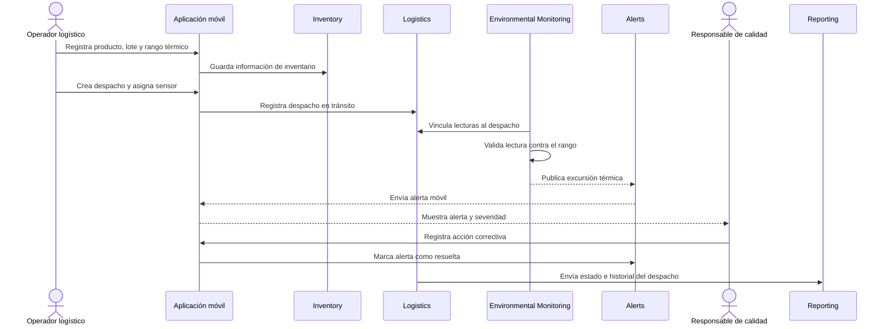
```mermaid
sequenceDiagram
  actor Operador as Operador logístico
  participant App as Aplicación móvil
  participant Inv as Inventory
  participant Log as Logistics
  participant Mon as Environmental Monitoring
  participant AlertsCtx as Alerts
  actor Calidad as Responsable de calidad
  participant Rep as Reporting

  Operador->>App: Registra producto, lote y rango térmico
  App->>Inv: Guarda información de inventario
  Operador->>App: Crea despacho y asigna sensor
  App->>Log: Registra despacho en tránsito
  Mon->>Log: Vincula lecturas al despacho
  Mon->>Mon: Valida lectura contra el rango
  Mon-->>AlertsCtx: Publica excursión térmica
  AlertsCtx-->>App: Envía alerta móvil
  App-->>Calidad: Muestra alerta y severidad
  Calidad->>App: Registra acción correctiva
  App->>AlertsCtx: Marca alerta como resuelta
  Log->>Rep: Envía estado e historial del despacho
```

#### 2.5.1.3. Context Canvases

Los Bounded Context Canvases se elaboraron de forma iterativa. Para cada contexto se definió el propósito, se capturaron las reglas y el lenguaje ubicuo, se analizaron las capacidades, se registraron dependencias y se realizó una crítica de diseño para evitar responsabilidades duplicadas. A continuación se presentan los canvases de los seis contextos candidatos.

#### Bounded Context Canvas: IAM

| Elemento | Definición |
|---|---|
| Context Overview | Administra el acceso seguro a SafeFlow móvil para administradores, operadores y responsables de calidad. |
| Business Rules & Ubiquitous Language | Usuario, rol, permiso, sesión activa, sesión expirada y acceso autorizado. |
| Capabilities | Registro, inicio de sesión, control por rol y cierre de sesión. |
| Dependencies | Provee identidad a Inventory, Alerts, Logistics y Reporting. Consume datos de usuarios y roles. |
| Design Critique | Mantenerlo independiente evita que cada contexto implemente sus propias reglas de seguridad. |

#### Bounded Context Canvas: Inventory

| Elemento | Definición |
|---|---|
| Context Overview | Gestiona productos sensibles, lotes, cantidades, rangos de temperatura y estado de conservación. |
| Business Rules & Ubiquitous Language | Producto, lote, stock, rango térmico, normal, en riesgo y desechado. |
| Capabilities | Registrar producto, registrar stock, consultar inventario y consultar productos en riesgo. |
| Dependencies | Consume identidad de IAM y entrega productos y rangos a Logistics y Environmental Monitoring. |
| Design Critique | El inventario debe ser dueño de los datos maestros; los demás contextos solo deben referenciarlos. |

#### Bounded Context Canvas: Environmental Monitoring

| Elemento | Definición |
|---|---|
| Context Overview | Recibe telemetría IoT y determina si las condiciones ambientales cumplen los rangos configurados. |
| Business Rules & Ubiquitous Language | Sensor, lectura, telemetría, umbral, excursión térmica, advertencia y desconexión. |
| Capabilities | Integrar sensores, recibir lecturas, validar rangos, detectar anomalías y asociar lecturas a despachos. |
| Dependencies | Consume rangos de Inventory y la relación de sensor con despacho de Logistics. Publica eventos para Alerts y Reporting. |
| Design Critique | Debe conservar el historial de mediciones y no asumir la responsabilidad de notificar o resolver alertas. |

#### Bounded Context Canvas: Alerts

| Elemento | Definición |
|---|---|
| Context Overview | Gestiona la comunicación de anomalías y el registro de acciones correctivas desde la aplicación móvil. |
| Business Rules & Ubiquitous Language | Alerta activa, severidad, destinatario, notificación, acción correctiva y alerta resuelta. |
| Capabilities | Generar, priorizar, agrupar, notificar, consultar y resolver alertas. |
| Dependencies | Consume excursiones de Environmental Monitoring y permisos de IAM. Publica acciones correctivas para Reporting. |
| Design Critique | La notificación móvil es un canal de entrega; la alerta debe mantenerse disponible aunque el dispositivo esté desconectado. |

#### Bounded Context Canvas: Logistics

| Elemento | Definición |
|---|---|
| Context Overview | Coordina despachos, transporte, rutas, sensores asignados y confirmación de entregas. |
| Business Rules & Ubiquitous Language | Despacho, ruta, transporte, en tránsito, entregado, cancelado y sensor asignado. |
| Capabilities | Crear despacho, asignar sensor, consultar estado, validar condiciones y confirmar entrega. |
| Dependencies | Consume productos y lotes de Inventory, y lecturas de Environmental Monitoring. Provee estados a Reporting. |
| Design Critique | Las transiciones de despacho deben ser explícitas y autorizadas según el rol del usuario. |

#### Bounded Context Canvas: Reporting

| Elemento | Definición |
|---|---|
| Context Overview | Consolida información histórica para indicadores, trazabilidad y evidencia de cumplimiento. |
| Business Rules & Ubiquitous Language | Historial térmico, indicador, evidencia digital, auditoría y reporte de cumplimiento. |
| Capabilities | Consultar historial, generar indicadores y preparar evidencia de un despacho. |
| Dependencies | Consume eventos y datos de Inventory, Environmental Monitoring, Alerts y Logistics. Depende de IAM para restringir la consulta. |
| Design Critique | Debe ser principalmente de lectura y no duplicar reglas operativas de los contextos que originan los datos. |

La elaboración de los canvases siguió un proceso iterativo: primero se definió el propósito de cada contexto, luego se capturaron reglas y lenguaje ubicuo, se identificaron capacidades, dependencias y finalmente se realizó una crítica de diseño para evitar responsabilidades duplicadas. Los canvases deben acompañarse con capturas progresivas del trabajo realizado por el equipo.

### 2.5.2. Context Mapping

El Context Mapping define las relaciones estructurales entre los bounded contexts identificados para SafeFlow. El mapa toma como referencia el flujo de negocio del transporte de productos sensibles y diferencia los contextos que producen información, los que la consumen y los que coordinan acciones. La aplicación móvil funciona como canal de interacción y no se considera un bounded context de negocio independiente.

#### Relaciones principales entre bounded contexts

| Contexto origen | Contexto destino | Información compartida | Patrón DDD | Justificación |
|---|---|---|---|---|
| **IAM** | Todos los contextos | Usuario autenticado, rol y permisos | **Shared Kernel** | La identidad mínima y los permisos son conceptos compartidos y deben tener una definición consistente. |
| **Inventory** | **Environmental Monitoring** | Producto, lote y rango térmico | **Customer/Supplier** | Environmental Monitoring necesita los rangos publicados por Inventory para evaluar las lecturas. |
| **Logistics** | **Environmental Monitoring** | Despacho, sensor asignado y transporte | **Customer/Supplier** | El monitoreo necesita conocer a qué despacho pertenece cada sensor y lectura. |
| **Environmental Monitoring** | **Alerts** | Excursión térmica, severidad y sensor | **Publisher/Subscriber** | Monitoring publica el evento; Alerts decide cómo priorizarlo y notificarlo. |
| **Alerts** | **Reporting** | Alerta, acción correctiva y estado de resolución | **Customer/Supplier** | Reporting consume la información para construir trazabilidad y evidencia. |
| **Logistics** | **Reporting** | Estado del despacho, ruta y entrega | **Customer/Supplier** | Reporting consolida la operación sin modificar las reglas logísticas. |
| **Inventory** | **Logistics** | Producto, lote y disponibilidad | **Customer/Supplier** | Logistics utiliza los datos de inventario para preparar despachos válidos. |
| **Reporting** | Todos los contextos | Consultas e indicadores históricos | **Conformist** | Reporting se adapta a los eventos publicados por los contextos operativos y no se convierte en dueño de esos datos. |

#### Alternativas evaluadas

1. **Mover las reglas de temperatura a Logistics:** simplificaría el flujo de despacho, pero mezclaría el transporte con la evaluación de telemetría y dificultaría reutilizar el monitoreo en almacén. Se descartó.
2. **Mover las alertas a Environmental Monitoring:** reduciría una integración, pero acoplaría la detección técnica con las preferencias de usuarios, severidades y acciones correctivas. Se descartó.
3. **Crear un Shared Kernel para productos, despachos y lecturas:** reduciría duplicación, pero produciría un modelo central demasiado grande y con cambios de alto impacto. Se mantuvo un Shared Kernel limitado a identidad y conceptos técnicos mínimos.
4. **Crear un contexto separado para notificaciones móviles:** permitiría cambiar de proveedor de push sin afectar Alerts. Se considera una evolución posible, pero para el alcance actual las notificaciones permanecen como una capacidad de Alerts.
5. **Aislar Reporting como contexto de lectura:** evita que los reportes modifiquen datos operativos y permite construir indicadores sin alterar Inventory, Logistics o Monitoring. Esta fue la alternativa seleccionada.

#### Mapa de contexto seleccionado

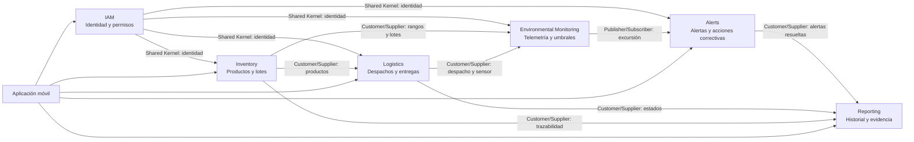
```mermaid
flowchart LR
  IAM[IAM\nIdentidad y permisos]
  Inv[Inventory\nProductos y lotes]
  Mon[Environmental Monitoring\nTelemetría y umbrales]
  Alt[Alerts\nAlertas y acciones correctivas]
  Log[Logistics\nDespachos y entregas]
  Rep[Reporting\nHistorial y evidencia]
  App[Aplicación móvil]

  IAM -->|Shared Kernel: identidad| Inv
  IAM -->|Shared Kernel: identidad| Mon
  IAM -->|Shared Kernel: identidad| Alt
  IAM -->|Shared Kernel: identidad| Log
  Inv -->|Customer/Supplier: rangos y lotes| Mon
  Inv -->|Customer/Supplier: productos| Log
  Log -->|Customer/Supplier: despacho y sensor| Mon
  Mon -->|Publisher/Subscriber: excursión| Alt
  Alt -->|Customer/Supplier: alertas resueltas| Rep
  Log -->|Customer/Supplier: estados| Rep
  Inv -->|Customer/Supplier: trazabilidad| Rep
  App --> IAM
  App --> Inv
  App --> Alt
  App --> Log
  App --> Rep
```

La aproximación seleccionada mantiene aisladas las reglas principales del dominio, reduce la dependencia directa entre contextos y permite que la aplicación móvil evolucione como canal de acceso. Las relaciones y patrones deberán revisarse durante la implementación si aparecen nuevos eventos o responsabilidades.

### 2.5.3. Software Architecture

La arquitectura de SafeFlow se representa mediante el modelo C4 y considera la aplicación móvil como el principal canal de interacción de los usuarios. La solución integra sensores IoT, servicios de dominio, persistencia, mensajería y notificaciones móviles para monitorear la cadena de frío y responder ante desviaciones de temperatura.

#### 2.5.3.1. Software Architecture Context Level Diagrams

El Context Level Diagram presenta SafeFlow como el sistema central y muestra sus usuarios y sistemas externos. Los usuarios consultan información y registran acciones desde la aplicación móvil. Los sensores IoT entregan telemetría y el proveedor de notificaciones permite comunicar alertas aun cuando el usuario no tenga la aplicación abierta.

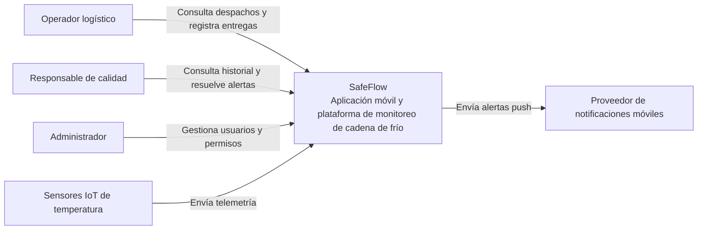
```mermaid
flowchart LR
  Operador[Operador logístico]
  Calidad[Responsable de calidad]
  Admin[Administrador]
  Sensores[Sensores IoT de temperatura]
  Push[Proveedor de notificaciones móviles]
  SafeFlow[SafeFlow\nAplicación móvil y plataforma de monitoreo de cadena de frío]

  Operador -->|Consulta despachos y registra entregas| SafeFlow
  Calidad -->|Consulta historial y resuelve alertas| SafeFlow
  Admin -->|Gestiona usuarios y permisos| SafeFlow
  Sensores -->|Envía telemetría| SafeFlow
  SafeFlow -->|Envía alertas push| Push
```

#### 2.5.3.2. Software Architecture Container Level Diagrams

El Container Diagram descompone SafeFlow en los contenedores que colaboran para cumplir las responsabilidades del sistema. La aplicación móvil gestiona la interacción y el almacenamiento local temporal; la API coordina las solicitudes; los servicios de dominio mantienen las reglas de cada bounded context; el gateway IoT procesa telemetría; y el bus de eventos desacopla la detección de anomalías, las alertas y los reportes.

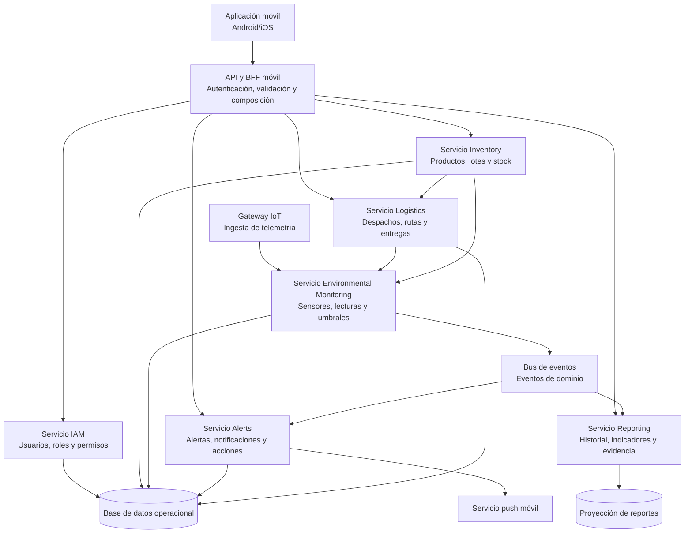
```mermaid
flowchart TB
  Mobile[Aplicación móvil\nAndroid/iOS]
  Api[API y BFF móvil\nAutenticación, validación y composición]
  IAMC[Servicio IAM\nUsuarios, roles y permisos]
  InvC[Servicio Inventory\nProductos, lotes y stock]
  MonC[Servicio Environmental Monitoring\nSensores, lecturas y umbrales]
  AltC[Servicio Alerts\nAlertas, notificaciones y acciones]
  LogC[Servicio Logistics\nDespachos, rutas y entregas]
  RepC[Servicio Reporting\nHistorial, indicadores y evidencia]
  IoT[Gateway IoT\nIngesta de telemetría]
  Bus[Bus de eventos\nEventos de dominio]
  DB[(Base de datos operacional)]
  ReadDB[(Proyección de reportes)]
  PushC[Servicio push móvil]

  Mobile --> Api
  Api --> IAMC
  Api --> InvC
  Api --> AltC
  Api --> LogC
  Api --> RepC
  IoT --> MonC
  MonC --> Bus
  Bus --> AltC
  Bus --> RepC
  LogC --> MonC
  InvC --> MonC
  InvC --> LogC
  AltC --> PushC
  IAMC --> DB
  InvC --> DB
  MonC --> DB
  AltC --> DB
  LogC --> DB
  RepC --> ReadDB
```

Las principales decisiones tecnológicas son: comunicación HTTPS entre la aplicación y la API, eventos asíncronos para desacoplar telemetría y alertas, persistencia operacional para las transacciones del dominio y una proyección de lectura para consultas históricas. La aplicación móvil debe mostrar el último estado conocido cuando exista conectividad intermitente y sincronizar las acciones pendientes al recuperar la conexión.

#### 2.5.3.3. Software Architecture Deployment Diagrams

El Deployment Diagram muestra la distribución física de SafeFlow. El usuario utiliza un dispositivo móvil conectado a Internet; los sensores transmiten datos hacia el entorno cloud; los servicios de backend se ejecutan en contenedores o servicios administrados; y la información se almacena en bases de datos protegidas. El proveedor de notificaciones entrega los avisos a los dispositivos registrados.

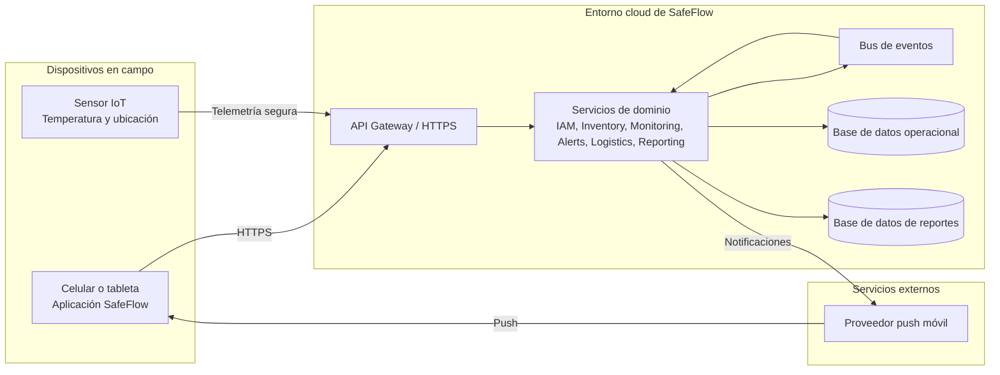
```mermaid
flowchart LR
  subgraph Device[Dispositivos en campo]
    Phone[Celular o tableta\nAplicación SafeFlow]
    Sensor[Sensor IoT\nTemperatura y ubicación]
  end

  subgraph Cloud[Entorno cloud de SafeFlow]
    Edge[API Gateway / HTTPS]
    Services[Servicios de dominio\nIAM, Inventory, Monitoring, Alerts, Logistics, Reporting]
    Events[Bus de eventos]
    Operational[(Base de datos operacional)]
    ReportingDB[(Base de datos de reportes)]
  end

  subgraph External[Servicios externos]
    PushSvc[Proveedor push móvil]
  end

  Phone -->|HTTPS| Edge
  Sensor -->|Telemetría segura| Edge
  Edge --> Services
  Services --> Events
  Services --> Operational
  Services --> ReportingDB
  Events --> Services
  Services -->|Notificaciones| PushSvc
  PushSvc -->|Push| Phone
```

Los nodos deben proteger sus comunicaciones mediante HTTPS y credenciales administradas. La separación entre la base operacional y la proyección de reportes evita que las consultas históricas afecten las operaciones de monitoreo. El despliegue final debe especificar el proveedor cloud, las regiones, las redes y las políticas de respaldo que el equipo seleccione.

## 2.6. Tactical-Level Domain-Driven Design

### 2.6.1. Bounded Context: iam

El bounded context **IAM (Identity and Access Management)** administra la identidad y el acceso seguro de los usuarios de SafeFlow. Su alcance incluye el registro de usuarios, el inicio y cierre de sesión, la expiración de sesiones y el control de permisos según el rol. La aplicación móvil consume este contexto a través de la API, pero no contiene las reglas centrales de autenticación ni autorización.

#### 2.6.1.1. Domain Layer

La Domain Layer concentra las reglas de negocio relacionadas con la identidad. Sus clases no dependen de la aplicación móvil, de la base de datos ni del proveedor de tokens.

| Clase | Categoría | Propósito | Atributos principales | Métodos principales |
|---|---|---|---|---|
| **User** | Entity / Aggregate Root | Representa a una persona autorizada para utilizar SafeFlow. | `id`, `name`, `email`, `passwordHash`, `status`, `roleId`, `createdAt`, `lastLoginAt` | `register()`, `changeRole()`, `activate()`, `deactivate()`, `recordLogin()` |
| **Role** | Entity | Define el nivel de acceso del usuario. | `id`, `name`, `permissions` | `addPermission()`, `removePermission()`, `hasPermission()` |
| **Permission** | Value Object | Representa una acción autorizada sobre un recurso. | `resource`, `action` | `matches(resource, action)` |
| **UserId** | Value Object | Identifica de manera única a un usuario. | `value` | `equals()`, `toString()` |
| **Email** | Value Object | Valida y representa el correo utilizado como credencial. | `value` | `validateFormat()`, `equals()` |
| **Session** | Entity | Representa una sesión autenticada y su vigencia. | `id`, `userId`, `refreshToken`, `expiresAt`, `revokedAt` | `isActive()`, `isExpired()`, `revoke()` |
| **UserRepository** | Domain Interface | Define la persistencia requerida por el dominio. | No aplica | `findById()`, `findByEmail()`, `save()`, `update()` |
| **PasswordHasher** | Domain Interface | Define la operación de protección y verificación de contraseñas. | No aplica | `hash()`, `matches()` |

Reglas principales del dominio:

- Cada correo debe ser único dentro de IAM.
- Un usuario desactivado no puede iniciar sesión.
- Un usuario solo puede ejecutar acciones permitidas por su rol.
- Una sesión expirada o revocada no puede utilizarse para acceder a recursos protegidos.
- La contraseña no se almacena en texto plano; el dominio trabaja únicamente con su representación protegida.

#### 2.6.1.2. Interface Layer

La Interface Layer expone las capacidades de IAM a la aplicación móvil mediante endpoints HTTP. Los controllers reciben solicitudes, validan su estructura básica y convierten los datos externos en comandos de aplicación. No contienen reglas de negocio ni acceden directamente a la base de datos.

| Clase | Tipo | Responsabilidad |
|---|---|---|
| **AuthController** | Controller | Atiende registro, inicio de sesión, renovación y cierre de sesión. |
| **UserController** | Controller | Consulta y actualiza usuarios cuando el actor cuenta con permisos administrativos. |
| **RoleController** | Controller | Administra roles y permisos para usuarios autorizados. |
| **AuthRequest** | Request DTO | Transporta correo, contraseña y datos básicos del registro desde la aplicación móvil. |
| **AuthResponse** | Response DTO | Devuelve el token de acceso, el refresh token, la expiración y los datos mínimos del usuario. |
| **UserSessionMiddleware** | Middleware | Extrae las credenciales de la solicitud y adjunta el usuario autenticado al contexto de ejecución. |
| **UnauthorizedErrorHandler** | Error Handler | Convierte errores de autenticación o autorización en respuestas consistentes para el cliente móvil. |

La aplicación móvil utiliza estas capacidades para registrarse, iniciar sesión, conservar una sesión segura, cerrar sesión y ocultar funciones no autorizadas según el rol recibido.

#### 2.6.1.3. Application Layer

La Application Layer coordina los casos de uso de IAM. Cada handler recibe un comando o consulta, utiliza las interfaces del dominio y devuelve un resultado que puede ser transformado por la Interface Layer. Esta capa conecta las capacidades del bounded context con las historias `US-18`, `US-30`, `US-31` y `US-42`.

| Clase | Tipo | Caso de uso | Flujo principal |
|---|---|---|---|
| **RegisterUserCommandHandler** | Command Handler | Registrarse en la aplicación. | Valida correo, crea `User`, asigna el rol inicial y persiste la cuenta. |
| **LoginUserCommandHandler** | Command Handler | Iniciar sesión. | Busca el usuario, verifica contraseña y estado, crea `Session` y emite credenciales. |
| **RefreshSessionCommandHandler** | Command Handler | Renovar sesión. | Valida el refresh token y crea una nueva sesión con expiración actualizada. |
| **LogoutUserCommandHandler** | Command Handler | Cerrar sesión. | Revoca la sesión actual y elimina las credenciales locales mediante la respuesta de la API. |
| **AuthorizeUserQueryHandler** | Query / Policy Handler | Controlar acceso por rol. | Consulta el rol y determina si el usuario puede ejecutar una acción. |
| **GetUserProfileQueryHandler** | Query Handler | Obtener perfil autenticado. | Devuelve los datos y permisos necesarios para construir la navegación móvil. |
| **UserRegisteredEventHandler** | Event Handler | Notificar el registro de usuario. | Publica o procesa el evento de registro para auditoría y confirmación de cuenta. |

Eventos de aplicación relevantes:

- `UserRegistered`: se crea una nueva cuenta.
- `UserLoggedIn`: se inicia una sesión válida.
- `SessionRevoked`: se cierra o invalida una sesión.
- `UserRoleChanged`: se modifica el conjunto de permisos del usuario.

#### 2.6.1.4. Infrastructure Layer

La Infrastructure Layer implementa las interfaces definidas por el dominio y conecta IAM con servicios externos. Esta capa contiene la persistencia, el hashing de contraseñas, la emisión de tokens y la publicación de eventos. La aplicación móvil no accede directamente a estos componentes.

| Clase | Tipo | Servicio externo | Responsabilidad |
|---|---|---|---|
| **UserRepositoryImpl** | Repository Implementation | Base de datos operacional | Persiste y consulta usuarios, roles y sesiones. |
| **IamDbContext** | Persistence Context | Motor relacional | Configura tablas, relaciones, índices y transacciones de IAM. |
| **BcryptPasswordHasher** | Service Adapter | Biblioteca criptográfica | Genera hashes y compara contraseñas sin almacenarlas en texto plano. |
| **JwtTokenService** | Service Adapter | Servicio de tokens | Emite y valida access tokens y refresh tokens. |
| **SessionCache** | Cache Adapter | Redis o caché administrada | Mantiene sesiones revocadas y datos temporales de autenticación. |
| **IamEventPublisher** | Message Adapter | Bus de eventos | Publica `UserRegistered`, `UserLoggedIn` y `SessionRevoked`. |
| **EmailVerificationService** | External Service Adapter | Servicio de correo | Envía la verificación de cuenta y mensajes de recuperación. |
| **IamUnitOfWork** | Infrastructure Abstraction | Base de datos | Confirma o revierte las operaciones realizadas en un caso de uso. |

Relaciones principales de la implementación:

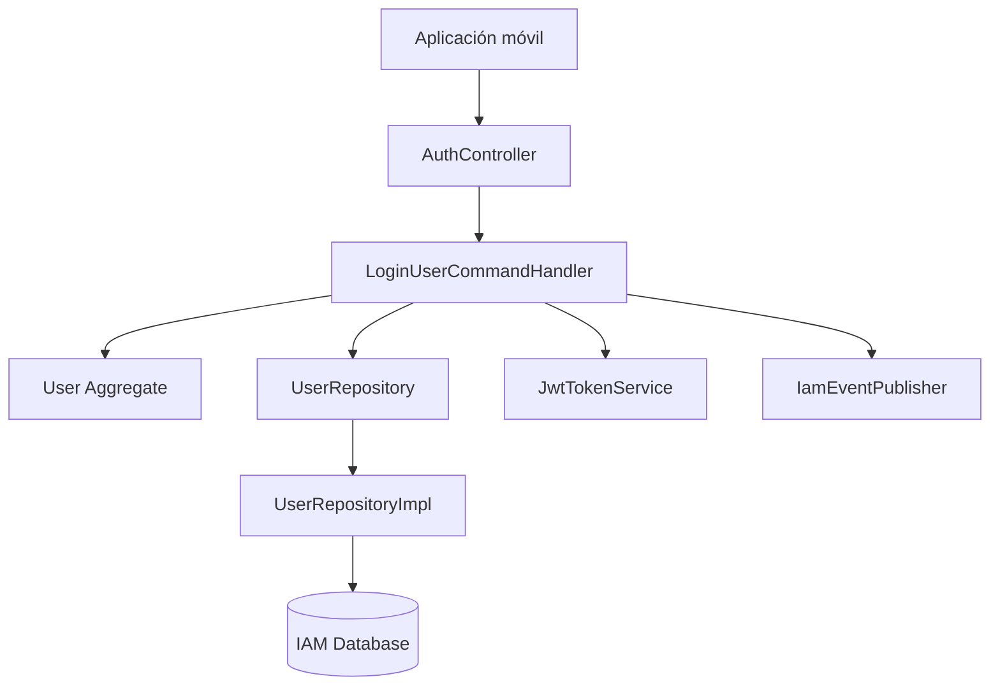
```mermaid
flowchart TB
  Mobile[Aplicación móvil]
  AuthController[AuthController]
  LoginHandler[LoginUserCommandHandler]
  User[User Aggregate]
  Repository[UserRepository]
  RepositoryImpl[UserRepositoryImpl]
  Token[JwtTokenService]
  Database[(IAM Database)]
  Events[IamEventPublisher]

  Mobile --> AuthController
  AuthController --> LoginHandler
  LoginHandler --> User
  LoginHandler --> Repository
  Repository --> RepositoryImpl
  RepositoryImpl --> Database
  LoginHandler --> Token
  LoginHandler --> Events
```

#### 2.6.1.5. Bounded Context Software Architecture Component Level Diagrams

El Component Diagram descompone el container del bounded context IAM en sus principales componentes internos. El diagrama muestra cómo el controller recibe las solicitudes de la aplicación móvil, cómo los handlers coordinan los casos de uso, cómo el dominio aplica las reglas de identidad y cómo los adaptadores conectan la solución con la base de datos, el servicio de tokens y el bus de eventos.

 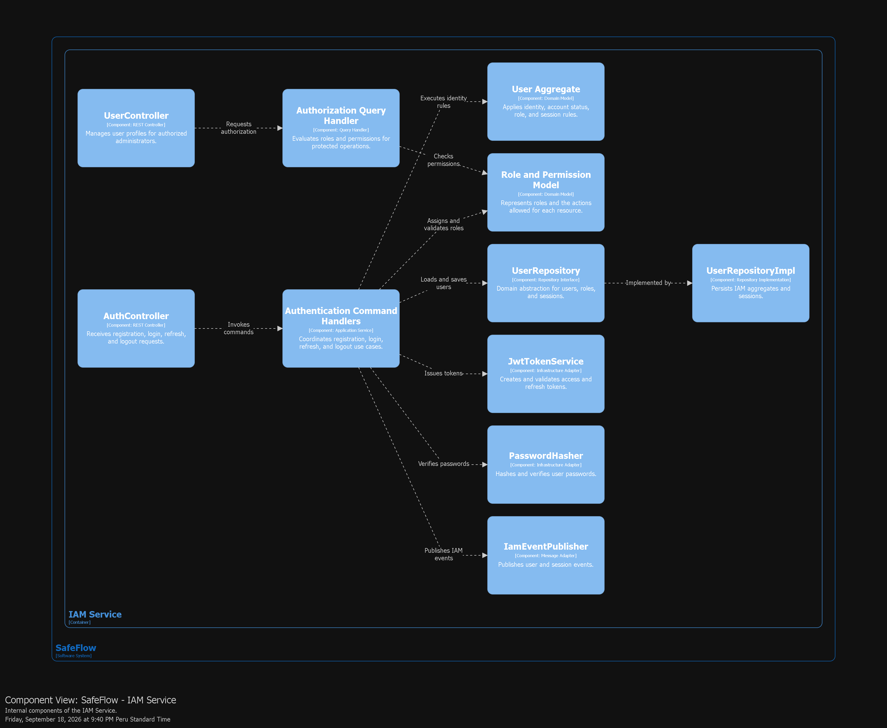 

#### 2.6.1.6. Bounded Context Software Architecture Code Level Diagrams

El Code Level Diagrams presenta el detalle de implementación de los componentes del bounded context IAM. Para este bounded context se incluyen dos diagramas: el diagrama UML de las clases del Domain Layer y el diagrama de la estructura de persistencia de IAM.

##### 2.6.1.6.1. Bounded Context Domain Layer Class Diagrams

Este diagrama muestra las entidades, value objects, interfaces, enumeraciones y relaciones del Domain Layer. Incluye atributos, métodos, visibilidad y multiplicidades. Structurizr DSL está orientado al modelo C4 y no representa de forma nativa diagramas UML de clases con miembros; por ello, se recomienda elaborar este diagrama en PlantUML, Visual Paradigm o la herramienta UML indicada por el curso.

Diagrama de clases del dominio IAM en Mermaid:

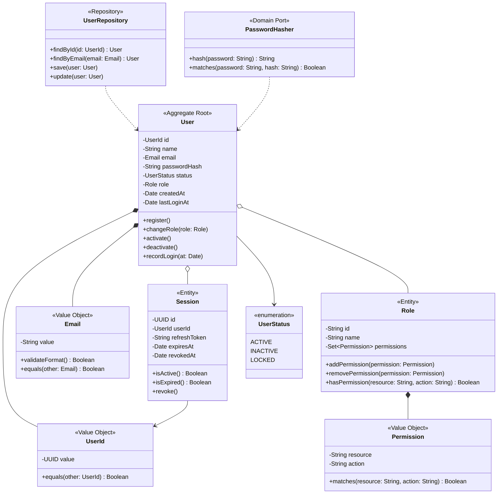
```mermaid
classDiagram
    class User {
        <<Aggregate Root>>
        -UserId id
        -String name
        -Email email
        -String passwordHash
        -UserStatus status
        -Role role
        -Date createdAt
        -Date lastLoginAt
        +register()
        +changeRole(role: Role)
        +activate()
        +deactivate()
        +recordLogin(at: Date)
    }

    class Role {
        <<Entity>>
        -String id
        -String name
        -Set~Permission~ permissions
        +addPermission(permission: Permission)
        +removePermission(permission: Permission)
        +hasPermission(resource: String, action: String) Boolean
    }

    class Permission {
        <<Value Object>>
        -String resource
        -String action
        +matches(resource: String, action: String) Boolean
    }

    class UserId {
        <<Value Object>>
        -UUID value
        +equals(other: UserId) Boolean
    }

    class Email {
        <<Value Object>>
        -String value
        +validateFormat() Boolean
        +equals(other: Email) Boolean
    }

    class Session {
        <<Entity>>
        -UUID id
        -UserId userId
        -String refreshToken
        -Date expiresAt
        -Date revokedAt
        +isActive() Boolean
        +isExpired() Boolean
        +revoke()
    }

    class UserRepository {
        <<Repository>>
        +findById(id: UserId) User
        +findByEmail(email: Email) User
        +save(user: User)
        +update(user: User)
    }

    class PasswordHasher {
        <<Domain Port>>
        +hash(password: String) String
        +matches(password: String, hash: String) Boolean
    }

    class UserStatus {
        <<enumeration>>
        ACTIVE
        INACTIVE
        LOCKED
    }

    User *-- UserId
    User *-- Email
    User o-- Role
    Role *-- Permission
    User o-- Session
    Session --> UserId
    UserRepository ..> User
    PasswordHasher ..> User
    User --> UserStatus
```

##### 2.6.1.6.2. Bounded Context Database Design Diagram

El diagrama de base de datos del bounded context IAM modela la persistencia de los agregados de identidad y sesión. Se emplea un esquema relacional con tablas dedicadas para usuarios, roles, permisos y sesiones, garantizando integridad referencial, restricciones de unicidad y trazabilidad de autenticación.

En este diseño, cada usuario pertenece a un único rol, cada rol puede tener múltiples permisos a través de la tabla `role_permissions` y cada usuario puede abrir múltiples sesiones. La columna `password_hash` evita almacenar contraseñas en texto plano, mientras que `refresh_token_hash` protege los tokens de renovación. Los campos `expires_at` y `revoked_at` permiten validar el estado de la sesión y mantener evidencia del cierre o invalidación.

La relación principal se implementa mediante `role_id` en `users`, la tabla de unión `role_permissions` y la clave foránea `user_id` en `sessions`. Este modelo respalda el control de acceso seguro, la revocación de sesiones y la conservación del historial de autenticación sin duplicar reglas de seguridad en otros bounded contexts.

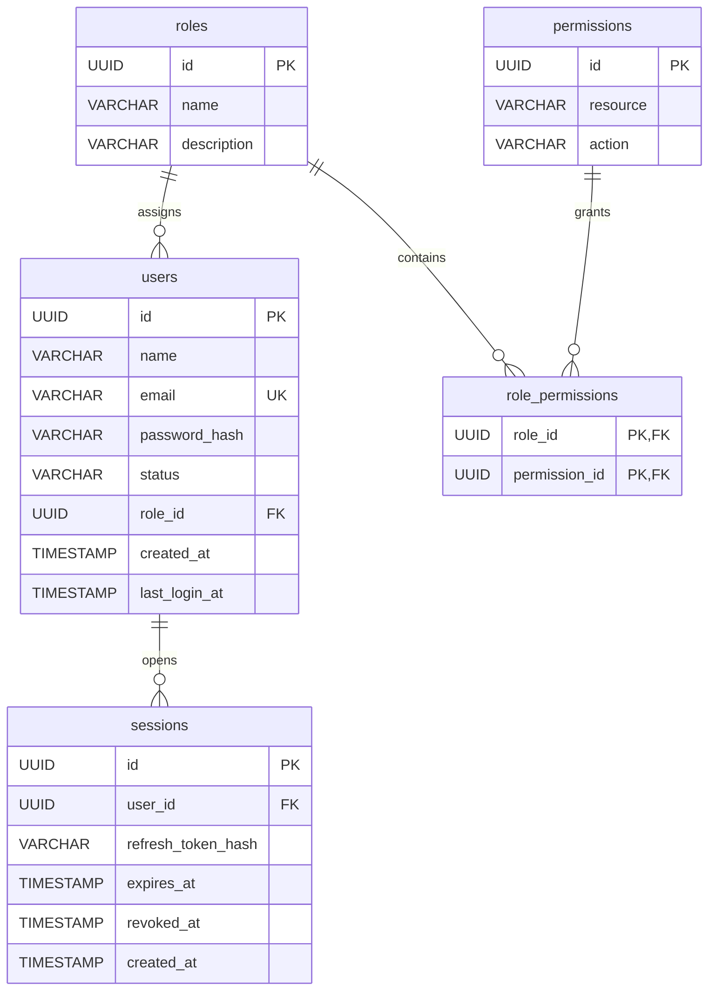
```mermaid
erDiagram
    roles {
        UUID id PK
        VARCHAR name
        VARCHAR description
    }

    users {
        UUID id PK
        VARCHAR name
        VARCHAR email UK
        VARCHAR password_hash
        VARCHAR status
        UUID role_id FK
        TIMESTAMP created_at
        TIMESTAMP last_login_at
    }

    permissions {
        UUID id PK
        VARCHAR resource
        VARCHAR action
    }

    role_permissions {
        UUID role_id PK, FK
        UUID permission_id PK, FK
    }

    sessions {
        UUID id PK
        UUID user_id FK
        VARCHAR refresh_token_hash
        TIMESTAMP expires_at
        TIMESTAMP revoked_at
        TIMESTAMP created_at
    }

    roles ||--o{ users : assigns
    roles ||--o{ role_permissions : contains
    permissions ||--o{ role_permissions : grants
    users ||--o{ sessions : opens
```

### 2.6.2. Bounded Context: inventory

#### 2.6.2.1. Domain Layer
El dominio administra productos, lotes, stock y rangos de temperatura. Sus principales clases son `Product`, `Batch`, `InventoryItem` y `TemperatureRange`.

#### 2.6.2.2. Interface Layer
`ProductController`, `BatchController` e `InventoryController` exponen el registro y consulta del inventario móvil.

#### 2.6.2.3. Application Layer
`RegisterProductHandler`, `RegisterBatchHandler`, `UpdateStockHandler` y `GetInventoryQueryHandler` coordinan los casos de uso del contexto.

#### 2.6.2.4. Infrastructure Layer
`InventoryRepositoryImpl` e `InventoryDbContext` persisten los productos, lotes y movimientos de stock.

#### 2.6.2.5. Bounded Context Software Architecture Component Level Diagrams
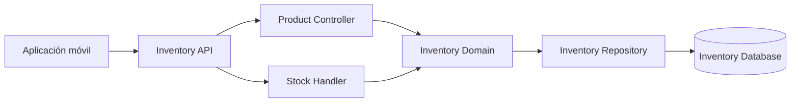
```mermaid
flowchart LR
  UI[Aplicación móvil] --> API[Inventory API]
  API --> Product[Product Controller]
  API --> Stock[Stock Handler]
  Product --> Domain[Inventory Domain]
  Stock --> Domain
  Domain --> Repo[Inventory Repository]
  Repo --> DB[(Inventory Database)]
```

#### 2.6.2.6. Bounded Context Software Architecture Code Level Diagrams
##### 2.6.2.6.1. Bounded Context Domain Layer Class Diagrams
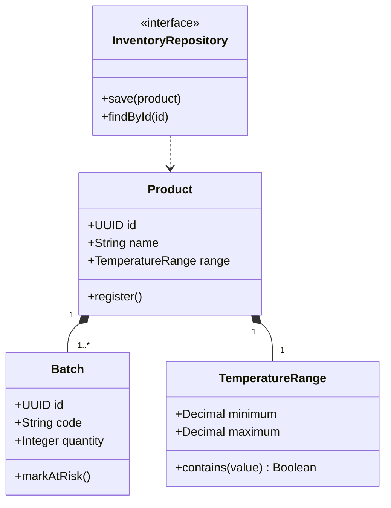
```mermaid
classDiagram
  class Product {
    +UUID id
    +String name
    +TemperatureRange range
    +register()
  }
  class Batch {
    +UUID id
    +String code
    +Integer quantity
    +markAtRisk()
  }
  class TemperatureRange {
    +Decimal minimum
    +Decimal maximum
    +contains(value) Boolean
  }
  class InventoryRepository {
    <<interface>>
    +save(product)
    +findById(id)
  }
  Product "1" *-- "1..*" Batch
  Product "1" *-- "1" TemperatureRange
  InventoryRepository ..> Product
```

##### 2.6.2.6.2. Bounded Context Database Design Diagram
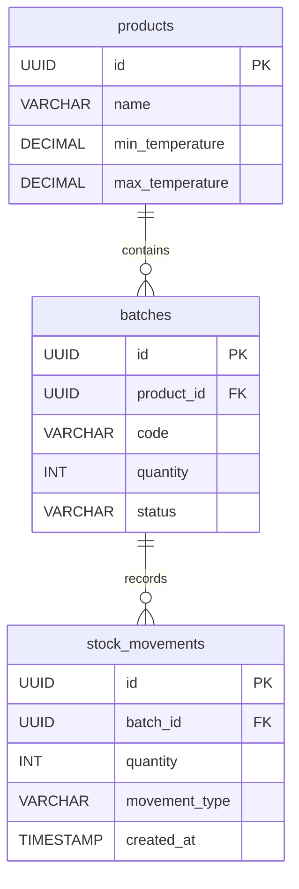
```mermaid
erDiagram
  products {
    UUID id PK
    VARCHAR name
    DECIMAL min_temperature
    DECIMAL max_temperature
  }
  batches {
    UUID id PK
    UUID product_id FK
    VARCHAR code
    INT quantity
    VARCHAR status
  }
  stock_movements {
    UUID id PK
    UUID batch_id FK
    INT quantity
    VARCHAR movement_type
    TIMESTAMP created_at
  }
  products ||--o{ batches : contains
  batches ||--o{ stock_movements : records
```

### 2.6.3. Bounded Context: environmental-monitoring

#### 2.6.3.1. Domain Layer
El dominio recibe telemetría y valida las lecturas contra los umbrales configurados. Sus clases son `Sensor`, `TemperatureReading`, `Threshold` y `Excursion`.

#### 2.6.3.2. Interface Layer
`TelemetryController` y `SensorController` reciben lecturas IoT y permiten consultar sensores y estados.

#### 2.6.3.3. Application Layer
`ReceiveTelemetryHandler`, `ValidateReadingHandler` y `DetectExcursionHandler` procesan las lecturas y publican eventos de anomalía.

#### 2.6.3.4. Infrastructure Layer
`SensorRepositoryImpl`, `MonitoringDbContext` y `TelemetryEventPublisher` conectan el contexto con la base de datos y el bus de eventos.

#### 2.6.3.5. Bounded Context Software Architecture Component Level Diagrams
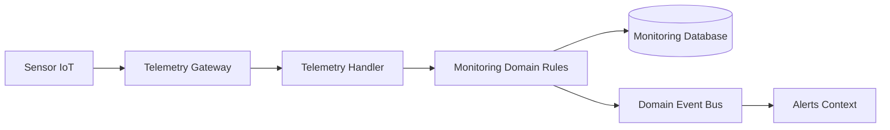
```mermaid
flowchart LR
  IoT[Sensor IoT] --> Gateway[Telemetry Gateway]
  Gateway --> Handler[Telemetry Handler]
  Handler --> Rules[Monitoring Domain Rules]
  Rules --> DB[(Monitoring Database)]
  Rules --> Bus[Domain Event Bus]
  Bus --> Alerts[Alerts Context]
```

#### 2.6.3.6. Bounded Context Software Architecture Code Level Diagrams
##### 2.6.3.6.1. Bounded Context Domain Layer Class Diagrams
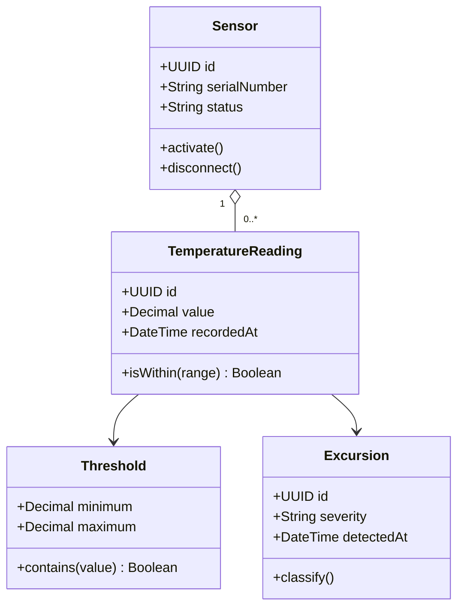
```mermaid
classDiagram
  class Sensor {
    +UUID id
    +String serialNumber
    +String status
    +activate()
    +disconnect()
  }
  class TemperatureReading {
    +UUID id
    +Decimal value
    +DateTime recordedAt
    +isWithin(range) Boolean
  }
  class Threshold {
    +Decimal minimum
    +Decimal maximum
    +contains(value) Boolean
  }
  class Excursion {
    +UUID id
    +String severity
    +DateTime detectedAt
    +classify()
  }
  Sensor "1" o-- "0..*" TemperatureReading
  TemperatureReading --> Threshold
  TemperatureReading --> Excursion
```

##### 2.6.3.6.2. Bounded Context Database Design Diagram
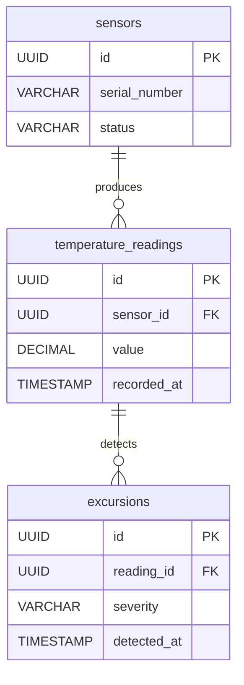
```mermaid
erDiagram
  sensors {
    UUID id PK
    VARCHAR serial_number
    VARCHAR status
  }
  temperature_readings {
    UUID id PK
    UUID sensor_id FK
    DECIMAL value
    TIMESTAMP recorded_at
  }
  excursions {
    UUID id PK
    UUID reading_id FK
    VARCHAR severity
    TIMESTAMP detected_at
  }
  sensors ||--o{ temperature_readings : produces
  temperature_readings ||--o{ excursions : detects
```

### 2.6.4. Bounded Context: alerts

#### 2.6.4.1. Domain Layer
El dominio administra alertas, severidad, notificaciones y acciones correctivas mediante `Alert`, `Notification` y `CorrectiveAction`.

#### 2.6.4.2. Interface Layer
`AlertController` permite consultar alertas, registrar acciones correctivas y resolver incidencias.

#### 2.6.4.3. Application Layer
`CreateAlertHandler`, `NotifyUsersHandler` y `ResolveAlertHandler` coordinan la atención de anomalías.

#### 2.6.4.4. Infrastructure Layer
`AlertRepositoryImpl`, `PushNotificationAdapter` y `AlertEventConsumer` implementan persistencia, notificaciones y consumo de eventos.

#### 2.6.4.5. Bounded Context Software Architecture Component Level Diagrams
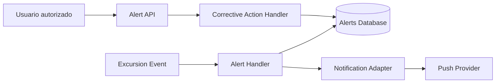
```mermaid
flowchart LR
  Event[Excursion Event] --> Create[Alert Handler]
  Create --> Store[(Alerts Database)]
  Create --> Notify[Notification Adapter]
  Notify --> Push[Push Provider]
  User[Usuario autorizado] --> API[Alert API]
  API --> Resolve[Corrective Action Handler]
  Resolve --> Store
```

#### 2.6.4.6. Bounded Context Software Architecture Code Level Diagrams
##### 2.6.4.6.1. Bounded Context Domain Layer Class Diagrams
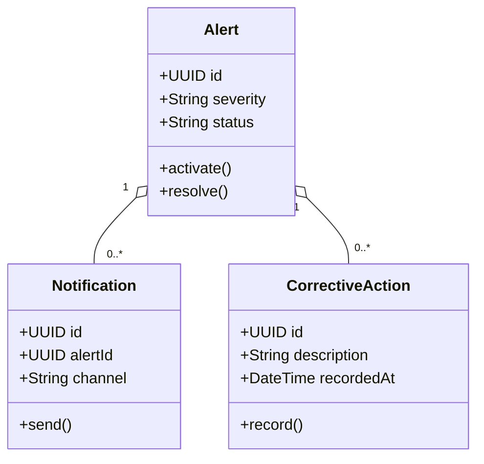
```mermaid
classDiagram
  class Alert {
    +UUID id
    +String severity
    +String status
    +activate()
    +resolve()
  }
  class Notification {
    +UUID id
    +UUID alertId
    +String channel
    +send()
  }
  class CorrectiveAction {
    +UUID id
    +String description
    +DateTime recordedAt
    +record()
  }
  Alert "1" o-- "0..*" Notification
  Alert "1" o-- "0..*" CorrectiveAction
```

##### 2.6.4.6.2. Bounded Context Database Design Diagram
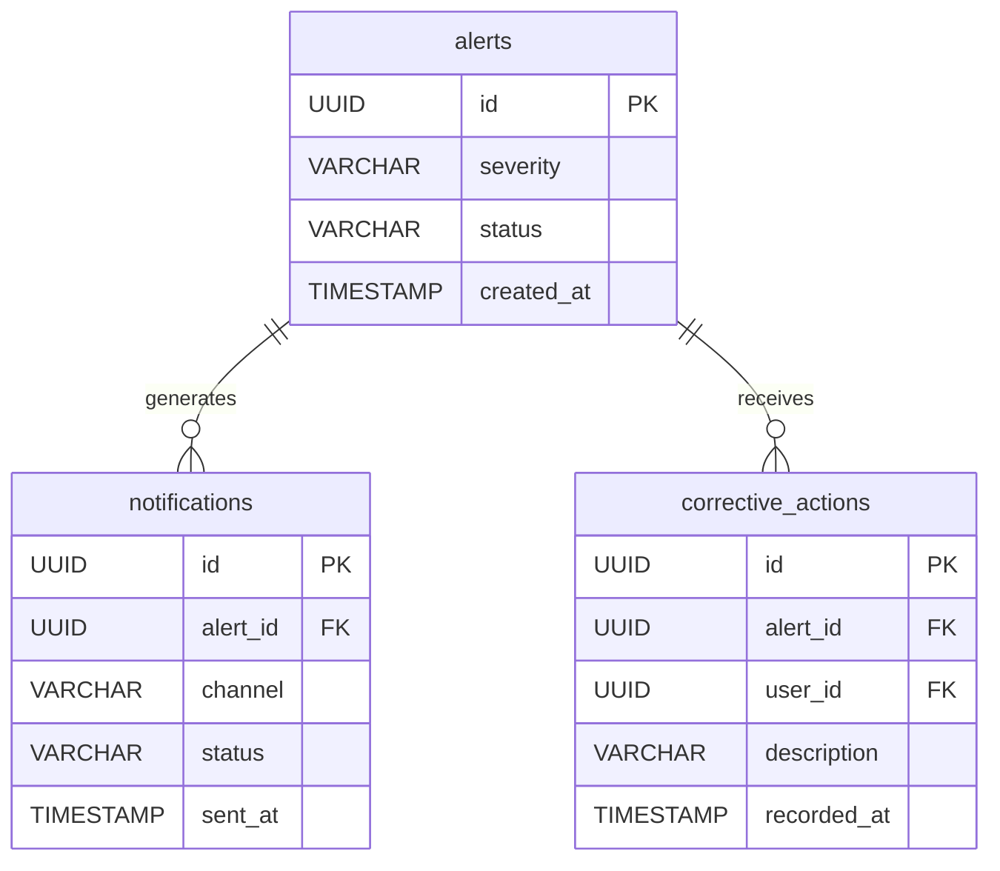
```mermaid
erDiagram
  alerts {
    UUID id PK
    VARCHAR severity
    VARCHAR status
    TIMESTAMP created_at
  }
  notifications {
    UUID id PK
    UUID alert_id FK
    VARCHAR channel
    VARCHAR status
    TIMESTAMP sent_at
  }
  corrective_actions {
    UUID id PK
    UUID alert_id FK
    UUID user_id FK
    VARCHAR description
    TIMESTAMP recorded_at
  }
  alerts ||--o{ notifications : generates
  alerts ||--o{ corrective_actions : receives
```

### 2.6.5. Bounded Context: logistics

#### 2.6.5.1. Domain Layer
El dominio coordina despachos, rutas, vehículos, sensores asignados y entregas mediante `Shipment`, `Route`, `Vehicle` y `Delivery`.

#### 2.6.5.2. Interface Layer
`ShipmentController`, `RouteController` y `DeliveryController` exponen las operaciones logísticas.

#### 2.6.5.3. Application Layer
`CreateShipmentHandler`, `AssignSensorHandler`, `ValidateShipmentHandler` y `ConfirmDeliveryHandler` coordinan el ciclo del despacho.

#### 2.6.5.4. Infrastructure Layer
`ShipmentRepositoryImpl`, `LogisticsDbContext` y `MonitoringClient` conectan el contexto con la persistencia y el monitoreo ambiental.

#### 2.6.5.5. Bounded Context Software Architecture Component Level Diagrams
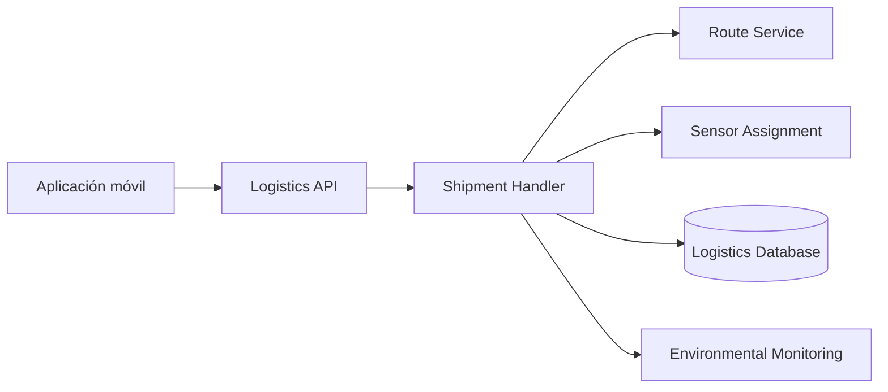
```mermaid
flowchart LR
  App[Aplicación móvil] --> API[Logistics API]
  API --> Shipment[Shipment Handler]
  Shipment --> Route[Route Service]
  Shipment --> Sensor[Sensor Assignment]
  Shipment --> DB[(Logistics Database)]
  Shipment --> Monitor[Environmental Monitoring]
```

#### 2.6.5.6. Bounded Context Software Architecture Code Level Diagrams
##### 2.6.5.6.1. Bounded Context Domain Layer Class Diagrams
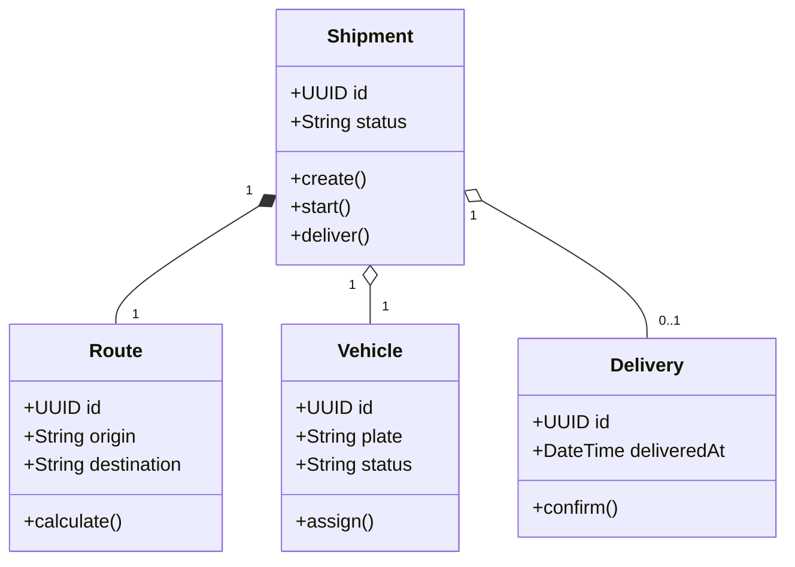
```mermaid
classDiagram
  class Shipment {
    +UUID id
    +String status
    +create()
    +start()
    +deliver()
  }
  class Route {
    +UUID id
    +String origin
    +String destination
    +calculate()
  }
  class Vehicle {
    +UUID id
    +String plate
    +String status
    +assign()
  }
  class Delivery {
    +UUID id
    +DateTime deliveredAt
    +confirm()
  }
  Shipment "1" *-- "1" Route
  Shipment "1" o-- "1" Vehicle
  Shipment "1" o-- "0..1" Delivery
```

##### 2.6.5.6.2. Bounded Context Database Design Diagram
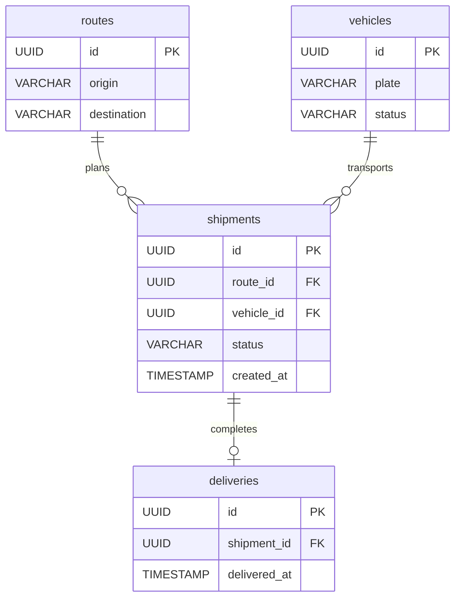
```mermaid
erDiagram
  shipments {
    UUID id PK
    UUID route_id FK
    UUID vehicle_id FK
    VARCHAR status
    TIMESTAMP created_at
  }
  routes {
    UUID id PK
    VARCHAR origin
    VARCHAR destination
  }
  vehicles {
    UUID id PK
    VARCHAR plate
    VARCHAR status
  }
  deliveries {
    UUID id PK
    UUID shipment_id FK
    TIMESTAMP delivered_at
  }
  routes ||--o{ shipments : plans
  vehicles ||--o{ shipments : transports
  shipments ||--o| deliveries : completes
```

### 2.6.6. Bounded Context: reporting

#### 2.6.6.1. Domain Layer
Reporting consolida historial, indicadores y evidencia digital. Sus clases principales son `TemperatureHistory`, `Kpi`, `ComplianceReport` y `EvidenceRecord`.

#### 2.6.6.2. Interface Layer
`DashboardController`, `HistoryController` y `ReportController` permiten consultar indicadores y exportar evidencia.

#### 2.6.6.3. Application Layer
`GetTemperatureHistoryHandler`, `GenerateKpiHandler` y `GenerateComplianceReportHandler` construyen las consultas de lectura.

#### 2.6.6.4. Infrastructure Layer
`ReportingProjection`, `ReadDatabase` y `ReportExporter` consumen eventos y generan proyecciones de solo lectura.

#### 2.6.6.5. Bounded Context Software Architecture Component Level Diagrams
```mermaid
flowchart LR
  Events[Domain Events] --> Projection[Reporting Projection]
  Projection --> ReadDB[(Reporting Read Database)]
  User[Usuario autorizado] --> API[Reporting API]
  API --> Dashboard[Dashboard Service]
  API --> Export[Evidence Exporter]
  Dashboard --> ReadDB
  Export --> ReadDB
```

#### 2.6.6.6. Bounded Context Software Architecture Code Level Diagrams
##### 2.6.6.6.1. Bounded Context Domain Layer Class Diagrams
```mermaid
classDiagram
  class TemperatureHistory {
    +UUID shipmentId
    +List readings
    +filterByDateRange()
  }
  class Kpi {
    +String name
    +Decimal value
    +calculate()
  }
  class ComplianceReport {
    +UUID id
    +String status
    +generate()
  }
  class EvidenceRecord {
    +UUID id
    +String hash
    +verifyIntegrity() Boolean
  }
  ComplianceReport "1" o-- "0..*" EvidenceRecord
  TemperatureHistory --> ComplianceReport
  Kpi --> ComplianceReport
```

##### 2.6.6.6.2. Bounded Context Database Design Diagram
```mermaid
erDiagram
  temperature_history {
    UUID id PK
    UUID shipment_id FK
    DECIMAL temperature
    TIMESTAMP recorded_at
  }
  kpis {
    UUID id PK
    VARCHAR name
    DECIMAL value
    DATE period
  }
  compliance_reports {
    UUID id PK
    UUID shipment_id FK
    VARCHAR status
    TIMESTAMP generated_at
  }
  evidence_records {
    UUID id PK
    UUID report_id FK
    VARCHAR content_hash
    TIMESTAMP created_at
  }
  compliance_reports ||--o{ evidence_records : contains
  temperature_history }o--|| compliance_reports : supports
```

