<div align="center">
        <br>
</div>
<h3 align="center"> Universidad Peruana de Ciencias Aplicadas </h3>

<h3 align="center">Carrera de Ingeniería de Software </h3>

<h3 align="center">
    <b>
        1ACC0238 
    </b>    
</h3>

<h3 align="center"> 
    <b>
        Aplicaciones para Dispositivos Móviles
    </b>
</h3>
<h3 align="center"> NRC </h3>

<h3 align="center">  
    <b>
        4950
    </b>
</h3>

<h3 align="center"> 
    <b>
        Informe de Trabajo Final
    </b>
</h3>


<h3 align="center"> Docente</h3>
<h3 align="center"> 
    <b>
        Mayta Guillermo, Jorge Luis 
    </b>
</h3>


<h3 align="center"> Equipo </h3>
<h3 align="center">  
    <b>
        Cryologic System
    </b>
</h3>

<h3 align="center"> Proyecto</h3>
<h3 align="center">  
    <b>
        SafeFlow
    </b>
</h3>

<br>

<h3 align="center">  
    <b>
        Integrantes
    </b>
</h3>

<div align = "center">
 
| Code       |      Member |
| :---:      |     :--- |
| U202219199 | Acosta Elera, Abraam Bernabe |
| U202123362 | Bustinza Muñoz, Sebastian Alonso |
| U202218531 | Mio Mejia, Andy Alejandro |
| U202316049 | Morales Yapuchura, Jefferson Bayron |

</div>

<h3 align="center">
    <b>
        Periodo 202620
    </b>
</h3>
<h3 align="center">
    <b>
        Octubre 2026
    </b>
</h3>


<div style="page-break-after: always;"></div>

## Registro de Versiones del Informe

El registro de versiones documenta, entrega por entrega, quién redactó o modificó cada sección del informe y qué cambios se realizaron, incluidas las secciones agregadas o retiradas y las correcciones derivadas de la retroalimentación del docente. La tabla siguiente resume ese historial y es coherente con las evidencias de colaboración de la siguiente sección.

<p><em>Registro de versiones del informe</em></p>

<div align = "center">
    
| Versión |   Fecha    |                Autor                |                                                  Descripción de modificación                                                   |
|:-------:|:----------:|:-----------------------------------:|:------------------------------------------------------------------------------------------------------------------------------:|
|   AV1   | 12-09-2026 | Mio Mejia, Andy Alejandro | Descripción de la Startup |
|   AV1   | 12-09-2026 | Mio Mejia, Andy Alejandro | Creación de la carpeta de imágenes |
|   AV1   | 12-09-2026 | Mio Mejia, Andy Alejandro | Creación de ramas en los repositorios |
|   AV1   | 12-09-2026 | Mio Mejia, Andy Alejandro | Source Code Management |
|   AV1   | 18-09-2026 | Bustinza Muñoz, Sebastian Alonso | Needfinding |
|   AV1   | 18-09-2026 | Morales Yapuchura, Jefferson Bayron | Análisis competitivo |
|   AV1   | 18-09-2026 | Morales Yapuchura, Jefferson Bayron | Estrategias y tácticas frente a competidores |
|   AV1   | 18-09-2026 | Morales Yapuchura, Jefferson Bayron | Diseño de entrevistas |
|   AV1   | 18-09-2026 | Morales Yapuchura, Jefferson Bayron | Registro de entrevistas |
|   AV1   | 18-09-2026 | Morales Yapuchura, Jefferson Bayron | Análisis de entrevistas |
|   AV1   | 18-09-2026 | Acosta Elera, Abraam Bernabe | Desarrollo de User Stories |
|   AV1   | 18-09-2026 | Acosta Elera, Abraam Bernabe | Desarrollo de Impact Mapping |
|   AV1   | 18-09-2026 | Acosta Elera, Abraam Bernabe | Desarrollo de Product Backlog |
|   AV1   | 18-09-2026 | Acosta Elera, Abraam Bernabe | Desarrollo de EventStorming |
|   AV1   | 18-09-2026 | Acosta Elera, Abraam Bernabe | Desarrollo de Candidate Context Discovery |
|   AV1   | 18-09-2026 | Acosta Elera, Abraam Bernabe | Desarrollo de Domain Message Flows Modeling |
|   AV1   | 18-09-2026 | Acosta Elera, Abraam Bernabe | Desarrollo de Bounded Context Canvases |
|   AV1   | 18-09-2026 | Acosta Elera, Abraam Bernabe | Desarrollo de Context Mapping |
|   AV1   | 18-09-2026 | Acosta Elera, Abraam Bernabe | Desarrollo de Software Architecture |
|   TB1   | 09-10-2026 | Acosta Elera, Abraam Bernabe | Actualización de Epics, User Stories e Impact Mapping; reconstrucción del Product Backlog |
|   TB1   | 09-10-2026 | Mio Mejia, Andy Alejandro | Incorporación de las secciones Student Outcome y Objetivos SMART |
|   TB1   | 09-10-2026 | Acosta Elera, Abraam Bernabe | Revisión de la nomenclatura de eventos, Domain Message Flow Modeling, Bounded Context Canvases y Context Mapping |
|   TB1   | 09-10-2026 | Acosta Elera, Abraam Bernabe | Revisión de los diagramas C4 (Context, Container, Deployment) y de los diagramas de cada Bounded Context |
|   TB1   | 09-10-2026 | Morales Yapuchura, Jefferson Bayron | Numeración, citación y descripción de figuras y tablas; saltos de página por capítulo |
|   TB1   | 09-10-2026 | Bustinza Muñoz, Sebastian Alonso | Incorporación del Capítulo III (UI/UX) y del Capítulo IV (Sprint 1) a partir de la base Android y del diseño en Figma |

<p><strong><em>Nota.</em></strong> Elaboración propia. Cada fila registra la sección modificada, su autor y la fecha de entrega.</p>

</div>

<div style="page-break-after: always;"></div>

## Project Report Collaboration Insights

A lo largo del desarrollo del trabajo se evidenció una participación activa, coordinada y progresiva de todos los integrantes del equipo. Cada fase se abordó de manera estructurada, con control de versiones en GitHub, planificación por entregables y asignación de responsabilidades según las competencias de cada integrante. El uso de repositorios específicos por componente contribuyó a la trazabilidad del trabajo colaborativo, con ramas por entregable y versiones controladas según el avance de cada sprint.

El informe se mantiene en el repositorio de la organización del equipo, donde cada integrante registra sus aportes mediante commits.

- Repositorio del informe: [safeflow-report](https://github.com/upc-pre-202620-1acc0238-4950-cryologic/safeflow-report.git)
- Repositorio de la aplicación <https://github.com/https://github.com/upc-pre-202620-1acc0238-4950-cryologic/safeflow-android-app>

La tabla siguiente detalla las tareas asignadas a cada integrante en las entregas AV1 y TB1 y su relación con las secciones del informe.

<p><em>Tareas asignadas por integrante en las entregas AV1 y TB1</em></p>

| Integrante | AV1 | TB1 |
|------------|-----|-----|
| Acosta Elera, Abraam Bernabe | Requisitos mediante User Stories, Impact Mapping y Product Backlog; diseño estratégico y arquitectura de software con Domain-Driven Design. | Actualización de epics y User Stories; Domain Message Flow Modeling, Bounded Context Canvases, Context Mapping, C4 y diseño táctico por Bounded Context. |
| Bustinza Muñoz, Sebastian Alonso | Needfinding: User Personas, User Task Matrix, User Journey Mapping, Empathy Mapping y EventStorming. | Desarrollo de la aplicación móvil Android (base técnica y sistema visual) y apoyo en la documentación: Capítulo III (UI/UX) y Capítulo IV (Sprint 1). |
| Mio Mejia, Andy Alejandro | Capítulo de presentación: Startup Profile, Solution Profile, proceso Lean UX y segmentos objetivo; ramas y gestión del código fuente. | Revisión del Capítulo I (5W y 2H, supuestos e hipótesis de Lean UX), Student Outcome, Objetivos SMART y Source Code Management. |
| Morales Yapuchura, Jefferson Bayron | Análisis competitivo; diseño, registro y análisis de entrevistas con usuarios clave. | Trazabilidad del análisis de entrevistas, numeración y citación de figuras y tablas, diseño de las entrevistas de validación, glosario y bibliografía. |

<p><strong><em>Nota.</em></strong> Elaboración propia a partir del reparto de responsabilidades del equipo en cada entrega.</p>

## **Github Collaboration Insights**

Los integrantes y sus cuentas de GitHub son los siguientes:

- Mio Mejia, Andy Alejandro (AndyMio17)
- Bustinza Muñoz, Sebastian Alonso (sebastianbustinza809)
- Morales Yapuchura, Jefferson Bayron (Fenfito)
- Acosta Elera, Abraam Bernabe (AbraamBernabe)

### Github Collaboration Informe

La Figura 1 presenta las estadísticas de colaboración del repositorio del informe, con el propósito de evidenciar que todos los integrantes participaron mediante commits.

<p><strong>Figura 1.</strong> <em>Estadísticas de colaboración en GitHub del repositorio del informe</em></p>

<div align="center">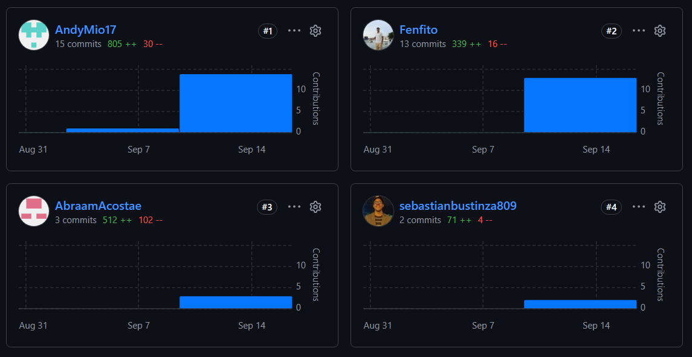</div>

<p><strong><em>Nota.</em></strong> Captura de la sección Insights del repositorio del informe, entrega AV1.</p>

> Pendiente: captura actualizada de GitHub Insights con los commits de la entrega TB1.

<div style="page-break-after: always;"></div>

# Contenido

## Tabla de Contenidos

- [Registro de Versiones del Informe](#registro-de-versiones-del-informe)
- [Project Report Collaboration Insights](#project-report-collaboration-insights)
- [Github Collaboration Insights](#github-collaboration-insights)
  - [Github Collaboration Informe](#github-collaboration-informe)
[Student Outcome](#student-outcome)

  - [1. Acosta Elera, Abraam Bernabe](#1-acosta-elera-abraam-bernabe)
  - [2. Bustinza Muñoz, Sebastian Alonso](#2-bustinza-muñoz-sebastian-alonso)
  - [3. Mio Mejia, Andy Alejandro](#3-mio-mejia-andy-alejandro)
  - [4. Morales Yapuchura, Jefferson Bayron](#4-morales-yapuchura-jefferson-bayron)
[Objetivos SMART](#objetivos-smart)

  - [1. Acosta Elera, Abraam Bernabe](#1-acosta-elera-abraam-bernabe-1)
  - [2. Bustinza Muñoz, Sebastian Alonso](#2-bustinza-muñoz-sebastian-alonso-1)
  - [3. Mio Mejia, Andy Alejandro](#3-mio-mejia-andy-alejandro-1)
  - [4. Morales Yapuchura, Jefferson Bayron](#4-morales-yapuchura-jefferson-bayron-1)
[Capítulo I: Presentación](#capítulo-i-presentación)

- [1.1. Startup Profile](#11-startup-profile)
  - [1.1.1. Descripción de la Startup](#111-descripción-de-la-startup)
  - [1.1.2. Perfiles de integrantes del equipo](#112-perfiles-de-integrantes-del-equipo)
- [1.2. Solution Profile](#12-solution-profile)
  - [1.2.1. Antecedentes y problemática](#121-antecedentes-y-problemática)
  - [1.2.2. Lean UX Process](#122-lean-ux-process)
- [1.3. Segmentos objetivo](#13-segmentos-objetivo)
  - [Segmento Objetivo 1: Empresas del sector farmacéutico](#segmento-objetivo-1-empresas-del-sector-farmacéutico)
  - [Segmento Objetivo 2: Operadores logísticos (3PL y transporte especializado)](#segmento-objetivo-2-operadores-logísticos-3pl-y-transporte-especializado)
  - [Respaldo estadístico de los segmentos](#respaldo-estadístico-de-los-segmentos)
[Capítulo II: Requirements Development and Software Solution Design](#capítulo-ii-requirements-development-and-software-solution-design)

- [2.1. Competidores](#21-competidores)
  - [2.1.1. Análisis competitivo](#211-análisis-competitivo)
  - [2.1.2. Estrategias y tácticas frente a competidores](#212-estrategias-y-tácticas-frente-a-competidores)
- [2.2. Entrevistas](#22-entrevistas)
  - [2.2.1. Diseño de entrevistas](#221-diseño-de-entrevistas)
  - [2.2.2. Registro de entrevistas](#222-registro-de-entrevistas)
  - [2.2.3. Análisis de entrevistas](#223-análisis-de-entrevistas)
- [2.3. Needfinding](#23-needfinding)
  - [2.3.1. User Personas](#231-user-personas)
  - [2.3.2. User Task Matrix](#232-user-task-matrix)
  - [2.3.3. User Journey Mapping](#233-user-journey-mapping)
  - [2.3.4. Empathy Mapping](#234-empathy-mapping)
  - [2.3.5. Big Picture EventStorming](#235-big-picture-eventstorming)
  - [2.3.6. Ubiquitous Language](#236-ubiquitous-language)
- [2.4. Requirements specification](#24-requirements-specification)
  - [2.4.1. User Stories](#241-user-stories)
  - [2.4.2. Impact Mapping](#242-impact-mapping)
  - [2.4.3. Product Backlog](#243-product-backlog)
- [2.5. Strategic-Level Domain-Driven Design](#25-strategic-level-domain-driven-design)
  - [2.5.1. EventStorming](#251-eventstorming)
  - [2.5.2. Context Mapping](#252-context-mapping)
  - [2.5.3 Software Architecture](#253-software-architecture)
- [2.6. Tactical-Level Domain-Driven Design](#26-tactical-level-domain-driven-design)
  - [2.6.1. Bounded Context: IAM](#261-bounded-context-iam)
  - [2.6.2. Bounded Context: Inventory](#262-bounded-context-inventory)
  - [2.6.3. Bounded Context: Environmental Monitoring](#263-bounded-context-environmental-monitoring)
  - [2.6.4 Alerts Bounded Context](#264-alerts-bounded-context)
  - [2.6.5 Logistics Bounded Context](#265-logistics-bounded-context)
  - [2.6.6 Reporting Bounded Context](#266-reporting-bounded-context)
[Capítulo III: Solution UI/UX Design](#capítulo-iii-solution-uiux-design)

- [3.1. Product design](#31-product-design)
  - [3.1.1. Style Guidelines](#311-style-guidelines)
  - [3.1.2. Information Architecture](#312-information-architecture)
  - [3.1.3. Landing Page UI Design](#313-landing-page-ui-design)
  - [3.1.4. Mobile Applications UX/UI Design](#314-mobile-applications-uxui-design)
[Capítulo IV: Product Implementation & Validation](#capítulo-iv-product-implementation--validation)

- [4.1. Software Configuration Management](#41-software-configuration-management)
  - [4.1.1. Software Development Environment Configuration](#411-software-development-environment-configuration)
  - [4.1.2. Source Code Management](#412-source-code-management)
  - [4.1.3. Source Code Style Guide & Conventions](#413-source-code-style-guide--conventions)
  - [4.1.4. Software Deployment Configuration](#414-software-deployment-configuration)
  - [4.1.5. Consideraciones éticas, i18n y accesibilidad](#415-consideraciones-éticas-i18n-y-accesibilidad)
- [4.2. Landing Page, Services & Applications Implementation](#42-landing-page-services--applications-implementation)
  - [4.2.1. Sprint 1](#421-sprint-1)
- [4.3. Validation Interviews](#43-validation-interviews)
  - [4.3.1. Diseño de Entrevistas](#431-diseño-de-entrevistas)
  - [4.3.2. Registro de Entrevistas](#432-registro-de-entrevistas)
  - [4.3.3. Evaluaciones según heurísticas](#433-evaluaciones-según-heurísticas)
[Conclusiones y recomendaciones](#conclusiones-y-recomendaciones)

[Videos](#videos)

- [Video About-the-Product](#video-about-the-product)
- [Video App Validation](#video-app-validation)
- [Video About-the-Team](#video-about-the-team)
[Glosario](#glosario)

[Bibliografía](#bibliografía)

- [Dominio de negocio](#dominio-de-negocio)
- [Métodos y técnicas de ingeniería de software](#métodos-y-técnicas-de-ingeniería-de-software)
- [Lenguajes, frameworks y herramientas](#lenguajes-frameworks-y-herramientas)
[Anexos](#anexos)

- [Anexo A. Videos de Exposiciones](#anexo-a-videos-de-exposiciones)
- [Anexo B. Formato de evaluación heurística](#anexo-b-formato-de-evaluación-heurística)

<div style="page-break-after: always;"></div>

# Student Outcome

El curso contribuye al cumplimiento del Student Outcome ABET: la capacidad de adquirir y aplicar nuevos conocimientos según sea necesario, utilizando estrategias de aprendizaje apropiadas. En el siguiente cuadro se describen las acciones realizadas y los enunciados de conclusiones por parte del grupo, que permiten sustentar el haber alcanzado el logro del ABET - Criterio: ABET-EAC-Student Outcome 7.

Cada integrante detalla a continuación la relación entre el outcome, sus dimensiones y el trabajo que realizó. Estas descripciones se complementan con los testimonios del video About the Team. Las celdas de acciones se amplían en cada entrega; las conclusiones se redactan de forma grupal y son acumulables. Las tablas siguientes corresponden a cada integrante, en orden alfabético por apellido.

### 1. Acosta Elera, Abraam Bernabe

<p><em>Student Outcome 7 - Acosta Elera, Abraam Bernabe</em></p>

| Criterio específico | Acciones realizadas | Conclusiones |
|---|---|---|
| Actualiza conceptos y conocimientos necesarios para su desarrollo profesional y en especial para su proyecto en soluciones de software. | **Acosta Elera, Abraam Bernabe**<br>**AV1:** Aplicó EventStorming, Candidate Context Discovery, Domain Message Flows Modeling, Bounded Context Canvases y Context Mapping para modelar el dominio de la cadena de frío; redactó las User Stories, el Impact Mapping y el Product Backlog.<br>**TB1:** Actualizó el catálogo de epics y User Stories (EP-01 a EP-07, 28 historias) y rehízo el Domain Message Flow Modeling, los seis Bounded Context Canvases, el Context Mapping y los diagramas C4 con las guías de la comunidad DDD (ddd-crew). | **AV1:** El equipo incorporó técnicas de Domain-Driven Design que no formaban parte de su práctica previa y las aplicó a un dominio real.<br>**TB1:** Justificar cada patrón de relación entre contextos obligó a contrastar alternativas y documentar por qué se descartó cada una. |
| Reconoce la necesidad del aprendizaje permanente para el desempeño profesional y el desarrollo de proyectos en soluciones de software. | **AV1:** Estudió el modelado estratégico de DDD para dividir el sistema en seis Bounded Contexts.<br>**TB1:** Estudió el modelado táctico por capas y las guías Domain Message Flow Modelling, Bounded Context Canvas y Context Mapping, y las aplicó a la documentación de cada contexto. | **AV1:** La complejidad del dominio mostró que el modelado requiere iteración y revisión constantes.<br>**TB1:** Las observaciones del docente se convirtieron en ciclos de corrección registrados en el control de versiones del informe. |

<p><strong><em>Nota.</em></strong> Elaboración propia. Formato del Anexo A del enunciado del trabajo final.</p>

### 2. Bustinza Muñoz, Sebastian Alonso

<p><em>Student Outcome 7 - Bustinza Muñoz, Sebastian Alonso</em></p>

| Criterio específico | Acciones realizadas | Conclusiones |
|---|---|---|
| Actualiza conceptos y conocimientos necesarios para su desarrollo profesional y en especial para su proyecto en soluciones de software. | **Bustinza Muñoz, Sebastian Alonso**<br>**AV1:** Elaboró User Personas, User Task Matrix, User Journey Mapping, Empathy Mapping y el Big Picture EventStorming.<br>**TB1:** Desarrolló la aplicación móvil Android: configuró el proyecto con Kotlin, Jetpack Compose, Hilt, Retrofit, Room y DataStore, organizó el código en seis paquetes por Bounded Context con sus cuatro capas e implementó el sistema visual (tema, tipografía Inter, iconos y 13 componentes reutilizables) a partir del diseño de Figma. Verificó la compilación, las pruebas unitarias y el análisis estático. Apoyó la documentación con los Capítulos III y IV. | **AV1:** El equipo aprendió a derivar requisitos de la evidencia de usuarios y no de supuestos.<br>**TB1:** Separar dominio, aplicación, infraestructura y presentación desde la base técnica evita acoplar los contextos y hace que el diseño del informe coincida con el código. |
| Reconoce la necesidad del aprendizaje permanente para el desempeño profesional y el desarrollo de proyectos en soluciones de software. | **AV1:** Aprendió a conducir procesos de Needfinding y a sintetizar hallazgos en artefactos de experiencia de usuario.<br>**TB1:** Incorporó herramientas y versiones que no se habían usado en clase (Room 3, KSP, Compose BOM 2026.09.00) y estudió el ejemplo de arquitectura por capas del docente para adaptarlo a SafeFlow. | **AV1:** El trabajo con usuarios exige actualizar los artefactos cuando cambian los hallazgos.<br>**TB1:** Adoptar bibliotecas nuevas requiere leer su documentación y comprobar su compatibilidad antes de usarlas en el proyecto. |

<p><strong><em>Nota.</em></strong> Elaboración propia. Formato del Anexo A del enunciado del trabajo final.</p>

### 3. Mio Mejia, Andy Alejandro

<p><em>Student Outcome 7 - Mio Mejia, Andy Alejandro</em></p>

| Criterio específico | Acciones realizadas | Conclusiones |
|---|---|---|
| Actualiza conceptos y conocimientos necesarios para su desarrollo profesional y en especial para su proyecto en soluciones de software. | **Mio Mejia, Andy Alejandro**<br>**AV1:** Redactó el Startup Profile, el Solution Profile, el proceso Lean UX y los segmentos objetivo; configuró las ramas de los repositorios y la gestión del código fuente.<br>**TB1:** Revisó el Capítulo I: aplicó la técnica 5W y 2H al planteamiento del problema, reorganizó los supuestos en los cinco tipos de Lean UX y formuló una hipótesis por cada supuesto de funcionalidad. Redactó las secciones Student Outcome y Objetivos SMART. | **AV1:** El equipo aplicó Lean UX para formular hipótesis verificables sobre el problema de la cadena de frío.<br>**TB1:** Vincular cada hipótesis con una funcionalidad concreta permite validar el producto y no solo describirlo. |
| Reconoce la necesidad del aprendizaje permanente para el desempeño profesional y el desarrollo de proyectos en soluciones de software. | **AV1:** Investigó la problemática de la cadena de frío y las prácticas de control de versiones con GitFlow.<br>**TB1:** Documentó el flujo de trabajo con GitFlow, Conventional Commits y Semantic Versioning para el Sprint 1. | **AV1:** El dominio del problema debe estudiarse antes de proponer la solución.<br>**TB1:** Las convenciones de commits facilitan la trazabilidad del trabajo de cada integrante. |

<p><strong><em>Nota.</em></strong> Elaboración propia. Formato del Anexo A del enunciado del trabajo final.</p>

### 4. Morales Yapuchura, Jefferson Bayron

<p><em>Student Outcome 7 - Morales Yapuchura, Jefferson Bayron</em></p>

| Criterio específico | Acciones realizadas | Conclusiones |
|---|---|---|
| Actualiza conceptos y conocimientos necesarios para su desarrollo profesional y en especial para su proyecto en soluciones de software. | **Morales Yapuchura, Jefferson Bayron**<br>**AV1:** Realizó el análisis competitivo, las estrategias frente a competidores y el diseño, registro y análisis de entrevistas.<br>**TB1:** Revisó la trazabilidad entre los registros de las entrevistas y las conclusiones del análisis, unificó la numeración y la citación de las figuras y las tablas del informe y elaboró el diseño de las entrevistas de validación. | **AV1:** El análisis de competidores y entrevistas permitió identificar ventajas diferenciales del producto.<br>**TB1:** Las cifras del análisis de entrevistas deben poder rastrearse hasta los registros individuales para sostener las decisiones de producto. |
| Reconoce la necesidad del aprendizaje permanente para el desempeño profesional y el desarrollo de proyectos en soluciones de software. | **AV1:** Aprendió técnicas de entrevista y de análisis cualitativo y cuantitativo de los datos obtenidos.<br>**TB1:** Aprendió el estilo APA 7 y a verificar fuentes académicas para el glosario y la bibliografía del informe. | **AV1:** El análisis de datos de usuarios requiere rigor para sustentar las decisiones de producto.<br>**TB1:** Citar fuentes verificables fortalece la credibilidad de las decisiones documentadas. |

<p><strong><em>Nota.</em></strong> Elaboración propia. Formato del Anexo A del enunciado del trabajo final.</p>

<div style="page-break-after: always;"></div>

# Objetivos SMART

Esta sección reúne los objetivos SMART (específicos, medibles, alcanzables, relevantes y con plazo) que cada integrante formula para su desarrollo profesional una vez finalizada la carrera. Cada plan incluye dos objetivos y refleja cómo el integrante proyecta un crecimiento profesional continuo a partir de lo aprendido en el trabajo final. Los planes de Acosta, Mio y Morales se centran en la documentación técnica y de producto, que fue su aporte principal; el de Bustinza se centra en el desarrollo móvil, que fue el suyo.

### 1. Acosta Elera, Abraam Bernabe

<p><em>Objetivos SMART - Acosta Elera, Abraam Bernabe</em></p>

| Objetivo | Específico | Medible | Alcanzable | Relevante | Plazo |
|---|---|---|---|---|---|
| 1 | Documentar la arquitectura de un sistema real con el modelo C4 y registros de decisiones de arquitectura (ADR). | Entregar los diagramas C4 de contexto y de contenedores y al menos 10 ADR. | Se reutiliza el método aplicado en este trabajo final. | Fortalece su perfil en diseño arquitectónico y comunicación técnica. | 12 meses después de la graduación |
| 2 | Obtener una certificación en arquitectura de software o arquitectura en la nube. | Aprobar el examen de certificación. | Estudio semanal de 6 horas con material oficial. | Respalda su especialización en Domain-Driven Design. | 18 meses después de la graduación |

<p><strong><em>Nota.</em></strong> Elaboración propia.</p>

### 2. Bustinza Muñoz, Sebastian Alonso

<p><em>Objetivos SMART - Bustinza Muñoz, Sebastian Alonso</em></p>

| Objetivo | Específico | Medible | Alcanzable | Relevante | Plazo |
|---|---|---|---|---|---|
| 1 | Publicar en Google Play una aplicación móvil propia desarrollada con Kotlin y Jetpack Compose. | Una aplicación publicada con al menos 3 versiones. | Se parte de la base técnica construida en este trabajo final. | Consolida su perfil como desarrollador móvil. | 12 meses después de la graduación |
| 2 | Alcanzar un dominio profesional de arquitectura Android por capas con pruebas automatizadas. | Cobertura de pruebas unitarias superior al 70 % en el dominio y la aplicación de un proyecto. | Se aplica la arquitectura por Bounded Context del proyecto SafeFlow. | Mejora la calidad y el mantenimiento del software que desarrolla. | 9 meses después de la graduación |

<p><strong><em>Nota.</em></strong> Elaboración propia.</p>

### 3. Mio Mejia, Andy Alejandro

<p><em>Objetivos SMART - Mio Mejia, Andy Alejandro</em></p>

| Objetivo | Específico | Medible | Alcanzable | Relevante | Plazo |
|---|---|---|---|---|---|
| 1 | Elaborar la documentación técnica y de producto de un proyecto de software, con repositorio, guía de contribución y plan de versiones. | Un repositorio con README, guía de contribución y al menos 6 documentos técnicos publicados. | Se aplican las prácticas de GitFlow y Conventional Commits de este trabajo. | Refuerza su perfil en gestión del código fuente y documentación. | 8 meses después de la graduación |
| 2 | Completar un curso de redacción técnica y análisis de requisitos. | Obtener el certificado del curso. | Dedicación de 4 horas semanales. | Mejora la calidad de la documentación que produce. | 12 meses después de la graduación |

<p><strong><em>Nota.</em></strong> Elaboración propia.</p>

### 4. Morales Yapuchura, Jefferson Bayron

<p><em>Objetivos SMART - Morales Yapuchura, Jefferson Bayron</em></p>

| Objetivo | Específico | Medible | Alcanzable | Relevante | Plazo |
|---|---|---|---|---|---|
| 1 | Producir informes de análisis de usuarios y de competencia para productos de software. | Dos informes con al menos 5 entrevistas y 3 competidores cada uno. | Se replica el método usado en este trabajo final. | Aplica su especialización en análisis del entorno competitivo. | 10 meses después de la graduación |
| 2 | Completar un curso de análisis de datos y estadística aplicada a la investigación de usuarios. | Aprobar el curso con una nota mínima de 80 %. | Cursado en línea con 4 horas semanales. | Respalda con datos las conclusiones de sus informes. | 8 meses después de la graduación |

<p><strong><em>Nota.</em></strong> Elaboración propia.</p>

<div style="page-break-after: always;"></div>

# Capítulo I: Presentación

Este capítulo presenta a la startup Cryologic Systems, al equipo que desarrolla SafeFlow y el planteamiento del problema que la solución busca resolver. Describe la startup y sus integrantes, el problema y su contexto, el proceso Lean UX que traduce el problema en supuestos e hipótesis verificables, y los segmentos de clientes a los que se dirige el producto.

## 1.1. Startup Profile

En esta sección se presenta el perfil de la startup Cryologic Systems, describiendo su propósito, enfoque y propuesta de valor dentro del contexto de la gestión de la cadena de frío. Asimismo, se detallan las características principales de la solución planteada y el rol del equipo encargado de su desarrollo.

### 1.1.1. Descripción de la Startup

Cryologic Systems es una startup tecnológica que desarrolla SafeFlow, una aplicación móvil para la gestión y el monitoreo de la cadena de frío en productos sensibles como medicamentos y alimentos perecederos. Su propósito principal es ofrecer una solución que permita a las empresas garantizar que sus productos se mantengan dentro de condiciones térmicas adecuadas durante el almacenamiento y el transporte.

La startup surge como respuesta a las pérdidas económicas y los riesgos sanitarios ocasionados por variaciones de temperatura que afectan la calidad e integridad de los productos. En este contexto, Cryologic Systems propone un sistema que permite registrar productos, definir rangos de temperatura permitidos y supervisar su comportamiento a lo largo de la cadena logística.

La aplicación analiza las mediciones registradas y detecta desviaciones respecto de los parámetros establecidos, generando alertas que facilitan la toma de decisiones oportunas. Además, permite la trazabilidad de los productos, identificando en qué punto de la cadena ocurre una incidencia y facilitando el control operativo. En esta etapa, las mediciones de los sensores se reproducen mediante una aplicación emuladora, por lo que la fabricación de hardware queda fuera del alcance del proyecto.

### 1.1.2. Perfiles de integrantes del equipo

Los perfiles describen la formación y las competencias técnicas principales de cada integrante, que sustentan el reparto de responsabilidades del equipo. La Tabla 1 reúne el perfil de los cuatro integrantes en orden alfabético por apellido.

<p><strong>Tabla 1.</strong> <em>Perfiles de los integrantes del equipo</em></p>

| Foto | Integrante | Código | Carrera | Descripción |
|:----:|:-----------|:------:|:--------|:------------|
|  | Acosta Elera, Abraam Bernabe | U202219199 | Ingeniería de Software | Estudiante de Ingeniería de Software enfocado en el diseño arquitectónico y el modelado de sistemas complejos. Posee capacidad analítica para estructurar soluciones escalables aplicando patrones de diseño y estrategias de Domain-Driven Design (DDD), lo que asegura la solidez técnica del proyecto. |
|  | Bustinza Muñoz, Sebastian Alonso | U202123362 | Ingeniería de Software | Estudiante de Ingeniería de Software orientado al entendimiento y la experiencia del usuario. Se especializa en procesos de Needfinding y crea herramientas empáticas como mapas de experiencia y perfiles de usuario (User Personas), fundamentales para asegurar que la solución resuelva problemas reales de manera intuitiva. |
|  | Mio Mejia, Andy Alejandro | U202218531 | Ingeniería de Software | Estudiante de Ingeniería de Software que se caracteriza por su compromiso con el trabajo en equipo. Cuenta con conocimientos en HTML, CSS, JavaScript y SQL, que aportan al desarrollo en las áreas de frontend y bases de datos, y con experiencia en Python para tareas de programación, automatización y análisis. |
|  | Morales Yapuchura, Jefferson Bayron | U202316049 | Ingeniería de Software | Estudiante de Ingeniería de Software con perfil analítico e investigativo. Destaca por su capacidad para analizar el entorno competitivo, identificar ventajas diferenciales y diseñar estrategias a partir de la recolección de información en entrevistas, lo que aporta una base sólida para las decisiones estratégicas frente a la competencia. |

<p><strong><em>Nota.</em></strong> Elaboración propia.</p>

## 1.2. Solution Profile

El Solution Profile de SafeFlow presenta la definición del problema que aborda la propuesta y el enfoque de solución, basado en la optimización de la cadena de frío mediante una aplicación móvil. La sección se divide en dos partes: los antecedentes y la problemática, y el proceso Lean UX aplicado al dominio del problema.

### 1.2.1. Antecedentes y problemática

Para delimitar el problema se aplicó la técnica de las 5W y 2H (Who, What, Where, When, Why, How y How much). La Tabla 2 resume el resultado y sirve de base para el planteamiento que sigue.

<p><strong>Tabla 2.</strong> <em>Análisis 5W y 2H del problema</em></p>

| Pregunta | Respuesta |
|:---------|:----------|
| Who (quién) | Operadores, supervisores y administradores de empresas farmacéuticas, alimentarias y logísticas que manejan productos sensibles a la temperatura. |
| What (qué) | Pérdida de productos y falta de trazabilidad por excursiones térmicas que se detectan tarde o no se detectan. |
| Where (dónde) | En el almacenamiento y el transporte de la cadena de frío. |
| When (cuándo) | Durante toda la operación logística, en especial en el traslado y cuando falla la supervisión o la conectividad. |
| Why (por qué) | Los controles dependen de registros manuales o de dispositivos que revelan la falla cuando el producto ya fue afectado. |
| How (cómo) | Una aplicación móvil que registra productos y lotes, evalúa las mediciones frente al rango térmico, alerta las desviaciones y conserva el historial. |
| How much (cuánto) | Pérdidas económicas por producto dañado y riesgos sanitarios; el equipo busca reducir las pérdidas por fallas de la cadena de frío en un 30 % (objetivo de negocio, no medición lograda). |

<p><strong><em>Nota.</em></strong> Elaboración propia a partir del análisis del problema del Capítulo I.</p>

La cadena de frío constituye un proceso fundamental en industrias como la farmacéutica y la alimentaria, donde es indispensable mantener los productos dentro de rangos específicos de temperatura para preservar su calidad, seguridad y efectividad. Las empresas han implementado distintos mecanismos de control durante el almacenamiento y el transporte; sin embargo, estos métodos no siempre garantizan un monitoreo continuo ni una supervisión eficiente de las condiciones ambientales.

En la actualidad, muchas organizaciones enfrentan limitaciones para controlar de manera constante las variables críticas, en especial la temperatura, lo que dificulta la detección temprana de anomalías. Como consecuencia, las incidencias suelen identificarse cuando el producto ya fue afectado, lo que genera pérdidas económicas significativas y posibles riesgos para la salud de los consumidores.

Asimismo, la ausencia de sistemas integrados que permitan una trazabilidad completa de la cadena logística impide identificar con precisión en qué punto ocurrió la falla y quién fue responsable del evento. Esta falta de visibilidad reduce la capacidad de respuesta ante incidentes y limita la toma de decisiones oportunas.

En este contexto, se evidencia la necesidad de una solución tecnológica que permita monitorear, registrar y analizar las condiciones de la cadena de frío de manera eficiente, con el fin de prevenir pérdidas, mejorar la trazabilidad y optimizar la gestión de productos sensibles. La solución debe cumplir los objetivos siguientes, dentro de las restricciones de alcance indicadas:

- **Objetivos:** supervisar la temperatura de los productos, alertar las desviaciones, registrar las acciones correctivas y conservar un historial trazable.
- **Restricciones:** el proyecto se limita a aplicaciones móviles Android y a un servicio compartido; la fabricación de hardware de medición, la integración industrial con sensores físicos y el despliegue industrial quedan fuera de alcance.

### 1.2.2. Lean UX Process

En esta parte se implementa el proceso Lean UX, que aborda la visión del modelo de negocio que respalda al producto de software. Se incluye el Problem Statement, que contempla el dominio, los segmentos de clientes, los puntos de dolor, las brechas, la visión y el segmento inicial. A continuación se definen las Assumptions y los Hypothesis Statements, y se presenta el Lean UX Canvas que resume y organiza estos elementos.

#### 1.2.2.1. Lean UX Problem Statements

Se formula un único Problem Statement para todo el proyecto, con la plantilla de iniciativa nueva (Brand new initiative) de Lean UX.

El estado actual de la gestión de la cadena de frío en las industrias farmacéutica y alimentaria es deficiente debido a la falta de monitoreo continuo y de sistemas de trazabilidad integrados. Muchas empresas dependen de registros manuales o de dispositivos que solo detectan fallos cuando el producto ya fue afectado, lo que genera pérdidas económicas, riesgos sanitarios y retrasos en la respuesta ante incidencias.

SafeFlow está diseñada para que operadores, supervisores y administradores de pequeñas y medianas empresas del sector logístico, farmacéutico y alimentario gestionen la cadena de frío, desde la supervisión de la temperatura hasta el seguimiento y la trazabilidad de los productos transportados. Con esta herramienta se busca facilitar la administración operativa, mejorar la capacidad de reacción ante anomalías y proteger la integridad de la carga.

¿Cómo podríamos ofrecer a los operadores y supervisores una herramienta que proporcione visibilidad completa y alertas preventivas sobre el estado de sus productos, para que intervengan antes de que la temperatura salga del rango permitido y se asegure la integridad de la carga?

#### 1.2.2.2. Lean UX Assumptions

Las suposiciones se organizan en los cinco tipos de Lean UX: negocio, resultados de negocio, usuarios, resultados y beneficios para el usuario, y funcionalidades. Cada una se redacta como una creencia que el equipo debe validar. La Tabla 3 resume la cantidad de supuestos por tipo.

<p><strong>Tabla 3.</strong> <em>Supuestos de Lean UX por tipo</em></p>

| Tipo | Cantidad | Propósito |
|:-----|:--------:|:----------|
| Business Assumptions | 4 | Validar la necesidad y el interés del mercado. |
| Business Outcomes | 4 | Definir los resultados medibles para el negocio. |
| User Assumptions | 4 | Validar las características y necesidades de los usuarios. |
| User Outcomes and Benefits | 4 | Definir el beneficio que el usuario espera obtener. |
| Feature Assumptions | 5 | Validar las funcionalidades que producirán esos resultados. |

<p><strong><em>Nota.</em></strong> Elaboración propia.</p>

**Business Assumptions**

- Creemos que la falta de monitoreo continuo de la temperatura en la cadena de frío es un problema crítico que genera pérdidas económicas y riesgos sanitarios.
- Creemos que las empresas de los sectores logístico, farmacéutico y alimentario están interesadas en adoptar una solución tecnológica que mejore el control de sus productos.
- Creemos que las empresas valoran las soluciones que automatizan alertas y reportes, porque ahorran tiempo y reducen errores humanos.
- Creemos que las organizaciones buscan herramientas que den visibilidad completa de su operación logística.

**Business Outcomes**

- Creemos que al ofrecer un monitoreo continuo de la cadena de frío aumentaremos en un 50 % la cantidad de empresas que supervisan la temperatura de sus productos.
- Creemos que al ofrecer alertas automáticas reduciremos en un 30 % las pérdidas de productos ocasionadas por fallas en la cadena de frío.
- Creemos que al proporcionar una vista consolidada y un historial claro incrementaremos en un 40 % la eficiencia en la toma de decisiones logísticas y operativas.
- Creemos que al integrar la trazabilidad completa de los productos reduciremos en un 25 % los tiempos de respuesta ante incidencias.

**User Assumptions**

- Creemos que los usuarios necesitan información clara y actualizada para gestionar adecuadamente la cadena de frío.
- Creemos que los usuarios prefieren soluciones simples que no requieran conocimientos técnicos avanzados.
- Creemos que los usuarios se sienten limitados por los sistemas actuales, que no ofrecen un monitoreo continuo.
- Creemos que los usuarios valoran las herramientas que reducen riesgos y optimizan sus procesos operativos.

**User Outcomes and Benefits**

- Creemos que al ofrecer monitoreo continuo los usuarios tomarán decisiones rápidas para evitar pérdidas de productos.
- Creemos que con una vista consolidada intuitiva los usuarios interpretarán con facilidad el estado de sus productos.
- Creemos que al permitir el acceso desde el teléfono o la tableta los usuarios supervisarán sus operaciones desde cualquier lugar.
- Creemos que al ofrecer un historial de datos los usuarios identificarán patrones y prevendrán incidencias futuras.

**Feature Assumptions**

- **FA1.** Creemos que una vista consolidada de productos, alertas y despachos permitirá a los usuarios revisar su operación de manera eficiente.
- **FA2.** Creemos que las alertas automáticas ayudarán a prevenir pérdidas al advertir las desviaciones de temperatura sin que el usuario consulte las mediciones.
- **FA3.** Creemos que el acceso desde teléfonos y tabletas permitirá una gestión más flexible de la cadena de frío.
- **FA4.** Creemos que el historial de temperaturas permitirá analizar tendencias y mejorar los procesos logísticos.
- **FA5.** Creemos que una interfaz intuitiva facilitará la adopción del sistema sin capacitación especializada.

#### 1.2.2.3. Lean UX Hypothesis Statements

Se formula una hipótesis por cada supuesto de funcionalidad, con la plantilla de Lean UX: «Creemos que lograremos [resultado de negocio] si [personas] obtienen [beneficio] con [funcionalidad]». La Tabla 4 reúne las cinco hipótesis y su criterio de validación.

<p><strong>Tabla 4.</strong> <em>Hipótesis de Lean UX por funcionalidad</em></p>

| Id | Hipótesis | Se validará cuando |
|:--:|:----------|:-------------------|
| H1 | Creemos que reduciremos en un 40 % el uso de herramientas externas para revisar el estado de la operación si supervisores y operadores obtienen una visión consolidada con la vista de resumen (FA1). | Los usuarios reporten esa disminución en el uso de hojas de cálculo y llamadas. |
| H2 | Creemos que reduciremos en un 25 % la pérdida de carga si los supervisores se enteran de las excursiones térmicas sin consultar las mediciones con las alertas automáticas (FA2). | El tiempo entre la detección de una anomalía y la acción correctiva sea menor de 15 minutos. |
| H3 | Creemos que aumentaremos la adopción en las operaciones diarias si operadores y supervisores trabajan desde su teléfono o tableta con el acceso móvil (FA3). | Los usuarios completen sus tareas principales desde ambos tipos de dispositivo. |
| H4 | Creemos que aumentaremos la confianza del cliente B2B si los supervisores analizan tendencias con el historial de temperaturas (FA4). | Los reportes finales de entrega no muestren discrepancias entre lo registrado y lo prometido. |
| H5 | Creemos que alcanzaremos una satisfacción mayor al 85 % si los usuarios operan sin capacitación especializada con una interfaz intuitiva (FA5). | Los usuarios completen el registro de un producto y la consulta de una alerta en menos de 3 minutos cada uno. |

<p><strong><em>Nota.</em></strong> Elaboración propia a partir de los supuestos de funcionalidad FA1 a FA5.</p>

#### 1.2.2.4. Lean UX Canvas

El Lean UX Canvas presenta de manera visual y estructurada los principales elementos estratégicos del producto propuesto: los problemas identificados en la gestión de la cadena de frío, los usuarios involucrados, las necesidades del negocio, las hipótesis planteadas, las funcionalidades principales y los resultados esperados. La Figura 2 organiza estas ideas en torno al monitoreo, la trazabilidad y la prevención de incidencias en productos sensibles a variaciones de temperatura.

<p><strong>Figura 2.</strong> <em>Lean UX Canvas de SafeFlow</em></p>

<div align="center">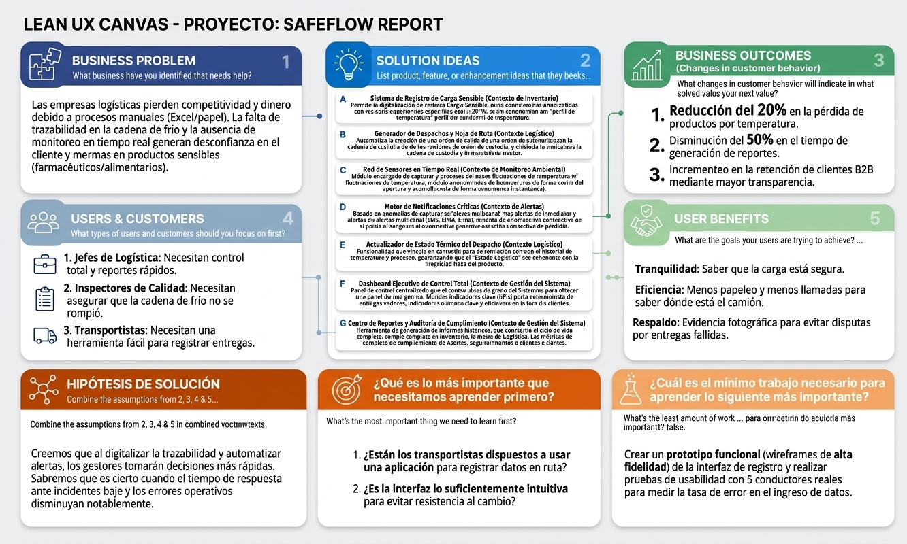</div>

<p><strong><em>Nota.</em></strong> Elaboración propia. El canvas integra el problema, los supuestos y las hipótesis de las secciones anteriores.</p>

## 1.3. Segmentos objetivo

En esta sección se identifican los segmentos de clientes a los que se dirige la solución de Cryologic Systems. La segmentación permite enfocar el desarrollo del producto en usuarios con necesidades específicas de gestión de la cadena de frío y precisar la propuesta de valor. La Tabla 5 sintetiza ambos segmentos y las secciones siguientes los describen.

<p><strong>Tabla 5.</strong> <em>Segmentos objetivo de SafeFlow</em></p>

| Segmento | Quiénes son | Necesidad principal |
|:---------|:------------|:--------------------|
| 1. Empresas del sector farmacéutico | Laboratorios, distribuidoras y operadores que transportan medicamentos sensibles a la temperatura. | Control estricto de la cadena de frío con trazabilidad para auditorías. |
| 2. Operadores logísticos (3PL y transporte especializado) | Empresas que transportan y distribuyen carga refrigerada de terceros. | Evidencia de las condiciones del transporte para sus clientes. |

<p><strong><em>Nota.</em></strong> Elaboración propia.</p>

### Segmento Objetivo 1: Empresas del sector farmacéutico

Este segmento está conformado por laboratorios, distribuidoras y operadores logísticos que transportan medicamentos sensibles a la temperatura, como vacunas, insulina y productos biológicos. Estas organizaciones requieren un control estricto de la cadena de frío debido a normativas sanitarias y estándares de calidad. Actualmente enfrentan dificultades para supervisar las condiciones térmicas durante el transporte, lo que puede comprometer la eficacia de los productos y generar pérdidas económicas significativas.

Necesidades clave:

- Supervisión continua de la temperatura.
- Alertas inmediatas ante desviaciones.
- Trazabilidad completa para auditorías.
- Cumplimiento de normativas sanitarias.

### Segmento Objetivo 2: Operadores logísticos (3PL y transporte especializado)

Este segmento reúne a las empresas que brindan servicios de transporte y distribución para terceros (farmacéuticas o de alimentos), en especial las que manejan carga refrigerada. Es un segmento relevante por tres razones:

- No son dueños del producto, pero sí responsables de su transporte.
- Necesitan evidencia (reportes) para sus clientes.
- Tienen un alto interés en diferenciarse con tecnología.

Necesidades clave:

- Supervisión de la temperatura durante las rutas.
- Reportes para los clientes.
- Alertas para los responsables del transporte.
- Optimización de rutas y tiempos.

### Respaldo estadístico de los segmentos

Para sustentar la relevancia de ambos segmentos se reunieron indicadores de fuentes públicas sobre pérdidas por fallas de temperatura y sobre el tamaño del mercado. La Tabla 6 resume los datos y la fuente de cada uno. Las cifras globales muestran la magnitud del problema; las peruanas muestran el tamaño y el crecimiento del mercado al que se dirige SafeFlow.

<p><strong>Tabla 6.</strong> <em>Indicadores que respaldan los segmentos objetivo</em></p>

| Indicador | Valor | Fuente | Segmento que respalda |
|:----------|:------|:-------|:----------------------|
| Alimentos perdidos entre la cosecha y la venta minorista | Alrededor del 14 % de los alimentos del mundo | FAO (2019) | 2. Operadores logísticos |
| Alimentos desperdiciados a nivel de consumidor en 2022 | 1.050 millones de toneladas, cerca del 19 % de los alimentos disponibles para el consumidor | UNEP (2024) | 2. Operadores logísticos |
| Exposición de vacunas a congelación en la cadena de frío | Entre el 14 % y el 35 % de los refrigeradores o envíos; entre el 75 % y el 100 % de los envíos en los estudios que analizaron todos los tramos de distribución | Matthias et al. (2007) | 1. Sector farmacéutico |
| Pérdidas del sector farmacéutico por desviaciones de temperatura | Al menos 15 000 millones de dólares al año en producto; más de 35 000 millones con los costos adicionales (estimación de prensa especializada, sin fuente primaria) | White (2020) | 1. Sector farmacéutico |
| Mercado logístico de cadena de frío en el Perú | 134,63 millones de dólares en 2025; crecimiento anual compuesto de 12,10 % hasta 2035 (421,89 millones de dólares) | Informes de Expertos (2026) | 1 y 2 |
| Sector farmacéutico peruano | Crecimiento proyectado de 4 % para 2025; los genéricos concentran cerca del 70 % de las ventas en clínicas y hospitales en 2024 | Perú Retail (2024), con datos de Alafarpe | 1. Sector farmacéutico |

<p><strong><em>Nota.</em></strong> Elaboración propia a partir de las fuentes citadas; las referencias completas figuran en la bibliografía. Las cifras de mercado son estimaciones de consultoras y asociaciones del sector, no estadísticas oficiales, y se usan como orden de magnitud.</p>

Los datos permiten extraer tres conclusiones. Primero, la pérdida de producto por temperatura es un problema extendido: la revisión de Matthias et al. (2007) encontró exposición a congelación en una parte importante de los refrigeradores y envíos de vacunas, y la FAO (2019) estima que cerca del 14 % de los alimentos se pierde antes de llegar al comercio minorista. Segundo, el costo es alto: según White (2020), el sector farmacéutico pierde al menos 15 000 millones de dólares anuales por desviaciones de temperatura, aunque esta cifra es una estimación sin fuente primaria. Tercero, el mercado peruano de logística de frío es pequeño pero crece de forma sostenida (Informes de Expertos, 2026), y el sector farmacéutico local mantiene un crecimiento positivo (Perú Retail, 2024). Estos hechos justifican priorizar a las empresas farmacéuticas y a los operadores logísticos como primeros clientes de SafeFlow. Debe tenerse en cuenta que los datos peruanos específicos de transporte refrigerado de medicamentos son escasos, por lo que se recomienda complementar este respaldo con datos propios de las entrevistas de validación.

<div style="page-break-after: always;"></div>

# Capítulo II: Requirements Development and Software Solution Design

Este capítulo recorre el camino que va desde comprender el contexto del problema hasta definir la solución de software de SafeFlow. Parte del análisis de la competencia en el sector de tecnologías para la cadena de frío, continúa con la investigación directa mediante entrevistas a representantes de los dos segmentos objetivo (empresas del sector farmacéutico y operadores logísticos) y consolida los hallazgos en artefactos de needfinding: User Personas, User Task Matrix, User Journey Maps, Empathy Maps, Big Picture EventStorming y un lenguaje ubicuo compartido por todo el equipo. Estos artefactos son el insumo sobre el cual se especifican los requisitos y se diseña la solución en las secciones posteriores.

## 2.1. Competidores

SafeFlow compite en un mercado donde ya existen soluciones consolidadas de monitoreo de la cadena de frío, desde servicios enterprise de alcance global hasta sensores inalámbricos de bajo costo. Evaluar a esta competencia es fundamental para entender el contexto del proyecto e identificar las cualidades, ventajas y estrategias de las alternativas existentes. Se seleccionaron tres competidores: Sensitech, Controlant y Monnit, que cubren respectivamente el segmento enterprise global, el segmento farmacéutico especializado y el segmento de bajo costo basado en hardware.

### 2.1.1. Análisis competitivo

El propósito de este análisis es examinar y contrastar a SafeFlow frente a sus competidores más relevantes, tomando como base variables clave como la propuesta de valor, el segmento de mercado, las tácticas de comercialización, la oferta de productos y servicios, las estructuras de precios y los canales de distribución. La pregunta que guía el análisis es cómo se posiciona SafeFlow frente a sus competidores en el mercado de monitoreo de la cadena de frío, en términos de propuesta de valor, tecnología y accesibilidad.

La <strong>Tabla 7</strong> presenta el Competitive Analysis Landscape: las columnas corresponden a la startup y a los tres competidores, y las filas se agrupan en perfil, perfil de marketing, perfil de producto y análisis SWOT. Su propósito es permitir una comparación directa, celda a celda, de cada variable.

<p><strong>Tabla 7.</strong> <em>Competitive Analysis Landscape de SafeFlow y sus competidores</em></p>

| Categoría | Variable | SafeFlow (startup) | Sensitech | Controlant | Monnit |
| :--- | :--- | :--- | :--- | :--- | :--- |
| **Perfil** | Overview | Aplicación móvil Android que permite supervisar la cadena de frío a partir de mediciones de temperatura, generando alertas y ofreciendo trazabilidad de los productos. | Soluciones globales de monitoreo de la cadena de frío con alta precisión y análisis avanzado para grandes empresas. | Solución enfocada en la industria farmacéutica, con visibilidad en tiempo real y análisis de datos. | Sensores inalámbricos para monitoreo ambiental en múltiples industrias. |
| **Perfil** | Ventaja competitiva (valor que ofrece a los clientes) | Accesibilidad, facilidad de uso, monitoreo en tiempo real y alertas preventivas que reducen pérdidas. | Alta precisión, cumplimiento normativo y experiencia global. | Integración avanzada de IoT y analítica en tiempo real. | Bajo costo y flexibilidad en la implementación de sensores. |
| **Perfil de Marketing** | Mercado objetivo | PYMEs, empresas farmacéuticas y operadores logísticos. | Grandes corporaciones y empresas globales. | Industria farmacéutica y logística avanzada. | Empresas que requieren soluciones de monitoreo económico. |
| **Perfil de Marketing** | Estrategias de marketing | Marketing digital, enfoque en facilidad de adopción y escalabilidad. | Posicionamiento como líder global y soluciones enterprise. | Alianzas estratégicas con farmacéuticas. | Venta directa de hardware y soluciones accesibles. |
| **Perfil de Producto** | Productos y servicios | Aplicación móvil con monitoreo, alertas, resumen de indicadores y trazabilidad. | Servicios completos de monitoreo, análisis y cumplimiento. | Plataforma IoT con sensores y analítica avanzada. | Sensores inalámbricos y software básico. |
| **Perfil de Producto** | Precios y costos | Modelo de suscripción accesible. | Alto costo (enterprise). | Alto costo especializado. | Bajo costo. |
| **Perfil de Producto** | Canales de distribución | Aplicación móvil. | Aplicación móvil y web. | Aplicación móvil y web. | Aplicación móvil y web. |
| **Análisis SWOT** | Fortalezas | Plataforma accesible, monitoreo en tiempo real, alertas automáticas y trazabilidad. | Alta precisión, experiencia global y marca reconocida. | Tecnología IoT avanzada y enfoque especializado. | Bajo costo y facilidad de implementación. |
| **Análisis SWOT** | Debilidades | Startup en crecimiento y baja presencia en el mercado. | Costos elevados y complejidad de implementación. | Dependencia de hardware y alto costo. | Menor especialización en cadena de frío. |
| **Análisis SWOT** | Oportunidades | Crecimiento del IoT, regulación sanitaria y digitalización logística. | Expansión en mercados emergentes. | Demanda creciente en el sector farmacéutico. | Crecimiento del mercado IoT. |
| **Análisis SWOT** | Amenazas | Competidores consolidados y barreras de adopción. | Nuevas startups más accesibles. | Competencia de soluciones más económicas. | Competidores especializados. |

<p><strong><em>Nota.</em></strong> Elaboración propia a partir del análisis del equipo sobre la oferta pública de cada competidor.</p>

Como se aprecia en la Tabla 7, los competidores enterprise (Sensitech y Controlant) ofrecen precisión y analítica avanzada pero con costos altos y dependencia de hardware, mientras que Monnit compite por precio con menor especialización en cadena de frío. SafeFlow ocupa el espacio intermedio: una propuesta accesible, de adopción sencilla y centrada en la prevención mediante alertas, con la limitación de ser una startup de baja presencia en el mercado.

### 2.1.2. Estrategias y tácticas frente a competidores

Esta sección detalla las tácticas y lineamientos estratégicos que SafeFlow adoptará para consolidar su posición ante la competencia. Dichas medidas se fundamentan en el análisis SWOT de la sección anterior y buscan maximizar las ventajas competitivas de la startup y mitigar sus vulnerabilidades.

La Tabla 8 cruza las fortalezas y debilidades de SafeFlow con las oportunidades y amenazas del entorno, y deriva de cada cruce un conjunto de estrategias (FO, DO, FA y DA). Su propósito es convertir el diagnóstico en acciones concretas.

<p><strong>Tabla 8.</strong> <em>Matriz de estrategias SWOT cruzado de SafeFlow</em></p>

| | **Fortalezas** | **Debilidades** |
| :--- | :--- | :--- |
| | Monitoreo en tiempo real<br>Plataforma accesible y fácil de usar<br>Alertas automáticas<br>Trazabilidad | Startup con baja presencia en el mercado<br>Dependencia de adopción tecnológica<br>Recursos limitados frente a competidores grandes |
| **Oportunidades**<br>Crecimiento del IoT<br>Regulaciones sanitarias<br>Digitalización logística<br>Expansión al sector alimentario | **Estrategia FO**<br>Aprovechar el monitoreo en tiempo real para captar empresas que buscan digitalizarse<br>Escalar la solución a los sectores farmacéutico y alimentario<br>Incorporar sensores accesibles para facilitar la adopción | **Estrategia DO**<br>Incrementar la visibilidad mediante marketing digital<br>Realizar pruebas piloto con empresas<br>Generar contenido educativo sobre cadena de frío |
| **Amenazas**<br>Competidores consolidados<br>Soluciones de bajo costo<br>Barreras de confianza<br>Rápido avance tecnológico | **Estrategia FA**<br>Diferenciarse por simplicidad frente a soluciones complejas<br>Ofrecer una implementación rápida<br>Enfocar la solución en la prevención mediante alertas | **Estrategia DA**<br>Ofrecer versiones demo o gratuitas<br>Generar casos de éxito<br>Brindar soporte técnico cercano y personalizado |

<p><strong><em>Nota.</em></strong> Elaboración propia a partir del análisis SWOT de la Tabla 7.</p>

La lectura de la Tabla 8 muestra una línea común: SafeFlow no busca igualar la profundidad analítica de los competidores enterprise, sino diferenciarse por simplicidad, rapidez de adopción y enfoque preventivo, y reducir su debilidad de baja presencia mediante pilotos, contenido educativo y casos de éxito.

## 2.2. Entrevistas

La investigación de usuarios se basa en entrevistas a representantes de los dos segmentos objetivo: empresas del sector farmacéutico y operadores logísticos (3PL y transporte especializado). Las entrevistas permiten comprender sus rutinas, herramientas, frustraciones y expectativas, y son la fuente de las características de los arquetipos presentados en la sección 2.3.

### 2.2.1. Diseño de entrevistas

El diseño de entrevistas consiste en una relación de 17 preguntas por segmento. Cada guía combina preguntas demográficas y de perfil tecnológico (edad, distrito, dispositivos, canales digitales, marcas), preguntas sobre el proceso actual (registro, supervisión, entrega, auditoría), y preguntas sobre frustraciones, impacto y expectativas frente a una solución. Esta estructura permite obtener los datos necesarios para construir los arquetipos: características demográficas, personalidad, afinidad por herramientas, canales de interacción, objetivos y frustraciones.

**Segmento objetivo 1: Empresas del sector farmacéutico**

1. ¿Podría indicarnos su edad, cargo actual y cuántos años de experiencia tiene en el sector farmacéutico?
2. ¿En qué distrito reside y cómo es su rutina tecnológica diaria (qué dispositivos usa más: laptop, smartphone, tablet)?
3. ¿Cuáles son sus principales responsabilidades respecto a la seguridad de productos termolábiles (vacunas, insulinas, biológicos)?
4. ¿Qué marcas o softwares de logística e inventario reconoce como líderes o utiliza actualmente?
5. ¿Cómo se describiría profesionalmente: prefiere decisiones basadas en datos analíticos o en la rapidez operativa?
6. ¿Cómo es el proceso actual de registro de un producto sensible cuando ingresa a su sistema de inventario?
7. ¿Cómo definen y vinculan los rangos de temperatura permitidos a cada lote de producto antes de un despacho?
8. ¿Qué criterios utilizan para asignar un transporte específico a un despacho de alta sensibilidad?
9. ¿Cómo se aseguran de que el transportista externo cumpla con los requisitos térmicos antes de cargar el producto?
10. ¿De qué manera supervisan la temperatura mientras el camión está en tránsito hacia una provincia o clínica?
11. ¿Cuál ha sido la peor experiencia que ha tenido con una ruptura de cadena de frío y quién asumió la pérdida económica?
12. ¿Qué sucede exactamente en su empresa cuando un sensor detecta que la temperatura subió a un nivel crítico? ¿Quién recibe la alerta y cuánto tardan en reaccionar?
13. ¿Qué es lo que más le frustra del sistema de monitoreo que usan actualmente (por ejemplo, demora en datos, falta de precisión, interfaz compleja)?
14. ¿Cómo manejan actualmente las auditorías sanitarias? ¿Cuánto tiempo les toma reunir la evidencia de trazabilidad térmica de un despacho de hace un mes?
15. ¿Qué impacto tendría en su bono de desempeño o en los KPIs de su área reducir las mermas por temperatura en un 20%?
16. Si tuviera un dashboard que centralizara inventario, rutas y alertas en tiempo real, ¿qué métrica sería la primera que revisaría cada mañana?
17. ¿Qué funcionalidad considera "no negociable" para confiar plenamente en una plataforma móvil o web de cadena de frío?

**Segmento objetivo 2: Operadores logísticos (3PL / transporte especializado)**

1. ¿Cuál es su edad, estado civil y nivel de estudios? ¿Cuál es su rol exacto en la operación logística?
2. ¿Qué aplicaciones móviles utiliza con más frecuencia para su trabajo y para su vida personal (WhatsApp, Waze, Facebook, aplicaciones bancarias)?
3. ¿Cómo es la relación tecnológica de sus conductores? ¿Cuentan con smartphones modernos o equipos básicos?
4. ¿Qué canales digitales utiliza para informarse sobre nuevas normativas de transporte o gestión de flotas (LinkedIn, grupos de Facebook, portales web)?
5. ¿Cómo organizan las rutas diarias y cómo notifican a los conductores sobre sus puntos de parada y entrega?
6. ¿Qué proceso siguen los conductores para reportar que han llegado a un punto de entrega y que el producto fue recibido conforme?
7. ¿Cómo registran actualmente las incidencias en ruta (tráfico, fallas mecánicas, desvíos) y cómo afectan estas a la temperatura de la carga?
8. ¿Utilizan alguna herramienta digital para el registro fotográfico de la entrega o siguen usando guías de remisión físicas en papel?
9. ¿Cómo sabe un conductor, mientras maneja, si el equipo de frío de su furgón ha dejado de funcionar correctamente?
10. ¿Reciben los conductores algún tipo de alerta visual o sonora, o dependen de que alguien desde la oficina les avise por teléfono?
11. ¿Qué tan frecuente es que los sensores fallen o den lecturas erróneas? ¿Cómo gestionan esa incertidumbre con sus clientes?
12. ¿Cuál es su mayor miedo o frustración cuando transportan carga de terceros valorizada en miles de dólares?
13. ¿Cómo demuestran ante sus clientes corporativos que son mejores o más confiables que la competencia?
14. ¿Cuánto tiempo invierte su equipo administrativo en descargar datos de los dispositivos de monitoreo para armar el reporte final del cliente?
15. ¿Qué tanto valoraría que el sistema actualizara el "estado térmico" del despacho automáticamente cada 5 minutos en un mapa interactivo?
16. Si pudiera elegir una mejora para su dashboard de gestión, ¿preferiría ver más mapas, más gráficos estadísticos o más alertas de texto?
17. ¿Qué le impide hoy digitalizar el 100% de su operación logística (falta de presupuesto, resistencia del personal, falta de software adecuado)?

Con estas guías el equipo cubre, para ambos segmentos, los datos de perfil y los puntos de dolor del proceso actual que alimentan los artefactos de needfinding.

### 2.2.2. Registro de entrevistas

Esta sección documenta las entrevistas realizadas a cada segmento. Para cada entrevistado se registra su nombre, edad y distrito, una captura del video con el instante de inicio, la duración y un resumen descriptivo de sus respuestas, que sirve de evidencia para las características de los arquetipos. Como se observa en las capturas de las entrevistas (Figura 3, Figura 4 y Figura 5), los entrevistados corresponden a perfiles jóvenes con funciones de calidad (segmento 1) y de operación logística (segmento 2).

#### Segmento objetivo 1: Empresas del sector farmacéutico

<p><strong>Figura 3.</strong> <em>Captura de la Entrevista 1 (Sebastian Mendoza)</em></p>

<div align="center"></div>


**Entrevista 1**

- **Nombres y apellidos:** Sebastian Mendoza
- **Edad:** 35 años
- **Distrito:** San Borja
- **Inicio:** 01:15
- **Duración:** 07:54

- **URL:** [https://youtu.be/v0ob7pnyQcw]()

**Resumen:**
Sebastian es un Jefe de Aseguramiento de la Calidad con 10 años de experiencia en el sector farmacéutico. Su gestión se centra en garantizar que productos críticos (vacunas e insulinas) se mantengan estrictamente entre 2°C y 8°C. Actualmente, enfrenta una grave falta de visibilidad durante el transporte, calificándolo como una "caja negra" donde solo detecta fallos post-mortem mediante la descarga manual de dataloggers.

Esta falta de monitoreo en tiempo real ha causado pérdidas económicas de hasta 50 mil dólares y daños reputacionales severos. Sebastian es un perfil altamente analítico que sufre con la demora de los datos y el caos administrativo de las auditorías sanitarias (que le toman hasta 3 días de trabajo). Valora por encima de todo la integridad inalterable de los datos y espera que SafeFlow le proporcione alertas preventivas y un dashboard centralizado para reducir mermas, lo cual impactaría directamente en sus KPIs y bonificaciones profesionales.

<p><strong>Figura 4.</strong> <em>Captura de la Entrevista 2 (Joan Aguirre)</em></p>

<div align="center"></div>

<p><strong><em>Nota.</em></strong> Captura del video de la entrevista, que documenta el desarrollo de la sesión con el segundo entrevistado del segmento 1.</p>

**Entrevista 2**

- **Nombres y apellidos:** Joan Aguirre
- **Edad:** 26 años
- **Distrito:** Surquillo
- **Inicio:** 00:00
- **Duración:** 07:32

- **URL:** [https://www.youtube.com/watch?v=ZWq9LLy3t9c]()

**Resumen:**
El entrevistado es un Jefe de Aseguramiento de la Calidad de 26 años con 3 años de experiencia en el sector farmacéutico. Su responsabilidad es garantizar la integridad biológica de productos críticos manteniéndolos entre 2°C y 8°C para cumplir con la normativa de DIGEMID. Siendo un profesional netamente analítico, su mayor debilidad actual es que el transporte es una "caja negra" sin monitoreo en la nube. Al depender de dataloggers físicos, las fallas se detectan de forma post-mortem tras descargar la información por USB, reaccionando cuando el producto ya está perdido. Esta situación ha ocasionado pérdidas de hasta 50 mil dólares y severos daños reputacionales en el pasado, además de generarle un proceso caótico de 2 a 3 días de trabajo para consolidar evidencias en auditorías. Considera como "no negociable" la integridad inalterable de los datos para respaldar las operaciones ante el Ministerio de Salud. Priorizaría un dashboard con "Alertas Críticas Activas" y proyecta que reducir las mermas en un 20% impactaría directa y positivamente en sus KPIs y bonos de desempeño.

#### Segmento objetivo 2: Operadores logísticos (3PL / transporte especializado)

<p><strong>Figura 5.</strong> <em>Captura de la Entrevista 3 (Henry Ruiz)</em></p>

<div align="center"></div>

<p><strong><em>Nota.</em></strong> Captura del video de la entrevista con el entrevistado del segmento 2.</p>

**Entrevista 3**

- **Nombres y apellidos:** Henry Ruiz
- **Edad:** 26 años
- **Distrito:** Surquillo
- **Inicio:** 00:00
- **Duración:** 08:33
- **URL:** [https://youtu.be/6a17Hf1BH-g]()

**Resumen:**
Henry es un responsable de operaciones logísticas que coordina despachos, supervisa conductores y mantiene la comunicación operativa durante las rutas. Actualmente utiliza WhatsApp, registros en papel y fotografías enviadas por los choferes como evidencia de las entregas. La falta de alertas en cabina dificulta que los conductores detecten a tiempo una falla del equipo de frío y deja a la empresa expuesta ante reclamos de sus clientes.

También identifica una carga administrativa importante al descargar datos de los dispositivos de monitoreo y preparar reportes en Excel. Valora que el estado térmico de cada despacho se actualice automáticamente en un mapa interactivo y considera que una solución fácil de usar, similar a WhatsApp, facilitaría la adopción por parte de los conductores. Para diferenciarse frente a otros operadores, necesita demostrar con evidencia confiable que sus cargas se transportaron bajo condiciones adecuadas.

### 2.2.3. Análisis de entrevistas

El análisis de entrevistas identifica, por segmento, las características objetivas y subjetivas más comunes entre los tres entrevistados disponibles. Para mantener una base de cálculo única, los porcentajes de las Tablas 9 y 10 se calculan sobre el total de entrevistas registradas (`n = 3`): Sebastian Mendoza y Joan Aguirre pertenecen al segmento farmacéutico, mientras que Henry Ruiz pertenece al segmento de operadores logísticos. Por ello, un hallazgo compartido por los dos entrevistados del segmento farmacéutico representa 67% del total y un hallazgo reportado por el entrevistado logístico representa 33%. Estos resultados son exploratorios y sirven como base para las fichas de User Persona.

La Tabla 9 resume los resultados del segmento 1, empresas del sector farmacéutico, e indica el sustento de cada característica en las entrevistas 1 y 2.

<p><strong>Tabla 9.</strong> <em>Análisis de entrevistas del segmento 1: empresas del sector farmacéutico</em></p>

| Categoría | Hallazgo | Porcentaje |
| :--- | :--- | :---: |
| Rol principal | Asegura la integridad biológica de productos termolábiles (2°C a 8°C) y garantiza el cumplimiento de normativas sanitarias (DIGEMID). | 67% |
| Gestión de datos | Se describe como un perfil analítico que no toma decisiones sin reportes de datos sustentados. | 67% |
| Herramientas actuales | Utiliza ERPs robustos (SAP) y dataloggers físicos. | 67% |
| Herramientas actuales | Cuenta con monitoreo en la nube en tiempo real. | 0% |
| Problemas comunes | Califica el transporte como una "caja negra" sin visibilidad en tránsito. | 67% |
| Problemas comunes | Reporta procesos caóticos de auditoría (entre 2 y 3 días para consolidar evidencias). | 67% |
| Problemas comunes | Menciona falta de alertas inmediatas ante fallas mecánicas o humanas. | 67% |
| Indicadores valorados | Prioriza el conteo de "Alertas Críticas Activas" y la trazabilidad histórica inalterable. | 67% |
| Impacto de la solución | Afirma que una reducción del 20% en mermas impacta directamente en sus bonos de desempeño y KPIs. | 67% |
| Factor no negociable | Exige integridad total de los datos (registros no editables). | 67% |

<p><strong><em>Nota.</em></strong> Elaboración propia a partir de las entrevistas 1 y 2 del segmento 1; porcentajes calculados sobre las tres entrevistas disponibles.</p>

La Tabla 10 resume los resultados del segmento 2, operadores logísticos, cuyo sustento se encuentra en la entrevista 3 y en las respuestas registradas en video.

<p><strong>Tabla 10.</strong> <em>Análisis de entrevistas del segmento 2: operadores logísticos</em></p>

| Categoría | Hallazgo | Porcentaje |
| :--- | :--- | :---: |
| Rol principal | Coordina despachos, supervisa conductores y gestiona la comunicación operativa en ruta. | 33% |
| Canales digitales | Utiliza WhatsApp para coordinar rutas y Facebook o LinkedIn para actualizarse en normativas. | 33% |
| Herramientas actuales | Usa pizarras acrílicas y registros en papel. | 33% |
| Herramientas actuales | Depende de fotos enviadas por los choferes como evidencia. | 33% |
| Problemas comunes | Reporta vulnerabilidad ante reclamos de clientes por falta de pruebas de temperatura en vivo. | 33% |
| Problemas comunes | Menciona que los choferes no detectan fallas de frío a tiempo por falta de alertas en cabina. | 33% |
| Problemas comunes | Identifica una pérdida de 5 horas semanales en la descarga manual de datos USB y el armado de reportes en Excel. | 33% |
| Indicadores valorados | Prioriza la visualización de unidades en mapas interactivos con estado térmico actualizado cada 5 minutos. | 33% |
| Adopción de la aplicación | Está dispuesto a adoptarla siempre que sea "fácil de usar como WhatsApp" y apta para conductores con baja alfabetización digital. | 33% |
| Diferenciación | Considera que la falta de una plataforma de monitoreo les hace perder grandes clientes corporativos. | 33% |

<p><strong><em>Nota.</em></strong> Elaboración propia a partir de la entrevista 3 del segmento 2; porcentajes calculados sobre las tres entrevistas disponibles.</p>

En conjunto, los tres entrevistados coinciden en la necesidad de contar con evidencia confiable y oportuna sobre las condiciones de transporte. Las entrevistas 1 y 2 enfatizan la integridad de los datos, la trazabilidad para auditorías y las alertas críticas; la entrevista 3 enfatiza la simplicidad de uso, las alertas para los conductores y la reducción del trabajo administrativo. La principal brecha del registro actual es que el segmento logístico cuenta con una sola entrevista, por lo que sus hallazgos deben considerarse indicios iniciales y no conclusiones generalizables.

## 2.3. Needfinding

El needfinding consolida la información recolectada en las entrevistas y en el análisis competitivo en artefactos que describen quiénes son los usuarios, qué tareas realizan, cómo viven hoy su proceso, qué sienten y qué eventos y términos definen el dominio. Los artefactos de esta sección son, en orden: User Personas, User Task Matrix, User Journey Maps, Empathy Maps, Big Picture EventStorming y Ubiquitous Language.

### 2.3.1. User Personas

Un User Persona es un arquetipo que sintetiza las características, objetivos y frustraciones más comunes de un segmento. Se elaboró una ficha por segmento objetivo a partir del análisis de entrevistas de la sección 2.2.3 y de las limitaciones observadas en las soluciones competidoras de la sección 2.1. Su propósito es mantener al usuario real como referencia en las decisiones de diseño.

#### Segmento 1: Gestor de Aseguramiento de Calidad

Pedro Paredes representa al segmento de empresas del sector farmacéutico. Como muestra la Figura 6, su perfil refleja los hallazgos de la Tabla 9: un profesional analítico, responsable de mantener los productos termolábiles entre 2°C y 8°C y de cumplir con la normativa sanitaria, que hoy depende de dataloggers físicos y vive el transporte como una "caja negra". Sus frustraciones principales son la demora de la información y el trabajo manual de las auditorías, y exige integridad inalterable de los datos.

<p><strong>Figura 6.</strong> <em>User Persona del segmento 1: Pedro Paredes</em></p>

<div align="center">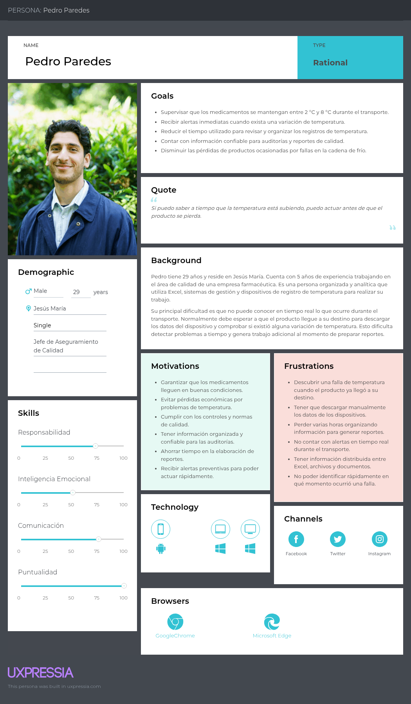</div>

<p><strong><em>Nota.</em></strong> Ficha de arquetipo elaborada por el equipo a partir de las entrevistas del segmento 1.</p>

#### Segmento 2: Supervisora de Operaciones y Flota

Angie Villegas representa al segmento de operadores logísticos. La Figura 7 resume su perfil según los hallazgos de la Tabla 10: coordina despachos y conductores principalmente por WhatsApp, trabaja con pizarras y registros en papel, y es vulnerable ante reclamos de clientes por no contar con pruebas de temperatura. Busca una aplicación sencilla, apta para conductores con baja alfabetización digital, y alertas oportunas en ruta.

<p><strong>Figura 7.</strong> <em>User Persona del segmento 2: Angie Villegas</em></p>

<div align="center">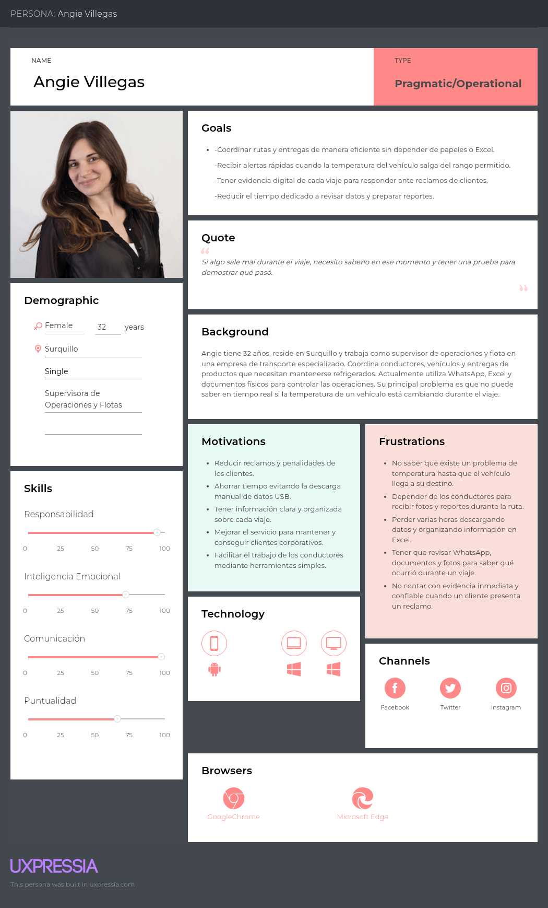</div>

<p><strong><em>Nota.</em></strong> Ficha de arquetipo elaborada por el equipo a partir de las entrevistas del segmento 2.</p>

Ambos arquetipos comparten la necesidad de visibilidad térmica y evidencia confiable, pero difieren en el foco: calidad y cumplimiento en Pedro, eficiencia operativa y respuesta a clientes en Angie.

### 2.3.2. User Task Matrix

La User Task Matrix concentra las tareas que cada User Persona realiza para cumplir sus objetivos, evaluando su frecuencia e importancia de manera independiente para Angie Villegas (segmento 2) y Pedro Paredes (segmento 1). Su propósito es identificar qué tareas son críticas para cada segmento y dónde coinciden o difieren.

La Tabla 11 presenta las tareas con la frecuencia y la importancia asignadas a cada persona.

<p><strong>Tabla 11.</strong> <em>User Task Matrix de los segmentos objetivo</em></p>

| User Task (Tarea) | **Angie Villegas**<br>Frecuencia | **Angie Villegas**<br>Importancia | **Pedro Paredes**<br>Frecuencia | **Pedro Paredes**<br>Importancia |
| :--- | :---: | :---: | :---: | :---: |
| Registro de dispositivos y sensores | Media | Alta | Baja | Alta |
| Monitoreo de temperatura en tiempo real | Alta | Alta | Alta | Alta |
| Configuración de umbrales de alerta | Media | Alta | Alta | Alta |
| Atención de alertas y resolución | Alta | Alta | Media | Alta |
| Generación de reportes para clientes y auditorías | Alta | Alta | Alta | Alta |
| Visualización de dashboard e indicadores | Alta | Alta | Alta | Alta |
| Gestión de rutas y vehículos | Alta | Alta | Baja | Media |
| Consulta del historial de temperatura | Alta | Alta | Alta | Alta |
| Gestión de usuarios y permisos | Media | Media | Baja | Alta |

<p><strong><em>Nota.</em></strong> Elaboración propia a partir del análisis de entrevistas.</p>

#### Conclusiones

La Tabla 11 muestra que el monitoreo de temperatura, la generación de reportes, la visualización de indicadores y la consulta del historial son tareas de alta frecuencia e importancia para ambos perfiles. Las diferencias aparecen en la configuración de umbrales (más frecuente en Pedro), y en la atención de alertas y la gestión de rutas y vehículos (más frecuentes en Angie).

- **Pedro Paredes** se enfoca principalmente en la calidad y seguridad de los medicamentos; necesita monitoreo constante, alertas preventivas, información confiable y reportes organizados para auditorías y control de calidad.
- **Angie Villegas** prioriza la eficiencia de las operaciones logísticas y el control de los vehículos; necesita monitorear las rutas en tiempo real, recibir alertas ante cambios de temperatura y contar con evidencia digital para responder rápidamente ante reclamos de los clientes.
- La plataforma debe ofrecer información detallada para los responsables de calidad y una interfaz sencilla para los supervisores de operaciones y flota. Ambos perfiles necesitan resolver problemas comunes como la falta de monitoreo en tiempo real, el uso de registros manuales y la dificultad para detectar y demostrar fallas de temperatura durante el transporte.

### 2.3.3. User Journey Mapping

Un User Journey Map describe el recorrido de un usuario a lo largo de un proceso, con sus acciones, emociones y puntos de dolor. Se elaboró uno por cada User Persona en su versión As-Is, es decir, la situación actual sin una solución digital, y cada mapa se vincula con el arquetipo correspondiente de la sección 2.3.1. Su propósito es localizar los momentos del proceso donde SafeFlow puede aportar mayor valor.

#### Segmento 1: Gestor de Aseguramiento de Calidad

La Figura 8 ilustra el recorrido de Pedro Paredes. Refleja que el seguimiento del transporte se apoya en dataloggers físicos cuya información solo se revisa tras la entrega, por lo que las fallas se detectan cuando el producto ya está perdido, y que la consolidación de evidencias para auditorías demanda varios días de trabajo manual.

<p><strong>Figura 8.</strong> <em>User Journey Map As-Is del segmento 1</em></p>

<div align="center">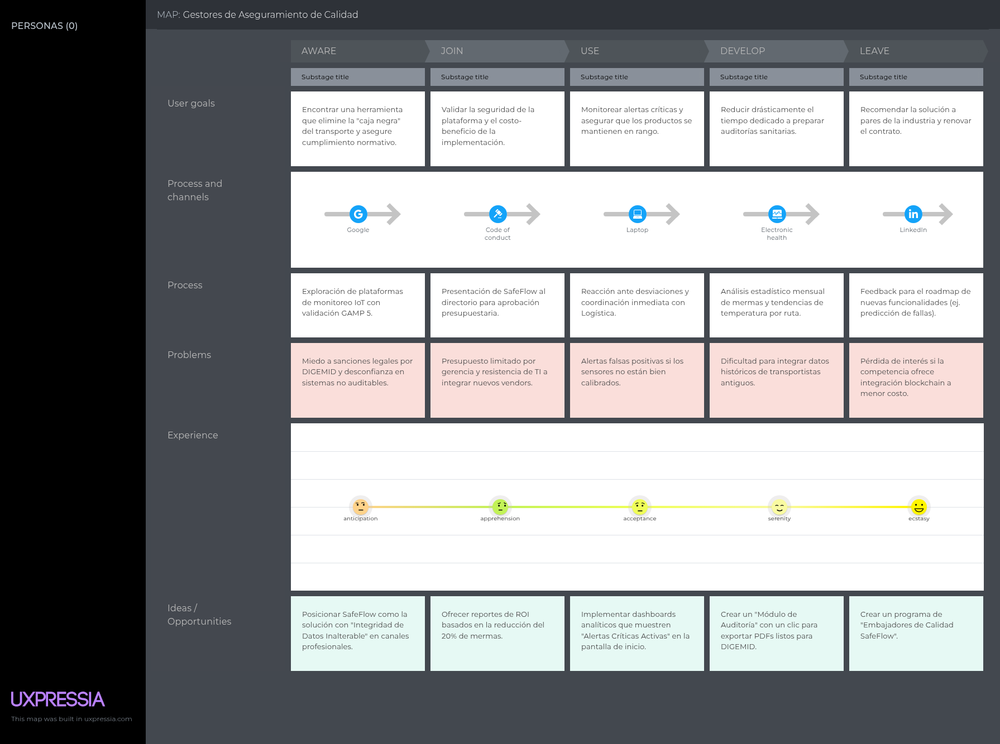</div>

<p><strong><em>Nota.</em></strong> Elaboración propia a partir de las entrevistas del segmento 1.</p>

#### Segmento 2: Supervisor de Operaciones y Flota

La Figura 9 ilustra el recorrido de Angie Villegas. Refleja una operación coordinada por WhatsApp, con registros en papel y fotos de los choferes como evidencia, sin alertas en cabina ante fallas de frío y con tiempo semanal invertido en descargar datos y armar reportes.

<p><strong>Figura 9.</strong> <em>User Journey Map As-Is del segmento 2</em></p>

<div align="center">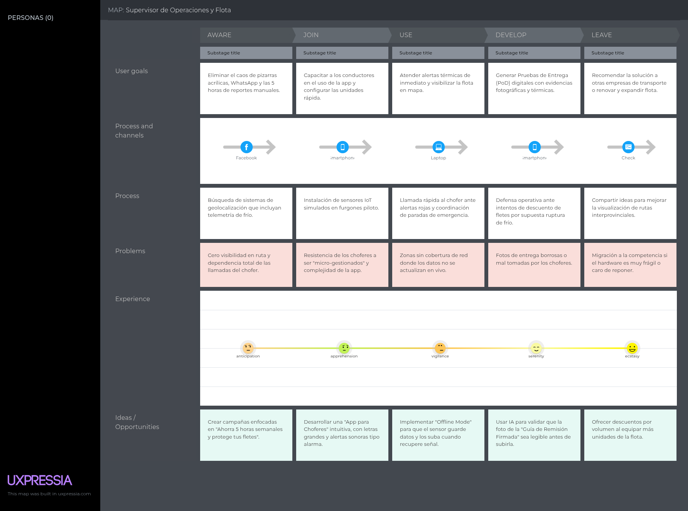</div>

<p><strong><em>Nota.</em></strong> Elaboración propia a partir de las entrevistas del segmento 2.</p>

En ambos recorridos los puntos de dolor se concentran en la falta de visibilidad en tránsito y en la elaboración manual de evidencia, lo que orienta las prioridades de la solución.

### 2.3.4. Empathy Mapping

El Empathy Map organiza lo que el equipo observa de cada User Persona en torno a lo que dice, piensa, hace, ve y escucha, y a sus pains y gains. Para elaborarlo se colocó al arquetipo al centro y se ubicó en cada cuadrante las observaciones del equipo, tomadas de las entrevistas. Su propósito es profundizar en la perspectiva emocional del usuario más allá de sus tareas.

#### Gestores de Aseguramiento de Calidad

Como muestra la Figura 10, el gestor de calidad siente estrés ante la posibilidad de perder lotes y presión por cumplir con la normativa; sus pains son la falta de visibilidad en tránsito, el análisis post-mortem y las auditorías caóticas, y sus gains son contar con alertas críticas y trazabilidad inalterable.

<p><strong>Figura 10.</strong> <em>Empathy Map del segmento 1</em></p>

<div align="center">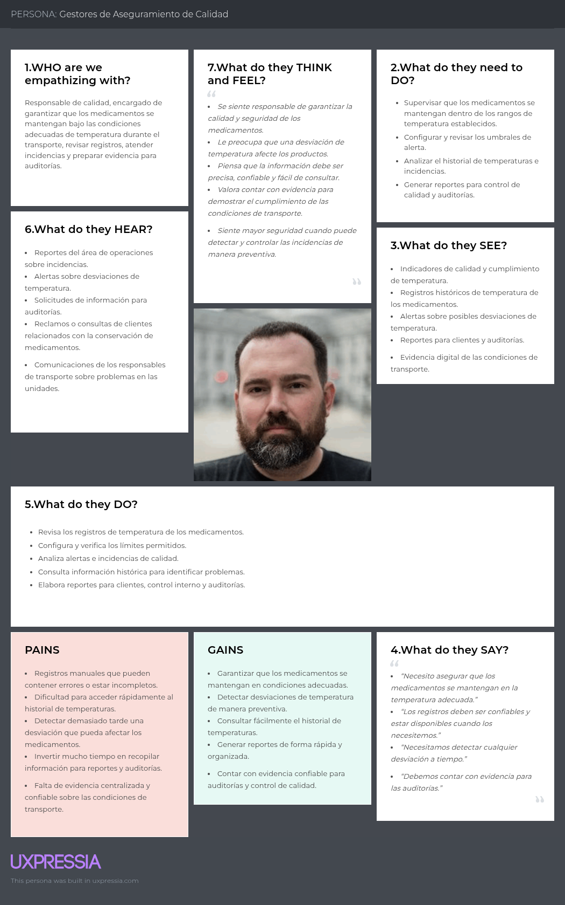</div>

<p><strong><em>Nota.</em></strong> Elaboración propia a partir de las entrevistas del segmento 1.</p>

#### Supervisores de Operaciones y Flota

La Figura 11 muestra al supervisor de operaciones y flota preocupado por los reclamos de clientes corporativos y por el riesgo de perder cuentas. Sus pains son la falta de pruebas de temperatura y de alertas en cabina, y sus gains son una aplicación fácil de usar y con estado térmico actualizado de las unidades.

<p><strong>Figura 11.</strong> <em>Empathy Map del segmento 2</em></p>

<div align="center">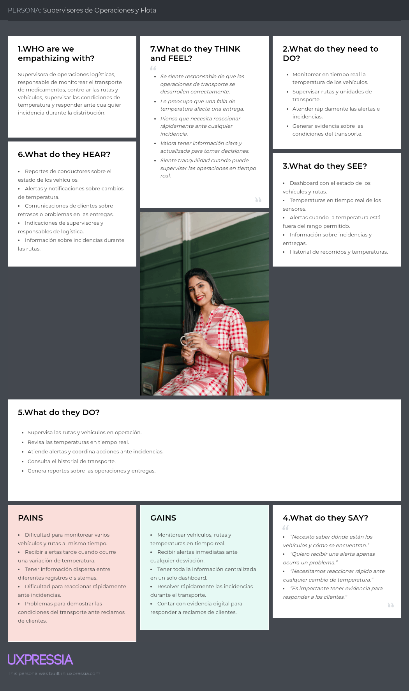</div>

<p><strong><em>Nota.</em></strong> Elaboración propia a partir de las entrevistas del segmento 2.</p>

Los dos mapas confirman que el valor percibido está en la prevención y en la evidencia: detectar a tiempo y poder demostrarlo.

### 2.3.5. Big Picture EventStorming

El Big Picture EventStorming es una sesión colaborativa en la que el equipo explora el dominio del negocio plasmando en notas los eventos significativos y sus relaciones, para identificar procesos clave, problemas y oportunidades. La sesión se realizó en dos etapas: un EventStorming inicial, con una primera lluvia de eventos del proceso de cadena de frío, y un EventStorming final, con los eventos ordenados cronológicamente y depurados. Las capturas de ambas etapas son la evidencia de la sesión.

La Figura 12 muestra el resultado de la primera etapa, y la Figura 13 muestra el tablero final tras ordenar y depurar los eventos.

<p><strong>Figura 12.</strong> <em>EventStorming inicial</em></p>

<div align="center">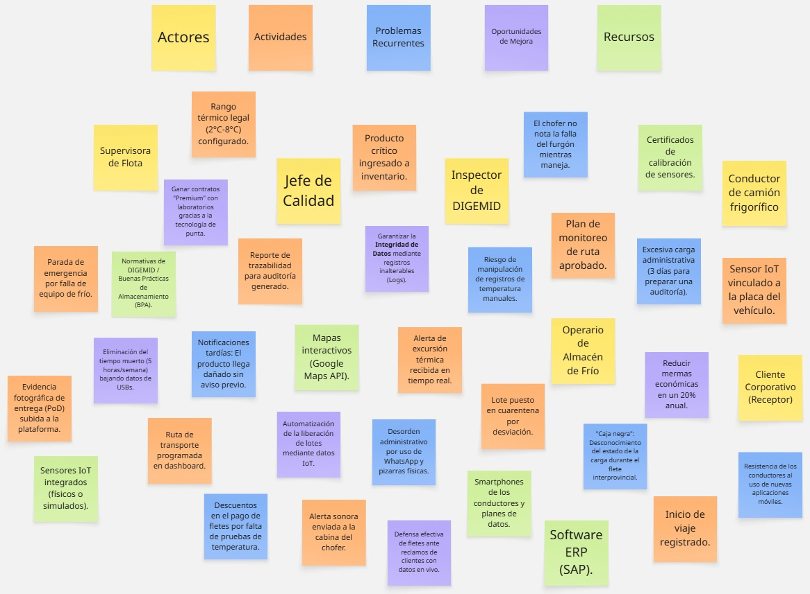</div>

<p><strong><em>Nota.</em></strong> Captura del tablero de la primera etapa de la sesión.</p>

<p><strong>Figura 13.</strong> <em>EventStorming final</em></p>

<div align="center">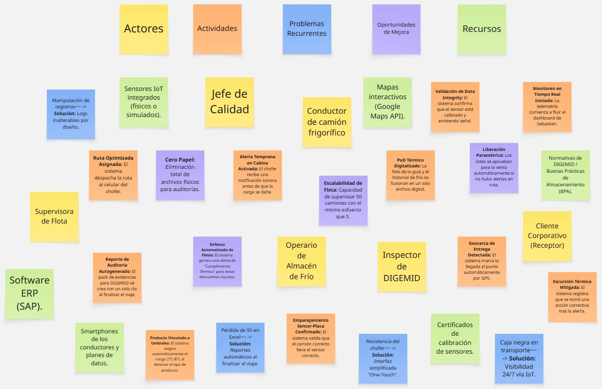</div>

<p><strong><em>Nota.</em></strong> Captura del tablero final de la sesión, con los eventos ordenados por fase.</p>

La Tabla 12 consolida los eventos de dominio resultantes, agrupados por fase del proceso: compra e ingreso, almacenamiento, monitoreo, alerta, despacho, entrega y consulta. Su propósito es dar una lectura textual y estable de lo que muestran las imágenes y servir de base para los bounded contexts del capítulo siguiente.

<p><strong>Tabla 12.</strong> <em>Eventos de dominio por fase del proceso</em></p>

| Fase | Eventos de dominio | Contexto |
| :--- | :--- | :--- |
| Acceso (transversal) | Cuenta creada, Sesión iniciada, Sesión cerrada, Acceso denegado, Permisos de rol actualizados | IAM |
| Compra e ingreso | Producto registrado, Lote registrado, Ingreso de stock registrado | Inventory |
| Almacenamiento | Stock actualizado | Inventory |
| Monitoreo | Lectura registrada, Lectura rechazada, Sensor desconectado, Sensor recuperado | Environmental Monitoring |
| Alerta | Excursión térmica detectada, Advertencia térmica detectada, Alerta generada, Alerta agrupada, Acción correctiva registrada, Alerta resuelta | Environmental Monitoring y Alerts |
| Despacho | Despacho registrado, Condición térmica validada, Envío bloqueado, Envío autorizado, Envío iniciado | Logistics |
| Entrega | Entrega confirmada | Logistics |
| Consulta | Sin eventos propios: consolida los eventos de los demás contextos en un modelo de lectura | Reporting |

<p><strong><em>Nota.</em></strong> Elaboración propia a partir de la sesión de EventStorming; los eventos se redactan en pasado con la forma sustantivo más participio.</p>

Como se lee en la Tabla 12, el proceso fluye desde el registro de productos y lotes, pasa por el monitoreo y las alertas, y termina en la validación térmica previa al envío y la confirmación de la entrega, con una fase de consulta que consolida la información.

### 2.3.6. Ubiquitous Language

El Ubiquitous Language es el glosario de términos del dominio que el equipo y los stakeholders usan sin ambigüedad en conversaciones, requisitos y código. Los términos se presentan en inglés con su equivalente en español y una definición en español, e incluyen solo términos del dominio, no términos técnicos de ingeniería de software.

La Tabla 13 presenta el glosario.

<p><strong>Tabla 13.</strong> <em>Glosario del Ubiquitous Language de SafeFlow</em></p>

| Term (EN) | Término (ES) | Definición (ES) |
| :--- | :--- | :--- |
| **Cold chain** | Cadena de frío | Conjunto de actividades de almacenamiento y transporte que mantienen los productos dentro de su temperatura adecuada desde el origen hasta la entrega. |
| **Cold Chain Integrity** | Integridad de la cadena de frío | Mantener los productos dentro de la temperatura adecuada durante todo su almacenamiento y transporte. |
| **Thermal range** | Rango térmico | Temperatura mínima y máxima permitida para conservar correctamente un producto. |
| **Thermal excursion** | Excursión térmica | Situación en la que la temperatura de un producto está por encima o por debajo de su rango térmico permitido. |
| **Warning** | Advertencia | Aviso temprano de que la temperatura se acerca al límite de su rango térmico, antes de producirse una excursión. |
| **Reading** | Lectura | Medición de temperatura de un sensor, con su valor y el instante en que fue tomada. |
| **Invalid measurement** | Medición inválida | Medición sin valor o con un valor no numérico, que se rechaza y no se considera una lectura. |
| **Sensor** | Sensor | Dispositivo que mide y emite la temperatura de un producto o de un envío. |
| **Sensor availability** | Disponibilidad del sensor | Estado que indica si un sensor está reportando mediciones (conectado) o dejó de hacerlo (desconectado). |
| **Simulated sensor** | Sensor simulado | Sensor cuyas mediciones son emitidas por un operador desde una aplicación emuladora, en lugar de un dispositivo físico. |
| **Real-Time Monitoring** | Monitoreo en tiempo real | Seguimiento continuo de la temperatura mientras los productos están almacenados o son transportados. |
| **Lot** | Lote | Conjunto identificable de unidades de un mismo producto que se registra, almacena y despacha como una unidad. |
| **Stock** | Stock | Cantidad disponible de un producto o lote para despacho. |
| **Inventory** | Inventario | Conjunto de productos, lotes y existencias registradas por la organización. |
| **Dispatch** | Despacho | Salida de uno o más lotes hacia un destino, que debe cumplir las condiciones térmicas antes del envío. |
| **Pre-shipment check** | Validación previa al envío | Verificación de que el producto cumple su rango térmico antes de autorizar o bloquear el envío de un despacho. |
| **Alert** | Alerta | Aviso generado cuando se detecta una excursión térmica, una advertencia o una desconexión de sensor, que requiere atención. |
| **Incident** | Incidencia | Problema ocurrido durante el almacenamiento o transporte que necesita ser atendido. |
| **Corrective action** | Acción correctiva | Medida tomada para solucionar una incidencia o alerta y evitar que continúe. |
| **Traceability** | Trazabilidad | Posibilidad de reconstruir el historial térmico y de movimientos de un producto o lote, como evidencia de que se conservó bajo las condiciones establecidas. |
| **Temperature History** | Historial de temperatura | Registro de las temperaturas tomadas durante el almacenamiento y el transporte. |
| **Temperature Report** | Reporte de temperatura | Documento que resume las temperaturas registradas durante un almacenamiento o transporte. |
| **Digital Evidence** | Evidencia digital | Registros que permiten demostrar que los productos fueron conservados bajo las condiciones establecidas. |
| **Operator** | Operador | Rol que registra productos, lotes e ingresos, atiende alertas y gestiona despachos en la operación diaria. |
| **Supervisor** | Supervisor | Rol que supervisa el estado térmico, las alertas, los despachos y el historial, y consulta el resumen de la operación. |
| **Administrator** | Administrador | Rol que administra las cuentas y los permisos de los demás roles; esta función no es delegable. |

<p><strong><em>Nota.</em></strong> Elaboración propia. Los términos Cold Chain Integrity, Real-Time Monitoring, Incident, Temperature History, Temperature Report y Digital Evidence se conservan de la versión inicial del glosario.</p>

Con la Tabla 13 el equipo comparte un vocabulario único: por ejemplo, se distingue una advertencia (aviso temprano) de una excursión térmica (límite superado), y una lectura válida de una medición inválida que se rechaza.

## 2.4. Requirements specification

Esta sección transforma los hallazgos de las investigaciones de usuarios, del análisis competitivo y del To-Be Scenario Mapping en requisitos concretos que el equipo puede estimar, priorizar e implementar. SafeFlow se compone de una aplicación móvil principal, orientada a supervisar temperaturas, gestionar inventario, atender alertas y controlar despachos, y de una aplicación móvil emuladora que reproduce mediciones y fallas de sensores con datos de prueba, dado que el hardware físico queda fuera de alcance. Los requisitos se expresan en tres artefactos complementarios: las User Stories con sus Epics y criterios de aceptación (2.4.1), el Impact Mapping que vincula los objetivos de negocio con los actores y los entregables (2.4.2) y el Product Backlog estimado y priorizado (2.4.3).

### 2.4.1. User Stories

El alcance se organiza en siete Epics que agrupan capacidades relacionadas y permiten entregar valor de forma incremental, como resume la Tabla 14. Cada Epic reúne las User Stories de un mismo objetivo de negocio; en total se especifican 28 User Stories, cada una con sus campos Story ID, User, Priority, Epic, Title, Description y Acceptance Criteria.

<p><strong>Tabla 14.</strong> <em>Epics del producto</em></p>

| Epic ID | Nombre | Objetivo |
|---------|--------|----------|
| EP-01 | Gestión de inventario | Registrar productos, lotes y stock, además de consultar el estado de los artículos y los riesgos asociados. |
| EP-02 | Monitoreo de temperatura | Supervisar las lecturas térmicas y detectar anomalías durante el almacenamiento y el transporte. |
| EP-03 | Gestión de alertas | Detectar, priorizar, notificar y resolver los incidentes térmicos de forma oportuna. |
| EP-04 | Gestión logística | Registrar despachos, asociar sensores, consultar su estado y confirmar entregas. |
| EP-05 | Gestión del sistema | Consultar información operativa y administrar el acceso, los roles y los permisos. |
| EP-06 | Acceso y captación de usuarios | Permitir el uso de SafeFlow desde celulares y tabletas. |
| EP-07 | Emulación de condiciones térmicas | Permitir al OPERADOR reproducir mediciones y fallas de sensores desde la aplicación móvil emuladora para verificar la respuesta de la aplicación principal. |

<p><strong><em>Nota.</em></strong> Elaboración propia. Los identificadores de Epic se conservan en las tablas de User Stories y en el Product Backlog.</p>

Los actores de las historias son los roles ADMIN, OPERADOR y SUPERVISOR y los estados de acceso VISITANTE y USUARIO AUTENTICADO, estos últimos sin permisos propios. Los criterios de aceptación siguen la estructura Gherkin (Dado, Cuando, Entonces), se redactan en presente y en tercera persona, no describen elementos de interfaz y son comprobables. Las prioridades usan la escala MoSCoW (Must, Should, Could, Won't).

> Nota de alcance: las Technical Stories del backend y las Spike Stories se elaborarán cuando exista un contrato de servicios; US-30 y US-31 permanecen diferidas respecto del cierre actual. US-56 a US-60 pertenecen a la aplicación emuladora y las restantes a la aplicación principal.

#### EP-01 Gestión de inventario

Este grupo cubre el registro de productos con su rango térmico, de lotes y de ingresos de stock, así como la consulta del inventario y de los productos en riesgo. Constituye la base de datos sobre la que se evalúa toda condición térmica posterior (Tabla 15).

<p><strong>Tabla 15.</strong> <em>User Stories de EP-01 Gestión de inventario</em></p>

| Story ID | User | Priority | Epic | Title | Description | Acceptance Criteria |
|----------|------|----------|------|-------|-------------|---------------------|
| US-01 | OPERADOR | Must | EP-01 | Registrar producto | Como OPERADOR quiero registrar cada producto y el rango de temperatura requerido para su conservación para establecer las condiciones térmicas con las que se evaluará ese producto. | **Escenario 1:** Dado un producto con datos válidos y su rango térmico, cuando el OPERADOR solicita registrarlo, entonces el producto queda registrado con ese rango.<br>**Escenario 2:** Dados datos obligatorios incompletos, cuando el OPERADOR solicita registrar el producto, entonces el registro no se completa y se informa qué datos faltan.<br>**Escenario 3:** Dado un rango con temperatura mínima mayor que la máxima, cuando el OPERADOR solicita registrar el producto, entonces se rechaza el rango y se informa la inconsistencia. |
| US-02 | OPERADOR | Must | EP-01 | Registrar ingreso de stock | Como OPERADOR quiero registrar la cantidad de unidades de un producto que ingresa al inventario para actualizar el stock disponible de ese producto. | **Escenario 1:** Dado un producto existente y una cantidad positiva, cuando el OPERADOR registra el ingreso, entonces el inventario refleja la cantidad actualizada.<br>**Escenario 2:** Dada una cantidad cero o negativa, cuando el OPERADOR solicita registrar el ingreso, entonces la operación se rechaza y se informa la cantidad inválida.<br>**Escenario 3:** Dado un producto inexistente, cuando el OPERADOR solicita registrar un ingreso para ese producto, entonces no se modifica el inventario y se informa que el producto no existe. |
| US-10 | OPERADOR | Must | EP-01 | Consultar inventario | Como OPERADOR quiero consultar los productos registrados en el inventario, sus cantidades disponibles y su estado de conservación para planificar el uso de los productos según su disponibilidad y condición. | **Escenario 1:** Dados productos registrados, cuando el OPERADOR consulta el inventario, entonces obtiene el nombre, la cantidad, el estado y el rango térmico de cada producto.<br>**Escenario 2:** Dado un inventario sin productos, cuando el OPERADOR lo consulta, entonces se informa que no existen productos registrados y se permite registrar uno.<br>**Escenario 3:** Dados productos con diferentes estados, cuando el OPERADOR limita la consulta a un estado, entonces obtiene únicamente los productos de ese estado. |
| US-19 | OPERADOR | Must | EP-01 | Registrar lote de producto | Como OPERADOR quiero registrar la identificación de un lote y vincularlo a su producto para identificar a qué producto pertenece cada lote y mantener su trazabilidad. | **Escenario 1:** Dado un producto existente y un lote válido, cuando el OPERADOR registra el lote, entonces el lote queda vinculado al producto.<br>**Escenario 2:** Dado un lote sin identificación, cuando el OPERADOR solicita registrarlo, entonces el registro no se completa y se informa el dato obligatorio faltante.<br>**Escenario 3:** Dado un lote ya registrado, cuando el OPERADOR intenta registrarlo nuevamente, entonces se informa la coincidencia y se permite consultar el registro existente. |
| US-20 | SUPERVISOR | Should | EP-01 | Consultar productos en riesgo | Como SUPERVISOR quiero consultar los productos clasificados en riesgo, su temperatura actual y sus antecedentes de anomalías para decidir qué productos requieren una intervención que proteja su conservación. | **Escenario 1:** Dados productos en riesgo, cuando el SUPERVISOR los consulta, entonces conoce la anomalía y la temperatura actual de cada producto.<br>**Escenario 2:** Dada la ausencia de productos en riesgo, cuando el SUPERVISOR realiza la consulta, entonces se informa que no existen productos en esa condición.<br>**Escenario 3:** Dado un producto con anomalías registradas, cuando el SUPERVISOR consulta sus antecedentes, entonces obtiene el historial de anomalías del producto. |

<p><strong><em>Nota.</em></strong> Elaboración propia. Las cinco historias de EP-01 las ejecuta principalmente el OPERADOR, salvo US-20, que corresponde a la supervisión.</p>

#### EP-02 Monitoreo de temperatura

Este grupo agrupa la consulta de la temperatura actual y del estado del sensor, la identificación de desviaciones y riesgos, el historial térmico y la recepción automática de mediciones, que evita la transcripción manual de lecturas (Tabla 16).

<p><strong>Tabla 16.</strong> <em>User Stories de EP-02 Monitoreo de temperatura</em></p>

| Story ID | User | Priority | Epic | Title | Description | Acceptance Criteria |
|----------|------|----------|------|-------|-------------|---------------------|
| US-03 | OPERADOR | Must | EP-02 | Consultar temperatura y estado del sensor | Como OPERADOR quiero consultar la última temperatura registrada por un sensor y su estado de disponibilidad para conocer la condición térmica actual e identificar interrupciones del monitoreo. | **Escenario 1:** Dado un sensor activo con lecturas disponibles, cuando el OPERADOR consulta la temperatura, entonces obtiene la lectura actualizada.<br>**Escenario 2:** Dada una lectura fuera del rango permitido, cuando el OPERADOR consulta la temperatura, entonces reconoce la desviación y recibe el aviso correspondiente.<br>**Escenario 3:** Dado un sensor desconectado, cuando el OPERADOR consulta la temperatura, entonces obtiene la última lectura conocida y conoce el estado de desconexión. |
| US-04 | SUPERVISOR | Must | EP-02 | Consultar desviaciones térmicas y riesgo | Como SUPERVISOR quiero consultar las desviaciones térmicas detectadas en los productos y su nivel de riesgo para evaluar qué productos requieren atención por sus condiciones de conservación. | **Escenario 1:** Dada una lectura fuera del rango permitido, cuando el SUPERVISOR consulta la condición del producto, entonces conoce su condición de riesgo.<br>**Escenario 2:** Dado un patrón térmico crítico, cuando el SUPERVISOR consulta la anomalía, entonces conoce la severidad elevada y recibe el aviso correspondiente.<br>**Escenario 3:** Dada una lectura dentro de la tolerancia de advertencia, cuando el SUPERVISOR consulta la condición térmica, entonces conoce la advertencia registrada. |
| US-17 | SUPERVISOR | Should | EP-02 | Consultar historial de temperatura | Como SUPERVISOR quiero consultar el historial de temperaturas por periodo para analizar el comportamiento térmico de los productos. | **Escenario 1:** Dadas lecturas históricas registradas, cuando el SUPERVISOR consulta el historial, entonces obtiene las temperaturas con sus fechas, horas y estados.<br>**Escenario 2:** Dada la ausencia de registros para la consulta, cuando el SUPERVISOR solicita el historial, entonces se informa que no existen lecturas correspondientes.<br>**Escenario 3:** Dadas lecturas de diferentes fechas, cuando el SUPERVISOR consulta un periodo, entonces obtiene únicamente las lecturas comprendidas en ese periodo. |
| US-52 | OPERADOR | Must | EP-02 | Obtener mediciones automáticamente | Como OPERADOR quiero obtener automáticamente mediciones de temperatura procedentes de sensores para supervisar la cadena de frío sin transcribir manualmente las lecturas. | **Escenario 1:** Dado un sensor activo que aporta una lectura válida, cuando el OPERADOR consulta las mediciones, entonces dispone de la lectura registrada y actualizada.<br>**Escenario 2:** Dado un sensor que aporta una lectura inválida, cuando el OPERADOR consulta las mediciones, entonces esa lectura no se incorpora como válida al historial consultable y queda constancia del rechazo.<br>**Escenario 3:** Dado un sensor que se desconecta, cuando el OPERADOR supervisa el monitoreo, entonces recibe una alerta de desconexión. |

<p><strong><em>Nota.</em></strong> Elaboración propia. US-52 integra la recepción de mediciones del servicio compartido y es la base de las pruebas con la aplicación emuladora.</p>

#### EP-03 Gestión de alertas

Este grupo permite al SUPERVISOR enterarse de las anomalías sin consultar continuamente las mediciones y cerrar cada incidencia mediante una acción correctiva con su historial (Tabla 17).

<p><strong>Tabla 17.</strong> <em>User Stories de EP-03 Gestión de alertas</em></p>

| Story ID | User | Priority | Epic | Title | Description | Acceptance Criteria |
|----------|------|----------|------|-------|-------------|---------------------|
| US-05 | SUPERVISOR | Must | EP-03 | Recibir avisos de anomalías | Como SUPERVISOR quiero recibir avisos de las anomalías térmicas detectadas para enterarme de las incidencias sin consultar continuamente las mediciones. | **Escenario 1:** Dada una anomalía térmica, cuando el SUPERVISOR consulta las alertas, entonces dispone de una alerta única con estado activo para esa anomalía.<br>**Escenario 2:** Dado un usuario autenticado autorizado para recibir avisos, cuando ocurre una anomalía térmica, entonces recibe el aviso correspondiente.<br>**Escenario 3:** Dadas alertas repetidas de una misma anomalía, cuando el SUPERVISOR recibe los avisos, entonces las repeticiones se agrupan para evitar avisos innecesarios. |
| US-06 | SUPERVISOR | Must | EP-03 | Resolver alertas con acción correctiva | Como SUPERVISOR quiero resolver las alertas mediante el registro de acciones correctivas para dejar constancia de la atención de cada incidencia y conservar sus antecedentes. | **Escenario 1:** Dadas alertas registradas, cuando el SUPERVISOR las consulta, entonces obtiene su descripción, severidad, fecha y ubicación.<br>**Escenario 2:** Dada una alerta activa, cuando el SUPERVISOR registra una acción correctiva, entonces la alerta queda resuelta y conserva su historial.<br>**Escenario 3:** Dada la ausencia de alertas activas, cuando el SUPERVISOR consulta las alertas, entonces puede consultar su historial. |

<p><strong><em>Nota.</em></strong> Elaboración propia. Ambas historias son Must porque sin aviso y resolución no se previene la pérdida de producto.</p>

#### EP-04 Gestión logística

Este grupo cubre el ciclo del despacho: registrarlo con su carga, destino y sensor, validar las condiciones térmicas previas al envío, monitorear el transporte, consultar su estado y confirmar la entrega (Tabla 18).

<p><strong>Tabla 18.</strong> <em>User Stories de EP-04 Gestión logística</em></p>

| Story ID | User | Priority | Epic | Title | Description | Acceptance Criteria |
|----------|------|----------|------|-------|-------------|---------------------|
| US-07 | OPERADOR | Must | EP-04 | Monitorear temperatura del transporte | Como OPERADOR quiero consultar las lecturas de temperatura vinculadas a un despacho y su evolución durante el transporte para evaluar las condiciones térmicas de la carga a lo largo del traslado. | **Escenario 1:** Dado un despacho con sensor asignado, cuando el OPERADOR consulta el monitoreo del transporte, entonces obtiene las lecturas vinculadas a ese despacho y sensor.<br>**Escenario 2:** Dadas varias lecturas de un transporte, cuando el OPERADOR consulta su evolución, entonces obtiene las lecturas ordenadas por fecha y hora.<br>**Escenario 3:** Dado un sensor del transporte desconectado, cuando el OPERADOR consulta el monitoreo, entonces conoce su estado de desconexión y recibe el aviso correspondiente. |
| US-24 | OPERADOR | Must | EP-04 | Confirmar entrega de despacho | Como OPERADOR quiero confirmar la entrega de un despacho para dejar constancia de la finalización del traslado y del momento de entrega. | **Escenario 1:** Dado un despacho en tránsito y un OPERADOR autorizado, cuando confirma la entrega, entonces el despacho queda entregado y se conserva la fecha y hora de confirmación.<br>**Escenario 2:** Dado un usuario autenticado sin autorización para confirmar una entrega, cuando intenta confirmarla, entonces el estado no cambia y se informa la falta de permiso.<br>**Escenario 3:** Dado un despacho ya entregado, cuando el OPERADOR intenta confirmar nuevamente su entrega, entonces se mantiene la entrega registrada y se advierte que ya fue confirmada. |
| US-25 | OPERADOR | Should | EP-04 | Consultar estado de despachos | Como OPERADOR quiero consultar el estado de los despachos para hacer seguimiento a los envíos. | **Escenario 1:** Dados despachos registrados, cuando el OPERADOR consulta los envíos, entonces obtiene su estado, producto y temperatura.<br>**Escenario 2:** Dada la ausencia de despachos, cuando el OPERADOR consulta los envíos, entonces se informa que no existen despachos registrados.<br>**Escenario 3:** Dados despachos con diferentes estados, cuando el OPERADOR limita la consulta a un estado, entonces obtiene únicamente los despachos en ese estado. |
| US-47 | OPERADOR | Must | EP-04 | Validar condiciones previas al envío | Como OPERADOR quiero consultar si la temperatura de los productos de un despacho permite continuar con el envío para identificar si el despacho puede continuar, requiere confirmación autorizada o debe bloquearse por falta de datos. | **Escenario 1:** Dado un envío con temperatura dentro del rango permitido, cuando el OPERADOR comprueba sus condiciones, entonces puede continuar con el despacho.<br>**Escenario 2:** Dado un envío con temperatura en condición de riesgo, cuando el OPERADOR comprueba sus condiciones, entonces se informa el riesgo y se requiere confirmación autorizada para continuar.<br>**Escenario 3:** Dado un envío sin datos de temperatura, cuando el OPERADOR intenta continuar con el despacho, entonces el envío se impide por falta de información térmica. |
| US-61 | OPERADOR | Must | EP-04 | Registrar despacho | Como OPERADOR quiero registrar un despacho con el producto, lote, cantidad, destino y sensor de monitoreo asociados para identificar la carga que se enviará y dar seguimiento a su estado y sus condiciones térmicas. | **Escenario 1:** Dados los datos válidos de la carga, el destino y el sensor, cuando el OPERADOR registra el despacho, entonces se conservan un identificador, el producto, el lote, la cantidad, el destino y el sensor asociados, el despacho queda en preparación y el envío no se inicia.<br>**Escenario 2:** Dados datos obligatorios incompletos, cuando el OPERADOR solicita registrar el despacho, entonces no se crea el registro y se informan los datos faltantes.<br>**Escenario 3:** Dada una cantidad cero, negativa o superior al stock disponible, un producto, lote o sensor inexistente, o un lote que no pertenece al producto seleccionado, cuando el OPERADOR solicita registrar el despacho, entonces se rechaza el registro, se informa la inconsistencia y se conservan los datos ingresados para su corrección. |

<p><strong><em>Nota.</em></strong> Elaboración propia. El registro de un despacho (US-61) no inicia el envío; este requiere la validación térmica de US-47.</p>

#### EP-05 Gestión del sistema

Este grupo reúne la administración de permisos por rol, la consulta de indicadores y alertas por severidad, y las historias de acceso (creación de cuenta e inicio de sesión) y cierre de sesión. La administración de permisos es exclusiva de ADMIN y no es delegable (Tabla 19).

<p><strong>Tabla 19.</strong> <em>User Stories de EP-05 Gestión del sistema</em></p>

| Story ID | User | Priority | Epic | Title | Description | Acceptance Criteria |
|----------|------|----------|------|-------|-------------|---------------------|
| US-13 | SUPERVISOR | Should | EP-05 | Consultar indicadores operativos | Como SUPERVISOR quiero consultar los indicadores consolidados de productos, alertas y despachos para evaluar la situación operativa y decidir qué aspectos requieren atención. | **Escenario 1:** Dada información de productos, alertas y despachos, cuando el SUPERVISOR consulta el resumen operativo, entonces obtiene los indicadores consolidados autorizados para su rol.<br>**Escenario 2:** Dado un usuario autenticado con permisos limitados, cuando consulta el resumen operativo, entonces obtiene únicamente los indicadores autorizados para su rol.<br>**Escenario 3:** Dada la ausencia de datos operativos, cuando el SUPERVISOR consulta el resumen, entonces se informa esa ausencia y se indica una acción operativa pertinente. |
| US-18 | ADMIN | Must | EP-05 | Definir permisos de operaciones por rol | Como ADMIN quiero definir las operaciones de negocio permitidas a OPERADOR y SUPERVISOR para limitar las tareas disponibles según las responsabilidades de cada rol. | **Escenario 1:** Dado un ADMIN autenticado, cuando modifica y guarda las operaciones autorizadas a OPERADOR o SUPERVISOR, entonces se aplican únicamente operaciones de negocio respaldadas por el Product Backlog y la administración de permisos permanece inherente a ADMIN.<br>**Escenario 2:** Dados usuarios con rol OPERADOR o SUPERVISOR, cuando realizan sus tareas, entonces acceden únicamente a las operaciones autorizadas y no pueden administrar permisos.<br>**Escenario 3:** Dado un VISITANTE o un usuario sin autorización que intenta administrar permisos, o un intento de retirar esa capacidad a ADMIN o concederla a otro rol, cuando se solicita la operación, entonces se rechaza y se conservan las autorizaciones vigentes. |
| US-30 | VISITANTE | Should | EP-05 | Crear cuenta | Como VISITANTE quiero crear mi cuenta para acceder a SafeFlow con una identidad propia. | **Escenario 1:** Dado un VISITANTE con datos válidos y términos aceptados, cuando solicita crear su cuenta, entonces la cuenta se crea y se solicita su verificación.<br>**Escenario 2:** Dado un correo ya registrado, cuando el VISITANTE intenta crear otra cuenta con ese correo, entonces no se duplica la cuenta y se informa que puede iniciar sesión o recuperar su acceso.<br>**Escenario 3:** Dada una contraseña que no cumple los requisitos de seguridad, cuando el VISITANTE solicita crear la cuenta, entonces el registro no se completa y se informan los requisitos incumplidos. |
| US-31 | VISITANTE | Should | EP-05 | Iniciar sesión | Como VISITANTE quiero iniciar sesión con mi cuenta registrada para acceder a las operaciones de SafeFlow que me corresponden. | **Escenario 1:** Dado un VISITANTE con una cuenta registrada y credenciales válidas, cuando inicia sesión, entonces pasa al estado de USUARIO AUTENTICADO y accede a las operaciones autorizadas para su rol.<br>**Escenario 2:** Dado un VISITANTE con credenciales incorrectas, cuando solicita iniciar sesión, entonces se deniega el acceso y permanece sin autenticación.<br>**Escenario 3:** Dados intentos fallidos que alcanzan el límite permitido, cuando el VISITANTE intenta autenticarse nuevamente, entonces la cuenta permanece bloqueada temporalmente y se informa la posibilidad de recuperar el acceso. |
| US-42 | USUARIO AUTENTICADO | Should | EP-05 | Cerrar sesión | Como USUARIO AUTENTICADO quiero cerrar mi sesión para proteger mi información cuando dejo de utilizar el dispositivo. | **Escenario 1:** Dado un USUARIO AUTENTICADO, cuando cierra su sesión, entonces pasa al estado de VISITANTE y requiere autenticarse nuevamente para acceder a información protegida.<br>**Escenario 2:** Dada una sesión expirada, cuando la persona intenta realizar una operación protegida, entonces se considera VISITANTE y se requiere una nueva autenticación.<br>**Escenario 3:** Dada una sesión conservada en el dispositivo, cuando el USUARIO AUTENTICADO la cierra, entonces esa sesión no puede reutilizarse para recuperar el acceso protegido. |
| US-55 | SUPERVISOR | Should | EP-05 | Consultar alertas por severidad | Como SUPERVISOR quiero consultar las alertas activas y distinguir su nivel de severidad para priorizar la atención de las incidencias que representan mayor riesgo. | **Escenario 1:** Dadas alertas activas con distintas severidades, cuando el SUPERVISOR las consulta, entonces identifica el nivel de severidad de cada una para priorizar su atención.<br>**Escenario 2:** Dada la ausencia de alertas activas, cuando el SUPERVISOR consulta las incidencias pendientes, entonces conoce que no existen alertas activas.<br>**Escenario 3:** Dada una alerta activa identificada, cuando el SUPERVISOR autorizado consulta la incidencia correspondiente, entonces obtiene su información y puede registrar una acción correctiva. |

<p><strong><em>Nota.</em></strong> Elaboración propia. US-30 y US-31 son las historias diferidas respecto del cierre actual.</p>

#### EP-06 Acceso y captación de usuarios

Este grupo contiene la capacidad compartida de usar la aplicación principal en celulares y tabletas, con independencia del rol (Tabla 20).

<p><strong>Tabla 20.</strong> <em>User Stories de EP-06 Acceso y captación de usuarios</em></p>

| Story ID | User | Priority | Epic | Title | Description | Acceptance Criteria |
|----------|------|----------|------|-------|-------------|---------------------|
| US-34 | USUARIO AUTENTICADO | Must | EP-06 | Operar desde celular o tableta | Como USUARIO AUTENTICADO quiero realizar las operaciones autorizadas para mi rol desde la aplicación móvil principal en un celular o una tableta para completar mis tareas desde el dispositivo móvil disponible. | **Escenario 1:** Dado un USUARIO AUTENTICADO que utiliza un celular, cuando realiza las operaciones autorizadas para su rol, entonces puede completarlas mediante el uso con una mano.<br>**Escenario 2:** Dado un USUARIO AUTENTICADO que utiliza una tableta, cuando realiza las operaciones autorizadas para su rol, entonces puede completarlas aprovechando el espacio disponible del dispositivo.<br>**Escenario 3:** Dado un aviso recibido por un USUARIO AUTENTICADO autorizado para consultar la incidencia, cuando consulta el evento asociado, entonces obtiene la información correspondiente. |

<p><strong><em>Nota.</em></strong> Elaboración propia. La historia se aplica de forma transversal a las demás y respeta los permisos del rol.</p>

#### EP-07 Emulación de condiciones térmicas

Este grupo corresponde a la aplicación emuladora, que el OPERADOR utiliza para asociar sensores simulados, emitir mediciones, variar la temperatura y reproducir indisponibilidad y mediciones inválidas, de modo que se pueda verificar la respuesta de la aplicación principal sin hardware físico (Tabla 21).

<p><strong>Tabla 21.</strong> <em>User Stories de EP-07 Emulación de condiciones térmicas</em></p>

| Story ID | User | Priority | Epic | Title | Description | Acceptance Criteria |
|----------|------|----------|------|-------|-------------|---------------------|
| US-56 | OPERADOR | Must | EP-07 | Asociar sensor simulado | Como OPERADOR quiero asociar un sensor simulado a un producto o despacho de prueba existente para atribuir las mediciones simuladas a la carga de prueba correspondiente. | **Escenario 1:** Dado un OPERADOR autenticado y un producto o despacho de prueba existente, cuando asocia un sensor simulado al destino, entonces la asociación queda identificada y sus nuevas mediciones corresponden a ese destino.<br>**Escenario 2:** Dado un destino de prueba inexistente, cuando el OPERADOR solicita asociarle un sensor simulado, entonces la asociación se rechaza y se informa que el destino no existe.<br>**Escenario 3:** Dado un sensor simulado asociado a un destino con mediciones previas, cuando el OPERADOR cambia la asociación a otro destino de prueba válido, entonces las nuevas mediciones corresponden al nuevo destino y las anteriores conservan su asociación y valores originales. |
| US-57 | OPERADOR | Must | EP-07 | Iniciar y finalizar emisión de mediciones | Como OPERADOR quiero iniciar y finalizar la emisión de mediciones térmicas de un sensor simulado para controlar el periodo durante el cual se generan datos para la prueba. | **Escenario 1:** Dado un OPERADOR autenticado y un sensor simulado con asociación válida, cuando inicia la emisión, entonces se producen mediciones identificadas para ese sensor y destino y quedan disponibles en la aplicación principal mediante el servicio compartido.<br>**Escenario 2:** Dada una emisión de mediciones en curso, cuando el OPERADOR la finaliza, entonces cesan las nuevas emisiones y se conservan las mediciones ya registradas.<br>**Escenario 3:** Dado un sensor simulado sin asociación válida, cuando el OPERADOR solicita iniciar la emisión, entonces la emisión no comienza y se informa que debe establecer una asociación válida. |
| US-58 | OPERADOR | Must | EP-07 | Ajustar temperatura emitida | Como OPERADOR quiero ajustar la temperatura emitida por un sensor simulado para verificar la respuesta de la aplicación principal ante temperaturas dentro y fuera del rango de conservación. | **Escenario 1:** Dado un sensor simulado asociado y un rango térmico de prueba acordado, cuando el OPERADOR establece y emite una temperatura dentro de ese rango, entonces la aplicación principal recibe la lectura y reconoce su condición térmica normal.<br>**Escenario 2:** Dado un sensor simulado asociado y un máximo térmico de prueba acordado, cuando el OPERADOR establece y emite una temperatura superior a ese máximo, entonces la aplicación principal refleja la lectura, reconoce la excursión térmica y aplica los comportamientos de riesgo y alertas.<br>**Escenario 3:** Dado un sensor simulado asociado y un mínimo térmico de prueba acordado, cuando el OPERADOR establece y emite una temperatura inferior a ese mínimo, entonces la aplicación principal refleja la lectura, reconoce la excursión térmica y aplica los comportamientos de riesgo y alertas. |
| US-59 | OPERADOR | Must | EP-07 | Simular indisponibilidad y recuperación del sensor | Como OPERADOR quiero simular la pérdida y recuperación de disponibilidad de un sensor para verificar que la aplicación principal reconoce la interrupción y la reanudación del monitoreo. | **Escenario 1:** Dado un sensor simulado asociado con monitoreo activo, cuando el OPERADOR reproduce su indisponibilidad, entonces la aplicación principal reconoce la desconexión, conserva la última lectura conocida y permite conocer la alerta correspondiente.<br>**Escenario 2:** Dado un sensor simulado en condición de indisponibilidad, cuando el OPERADOR reproduce su recuperación y reanuda las mediciones, entonces la aplicación principal reconoce la disponibilidad y vuelve a recibir lecturas actualizadas.<br>**Escenario 3:** Dada una interrupción simulada con una alerta registrada, cuando el sensor recupera la disponibilidad, entonces se conservan el antecedente de la interrupción y la alerta, sin resolver automáticamente una incidencia que requiere acción correctiva. |
| US-60 | OPERADOR | Must | EP-07 | Generar mediciones inválidas | Como OPERADOR quiero generar mediciones con temperatura ausente o no numérica para verificar que se rechazan los datos defectuosos y se siguen aceptando las lecturas válidas posteriores. | **Escenario 1:** Dado un sensor simulado asociado, cuando el OPERADOR reproduce una medición sin temperatura o con temperatura no numérica, entonces la medición se rechaza, no se incorpora al historial de mediciones válidas y queda constancia del rechazo.<br>**Escenario 2:** Dado un rango térmico de prueba acordado, cuando el OPERADOR emite una temperatura numérica fuera del rango permitido, entonces se acepta como una medición válida que representa una excursión térmica y se aplican las reglas de riesgo y alertas.<br>**Escenario 3:** Dada una medición inválida rechazada, cuando el OPERADOR emite posteriormente una medición válida, entonces la aplicación principal recibe la nueva lectura válida y se conserva la constancia del rechazo anterior. |

<p><strong><em>Nota.</em></strong> Elaboración propia. Una temperatura numérica fuera de rango es una excursión válida; solo la ausencia de valor o un valor no numérico constituye una medición inválida.</p>

Como lectura de conjunto, las 28 historias cubren las siete Epics: 20 son Must, 8 son Should y no se declaran historias Could ni Won't en este cierre. Las historias del OPERADOR concentran el flujo operativo, las del SUPERVISOR la atención de riesgos y alertas, y las del ADMIN el control de permisos.

### 2.4.2. Impact Mapping

El Impact Mapping vincula los objetivos de negocio con los actores que ayudan a alcanzarlos, los cambios de comportamiento esperados (Impacts), los entregables del producto y las User Stories que los materializan. Se elaboró en la herramienta indicada por el curso a partir de los User Personas identificados en la sección de User Personas, y se presenta en las dos capturas de la Figura 14 y la Figura 15, que muestran el mapa completo desde los objetivos hasta los entregables.

<p><strong>Figura 14.</strong> <em>Impact Map de SafeFlow (parte 1)</em></p>

<div align="center">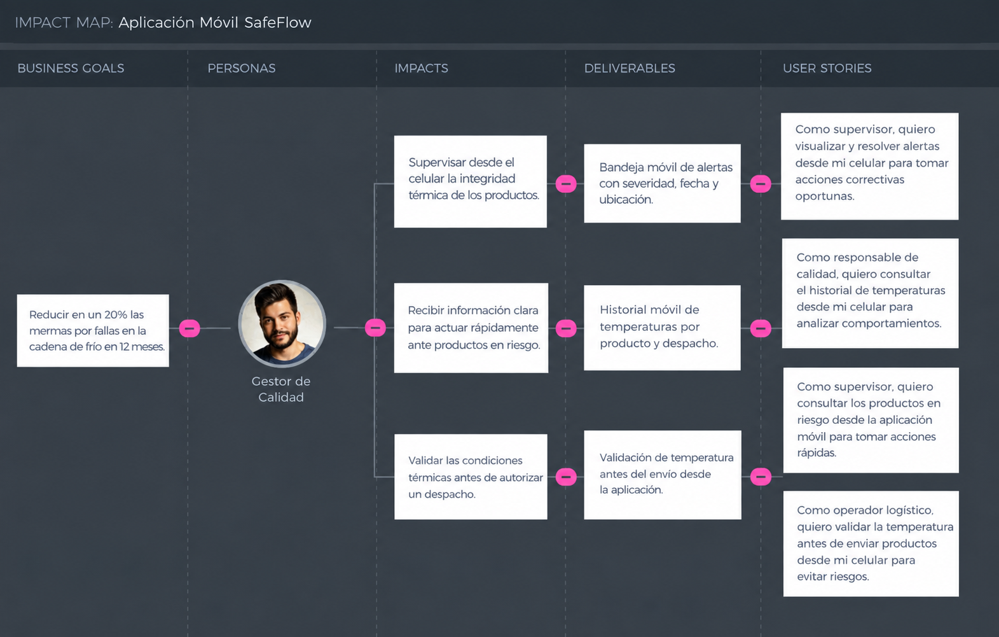</div>

<p><strong><em>Nota.</em></strong> Captura del Impact Map elaborado por el equipo con los Business Goals, Actors, Impacts y Deliverables de SafeFlow.</p>

<p><strong>Figura 15.</strong> <em>Impact Map de SafeFlow (parte 2)</em></p>

<div align="center">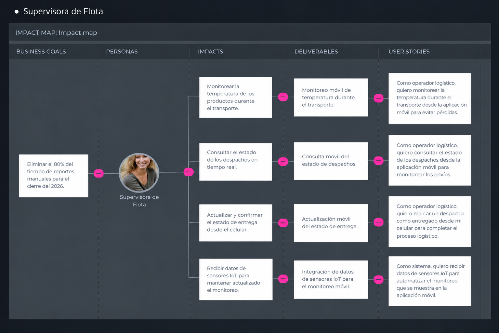</div>

<p><strong><em>Nota.</em></strong> Continuación de la captura del Impact Map elaborado por el equipo.</p>

Los objetivos de negocio se formularon como metas SMART del equipo (Tabla 22). Son objetivos propuestos para orientar el diseño y la verificación; no representan mediciones logradas.

<p><strong>Tabla 22.</strong> <em>Business Goals SMART del producto</em></p>

| Objetivo | Meta SMART (objetivo del equipo) |
|----------|-----------------------------------|
| BG-1 Reducir las pérdidas por excursiones no atendidas | Lograr que, en las pruebas integradas con la aplicación emuladora al cierre del Sprint 4, el 100% de las excursiones térmicas simuladas genere una alerta visible para el SUPERVISOR y quede resuelta o en atención con una acción correctiva registrada. |
| BG-2 Reducir el tiempo de atención de alertas | Lograr que, en las pruebas del Sprint 4, el SUPERVISOR identifique y registre la acción correctiva de una alerta activa en menos de 3 minutos por tarea. |
| BG-3 Ampliar la cobertura de monitoreo | Lograr que, al cierre del Sprint 3, el 100% de los despachos de prueba registrados cuente con un sensor asociado y con mediciones consultables antes de iniciar el envío. |
| BG-4 Facilitar la operación de campo | Lograr que, en la validación con usuarios representativos, el OPERADOR registre un producto en menos de 3 minutos por tarea en celular y en tableta. |

<p><strong><em>Nota.</em></strong> Elaboración propia. Las metas son objetivos propuestos por el equipo y se verificarán en pruebas; no se reportan resultados medidos.</p>

La Tabla 23 traduce esos objetivos en la cadena actor, impacto, entregable e historias. Permite comprobar que cada User Story contribuye a un cambio de comportamiento concreto y que ninguna capacidad prevista queda sin un propósito de negocio.

<p><strong>Tabla 23.</strong> <em>Impact Mapping de SafeFlow</em></p>

| Actor / Persona | Impacto | Entregable | User Stories |
|-----------------|---------|------------|--------------|
| OPERADOR (BG-3, BG-4) | Registra productos, lotes e ingresos de stock de forma completa y consulta el inventario antes de despachar. | Gestión de inventario con rango térmico por producto, lotes y stock. | US-01, US-02, US-10, US-19 |
| OPERADOR (BG-3) | Registra cada despacho con su carga, destino y sensor, y valida la condición térmica antes de iniciar el envío. | Registro de despachos y validación térmica previa al envío. | US-61, US-47, US-25 |
| OPERADOR (BG-1, BG-3) | Supervisa la temperatura de la carga durante el traslado, detecta interrupciones del sensor y confirma la entrega. | Monitoreo de temperatura y estado del sensor, y confirmación de entrega. | US-03, US-07, US-24, US-52 |
| SUPERVISOR (BG-1, BG-2) | Atiende las alertas por severidad y registra la acción correctiva sin consultar continuamente las mediciones. | Avisos de anomalías, alertas priorizadas y resolución con acción correctiva. | US-05, US-06, US-55 |
| SUPERVISOR (BG-1, BG-2) | Evalúa desviaciones, productos en riesgo e historial para decidir intervenciones a tiempo. | Consulta de desviaciones, productos en riesgo, historial térmico e indicadores operativos. | US-04, US-20, US-17, US-13 |
| ADMIN (BG-4) | Define qué operaciones de negocio puede realizar cada rol. | Administración de permisos por rol. | US-18 |
| USUARIO AUTENTICADO y VISITANTE (BG-4) | Utiliza la aplicación en celular o tableta, protege su sesión y, cuando se habilite, crea su cuenta e inicia sesión. | Uso multidispositivo y gestión de acceso y sesión. | US-34, US-42, US-30, US-31 |
| OPERADOR en la aplicación emuladora (BG-1, BG-3) | Reproduce condiciones normales, excursiones, indisponibilidad y datos inválidos para comprobar la respuesta de la aplicación principal. | Aplicación emuladora con sensores simulados. | US-56, US-57, US-58, US-59, US-60 |

<p><strong><em>Nota.</em></strong> Elaboración propia. Entre paréntesis se indican los objetivos de la Tabla 22 a los que contribuye cada actor.</p>

En conjunto, el mapa muestra que el valor del producto se concentra en detectar y atender a tiempo las excursiones térmicas, y que la aplicación emuladora permite verificar esa capacidad antes de disponer de sensores reales.

### 2.4.3. Product Backlog

El Product Backlog reúne las 28 User Stories con su estimación en Story Points (escala 1, 2, 3, 5, 8) y el Sprint planificado. El orden de la Tabla 24 responde al valor para el negocio: primero se ubican la detección, el aviso y la atención de excursiones térmicas, luego el registro y la validación de la carga y, al final, las capacidades de soporte como el acceso y la gestión de sesión. La priorización combina la escala MoSCoW de cada historia con su aporte a los objetivos de la sección 2.4.2. La columna Sprint refleja la planificación vigente, que además considera dependencias técnicas; por ello el orden por valor no coincide estrictamente con el orden de los Sprints.

<p><strong>Tabla 24.</strong> <em>Product Backlog de SafeFlow</em></p>

| # Orden | User Story Id | Título | Story Points (1 / 2 / 3 / 5 / 8) | Sprint |
|---------|---------------|--------|----------------------------------|--------|
| 1 | US-03 | Consultar temperatura y estado del sensor | 5 | Sprint 2 |
| 2 | US-04 | Consultar desviaciones térmicas y riesgo | 5 | Sprint 2 |
| 3 | US-05 | Recibir avisos de anomalías | 3 | Sprint 2 |
| 4 | US-52 | Obtener mediciones automáticamente | 8 | Sprint 3 |
| 5 | US-06 | Resolver alertas con acción correctiva | 3 | Sprint 2 |
| 6 | US-47 | Validar condiciones previas al envío | 3 | Por planificar |
| 7 | US-01 | Registrar producto | 3 | Sprint 1 |
| 8 | US-19 | Registrar lote de producto | 3 | Sprint 1 |
| 9 | US-02 | Registrar ingreso de stock | 3 | Sprint 1 |
| 10 | US-10 | Consultar inventario | 2 | Sprint 1 |
| 11 | US-61 | Registrar despacho | 5 | Por planificar |
| 12 | US-07 | Monitorear temperatura del transporte | 5 | Sprint 2 |
| 13 | US-20 | Consultar productos en riesgo | 2 | Sprint 2 |
| 14 | US-55 | Consultar alertas por severidad | 2 | Por planificar |
| 15 | US-24 | Confirmar entrega de despacho | 2 | Sprint 2 |
| 16 | US-25 | Consultar estado de despachos | 2 | Sprint 2 |
| 17 | US-56 | Asociar sensor simulado | 5 | Sprint 3 |
| 18 | US-57 | Iniciar y finalizar emisión de mediciones | 3 | Sprint 3 |
| 19 | US-58 | Ajustar temperatura emitida | 3 | Sprint 3 |
| 20 | US-59 | Simular indisponibilidad y recuperación del sensor | 5 | Sprint 4 |
| 21 | US-60 | Generar mediciones inválidas | 5 | Sprint 4 |
| 22 | US-13 | Consultar indicadores operativos | 5 | Sprint 2 |
| 23 | US-17 | Consultar historial de temperatura | 3 | Sprint 2 |
| 24 | US-34 | Operar desde celular o tableta | 3 | Por planificar |
| 25 | US-18 | Definir permisos de operaciones por rol | 5 | Sprint 1 |
| 26 | US-42 | Cerrar sesión | 1 | Por planificar |
| 27 | US-31 | Iniciar sesión | 2 | Sprint 1 |
| 28 | US-30 | Crear cuenta | 3 | Sprint 1 |

<p><strong><em>Nota.</em></strong> Elaboración propia. Las estimaciones de US-56 a US-61 (5, 3, 3, 5, 5 y 5 puntos, respectivamente) son propuestas a validar por el equipo; las demás conservan la estimación original. US-30 y US-31 figuran en Sprint 1 pero permanecen diferidas respecto del cierre actual.</p>

La tabla muestra que la mayor parte del esfuerzo de los primeros lugares recae en el monitoreo y las alertas, que son la propuesta de valor central, y que las historias de acceso, aunque necesarias, se ubican al final por su menor aporte directo a la prevención de pérdidas.

> Pendiente: captura y URL pública del tablero del backlog (Trello/YouTrack/Jira)

## 2.5. Strategic-Level Domain-Driven Design

El diseño estratégico de Domain-Driven Design (DDD) descompone SafeFlow en subconjuntos con límites naturales, los Bounded Contexts, dentro de los cuales cada término del negocio tiene un significado único. Su propósito es decidir qué responsabilidades viven juntas, cuáles se separan y cómo se relacionan, antes de entrar al diseño táctico. Para ello el equipo encadenó cinco herramientas: EventStorming para descubrir el dominio, Candidate Context Discovery para proponer contextos, Domain Message Flow Modeling para validar cómo colaboran, Bounded Context Canvas para especificar cada contexto y Context Mapping para decidir sus relaciones. Cada herramienta consume el resultado de la anterior, de modo que los seis contextos finales (IAM, Inventory, Environmental Monitoring, Alerts, Logistics y Reporting) son consecuencia del análisis y no un punto de partida arbitrario.

### 2.5.1. EventStorming

El EventStorming es un taller colaborativo que modela el dominio a partir de eventos de negocio ordenados en una línea de tiempo. En SafeFlow sirvió para obtener una primera aproximación general del dominio de la cadena de frío y refinarla hasta alcanzar el mayor nivel de detalle posible. La sesión se realizó sobre un lienzo digital en dos momentos: una versión inicial, en la que se volcaron eventos, actores y comandos sin filtrar, y una versión final, en la que se depuraron los nombres, se ordenó la línea de tiempo y se agruparon los eventos por afinidad de vocabulario.

**Convención de nomenclatura de eventos.** Un evento de dominio es un hecho que ya ocurrió y es relevante para el negocio. Por ello se nombra en pasado, con la estructura *Sustantivo + participio* (por ejemplo, *Lote registrado*), sin verbos imperativos (que corresponden a comandos, como *Registrar lote*) y sin nombres técnicos de implementación (como *Fila insertada* o *Webhook recibido*). Esta regla se aplicó tanto al taller como a los diagramas posteriores, de modo que el mismo evento conserva su nombre en todo el informe. La Tabla 25 reúne los eventos canónicos agrupados por bounded context y confirma que todos cumplen la convención.

<p><strong>Tabla 25.</strong> <em>Eventos de dominio por bounded context</em></p>

| Bounded Context | Eventos de dominio |
|---|---|
| IAM | Cuenta creada, Sesión iniciada, Sesión cerrada, Acceso denegado, Permisos de rol actualizados |
| Inventory | Producto registrado, Lote registrado, Ingreso de stock registrado, Stock actualizado |
| Environmental Monitoring | Lectura registrada, Lectura rechazada, Excursión térmica detectada, Advertencia térmica detectada, Sensor desconectado, Sensor recuperado |
| Alerts | Alerta generada, Alerta agrupada, Acción correctiva registrada, Alerta resuelta |
| Logistics | Despacho registrado, Condición térmica validada, Envío bloqueado, Envío autorizado, Envío iniciado, Entrega confirmada |
| Reporting | No emite eventos de dominio: es un modelo de lectura que consume los eventos de los demás contextos |

<p><strong><em>Nota.</em></strong> Todos los eventos están en pasado y siguen la estructura Sustantivo + participio. Los comandos que los originan se expresan en imperativo, por ejemplo Registrar producto o Validar condición térmica.</p>

#### EventStorming Inicial

La versión inicial, mostrada en la Figura 16, captura la lluvia de eventos sin depurar. Su propósito es evidenciar el punto de partida del equipo: eventos con nombres aún heterogéneos, actores identificados (ADMIN, OPERADOR, SUPERVISOR y el servicio de mediciones) y primeras hipótesis sobre el flujo desde el registro de productos hasta la entrega.

<p><strong>Figura 16.</strong> <em>EventStorming inicial de SafeFlow</em></p>

<div align="center">
  
</div>

<p><strong><em>Nota.</em></strong> Lienzo de la primera iteración del taller. Elaboración propia.</p>

#### EventStorming Final

La versión final, mostrada en la Figura 17, es el resultado de las iteraciones de depuración. Los eventos se renombraron según la convención descrita, se ordenaron en la línea de tiempo y se agruparon por vocabulario, lo que dejó visibles las fronteras que más adelante se formalizan como bounded contexts. Es la entrada directa del Candidate Context Discovery.

<p><strong>Figura 17.</strong> <em>EventStorming final de SafeFlow</em></p>

<div align="center">
  
</div>

<p><strong><em>Nota.</em></strong> Lienzo tras la depuración de nombres de eventos y la agrupación por afinidad. Elaboración propia.</p>

#### 2.5.1.1. Candidate Context Discovery

El Candidate Context Discovery parte del EventStorming final y busca los límites naturales del dominio. El equipo aplicó tres técnicas. Con **start-with-value** se identificaron primero las capacidades que concentran el valor del negocio: detectar excursiones térmicas y reaccionar a ellas antes de perder la carga, lo que convirtió a Environmental Monitoring y Alerts en el núcleo. Con **start-with-simple** se descompuso la línea de tiempo en pasos secuenciales sencillos (registrar producto, registrar lote, registrar despacho, validar condición, monitorear, alertar, resolver, entregar), y cada paso se asignó al vocabulario que mejor lo describe. Con **look-for-pivotal-events** se buscaron los eventos que marcan un cambio de estado entre partes del proceso: *Lote registrado* (de inventario a logística), *Condición térmica validada* (de la preparación al envío), *Excursión térmica detectada* (de monitoreo a atención de incidencias) y *Alerta resuelta* (de la incidencia al historial).

La Tabla 26 resume los candidatos considerados, el motivo por el cual cada uno se conservó o se absorbió y su destino final.

<p><strong>Tabla 26.</strong> <em>Candidatos de contexto y decisión de agrupación</em></p>

| Candidato | Eventos y conceptos | Decisión | Motivo |
|---|---|---|---|
| Identidad y permisos | Cuenta creada, Sesión iniciada, Permisos de rol actualizados | **IAM** | Vocabulario propio (cuenta, rol, permiso) y reglas de acceso que no pertenecen a ningún proceso operativo. |
| Productos, lotes y stock | Producto registrado, Lote registrado, Stock actualizado | **Inventory** | Es dueño de los datos maestros y del rango térmico del producto. |
| Lecturas y sensores | Lectura registrada, Lectura rechazada, Sensor desconectado, Sensor recuperado | **Environmental Monitoring** | Valida mediciones y las compara con el rango; su lenguaje (lectura, umbral, excursión) es distinto al de logística. |
| Detección de excursiones | Excursión térmica detectada, Advertencia térmica detectada | **Environmental Monitoring** | Se fusionó con lecturas: separar la detección del registro de lecturas obliga a replicar el rango y el estado del sensor. |
| Incidencias | Alerta generada, Alerta agrupada, Acción correctiva registrada, Alerta resuelta | **Alerts** | Ciclo de vida propio (activa, agrupada, resuelta) y reglas de severidad y agrupación independientes de la medición. |
| Notificaciones móviles | Aviso al supervisor | **Alerts** (capacidad) | Es un canal de entrega de la alerta; su propio contexto sería prematuro en el alcance actual. |
| Despachos y envío | Despacho registrado, Condición térmica validada, Envío autorizado, Envío bloqueado, Envío iniciado, Entrega confirmada | **Logistics** | Orquesta el recorrido de la carga y decide si el envío puede iniciar. |
| Consolidación e historial | Historial térmico, indicadores | **Reporting** | Modelo de lectura sin reglas operativas propias; consume eventos de los demás. |
| Emulación de mediciones | Medición simulada | Fuera de los 6 contextos | Es otra aplicación que alimenta al servicio compartido; se trata como sistema externo. |

<p><strong><em>Nota.</em></strong> Elaboración propia a partir del EventStorming final. La app emuladora no es un contexto de negocio de SafeFlow.</p>

La agrupación en seis contextos responde a tres criterios: cada contexto tiene un lenguaje ubicuo propio (por ejemplo, *Lectura* en Monitoring no es lo mismo que *Despacho* en Logistics), un ciclo de vida de datos diferenciado y una razón de cambio distinta. Los candidatos de detección de excursiones y de notificaciones no justificaron contextos propios porque dependían del mismo vocabulario que Monitoring y Alerts, respectivamente.

Para comprobar que el diseño cubre el producto completo, la Tabla 27 asigna cada historia de usuario del alcance al bounded context que es su propietario principal.

<p><strong>Tabla 27.</strong> <em>Trazabilidad de historias de usuario a bounded contexts</em></p>

| Bounded Context | Historias de usuario | Capacidad cubierta |
|---|---|---|
| IAM | US-18, US-30, US-31, US-42 | Definir operaciones permitidas por rol, crear cuenta, iniciar y cerrar sesión |
| Inventory | US-01, US-02, US-10, US-19 | Registrar producto con rango térmico, ingreso de stock, consulta de inventario, registro de lote |
| Environmental Monitoring | US-03, US-04, US-17, US-20, US-52 | Última lectura y estado del sensor, desviaciones y riesgo, historial por periodo, productos en riesgo, obtención automática de mediciones |
| Alerts | US-05, US-06, US-55 | Avisos de anomalías, acciones correctivas, alertas activas por severidad |
| Logistics | US-07, US-24, US-25, US-47, US-61 | Lecturas por despacho, confirmar entrega, estado de despachos, validar condición previa al envío, registrar despacho |
| Reporting | US-13 | Indicadores consolidados de productos, alertas y despachos |
| Transversal (`main` y `core/ui`) | US-34 | Uso de las operaciones autorizadas en celular y tableta |
| Fuera de los 6 contextos (app emuladora) | US-56, US-57, US-58, US-59, US-60 | Asociar sensor simulado, emitir, variar temperatura, simular indisponibilidad y mediciones inválidas |

<p><strong><em>Nota.</em></strong> Cada historia tiene un único propietario principal; US-34 se resuelve con el sistema visual compartido y la navegación, no con un contexto de negocio.</p>

Como muestra la Tabla 27, las 28 historias quedan asignadas sin solapes, lo que valida la partición propuesta.

#### 2.5.1.2. Domain Message Flows Modeling

El Domain Message Flow Modeling, propuesto por la comunidad ddd-crew, representa cómo colaboran los bounded contexts para resolver un escenario de negocio mediante mensajes ordenados. Reemplaza la narración informal por una notación explícita que distingue qué es un comando, qué es un evento y qué es una consulta, y dibuja los límites de cada contexto. Su valor para SafeFlow es doble: valida que cada historia crítica se resuelve sin que un contexto invada responsabilidades de otro y revela dependencias que alimentan el Context Mapping. El equipo modeló tres flujos clave, cada uno como un diagrama de secuencia Mermaid con mensajes numerados y los contextos agrupados en recuadros que hacen de límites.


La Tabla 28 define la notación común a los tres diagramas.

<p><strong>Tabla 28.</strong> <em>Leyenda de notación de los flujos de mensajes</em></p>

| Elemento | Representación en el diagrama |
|---|---|
| Actor o sistema externo | Participante fuera de los recuadros (Operador, Supervisor, app emuladora, servicio compartido) |
| Límite de bounded context | Recuadro (`box`) que agrupa al contexto |
| Comando | Flecha continua con prefijo **CMD** (intención de cambiar el estado, en imperativo) |
| Evento | Flecha discontinua con prefijo **EVT** (hecho ocurrido, en pasado) |
| Consulta | Flecha continua con prefijo **QRY** y su respuesta discontinua con prefijo **RES** |
| Orden de mensajes | Numeración automática en cada flecha |

<p><strong><em>Nota.</em></strong> Adaptación de la notación de Domain Message Flow Modelling a diagramas de secuencia Mermaid.</p>

##### Flujo A: Registrar despacho y validar condición previa

Este flujo muestra cómo el OPERADOR deja un despacho en preparación y luego comprueba si las condiciones térmicas permiten iniciarlo. Su propósito es evidenciar la dependencia de Logistics hacia Inventory (stock y producto) y hacia Monitoring (última lectura), y la regla de que registrar un despacho no inicia el envío. La Figura 18 lo detalla.

1. El OPERADOR envía a Logistics el comando Registrar despacho con producto, lote, cantidad, destino y sensor.
2. Logistics consulta a Inventory el stock disponible del lote.
3. Inventory responde con la cantidad disponible; si es insuficiente o el lote no pertenece al producto, Logistics rechaza el registro.
4. Logistics emite *Despacho registrado*; el despacho queda en preparación.
5. El OPERADOR envía el comando Validar condición térmica.
6. Logistics consulta a Monitoring, a través de su ACL, la última lectura del sensor asignado.
7. Monitoring responde con la lectura (o con su ausencia).
8. Logistics emite *Condición térmica validada* y, según el resultado, *Envío autorizado* (dentro de rango) o *Envío bloqueado* (sin datos o riesgo sin confirmación autorizada).
9. Con el envío autorizado, el OPERADOR envía Iniciar envío y Logistics emite *Envío iniciado*.

<p><strong>Figura 18.</strong> <em>Flujo A: registrar despacho y validar condición previa</em></p>

<div align="center">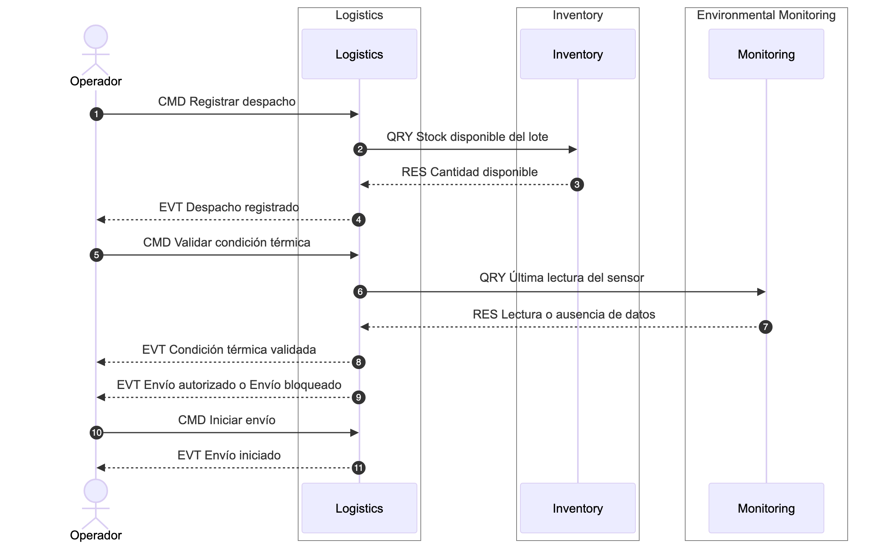</div>

<p><strong><em>Nota.</em></strong> Los eventos dirigidos al Operador representan el resultado visible en la aplicación. Elaboración propia.</p>

##### Flujo B: Excursión térmica, alerta y acción correctiva

Este flujo describe el ciclo de la incidencia desde que una medición sale del rango hasta que el SUPERVISOR la resuelve. Su propósito es verificar que Monitoring solo detecta y que Alerts es el único dueño del ciclo de vida de la alerta. La Figura 19 lo representa.

1. Monitoring registra una lectura numérica y emite *Lectura registrada*.
2. Al compararla con el rango del producto, emite *Excursión térmica detectada*.
3. Alerts, suscrito al evento, genera la alerta y emite *Alerta generada*; si ya existe una alerta activa para la misma anomalía, emite *Alerta agrupada* en lugar de duplicarla.
4. Alerts envía el aviso móvil al SUPERVISOR autorizado.
5. El SUPERVISOR consulta las alertas activas y su severidad.
6. Alerts devuelve la alerta con su información.
7. El SUPERVISOR envía el comando Registrar acción correctiva.
8. Alerts emite *Acción correctiva registrada* y *Alerta resuelta*; el historial se conserva.

<p><strong>Figura 19.</strong> <em>Flujo B: excursión térmica, alerta y acción correctiva</em></p>

<div align="center">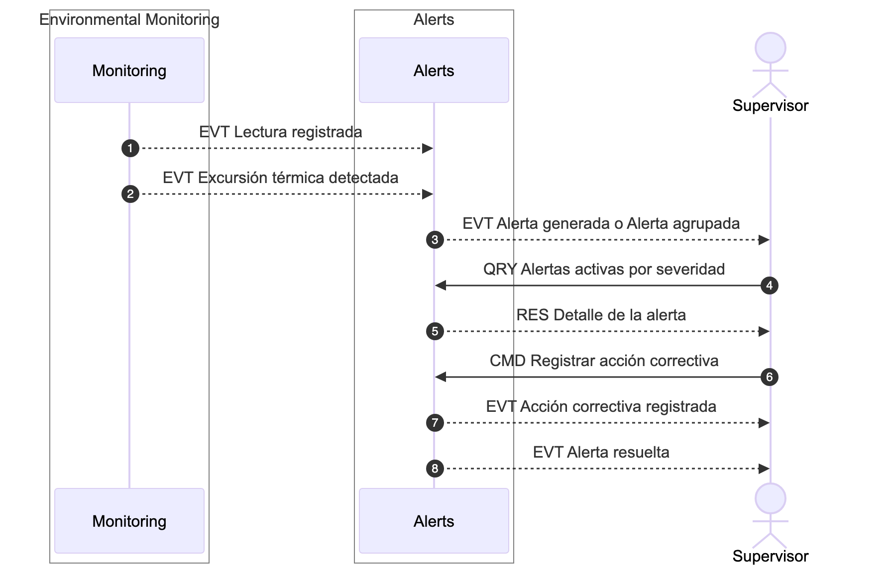</div>

<p><strong><em>Nota.</em></strong> Recuperar un sensor no resuelve alertas pendientes; solo el registro de una acción correctiva las resuelve. Elaboración propia.</p>

##### Flujo C: Medición emulada, servicio compartido, Monitoring y Alerts

Este flujo cubre el recorrido de prueba integrado: la app emuladora publica una medición simulada, el servicio compartido la conserva y la app principal la incorpora a través de la capa anticorrupción (ACL) de Monitoring. Su propósito es mostrar el único punto donde un modelo externo se traduce al dominio y la regla de validación de datos. La Figura 20 lo muestra.

1. El OPERADOR envía a la app emuladora el comando Iniciar emisión.
2. La app emuladora publica la medición en el servicio compartido.
3. Monitoring consulta mediante su ACL las mediciones nuevas.
4. El servicio compartido devuelve la medición en su formato externo.
5. La ACL traduce la medición a una Lectura del dominio. Si no tiene valor o no es numérica, Monitoring emite *Lectura rechazada* y el monitoreo continúa con las siguientes lecturas.
6. Si es válida, Monitoring emite *Lectura registrada*. Una temperatura numérica fuera de rango es válida y representa una excursión.
7. Si hay excursión, Monitoring emite *Excursión térmica detectada*.
8. Alerts emite *Alerta generada*.

<p><strong>Figura 20.</strong> <em>Flujo C: medición emulada hasta la alerta</em></p>

<div align="center">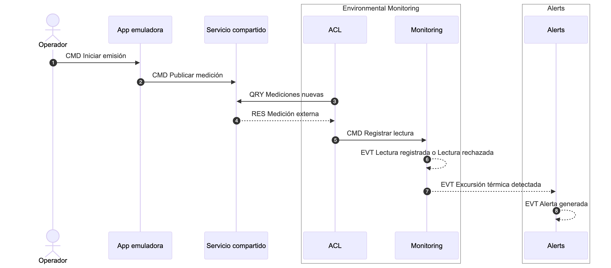</div>

<p><strong><em>Nota.</em></strong> La app emuladora y el servicio compartido son sistemas externos a los seis contextos. Elaboración propia.</p>

Los tres flujos confirman que cada comando tiene un único contexto responsable y que la colaboración se produce por consultas puntuales (Logistics hacia Inventory y Monitoring) y por eventos (Monitoring hacia Alerts), lo que sostiene las relaciones definidas en el Context Mapping.

#### 2.5.1.3. Bounded Context Canvases

El Bounded Context Canvas, propuesto por ddd-crew, es una ficha que describe un contexto en un solo lugar: su propósito, su clasificación estratégica, sus roles, sus comunicaciones, su lenguaje, sus decisiones y sus incógnitas. El equipo elaboró un canvas por contexto en orden de importancia estratégica (Monitoring, Alerts, Logistics, Inventory, IAM y Reporting), porque los primeros concentran el valor diferencial del producto. El proceso fue iterativo, con cinco pasos. En el **Context Overview Definition** se redactó el propósito y la clasificación de cada contexto. En el **Business Rules Distillation & Ubiquitous Language Capture** se extrajeron las reglas de negocio de las historias y los escenarios de aceptación (por ejemplo, una temperatura numérica fuera de rango es una excursión válida, mientras que un dato ausente o no numérico se rechaza) y los términos del lenguaje ubicuo. En el **Capability Analysis** se agruparon las capacidades por contexto y se verificó que no se duplicaran; no fue necesario el Capability Layering porque ningún contexto mezcla capacidades de niveles distintos. En el **Dependencies Capture** se registraron los mensajes entrantes y salientes con sus colaboradores, apoyados en los flujos de la sección anterior. Finalmente, en el **Design Critique** se revisó cada canvas buscando responsabilidades repetidas y se ajustaron los límites, por ejemplo al dejar la notificación móvil dentro de Alerts.

> Pendiente: capturas progresivas de la sesión de canvases

##### Canvas 1: Environmental Monitoring

Es el contexto central del producto: recibe las mediciones, decide si son válidas y detecta si el producto está fuera de rango. La Tabla 29 contiene su canvas completo.

<p><strong>Tabla 29.</strong> <em>Bounded Context Canvas de Environmental Monitoring</em></p>

| Sección | Contenido |
|---|---|
| Name | Environmental Monitoring (paquete `monitoring`) |
| Purpose | Registrar mediciones térmicas válidas, mantener el estado de los sensores y detectar excursiones y advertencias respecto del rango del producto. |
| Strategic Classification | Dominio: **core**. Modelo de negocio: generador de valor (previene pérdidas). Evolución: **custom-built** (génesis a custom). |
| Domain Roles | Execution context (aplica las reglas de validación y detección) y Analysis context (historial térmico). |
| Inbound Communication | **Eventos:** rango térmico del producto (desde Inventory). **Comandos:** Registrar lectura (desde la ACL del servicio compartido). **Consultas:** Última lectura y estado del sensor, historial por periodo y productos en riesgo (desde Logistics y la app). |
| Outbound Communication | **Eventos:** Lectura registrada, Lectura rechazada, Excursión térmica detectada, Advertencia térmica detectada, Sensor desconectado, Sensor recuperado (hacia Alerts, Logistics y Reporting). **Consultas:** mediciones nuevas al servicio compartido. |
| Ubiquitous Language | Lectura, sensor, rango térmico, excursión térmica, advertencia térmica, medición inválida, sensor desconectado, última lectura conocida. |
| Business Decisions | Una temperatura numérica fuera del rango es una lectura válida y una excursión. Una medición sin valor o no numérica se rechaza, queda constancia y no entra al historial válido. Un sensor desconectado conserva su última lectura conocida. Recuperar un sensor no resuelve alertas. |
| Assumptions | Los rangos de prueba se acuerdan con el equipo. El servicio compartido entrega mediciones con identificador de sensor y destino. Las mediciones simuladas se marcan como datos de prueba. |
| Verification Metrics | Porcentaje de mediciones inválidas rechazadas (objetivo 100%); lecturas del historial con fecha, hora y estado completos (objetivo 100%); tiempo de consulta de temperatura dentro del objetivo de rendimiento propuesto. |
| Open Questions | ¿Qué tolerancia define una advertencia frente a una excursión? ¿Cuánto tiempo sin lecturas declara un sensor desconectado? |

<p><strong><em>Nota.</em></strong> Elaboración propia. Los objetivos de verificación son propuestos y aún no medidos.</p>

##### Canvas 2: Alerts

Convierte las detecciones de Monitoring en incidencias gestionables y conserva la trazabilidad de su resolución. La Tabla 30 presenta su canvas.

<p><strong>Tabla 30.</strong> <em>Bounded Context Canvas de Alerts</em></p>

| Sección | Contenido |
|---|---|
| Name | Alerts |
| Purpose | Generar, agrupar, priorizar y notificar alertas de anomalías térmicas y registrar las acciones correctivas que las resuelven. |
| Strategic Classification | Dominio: **core**. Modelo de negocio: generador de valor (reacción oportuna). Evolución: **custom-built**. |
| Domain Roles | Execution context (ciclo de vida de la alerta) y Notification context (avisos móviles). |
| Inbound Communication | **Eventos:** Excursión térmica detectada, Advertencia térmica detectada y Sensor desconectado (desde Monitoring). **Comandos:** Registrar acción correctiva (SUPERVISOR). **Consultas:** Alertas activas por severidad (SUPERVISOR). |
| Outbound Communication | **Eventos:** Alerta generada, Alerta agrupada, Acción correctiva registrada, Alerta resuelta (hacia Reporting). **Mensajes:** aviso móvil al SUPERVISOR autorizado. |
| Ubiquitous Language | Alerta, severidad, alerta activa, alerta agrupada, aviso, acción correctiva, alerta resuelta. |
| Business Decisions | Las alertas repetidas de una misma anomalía se agrupan en una sola. Solo una acción correctiva resuelve una alerta; la recuperación del sensor no lo hace. Los avisos respetan los permisos del usuario. El historial de alertas se conserva tras su resolución. |
| Assumptions | La notificación móvil es solo un canal de entrega; la alerta existe aunque el dispositivo esté sin conexión. El SUPERVISOR integra las responsabilidades de logística y calidad. |
| Verification Metrics | Alertas duplicadas por anomalía (objetivo 0); resoluciones con acción correctiva, autor y momento registrados (objetivo 100%). |
| Open Questions | ¿Qué criterio exacto define la severidad? ¿Qué ventana define que dos alertas son la misma anomalía? |

<p><strong><em>Nota.</em></strong> Elaboración propia.</p>

##### Canvas 3: Logistics

Coordina el despacho de la carga y decide si el envío puede iniciar según su condición térmica. La Tabla 31 muestra su canvas.

<p><strong>Tabla 31.</strong> <em>Bounded Context Canvas de Logistics</em></p>

| Sección | Contenido |
|---|---|
| Name | Logistics |
| Purpose | Registrar despachos, validar la condición térmica previa al envío, controlar su estado y confirmar la entrega. |
| Strategic Classification | Dominio: **supporting**. Modelo de negocio: habilitador de ingresos (operación diaria). Evolución: **custom-built**. |
| Domain Roles | Execution context (orquesta el despacho) y Approver (autoriza o bloquea el envío). |
| Inbound Communication | **Comandos:** Registrar despacho, Validar condición térmica, Iniciar envío, Confirmar entrega (OPERADOR). **Consultas:** Estado de despachos y lecturas por despacho. **Eventos:** Excursión térmica detectada y Sensor desconectado (desde Monitoring). |
| Outbound Communication | **Eventos:** Despacho registrado, Condición térmica validada, Envío bloqueado, Envío autorizado, Envío iniciado, Entrega confirmada (hacia Reporting). **Consultas:** Stock disponible (a Inventory) y última lectura (a Monitoring, por ACL). |
| Ubiquitous Language | Despacho, en preparación, en tránsito, entregado, destino, sensor asignado, condición previa, envío autorizado, envío bloqueado. |
| Business Decisions | Un despacho registrado queda en preparación y no inicia el envío. Registrar exige cantidad positiva y no superior al stock, y que el lote pertenezca al producto. Sin datos de temperatura el envío se bloquea. Un riesgo térmico requiere confirmación autorizada. Una entrega ya confirmada no se confirma de nuevo. |
| Assumptions | El sensor asociado existe y reporta a Monitoring. Los destinos se registran como texto libre. |
| Verification Metrics | Envíos iniciados sin validación previa (objetivo 0); registros rechazados con la causa informada (objetivo 100%). |
| Open Questions | ¿Quién concede la confirmación autorizada ante un riesgo? ¿Un despacho puede cancelarse? |

<p><strong><em>Nota.</em></strong> Elaboración propia.</p>

##### Canvas 4: Inventory

Es dueño de los datos maestros que los demás contextos referencian. La Tabla 32 contiene su canvas.

<p><strong>Tabla 32.</strong> <em>Bounded Context Canvas de Inventory</em></p>

| Sección | Contenido |
|---|---|
| Name | Inventory |
| Purpose | Mantener el catálogo de productos con su rango térmico, sus lotes y el stock disponible. |
| Strategic Classification | Dominio: **supporting**. Modelo de negocio: habilitador de ingresos. Evolución: **custom-built** a commodity. |
| Domain Roles | Specification context (define productos y rangos) y Execution context (stock). |
| Inbound Communication | **Comandos:** Registrar producto, Registrar lote, Registrar ingreso de stock (OPERADOR). **Consultas:** Inventario por estado, stock disponible (Logistics). |
| Outbound Communication | **Eventos:** Producto registrado, Lote registrado, Ingreso de stock registrado, Stock actualizado (hacia Monitoring, Logistics y Reporting). |
| Ubiquitous Language | Producto, rango térmico, lote, stock, ingreso, estado de conservación. |
| Business Decisions | El rango mínimo no puede superar al máximo. Un lote pertenece a un único producto y no se duplica. El ingreso exige cantidad positiva y producto existente. |
| Assumptions | El estado de conservación se deriva de la información de Monitoring. Los lotes se identifican por un código del OPERADOR. |
| Verification Metrics | Registros con datos obligatorios completos (objetivo 100%); coincidencia entre stock mostrado y movimientos registrados. |
| Open Questions | ¿Se registra la salida de stock al iniciar un envío? ¿Cómo se trata un lote vencido? |

<p><strong><em>Nota.</em></strong> Elaboración propia.</p>

##### Canvas 5: IAM

Aísla la identidad y los permisos para que ningún otro contexto implemente reglas de seguridad propias. La Tabla 33 presenta su canvas.

<p><strong>Tabla 33.</strong> <em>Bounded Context Canvas de IAM</em></p>

| Sección | Contenido |
|---|---|
| Name | IAM (Identity and Access Management) |
| Purpose | Gestionar cuentas, sesiones, roles y permisos de acceso. |
| Strategic Classification | Dominio: **generic**. Modelo de negocio: habilitador de cumplimiento. Evolución: **commodity** (se adopta un patrón estándar). |
| Domain Roles | Gateway context (controla el acceso) y Specification context (define permisos). |
| Inbound Communication | **Comandos:** Crear cuenta, Iniciar sesión, Cerrar sesión (VISITANTE y USUARIO AUTENTICADO), Actualizar permisos de rol (ADMIN). **Consultas:** Rol y permisos de la sesión (todos los contextos). |
| Outbound Communication | **Eventos:** Cuenta creada, Sesión iniciada, Sesión cerrada, Acceso denegado, Permisos de rol actualizados. Publica el rol y los permisos de la sesión como Published Language. |
| Ubiquitous Language | Cuenta, sesión, rol (ADMIN, OPERADOR, SUPERVISOR), permiso, VISITANTE, USUARIO AUTENTICADO, acceso denegado. |
| Business Decisions | Solo ADMIN administra permisos y esa capacidad no es delegable ni retirable. Crear una cuenta no inicia sesión ni concede permisos. Una sesión cerrada o expirada devuelve al estado de VISITANTE. Los intentos fallidos repetidos bloquean la cuenta de forma temporal. |
| Assumptions | Tres roles bastan para el alcance actual. Las credenciales no se conservan en texto plano en el dispositivo. |
| Verification Metrics | Operaciones sin autorización denegadas (objetivo 100%); credenciales eliminadas al cerrar sesión (objetivo 100%). |
| Open Questions | ¿Cuántos intentos fallidos activan el bloqueo y por cuánto tiempo? ¿Cómo se recupera el acceso? |

<p><strong><em>Nota.</em></strong> Elaboración propia.</p>

##### Canvas 6: Reporting

Consolida la información de los demás contextos para consulta, sin reglas operativas propias. La Tabla 34 muestra su canvas.

<p><strong>Tabla 34.</strong> <em>Bounded Context Canvas de Reporting</em></p>

| Sección | Contenido |
|---|---|
| Name | Reporting |
| Purpose | Ofrecer al SUPERVISOR indicadores consolidados de productos, alertas y despachos. |
| Strategic Classification | Dominio: **generic**. Modelo de negocio: habilitador de decisiones. Evolución: **commodity** a custom-built. |
| Domain Roles | Analysis context (modelo de lectura). |
| Inbound Communication | **Eventos:** los de Inventory, Monitoring, Alerts y Logistics. **Consultas:** Indicadores consolidados (SUPERVISOR). |
| Outbound Communication | No emite eventos de dominio. |
| Ubiquitous Language | Indicador, resumen operativo, productos en riesgo, alertas activas, despachos por estado. |
| Business Decisions | Solo consolida: no modifica datos operativos. Cada usuario ve los indicadores autorizados para su rol. Sin datos se informa la ausencia y se sugiere una acción. |
| Assumptions | Los datos del resumen proceden de los eventos y pueden mostrarse con un ligero desfase. |
| Verification Metrics | Coincidencia entre indicadores y datos de origen (objetivo 100%). |
| Open Questions | ¿Qué indicadores adicionales se requerirán? ¿Se exportará evidencia en el futuro? |

<p><strong><em>Nota.</em></strong> Elaboración propia.</p>

Los seis canvases muestran un reparto sin responsabilidades duplicadas: Monitoring detecta, Alerts gestiona la incidencia, Logistics decide el envío, Inventory conserva los datos maestros, IAM controla el acceso y Reporting solo consolida.

### 2.5.2. Context Mapping

El Context Mapping visualiza las relaciones estructurales entre los bounded contexts y los patrones que gobiernan esas relaciones. Su propósito es decidir cómo se integran los contextos y qué costo de coordinación implica cada integración. El proceso comenzó con los canvases y los flujos de mensajes como información de entrada, de la cual se produjeron mapas candidatos. Para generarlos se formularon preguntas de reorganización: qué pasaría si se moviera una capacidad a otro contexto, si se descompusiera una capacidad y se moviera una parte, si se partiera un contexto, si se unieran capacidades de varios contextos en uno nuevo, si se duplicara una funcionalidad para romper una dependencia, si se creara un servicio compartido o si se aislaran las capacidades core de las demás. Cada alternativa se discutió contra los criterios de lenguaje propio, ciclo de vida distinto y razón de cambio independiente.


#### Alternativas de mapa evaluadas

La Tabla 35 compara tres mapas candidatos y recoge la decisión sobre cada uno.

<p><strong>Tabla 35.</strong> <em>Alternativas de mapa de contexto</em></p>

| Alternativa | Descripción | Ventajas | Desventajas | Decisión |
|---|---|---|---|---|
| **A: seis contextos, Reporting separado** | Cada capacidad en su contexto; Reporting es un modelo de lectura que consume eventos. | Fronteras alineadas con el lenguaje; Reporting no puede alterar datos operativos; Monitoring queda libre de lógica de consulta agregada. | Más relaciones por mantener. | **Elegida** |
| **B: Reporting fusionado en Monitoring** | Indicadores y historial se resuelven dentro de Monitoring. | Una relación menos. | Monitoring cargaría con datos de Inventory, Alerts y Logistics y rompería su enfoque en detección; Monitoring pasaría a depender de todos los demás. | Descartada |
| **C: IAM como Shared Kernel** | Identidad y permisos como modelo común compartido por todos. | Una única definición de rol. | Los cambios de IAM obligarían a recompilar y coordinar a todos los contextos; acopla los modelos. | Descartada |

<p><strong><em>Nota.</em></strong> Elaboración propia a partir de las preguntas de reorganización del proceso de Context Mapping.</p>

Se evaluaron además dos variantes de la pregunta sobre mover capacidades: llevar las reglas de temperatura a Logistics simplificaría el despacho, pero mezclaría transporte con evaluación de mediciones; y llevar las alertas a Monitoring ahorraría una integración, pero acoplaría la detección con las preferencias de severidad y las acciones correctivas. Ambas se descartaron, y se mantuvo el diseño de la alternativa A.

#### Mapa de contexto seleccionado

La Figura 21 presenta el mapa elegido. Las flechas van del contexto upstream (U) al downstream (D) y su etiqueta indica el patrón: Open Host Service con Published Language (OHS+PL), Conformist (CF), Customer/Supplier (C/S) y Anti-corruption Layer (ACL). Los eventos de dominio son el mecanismo de integración entre los contextos, no un patrón de relación.

<p><strong>Figura 21.</strong> <em>Context Map de SafeFlow</em></p>

<div align="center">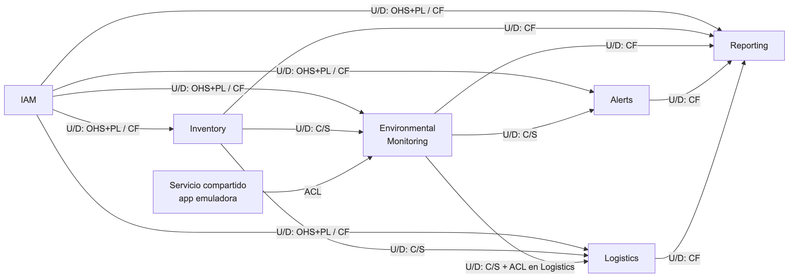</div>

<p><strong><em>Nota.</em></strong> U es upstream y D es downstream. No se utiliza Shared Kernel. Elaboración propia.</p>

La Tabla 36 justifica cada relación indicando el patrón elegido, por qué se prefiere frente a otros y la consecuencia o riesgo.

<p><strong>Tabla 36.</strong> <em>Justificación de las relaciones del Context Map</em></p>

| Upstream | Downstream | Patrón | Justificación | Consecuencia o riesgo |
|---|---|---|---|---|
| IAM | Inventory, Monitoring, Alerts, Logistics, Reporting | **OHS + Published Language** en IAM; **Conformist** en los downstream | IAM sirve a muchos consumidores, por lo que publica un protocolo único y estable (rol y permisos de la sesión). Los downstream no negocian ese modelo, lo adoptan; un Customer/Supplier exigiría atender necesidades distintas de cinco consumidores y un ACL por contexto sería sobredimensionado. | Un cambio en el lenguaje publicado afecta a todos; debe versionarse con cuidado. |
| Inventory | Monitoring | **Customer/Supplier** | Monitoring necesita el rango térmico del producto y puede pedir ajustes al formato; Inventory lo planifica como proveedor. | Un rango mal registrado produce falsas excursiones. |
| Inventory | Logistics | **Customer/Supplier** | Logistics requiere productos, lotes y stock disponible para validar el despacho y puede negociar el contenido. | Stock desactualizado permite despachos inválidos. |
| Monitoring | Alerts | **Customer/Supplier** | Alerts depende de las excursiones, advertencias y desconexiones, que Monitoring publica como eventos; ambos equipos acuerdan su contenido. | Si Monitoring omite un evento, no se genera la alerta. |
| Monitoring | Logistics | **Customer/Supplier** con **ACL** en Logistics | Logistics necesita la condición térmica previa al envío, pero no debe adoptar el vocabulario de lecturas y umbrales; su ACL traduce la lectura a un resultado de condición. | La traducción debe mantenerse cuando cambie el modelo de lecturas. |
| Inventory, Monitoring, Alerts, Logistics | Reporting | **Conformist** | Reporting solo consolida: acepta los modelos de origen sin influir en ellos; un C/S daría a Reporting poder para pedir cambios a contextos operativos. | Reporting debe adaptarse a cada cambio de los contextos origen. |
| Servicio compartido y app emuladora | Monitoring | **ACL** | El formato externo no es controlado por el equipo y puede traer datos ausentes o no numéricos; el ACL traduce a Lectura y rechaza lo inválido, protegiendo el dominio. | Cada cambio del servicio compartido se absorbe en la ACL. |

<p><strong><em>Nota.</em></strong> Elaboración propia. Los eventos de dominio son el mecanismo de integración en las relaciones de la tabla.</p>

**Por qué no se usa Shared Kernel.** Compartir un subconjunto del modelo exige que los equipos coordinen cada cambio y acopla los ciclos de vida de los contextos. Para SafeFlow, el único candidato era la identidad y los permisos, pero IAM ya expone un contrato estable mediante Open Host Service y Published Language; compartir el modelo no aportaría ventaja y sí un riesgo de acoplamiento entre modelos. Se prefiere, por tanto, que cada contexto conserve su propio modelo y se integre por contratos explícitos y eventos.

La alternativa A resulta la mejor aproximación porque mantiene aisladas las reglas centrales del dominio, limita las dependencias a relaciones unidireccionales y protege a Monitoring y Logistics de los modelos externos. Las relaciones deberán revisarse si surgen nuevos eventos o responsabilidades durante la implementación.

### 2.5.3 Software Architecture

La arquitectura de software de SafeFlow se representa con el modelo C4, que describe un sistema en cuatro niveles de detalle creciente. El nivel Context muestra el sistema como una sola caja rodeada por las personas y los sistemas con los que se relaciona. El nivel Container abre esa caja y muestra las unidades ejecutables o de almacenamiento que la componen, con sus tecnologías y responsabilidades. El nivel Component descompone un contenedor en sus módulos internos, y el nivel Code baja hasta las clases e interfaces de un componente. Además de estos niveles, el diagrama de despliegue indica sobre qué nodos de infraestructura se ejecuta cada contenedor.

En esta sección se presentan los niveles Context y Container, y el despliegue de la solución completa. Los diagramas Component y Code se elaboran por Bounded Context y viven en las secciones 2.6.x.5 y 2.6.x.6, junto al diseño táctico de cada contexto. De este modo, esta sección fija la vista global y la 2.6 profundiza en cada módulo de la aplicación.

La solución es una aplicación Android (SafeFlow) para supervisar la cadena de frío. Se apoya en una aplicación emuladora independiente, que el OPERADOR usa para emitir mediciones y estados simulados, y en un servicio compartido remoto que recibe esos datos y los expone a la aplicación principal. El sistema no incluye microservicios propios, bus de eventos local ni puerta de enlace IoT. Los sensores y el hardware físico quedan fuera de alcance: la emuladora ocupa su lugar durante el desarrollo y la validación.

El modelo se documenta con el estilo C4 y, como material de apoyo, el Workspace DSL de Structurizr correspondiente a los niveles Context y Container se incluye en un bloque desplegable al final del nivel Container (Listado de apoyo 1). Los diagramas de las figuras se redactan en Mermaid para que se rendericen directamente en el informe.

#### 2.5.3.1 Context Level Diagrams

El diagrama de contexto es el nivel más alto del modelo C4. Presenta SafeFlow como un recuadro central, rodeado por sus usuarios y por los sistemas con los que interactúa, sin entrar en tecnologías internas. Su propósito es acordar con el equipo y con los interesados quién usa el sistema, con qué otros sistemas se integra y dónde termina el alcance de la solución.

Como muestra la Figura 22, hay tres personas con responsabilidades distintas. El OPERADOR consulta y registra la operación diaria (productos, lotes, ingresos y despachos) y usa además la app emuladora para generar mediciones simuladas. El SUPERVISOR vigila las condiciones térmicas, atiende las alertas y consulta los indicadores. El ADMIN administra la identidad de los usuarios y los permisos por rol, una capacidad exclusiva y no delegable. La aplicación SafeFlow obtiene del servicio compartido las mediciones y los estados simulados, y usa el servicio de avisos móviles del sistema operativo para notificar las alertas aunque la aplicación no esté abierta.

<p><strong>Figura 22.</strong> <em>Diagrama de contexto de SafeFlow (C4 nivel 1)</em></p>

<div align="center">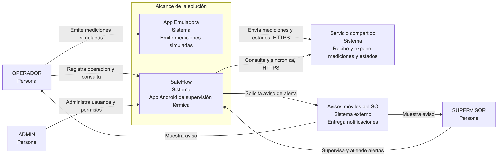</div>

<p><strong><em>Nota.</em></strong> Leyenda: persona es un usuario humano; sistema es una aplicación o servicio de la solución; sistema externo es un servicio de la plataforma Android que el equipo no desarrolla. Los sensores y el hardware físico están fuera de alcance. Elaboración propia con el estilo C4.</p>

La Tabla 37 describe cada elemento del diagrama y deja explícito qué es del equipo y qué es externo; la Tabla 38 describe cada relación con su verbo y, cuando aplica, su protocolo.

<p><strong>Tabla 37.</strong> <em>Elementos del diagrama de contexto</em></p>

| Elemento | Tipo | Descripción |
|---|---|---|
| OPERADOR | Persona | Registra productos, lotes, ingresos y despachos, y consulta el estado térmico. Usa la app emuladora para emitir mediciones simuladas. |
| SUPERVISOR | Persona | Revisa condiciones térmicas, atiende alertas, registra acciones correctivas y consulta indicadores consolidados. |
| ADMIN | Persona | Administra cuentas y permisos por rol. Es el único rol que puede hacerlo. |
| SafeFlow | Sistema | Aplicación Android que concentra la supervisión térmica, el inventario, las alertas, los despachos y los reportes. Funciona en celular y tableta. |
| App Emuladora | Sistema | Aplicación Android separada con la que el OPERADOR genera mediciones y estados simulados, en lugar de sensores físicos. |
| Servicio compartido | Sistema | Sistema de software remoto que recibe las mediciones y los estados simulados, los almacena y los expone a SafeFlow. |
| Avisos móviles del SO | Sistema externo | Servicio de notificaciones del sistema operativo que presenta las alertas en el dispositivo, incluso con la aplicación cerrada. |

<p><strong><em>Nota.</em></strong> Cada fila corresponde a un recuadro de la figura. Elaboración propia.</p>

<p><strong>Tabla 38.</strong> <em>Relaciones del diagrama de contexto</em></p>

| Origen | Relación | Destino | Protocolo |
|---|---|---|---|
| OPERADOR | Registra operación y consulta | SafeFlow | Interacción en la aplicación |
| SUPERVISOR | Supervisa y atiende alertas | SafeFlow | Interacción en la aplicación |
| ADMIN | Administra usuarios y permisos | SafeFlow | Interacción en la aplicación |
| OPERADOR | Emite mediciones simuladas | App Emuladora | Interacción en la aplicación |
| App Emuladora | Envía mediciones y estados | Servicio compartido | HTTPS |
| SafeFlow | Consulta y sincroniza datos | Servicio compartido | HTTPS |
| SafeFlow | Solicita el aviso de una alerta | Avisos móviles del SO | API de notificaciones del sistema operativo |
| Avisos móviles del SO | Muestra el aviso | OPERADOR y SUPERVISOR | Notificación en el dispositivo |

<p><strong><em>Nota.</em></strong> Las relaciones entre aplicaciones y servicio usan HTTPS, por lo que la información viaja cifrada en tránsito. Elaboración propia.</p>

El contexto deja claro que SafeFlow no se comunica con sensores físicos: toda medición llega desde el servicio compartido, alimentado por la app emuladora. Esa frontera permite sustituir la emuladora por una fuente real en el futuro sin alterar la relación de SafeFlow con el servicio.

#### 2.5.3.2 Container Level Diagrams

El diagrama de contenedores abre cada sistema del nivel anterior y muestra sus piezas ejecutables y de almacenamiento. Un contenedor, en C4, es una aplicación o un almacén de datos que se ejecuta de forma independiente, no un contenedor de Docker. El propósito de este nivel es mostrar cómo se reparten las responsabilidades, qué tecnología usa cada pieza y cómo se comunican entre sí.

La Figura 23 muestra tres sistemas con sus contenedores. SafeFlow se compone de la aplicación Android y de un almacenamiento local. La App Emuladora es una aplicación Android independiente. El servicio compartido se compone de una API REST y de la base de datos del servicio. Los avisos móviles se representan como un contenedor de plataforma que SafeFlow invoca para notificar alertas. La Tabla 39 resume la responsabilidad, la tecnología y las interfaces de cada contenedor.

<p><strong>Figura 23.</strong> <em>Diagrama de contenedores de SafeFlow (C4 nivel 2)</em></p>

<div align="center">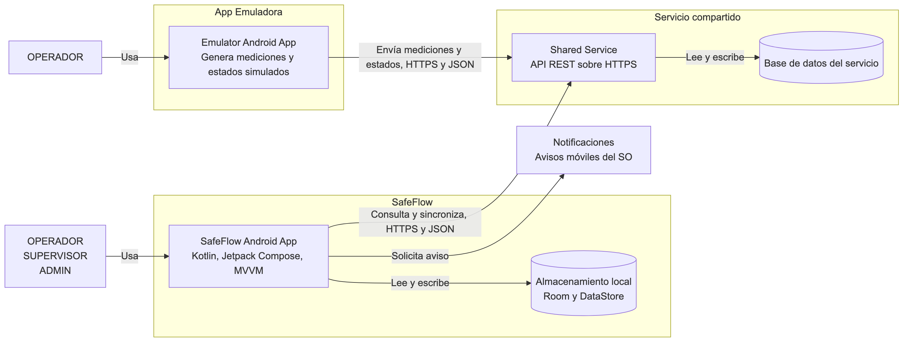</div>

<p><strong><em>Nota.</em></strong> Los recuadros con borde son los sistemas del nivel de contexto; los cilindros son almacenes de datos. La base de datos del servicio se deja genérica a propósito. Elaboración propia con el estilo C4.</p>

<p><strong>Tabla 39.</strong> <em>Contenedores de la solución</em></p>

| Contenedor | Sistema | Responsabilidad | Tecnología | Interfaces |
|---|---|---|---|---|
| SafeFlow Android App | SafeFlow | Presenta la interfaz para los tres roles, aplica las reglas de los seis Bounded Contexts, muestra el último estado conocido y sincroniza al recuperar conexión. | Kotlin, Jetpack Compose, MVVM, Hilt, StateFlow, Retrofit con Gson, Coil | Consume la API REST del servicio compartido; usa el almacenamiento local y la API de notificaciones. |
| Almacenamiento local | SafeFlow | Conserva el último estado consultado, las acciones pendientes de sincronizar y los datos de sesión no sensibles. | Room y DataStore | Acceso interno desde la aplicación mediante DAO y preferencias. |
| Emulator Android App | App Emuladora | Permite al OPERADOR emitir mediciones y estados simulados, incluidos casos de indisponibilidad y de medición inválida. | Aplicación Android | Envía datos a la API REST del servicio compartido. |
| Shared Service | Servicio compartido | Recibe y valida mediciones y estados, valida identidad y permisos por rol, y expone los datos a la aplicación principal. | API REST sobre HTTPS | Recursos REST con JSON consumidos por ambas aplicaciones. |
| Base de datos del servicio | Servicio compartido | Almacena de forma persistente los datos recibidos y publicados por el servicio. | Base de datos del servicio | Acceso exclusivo desde Shared Service. |
| Notificaciones | Plataforma Android | Entrega al usuario los avisos de alerta aunque la aplicación esté cerrada. | Servicio de notificaciones del sistema operativo | API de notificaciones invocada por la aplicación. |

<p><strong><em>Nota.</em></strong> La aplicación principal es un solo módulo Gradle, con un paquete por Bounded Context. Elaboración propia a partir de la arquitectura vigente de la aplicación.</p>

La comunicación sigue tres caminos. Primero, la aplicación SafeFlow y la App Emuladora se comunican con el servicio compartido solo mediante solicitudes HTTPS a la API REST; las dos aplicaciones no se llaman entre sí, de modo que el servicio es el único punto de intercambio. Segundo, SafeFlow no consulta el servicio en cada interacción: lee y escribe en el almacenamiento local, de forma que la interfaz responde con el último estado conocido y las acciones pendientes se sincronizan cuando regresa la conexión. Tercero, para las alertas, la aplicación pide al sistema operativo mostrar el aviso mediante la API de notificaciones.

Dentro de la aplicación Android, cada Bounded Context (IAM, Inventory, Environmental Monitoring, Alerts, Logistics y Reporting) ocupa un paquete con cuatro capas: domain, application, infrastructure y presentation. El dominio no depende de Android, la capa de infraestructura implementa los repositorios que consultan el servicio y el almacenamiento local, y la presentación (Compose con ViewModel y StateFlow) consume la capa de aplicación. Ningún contexto importa repositorios, DTO ni ViewModels de otro. Este detalle se desarrolla en los diagramas de componentes de la sección 2.6.

Las decisiones de seguridad y calidad que condicionan estos contenedores son las siguientes:

- La comunicación entre aplicaciones y servicio usa HTTPS, de modo que los datos viajan cifrados en tránsito.
- El servicio compartido valida el rol y los permisos de cada solicitud. La aplicación solo representa los permisos recibidos: ocultar un control en pantalla no sustituye la autorización del servicio.
- Las credenciales no se almacenan en claro en el dispositivo; el almacenamiento local guarda únicamente datos de sesión no sensibles y el último estado consultado.
- Las consultas habituales deben responder en menos de 300 ms en el percentil 95 con 100 usuarios concurrentes, y el servicio apunta a una disponibilidad de 99,5 %.
- Ante conectividad intermitente, la aplicación conserva el último estado y sincroniza al recuperar la conexión.

La separación en tres sistemas y en un servicio compartido concentra las reglas de autorización y de consistencia en un solo lugar, mantiene la aplicación móvil liviana y permite probar el flujo completo, de emuladora a servicio y a la aplicación principal, sin hardware físico.

<details>
<summary>Listado de apoyo 1. Workspace DSL de Structurizr (Context y Container)</summary>

El siguiente Workspace DSL describe los mismos elementos de las figuras y puede abrirse en Structurizr para generar los diagramas de los niveles Context y Container.

```text
workspace "SafeFlow" "Arquitectura C4 de SafeFlow" {

  model {
    operador   = person "OPERADOR" "Registra operación y emite mediciones simuladas"
    supervisor = person "SUPERVISOR" "Supervisa condiciones y atiende alertas"
    admin      = person "ADMIN" "Administra usuarios y permisos"

    safeflow = softwareSystem "SafeFlow" "App Android de supervisión térmica" {
      app   = container "SafeFlow Android App" "Interfaz y reglas por Bounded Context" "Kotlin, Jetpack Compose, MVVM"
      local = container "Almacenamiento local" "Último estado y acciones pendientes" "Room, DataStore" "Database"
    }

    emuladora = softwareSystem "App Emuladora" "Emite mediciones y estados simulados" {
      emu = container "Emulator Android App" "Genera mediciones simuladas" "Aplicación Android"
    }

    servicio = softwareSystem "Servicio compartido" "Recibe y expone mediciones y estados" {
      api = container "Shared Service" "API REST con validación de rol y permisos" "REST sobre HTTPS"
      db  = container "Base de datos del servicio" "Persistencia de datos del servicio" "Base de datos" "Database"
    }

    avisos = softwareSystem "Avisos móviles del SO" "Entrega notificaciones" "Externo"

    operador   -> safeflow "Registra operación y consulta"
    supervisor -> safeflow "Supervisa y atiende alertas"
    admin      -> safeflow "Administra usuarios y permisos"
    operador   -> emuladora "Emite mediciones simuladas"
    emuladora  -> servicio "Envía mediciones y estados" "HTTPS"
    safeflow   -> servicio "Consulta y sincroniza" "HTTPS"
    safeflow   -> avisos "Solicita aviso de alerta"

    operador -> app "Usa"
    operador -> emu "Usa"
    app -> local "Lee y escribe"
    app -> api "Consulta y sincroniza" "HTTPS, JSON"
    emu -> api "Envía mediciones y estados" "HTTPS, JSON"
    api -> db "Lee y escribe"
    app -> avisos "Solicita aviso"
  }

  views {
    systemContext safeflow "Context" {
      include *
      autoLayout lr
    }

    container safeflow "Containers" {
      include *
      autoLayout lr
    }

    styles {
      element "Person"   { shape Person }
      element "Database" { shape Cylinder }
      element "Externo"  { background #999999 }
    }
  }
}
```

</details>

#### 2.5.3.3 Deployment Diagrams

El diagrama de despliegue muestra sobre qué nodos de infraestructura se ejecuta cada contenedor y cómo se conectan los nodos. Su propósito es describir cómo se implementa la solución en la infraestructura: qué corre en los dispositivos de las personas y qué corre en el servidor.

Como muestra la Figura 24, hay tres nodos. El primero es el dispositivo Android del OPERADOR, SUPERVISOR o ADMIN, un celular o una tableta, que ejecuta la aplicación SafeFlow con su almacenamiento local. El segundo es el dispositivo Android donde el OPERADOR ejecuta la App Emuladora. El tercero es el servicio compartido, alojado en la nube, que ejecuta la API REST y su base de datos. Los dos dispositivos se conectan a la nube por HTTPS. La Tabla 40 detalla qué contiene cada nodo.

<p><strong>Figura 24.</strong> <em>Diagrama de despliegue de SafeFlow</em></p>

<div align="center">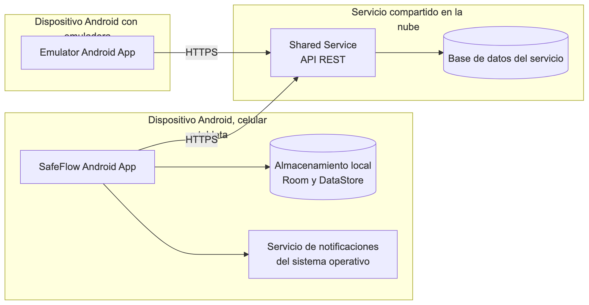</div>

<p><strong><em>Nota.</em></strong> Cada recuadro externo es un nodo de despliegue; las líneas sin flecha son comunicación local dentro del mismo nodo. Elaboración propia con el estilo C4.</p>

<p><strong>Tabla 40.</strong> <em>Nodos de despliegue</em></p>

| Nodo | Contenedores que aloja | Conexión | Observaciones |
|---|---|---|---|
| Dispositivo Android del OPERADOR, SUPERVISOR o ADMIN | SafeFlow Android App, almacenamiento local, notificaciones del sistema operativo | HTTPS hacia el servicio compartido | Celular o tableta. La aplicación se adapta a ambos tamaños de pantalla. |
| Dispositivo Android con emuladora | Emulator Android App | HTTPS hacia el servicio compartido | Lo usa el OPERADOR para emitir mediciones y estados simulados. |
| Servicio compartido en la nube | Shared Service y base de datos del servicio | Recibe HTTPS de ambas aplicaciones | Expone la API REST y persiste los datos. |

<p><strong><em>Nota.</em></strong> Elaboración propia a partir de la arquitectura vigente de la solución.</p>

> Pendiente: definir el proveedor cloud, la región y la política de respaldo del servicio compartido. El diseño no depende de un proveedor concreto.

Las dos aplicaciones nunca se conectan entre sí; todo el intercambio ocurre a través del servicio, por canales HTTPS que cifran la información en tránsito. El servicio valida el rol y los permisos de cada solicitud, y los dispositivos no almacenan credenciales en claro. Para sostener la disponibilidad objetivo de 99,5 % y la respuesta de consultas por debajo de 300 ms en el percentil 95 con 100 usuarios concurrentes, el servicio es el único nodo que debe dimensionarse y monitorearse; los dispositivos, en cambio, toleran cortes de conexión gracias al almacenamiento local, que conserva el último estado y sincroniza al recuperar la red.

## 2.6. Tactical-Level Domain-Driven Design

El diseño táctico traduce el modelo estratégico de SafeFlow en clases, contratos y flujos concretos dentro de la aplicación Android. Cada uno de los seis bounded contexts (IAM, Inventory, Environmental Monitoring, Alerts, Logistics y Reporting) se implementa como un paquete `features/<contexto>/` del módulo Gradle `:app`, con cuatro capas: `domain`, `application`, `infrastructure` y `presentation`. Esta sección describe, para cada contexto, qué clases forman cada capa, cómo colaboran y cómo se persisten sus datos locales. Los contextos IAM, Inventory y Environmental Monitoring se detallan en las secciones 2.6.1 a 2.6.3; Alerts, Logistics y Reporting siguen la misma plantilla en las secciones 2.6.4 a 2.6.6.

Como SafeFlow es una aplicación móvil y no un servicio backend, el enfoque táctico se adapta en tres puntos. Primero, la Interface Layer del modelo clásico (controllers REST) corresponde aquí a la capa de presentación: pantallas Jetpack Compose, ViewModels y estado observable con `StateFlow`. Segundo, los command handlers y query handlers se materializan como casos de uso Kotlin con la forma `suspend operator fun invoke()`. Tercero, la infraestructura combina el acceso remoto al servicio compartido (Retrofit con Gson) con la persistencia local (Room y DataStore), y la inyección de dependencias se resuelve con Hilt. La arquitectura sigue una organización por funcionalidad con inversión de dependencias, pero no se presenta como una implementación completa de DDD: el modelo de dominio se mantiene en Kotlin puro, mientras que las reglas definitivas de autorización y consistencia las aplica el servicio compartido.

La <strong>Tabla 41</strong> resume la equivalencia entre las capas del enfoque táctico y su realización en la aplicación, de modo que el lector pueda interpretar las secciones de cada contexto con un vocabulario común.

<p><strong>Tabla 41.</strong> <em>Equivalencia de las capas tácticas en SafeFlow Android</em></p>

| Capa táctica | Realización en la aplicación | Elementos típicos |
|---|---|---|
| Domain Layer | Paquete `domain`, Kotlin sin dependencias de Android | Entities, Aggregates, Value Objects, Domain Services, Factories, interfaces de Repository, Domain Events |
| Interface Layer | Paquete `presentation` (Presentation Layer) | Pantallas Compose, ViewModels, clases `UiState` expuestas con `StateFlow` |
| Application Layer | Paquete `application` | Casos de uso (command y query handlers), event handlers |
| Infrastructure Layer | Paquete `infrastructure` (`remote`, `local`, `repository`, `di`) | DTO y servicios Retrofit, entidades y DAO de Room, DataStore, mappers, implementaciones de repositorio, módulos Hilt |

<p><strong><em>Nota.</em></strong> La Interface Layer se implementa como Presentation Layer porque la aplicación no expone endpoints; consume los del servicio compartido. Elaboración propia.</p>

La <strong>Figura 25</strong> muestra la regla de dependencias que comparten todos los contextos: presentation consume application, application depende de los contratos del dominio e infrastructure implementa esos contratos. Su propósito es dejar explícito que el dominio no conoce a ninguna otra capa y que ningún contexto importa repositorios, DTO o ViewModels de otro.

<p><strong>Figura 25.</strong> <em>Regla de dependencias entre capas de un bounded context</em></p>

<div align="center">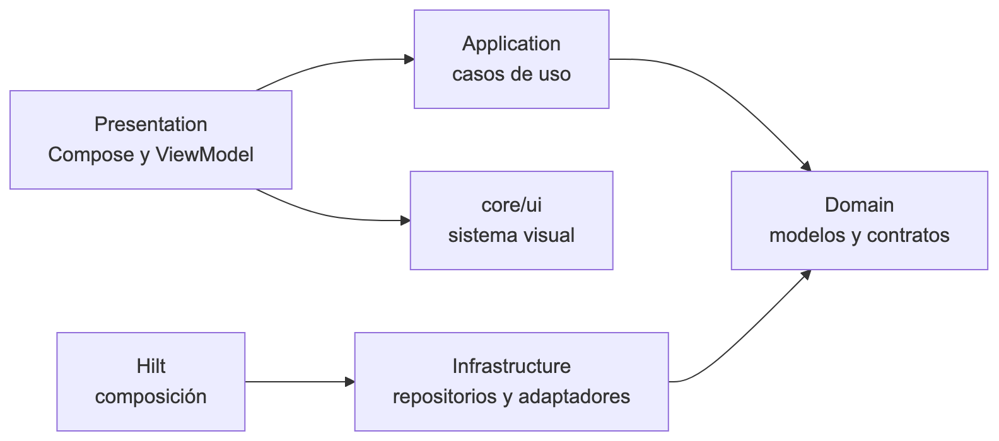</div>

<p><strong><em>Nota.</em></strong> Las flechas indican la dirección de la dependencia en el código fuente. Hilt enlaza contratos con implementaciones desde <code>infrastructure/di</code>. Elaboración propia.</p>

Los eventos de dominio se modelan como clases Kotlin selladas (`sealed interface`) con nombre en inglés y en pasado, en correspondencia 1:1 con los eventos canónicos del Event Storming (por ejemplo, Producto registrado se implementa como `ProductRegistered`). El agregado los acumula al ejecutar una operación y el caso de uso los entrega a sus event handlers en el mismo proceso, sin un bus de eventos local. La propagación hacia otros contextos se realiza a través de contratos explícitos y del servicio compartido. Cada contexto presenta, en el mismo orden, su propósito, las cinco capas, el diagrama de componentes y los diagramas de código (clases del dominio y base de datos local).

### 2.6.1. Bounded Context: IAM

El bounded context **IAM (Identity and Access Management)** administra la identidad y el acceso de las personas que usan SafeFlow. Gestiona la creación de cuenta (US-30), el inicio de sesión (US-31), el cierre de sesión (US-42) y la definición de las operaciones permitidas a cada rol (US-18). Es el contexto upstream del resto: publica el rol y los permisos de la sesión mediante un Open Host Service con Published Language, y los demás contextos los consumen como Conformist.

Reglas de negocio clave:

- Los roles son ADMIN, OPERADOR y SUPERVISOR; VISITANTE y USUARIO AUTENTICADO son estados de acceso, no roles.
- Un correo identifica una única cuenta; una contraseña que no cumple las condiciones de seguridad no crea la cuenta.
- Tras alcanzar el límite de intentos fallidos, la cuenta queda bloqueada temporalmente y rechaza nuevos intentos hasta que venza el bloqueo.
- Una sesión cerrada o expirada no permite operaciones protegidas: la persona vuelve al estado VISITANTE.
- Solo ADMIN configura las operaciones permitidas a OPERADOR y SUPERVISOR; esta administración es inherente a ADMIN y no se puede delegar ni retirar.
- Las credenciales no se guardan en texto plano: la contraseña no se persiste en el dispositivo y los tokens de sesión se conservan cifrados en DataStore.

#### 2.6.1.1. Domain Layer

La Domain Layer de IAM concentra las reglas de identidad y autorización que la aplicación puede validar sin conocer Android ni el servicio remoto. Las clases del dominio se agrupan en entidades y objetos de valor (<strong>Tabla 42</strong>), servicios, factories y repositorios (<strong>Tabla 43</strong>) y eventos de dominio (<strong>Tabla 44</strong>).

<p><strong>Tabla 42.</strong> <em>Entidades, agregados y objetos de valor de IAM</em></p>

| Elemento | Categoría | Propósito | Atributos principales |
|---|---|---|---|
| `Account` | Aggregate Root | Representa la cuenta de una persona con su rol, estado y control de bloqueo. | `id: AccountId`, `email: Email`, `displayName`, `role: Role`, `status: AccountStatus`, `failedAttempts`, `lockedUntil` |
| `Session` | Aggregate Root | Representa la sesión autenticada y su vigencia. | `id`, `accountId: AccountId`, `role: Role`, `expiresAt`, `closedAt` |
| `RolePermissions` | Aggregate Root | Define las operaciones de negocio permitidas a un rol. | `role: Role`, `allowed: Set<Operation>` |
| `AccountId` | Value Object | Identifica de forma única a una cuenta. | `value: String` |
| `Email` | Value Object | Valida el formato del correo usado como credencial. | `value: String` |
| `Password` | Value Object | Valida las condiciones de seguridad de la contraseña; no se persiste. | `value: CharArray` |
| `Role` | Value Object (enum) | Rol de negocio de la cuenta. | `ADMIN`, `OPERADOR`, `SUPERVISOR` |
| `AccountStatus` | Value Object (enum) | Estado de la cuenta. | `PENDING_VERIFICATION`, `ACTIVE`, `LOCKED` |
| `Operation` | Value Object (enum) | Operación de negocio sujeta a permiso (por ejemplo, registrar producto o registrar despacho). | `code` |

<p><strong><em>Nota.</em></strong> La administración de permisos no es un valor de <code>Operation</code>: es una capacidad inherente de ADMIN que no se puede asignar a otros roles. Elaboración propia.</p>

<p><strong>Tabla 43.</strong> <em>Servicios, factories y repositorios del dominio de IAM</em></p>

| Elemento | Categoría | Propósito | Operaciones principales |
|---|---|---|---|
| `AuthorizationService` | Domain Service | Decide si una sesión vigente puede ejecutar una operación según los permisos de su rol. | `isAllowed(session, policy, operation)` |
| `AccountFactory` | Factory | Crea una cuenta nueva validando correo y contraseña. | `create(email, password, displayName)` |
| `SessionFactory` | Factory | Abre una sesión para una cuenta activa con su vigencia. | `open(account, expiresAt)` |
| `AccountRepository` | Repository (interfaz) | Contrato de persistencia de cuentas. | `findByEmail`, `save` |
| `SessionRepository` | Repository (interfaz) | Contrato de la sesión conservada en el dispositivo. | `current`, `save`, `clear` |
| `RolePermissionsRepository` | Repository (interfaz) | Contrato de lectura y actualización de permisos por rol. | `get(role)`, `update(policy)` |

<p><strong><em>Nota.</em></strong> Los repositorios son interfaces del dominio; sus implementaciones viven en Infrastructure. Elaboración propia.</p>

<p><strong>Tabla 44.</strong> <em>Eventos de dominio de IAM</em></p>

| Evento (Event Storming) | Clase Kotlin | Se produce cuando | Datos principales |
|---|---|---|---|
| Cuenta creada | `AccountCreated` | Se crea una cuenta válida | `accountId`, `email`, `role` |
| Sesión iniciada | `SessionStarted` | Las credenciales son válidas y la cuenta no está bloqueada | `sessionId`, `accountId`, `role`, `expiresAt` |
| Sesión cerrada | `SessionEnded` | La persona cierra la sesión o esta expira | `sessionId`, `reason` |
| Acceso denegado | `AccessDenied` | Hay credenciales incorrectas, cuenta bloqueada u operación no permitida | `accountId?`, `reason`, `operation?` |
| Permisos de rol actualizados | `RolePermissionsUpdated` | ADMIN guarda nuevos permisos de un rol | `role`, `allowed`, `updatedBy` |

<p><strong><em>Nota.</em></strong> Cada evento corresponde 1:1 con el evento canónico del mismo nombre en el Event Storming. Elaboración propia.</p>

Invariantes del dominio:

- `Email` debe tener un formato válido y `Password` debe cumplir las condiciones mínimas de seguridad; en caso contrario `AccountFactory` no crea la cuenta.
- `Account.failedAttempts` se reinicia con un inicio de sesión correcto y, al alcanzar el límite permitido, fija `lockedUntil`; mientras `lockedUntil` sea posterior al instante actual la cuenta no puede iniciar sesión.
- `Session` está activa solo si no tiene `closedAt` y `expiresAt` es posterior al instante actual.
- `RolePermissions` solo puede modificarlo un actor con rol `ADMIN` y nunca incluye la administración de permisos.

#### 2.6.1.2. Interface Layer

En una aplicación Android la Interface Layer se implementa como Presentation Layer: en lugar de controllers REST, las pantallas Compose reciben la interacción del usuario, los ViewModels la convierten en llamadas a casos de uso y el resultado se publica como `UiState` mediante `StateFlow`, que Compose consume con `collectAsStateWithLifecycle()`. La capa no contiene reglas de negocio ni instancia Retrofit o Room. La <strong>Tabla 45</strong> lista sus componentes.

<p><strong>Tabla 45.</strong> <em>Componentes de presentación de IAM</em></p>

| Componente | Tipo | Responsabilidad | Historia |
|---|---|---|---|
| `CreateAccountScreen` | Pantalla Compose | Captura datos de la cuenta y muestra errores de validación o correo repetido. | US-30 |
| `CreateAccountViewModel` | ViewModel | Valida el formulario, invoca `CreateAccountUseCase` y expone `CreateAccountUiState`. | US-30 |
| `SignInScreen` | Pantalla Compose | Captura credenciales y muestra credenciales incorrectas o bloqueo temporal. | US-31 |
| `SignInViewModel` | ViewModel | Invoca `SignInUseCase` y expone `SignInUiState` con `StateFlow`. | US-31 |
| `PermissionsByRoleScreen` | Pantalla Compose | Muestra y edita las operaciones permitidas a OPERADOR y SUPERVISOR; solo accesible para ADMIN. | US-18 |
| `PermissionsViewModel` | ViewModel | Carga y guarda los permisos por rol mediante sus casos de uso. | US-18 |
| `SessionViewModel` | ViewModel de alcance de aplicación | Mantiene `SessionState` (visitante, autenticado con rol y permisos, expirada) y gestiona el cierre de sesión. | US-31, US-42 |
| `SignOutDialog` | Componente Compose | Solicita confirmación y dispara el cierre de sesión desde el menú de cuenta. | US-42 |

<p><strong><em>Nota.</em></strong> Las pantallas reutilizan los componentes genéricos de <code>core/ui</code>, como <code>SafeFlowTextField</code> y <code>SafeFlowButton</code>. Elaboración propia.</p>

#### 2.6.1.3. Application Layer

La Application Layer coordina los flujos de IAM. Cada caso de uso es una clase con `suspend operator fun invoke()`, depende únicamente de contratos del dominio y devuelve un resultado que el ViewModel transforma en estado. La <strong>Tabla 46</strong> relaciona cada elemento con su tipo y la historia que atiende.

<p><strong>Tabla 46.</strong> <em>Casos de uso y handlers de IAM</em></p>

| Nombre | Tipo | Responsabilidad | Historia |
|---|---|---|---|
| `CreateAccountUseCase` | Command | Crear cuenta: valida datos, rechaza correo ya registrado y publica `AccountCreated`. | US-30 |
| `SignInUseCase` | Command | Iniciar sesión: verifica credenciales y bloqueo, abre la sesión y guarda los tokens cifrados. | US-31 |
| `SignOutUseCase` | Command | Cerrar sesión: invalida la sesión en el servicio y borra la local. | US-42 |
| `UpdateRolePermissionsUseCase` | Command | Actualizar permisos de un rol; rechaza al actor que no es ADMIN. | US-18 |
| `GetCurrentSessionUseCase` | Query | Obtener la sesión vigente y su estado de acceso. | US-31, US-42 |
| `GetRolePermissionsUseCase` | Query | Obtener las operaciones permitidas de un rol. | US-18 |
| `CheckPermissionUseCase` | Query | Comprobar si la sesión puede ejecutar una operación; lo consumen los demás contextos como Conformist. | US-18 |
| `SessionExpiredHandler` | Event handler | Al detectar sesión expirada o cerrada, limpia datos de sesión y lleva a VISITANTE. | US-42 |
| `AccessDeniedHandler` | Event handler | Registra el acceso denegado y habilita el mensaje al usuario. | US-31 |
| `RolePermissionsUpdatedHandler` | Event handler | Refresca la caché local de permisos tras una actualización. | US-18 |

<p><strong><em>Nota.</em></strong> Los event handlers se invocan en el mismo proceso desde el caso de uso que produjo el evento. Elaboración propia.</p>

#### 2.6.1.4. Infrastructure Layer

La Infrastructure Layer implementa los repositorios del dominio, consume el servicio compartido y conserva el estado local. Los DTO de Retrofit se transforman en modelos del dominio mediante mappers y nunca llegan a presentación. La sesión (tokens y expiración) se guarda en DataStore con cifrado y las credenciales en texto plano no se persisten; la caché de permisos usa Room, de modo que el último estado conocido sigue disponible sin conexión. La <strong>Tabla 47</strong> detalla estos componentes.

<p><strong>Tabla 47.</strong> <em>Componentes de infraestructura de IAM</em></p>

| Componente | Tipo | Responsabilidad |
|---|---|---|
| `AuthApiService` | Retrofit service | Define las llamadas HTTPS de registro, inicio y cierre de sesión y de permisos por rol. |
| `SignInRequestDto`, `SessionDto`, `AccountDto`, `RolePermissionsDto` | DTO (Gson) | Transportan los datos del servicio; `SignInRequestDto` no se almacena. |
| `EncryptedSessionDataSource` | DataStore | Guarda el token de acceso, el token de renovación y la expiración cifrados con una clave del Android Keystore. |
| `RolePermissionEntity`, `LocalAccountEntity`, `LockoutStateEntity` | Entidades Room | Persisten la caché de permisos, el perfil de la cuenta autenticada y el estado de bloqueo. |
| `RolePermissionDao`, `LocalAccountDao`, `LockoutStateDao` | DAO Room | Consultas y escrituras locales. |
| `IamMapper` | Mapper | Convierte DTO y entidades en `Account`, `Session` y `RolePermissions`. |
| `AccountRepositoryImpl`, `SessionRepositoryImpl`, `RolePermissionsRepositoryImpl` | Repository implementation | Implementan los contratos del dominio combinando servicio, Room y DataStore. |
| `IamNetworkModule`, `IamStorageModule`, `IamRepositoryModule` | Módulos Hilt | Proveen Retrofit, Room y DataStore y enlazan contratos con implementaciones. |

<p><strong><em>Nota.</em></strong> Los nombres de la capa corresponden al paquete <code>features/iam/infrastructure</code> (<code>remote</code>, <code>local</code>, <code>repository</code> y <code>di</code>). Elaboración propia.</p>

#### 2.6.1.5. Component Level Diagrams

El Component Diagram de IAM descompone el contenedor de la aplicación móvil en los componentes del contexto. La <strong>Figura 26</strong> muestra cómo las pantallas y ViewModels invocan los casos de uso, cómo estos usan los contratos y servicios del dominio y cómo la infraestructura implementa esos contratos con el servicio compartido, DataStore y Room. Su propósito es evidenciar que las dependencias apuntan hacia el dominio.

<p><strong>Figura 26.</strong> <em>Diagrama de componentes del bounded context IAM</em></p>

<div align="center">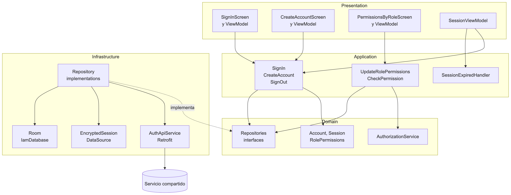</div>

<p><strong><em>Nota.</em></strong> Las flechas continuas indican uso; la flecha punteada indica implementación de un contrato del dominio. Elaboración propia.</p>

#### 2.6.1.6. Code Level Diagrams

El nivel de código de IAM presenta el modelo de clases del dominio y la base de datos local que respalda la sesión y la caché de permisos.

##### 2.6.1.6.1. Domain Layer Class Diagrams

La <strong>Figura 27</strong> presenta las clases del Domain Layer de IAM con sus atributos, métodos, visibilidad y relaciones nombradas con multiplicidad. Su propósito es mostrar que `Account`, `Session` y `RolePermissions` son los agregados y que el control de permisos depende del rol y de la operación.

<p><strong>Figura 27.</strong> <em>Diagrama de clases del dominio de IAM</em></p>

<div align="center">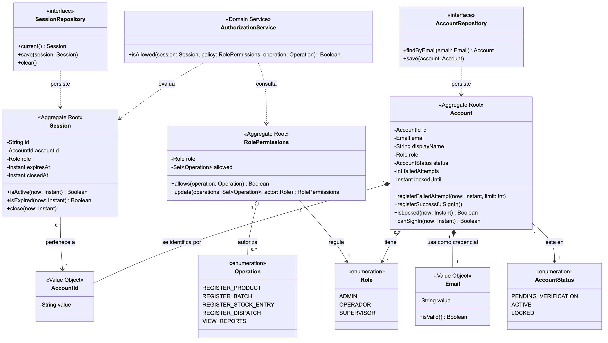</div>

<p><strong><em>Nota.</em></strong> Visibilidad: <code>+</code> público y <code>-</code> privado. Los valores de <code>Operation</code> son ilustrativos; el conjunto completo corresponde a las operaciones de negocio de los demás contextos. Elaboración propia.</p>

La <strong>Tabla 48</strong> es el diccionario de las clases de la figura anterior.

<p><strong>Tabla 48.</strong> <em>Diccionario de clases del dominio de IAM</em></p>

| Clase | Propósito | Atributos | Métodos | Relaciones |
|---|---|---|---|---|
| `Account` | Cuenta de una persona con rol, estado y bloqueo temporal. | `id`, `email`, `displayName`, `role`, `status`, `failedAttempts`, `lockedUntil` | `registerFailedAttempt`, `registerSuccessfulSignIn`, `isLocked`, `canSignIn` | Compone `AccountId` y `Email`; asocia `Role` y `AccountStatus` |
| `AccountId` | Identificador único de cuenta. | `value` | Ninguno | Compuesto en `Account`; referenciado por `Session` |
| `Email` | Correo válido usado como credencial. | `value` | `isValid` | Compuesto en `Account` |
| `Role` | Rol de negocio. | `ADMIN`, `OPERADOR`, `SUPERVISOR` | Ninguno | Asociado a `Account`, `Session` y `RolePermissions` |
| `AccountStatus` | Estado de la cuenta. | `PENDING_VERIFICATION`, `ACTIVE`, `LOCKED` | Ninguno | Asociado a `Account` |
| `Session` | Sesión autenticada con vigencia. | `id`, `accountId`, `role`, `expiresAt`, `closedAt` | `isActive`, `isExpired`, `close` | Pertenece a un `AccountId` |
| `RolePermissions` | Operaciones permitidas a un rol. | `role`, `allowed` | `allows`, `update` | Regula un `Role`; agrega `Operation` |
| `Operation` | Operación de negocio sujeta a permiso. | Valores enumerados | Ninguno | Agregada en `RolePermissions` |
| `AuthorizationService` | Decide el acceso a una operación. | Ninguno | `isAllowed` | Usa `Session` y `RolePermissions` |
| `AccountRepository` | Contrato de persistencia de cuentas. | Ninguno | `findByEmail`, `save` | Persiste `Account` |
| `SessionRepository` | Contrato de la sesión del dispositivo. | Ninguno | `current`, `save`, `clear` | Persiste `Session` |

<p><strong><em>Nota.</em></strong> Los demás elementos del dominio (<code>Password</code>, <code>AccountFactory</code>, <code>SessionFactory</code>, <code>RolePermissionsRepository</code> y los eventos) se describen en las tablas de la sección 2.6.1.1. Elaboración propia.</p>

##### 2.6.1.6.2. Database Design Diagram

La base local de IAM, definida con Room, guarda únicamente lo necesario para operar sin conexión: el catálogo de roles, la caché de permisos por rol, el perfil de la cuenta autenticada y el estado de bloqueo por correo. Los tokens de sesión no están en Room: se conservan cifrados en DataStore, y la contraseña nunca se almacena. La <strong>Figura 28</strong> muestra las tablas, claves y relaciones.

<p><strong>Figura 28.</strong> <em>Diagrama de base de datos local de IAM</em></p>

<div align="center">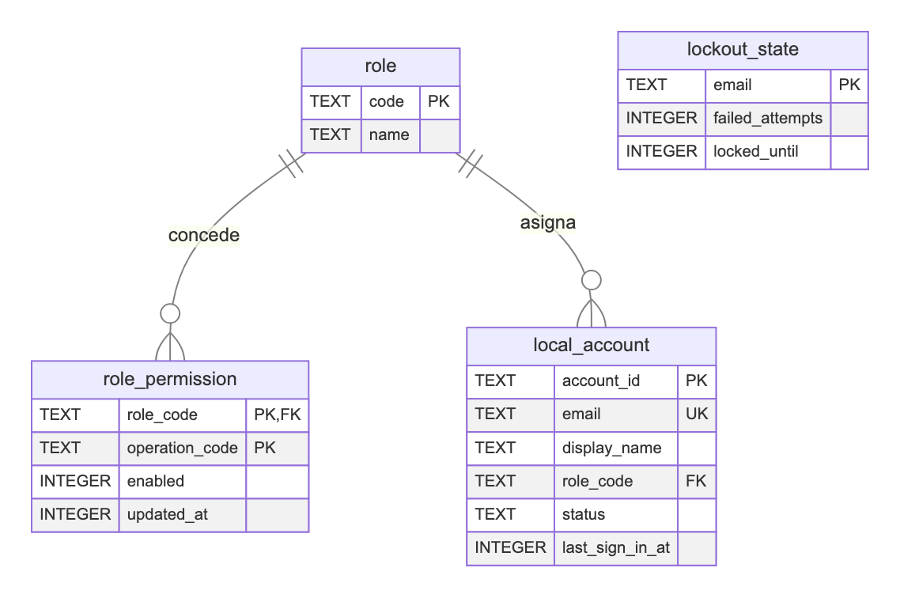</div>

<p><strong><em>Nota.</em></strong> Tipos de Room: <code>TEXT</code> e <code>INTEGER</code> (instantes como milisegundos desde época). <code>lockout_state</code> se asocia por correo, sin clave foránea, porque el bloqueo aplica también a correos no registrados en el dispositivo. Elaboración propia.</p>

### 2.6.2. Bounded Context: Inventory

El bounded context **Inventory** administra los datos maestros del inventario: productos con su rango térmico, lotes y stock. Atiende el registro de productos (US-01), el registro de ingresos de stock (US-02), la consulta del inventario con su estado (US-10) y el registro de lotes vinculados a su producto (US-19). Inventory es proveedor (Customer/Supplier) de Monitoring, que consulta el rango térmico del producto, y de Logistics, que consume productos, lotes y stock disponible; además consume de IAM los permisos de la sesión como Conformist.

Reglas de negocio clave:

- Todo producto se registra con nombre y un rango térmico cuya temperatura mínima es menor que la máxima; un rango invertido se rechaza.
- Un lote tiene una identificación obligatoria y única, y siempre está vinculado a un producto existente; no se puede registrar dos veces.
- Un ingreso de stock requiere un producto existente y una cantidad mayor que cero.
- El estado del producto (normal, en atención o en riesgo) se muestra en la consulta, pero Inventory no lo calcula: lo determina Environmental Monitoring.
- Solo el rol OPERADOR con el permiso correspondiente registra productos, lotes e ingresos.

#### 2.6.2.1. Domain Layer

El dominio de Inventory modela el catálogo de productos y su stock. Las clases se agrupan en entidades y objetos de valor (<strong>Tabla 49</strong>), servicios, factories y repositorios (<strong>Tabla 50</strong>) y eventos (<strong>Tabla 51</strong>).

<p><strong>Tabla 49.</strong> <em>Entidades, agregados y objetos de valor de Inventory</em></p>

| Elemento | Categoría | Propósito | Atributos principales |
|---|---|---|---|
| `Product` | Aggregate Root | Producto farmacéutico o alimenticio con su rango térmico. | `id: ProductId`, `name`, `thermalRange: ThermalRange`, `status: ProductStatus` |
| `Batch` | Aggregate Root | Lote identificado de forma única y ligado a un producto. | `code: BatchCode`, `productId: ProductId`, `registeredAt` |
| `Stock` | Aggregate Root | Cantidad disponible de un producto y sus ingresos. | `productId`, `available: Quantity`, `entries: List<StockEntry>` |
| `StockEntry` | Entity | Ingreso de unidades registrado sobre el stock. | `id`, `quantity: Quantity`, `registeredAt` |
| `ProductId` | Value Object | Identifica un producto. | `value: String` |
| `BatchCode` | Value Object | Identificación única del lote; no vacía. | `value: String` |
| `ThermalRange` | Value Object | Rango de conservación en grados Celsius. | `min`, `max` |
| `Quantity` | Value Object | Cantidad de unidades; positiva al ingresar. | `value: Int` |
| `ProductStatus` | Value Object (enum) | Estado de conservación informado por Monitoring. | `NORMAL`, `ATTENTION`, `AT_RISK` |

<p><strong><em>Nota.</em></strong> Elaboración propia a partir de las reglas del contexto.</p>

<p><strong>Tabla 50.</strong> <em>Servicios, factories y repositorios del dominio de Inventory</em></p>

| Elemento | Categoría | Propósito | Operaciones principales |
|---|---|---|---|
| `BatchUniquenessChecker` | Domain Service | Verifica que la identificación del lote no exista antes de registrarlo. | `isAvailable(code)` |
| `ProductFactory` | Factory | Crea un producto validando nombre y rango térmico (min menor que max). | `create(name, min, max)` |
| `BatchFactory` | Factory | Crea un lote validando identificación y producto. | `create(code, productId)` |
| `ProductRepository` | Repository (interfaz) | Persistencia y consulta de productos, con filtro por estado. | `save`, `findById`, `findAll(status?)` |
| `BatchRepository` | Repository (interfaz) | Persistencia y búsqueda de lotes. | `save`, `existsByCode`, `findByProduct` |
| `StockRepository` | Repository (interfaz) | Persistencia del stock y sus ingresos. | `save`, `findByProduct` |

<p><strong><em>Nota.</em></strong> Las implementaciones de los repositorios pertenecen a Infrastructure. Elaboración propia.</p>

<p><strong>Tabla 51.</strong> <em>Eventos de dominio de Inventory</em></p>

| Evento (Event Storming) | Clase Kotlin | Se produce cuando | Datos principales |
|---|---|---|---|
| Producto registrado | `ProductRegistered` | Se guarda un producto con rango válido | `productId`, `name`, `min`, `max` |
| Lote registrado | `BatchRegistered` | Se guarda un lote vinculado a un producto | `batchCode`, `productId` |
| Ingreso de stock registrado | `StockEntryRegistered` | Se registra un ingreso con cantidad positiva | `productId`, `quantity`, `registeredAt` |
| Stock actualizado | `StockUpdated` | Cambia la cantidad disponible tras un ingreso | `productId`, `available` |

<p><strong><em>Nota.</em></strong> Correspondencia 1:1 con los eventos canónicos del Event Storming. Elaboración propia.</p>

Invariantes del dominio: `ThermalRange.min` es menor que `ThermalRange.max`; `BatchCode` no es vacío ni repetido; `Quantity` es mayor que cero en cada ingreso; todo `Batch` referencia un `Product` existente.

#### 2.6.2.2. Interface Layer

La presentación de Inventory sigue el mismo esquema que el resto de contextos: pantallas Compose, ViewModels y estado con `StateFlow`, sin acceso directo a Retrofit ni Room. Reutiliza `SafeFlowListCard`, `SafeFlowChip` y `SafeFlowTextField` de `core/ui`, y adapta el listado a celular y tableta. La <strong>Tabla 52</strong> enumera sus componentes.

<p><strong>Tabla 52.</strong> <em>Componentes de presentación de Inventory</em></p>

| Componente | Tipo | Responsabilidad | Historia |
|---|---|---|---|
| `RegisterProductScreen` | Pantalla Compose | Formulario de nombre y rango térmico, con mensajes de datos faltantes o rango invertido. | US-01 |
| `RegisterProductViewModel` | ViewModel | Valida y llama a `RegisterProductUseCase`; expone `RegisterProductUiState`. | US-01 |
| `RegisterStockEntryScreen` | Pantalla Compose | Formulario de producto y cantidad; informa cantidad inválida. | US-02 |
| `RegisterStockEntryViewModel` | ViewModel | Llama a `RegisterStockEntryUseCase` y actualiza el estado. | US-02 |
| `InventoryScreen` | Pantalla Compose | Lista productos con cantidad, estado y rango; filtro por estado; vista adaptada a tableta. | US-10 |
| `InventoryViewModel` | ViewModel | Obtiene el inventario y el filtro mediante `GetInventoryUseCase`; expone `InventoryUiState`. | US-10 |
| `ProductDetailScreen` | Pantalla Compose | Muestra el producto, sus lotes y su stock. | US-10, US-19 |
| `RegisterBatchScreen` | Pantalla Compose | Formulario de identificación de lote y producto asociado. | US-19 |
| `RegisterBatchViewModel` | ViewModel | Llama a `RegisterBatchUseCase` y expone el resultado, incluido el lote repetido. | US-19 |

<p><strong><em>Nota.</em></strong> Las pantallas están diseñadas en los mockups de inventario, registro de producto, registro de lote, ingreso de stock y detalle de producto. Elaboración propia.</p>

#### 2.6.2.3. Application Layer

Los casos de uso de Inventory validan el permiso de la sesión consultando el contrato de IAM, aplican las reglas mediante las factories y guardan los resultados en los repositorios. La <strong>Tabla 53</strong> los resume.

<p><strong>Tabla 53.</strong> <em>Casos de uso y handlers de Inventory</em></p>

| Nombre | Tipo | Responsabilidad | Historia |
|---|---|---|---|
| `RegisterProductUseCase` | Command | Registrar producto con su rango térmico y publicar `ProductRegistered`. | US-01 |
| `RegisterBatchUseCase` | Command | Registrar lote vinculado a un producto, rechazando identificación faltante o repetida. | US-19 |
| `RegisterStockEntryUseCase` | Command | Registrar ingreso de stock y publicar `StockEntryRegistered` y `StockUpdated`. | US-02 |
| `GetInventoryUseCase` | Query | Consultar productos con cantidad, estado y rango, con filtro opcional por estado. | US-10 |
| `GetProductDetailUseCase` | Query | Consultar un producto con sus lotes y stock. | US-10, US-19 |
| `GetProductThermalRangeUseCase` | Query | Publicar el rango térmico de un producto para Monitoring (contrato Customer/Supplier). | US-01, US-03 |
| `StockUpdatedHandler` | Event handler | Refresca el inventario consultado tras un cambio de stock. | US-02, US-10 |
| `ProductRegisteredHandler` | Event handler | Sincroniza el producto nuevo con el servicio compartido. | US-01 |

<p><strong><em>Nota.</em></strong> Monitoring y Logistics consumen resultados de application, no repositorios ni DTO de Inventory. Elaboración propia.</p>

#### 2.6.2.4. Infrastructure Layer

La infraestructura de Inventory consume el servicio compartido y conserva copia local en Room para mantener el último estado conocido cuando la conectividad es intermitente; los ingresos creados sin conexión quedan marcados como pendientes de sincronización. Los DTO se convierten al dominio con `InventoryMapper`. La <strong>Tabla 54</strong> lista los componentes.

<p><strong>Tabla 54.</strong> <em>Componentes de infraestructura de Inventory</em></p>

| Componente | Tipo | Responsabilidad |
|---|---|---|
| `InventoryApiService` | Retrofit service | Llamadas HTTPS para registrar y consultar productos, lotes e ingresos. |
| `ProductDto`, `BatchDto`, `StockEntryDto` | DTO (Gson) | Datos transportados desde y hacia el servicio compartido. |
| `ProductEntity`, `BatchEntity`, `StockEntity`, `StockEntryEntity` | Entidades Room | Copia local de productos, lotes, stock e ingresos. |
| `ProductDao`, `BatchDao`, `StockDao` | DAO Room | Consultas locales, incluido el filtro por estado. |
| `InventoryMapper` | Mapper | Convierte DTO y entidades en `Product`, `Batch` y `Stock`. |
| `ProductRepositoryImpl`, `BatchRepositoryImpl`, `StockRepositoryImpl` | Repository implementation | Implementan los contratos del dominio con servicio y Room. |
| `InventoryNetworkModule`, `InventoryDatabaseModule`, `InventoryRepositoryModule` | Módulos Hilt | Proveen dependencias y enlazan contratos. |

<p><strong><em>Nota.</em></strong> Paquete <code>features/inventory/infrastructure</code>. Elaboración propia.</p>

#### 2.6.2.5. Component Level Diagrams

La <strong>Figura 29</strong> muestra los componentes de Inventory y el flujo entre pantallas, casos de uso, dominio e infraestructura. Su propósito es señalar que el contrato `GetProductThermalRangeUseCase` es el punto por el que Monitoring obtiene el rango térmico sin conocer el almacenamiento de Inventory.

<p><strong>Figura 29.</strong> <em>Diagrama de componentes del bounded context Inventory</em></p>

<div align="center">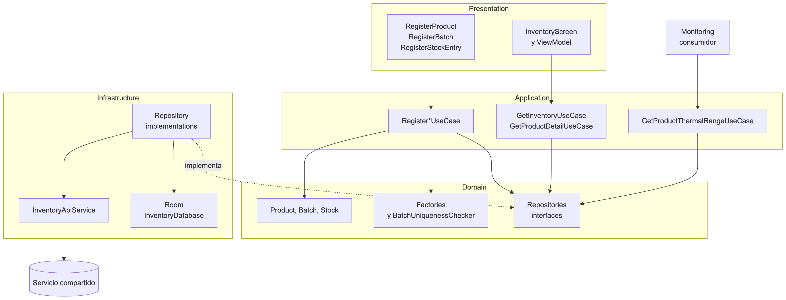</div>

<p><strong><em>Nota.</em></strong> Monitoring consume solo el resultado del caso de uso publicado. Elaboración propia.</p>

#### 2.6.2.6. Code Level Diagrams

##### 2.6.2.6.1. Domain Layer Class Diagrams

La <strong>Figura 30</strong> detalla el modelo de clases del dominio de Inventory. Su propósito es mostrar los tres agregados (`Product`, `Batch` y `Stock`), los objetos de valor que sostienen las invariantes y los contratos de repositorio.

<p><strong>Figura 30.</strong> <em>Diagrama de clases del dominio de Inventory</em></p>

<div align="center">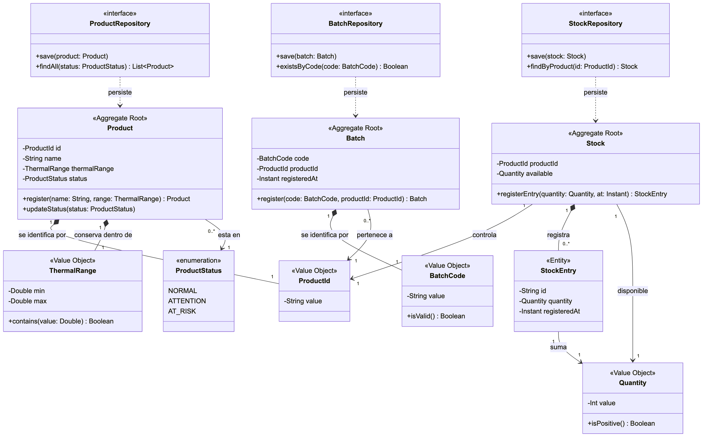</div>

<p><strong><em>Nota.</em></strong> <code>Product</code>, <code>Batch</code> y <code>Stock</code> se relacionan por <code>ProductId</code>, no por referencia directa, para mantener cada agregado independiente. Elaboración propia.</p>

La <strong>Tabla 55</strong> documenta las clases de la figura.

<p><strong>Tabla 55.</strong> <em>Diccionario de clases del dominio de Inventory</em></p>

| Clase | Propósito | Atributos | Métodos | Relaciones |
|---|---|---|---|---|
| `Product` | Producto con rango térmico y estado. | `id`, `name`, `thermalRange`, `status` | `register`, `updateStatus` | Compone `ProductId` y `ThermalRange`; asocia `ProductStatus` |
| `ProductId` | Identificador de producto. | `value` | Ninguno | Usado por `Product`, `Batch` y `Stock` |
| `ThermalRange` | Rango de conservación válido. | `min`, `max` | `contains` | Compuesto en `Product` |
| `ProductStatus` | Estado de conservación. | `NORMAL`, `ATTENTION`, `AT_RISK` | Ninguno | Asociado a `Product` |
| `Batch` | Lote vinculado a un producto. | `code`, `productId`, `registeredAt` | `register` | Compone `BatchCode`; pertenece a un `ProductId` |
| `BatchCode` | Identificación única del lote. | `value` | `isValid` | Compuesto en `Batch` |
| `Stock` | Cantidad disponible y sus ingresos. | `productId`, `available` | `registerEntry` | Compone `StockEntry`; usa `Quantity` |
| `StockEntry` | Ingreso de unidades. | `id`, `quantity`, `registeredAt` | Ninguno | Compuesto en `Stock` |
| `Quantity` | Cantidad de unidades. | `value` | `isPositive` | Usado por `Stock` y `StockEntry` |
| `ProductRepository` | Contrato de productos. | Ninguno | `save`, `findAll` | Persiste `Product` |
| `BatchRepository` | Contrato de lotes. | Ninguno | `save`, `existsByCode` | Persiste `Batch` |
| `StockRepository` | Contrato de stock. | Ninguno | `save`, `findByProduct` | Persiste `Stock` |

<p><strong><em>Nota.</em></strong> Elaboración propia.</p>

##### 2.6.2.6.2. Database Design Diagram

La base local de Inventory conserva productos, lotes, stock e ingresos con sus claves y restricciones. La <strong>Figura 31</strong> muestra que cada lote referencia un producto, que el stock es único por producto y que los ingresos cuelgan del stock; la columna `pending_sync` marca los ingresos registrados sin conexión.

<p><strong>Figura 31.</strong> <em>Diagrama de base de datos local de Inventory</em></p>

<div align="center">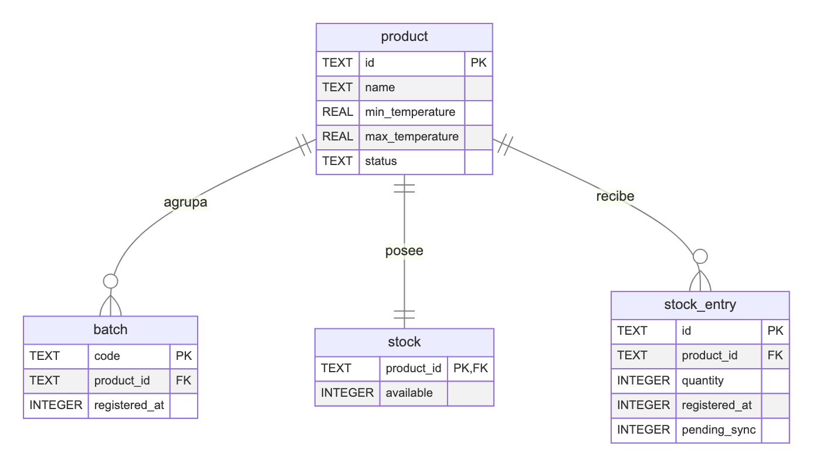</div>

<p><strong><em>Nota.</em></strong> <code>batch.code</code> es clave primaria y por tanto única. Restricción de Room: <code>min_temperature</code> menor que <code>max_temperature</code> se valida en el dominio antes de persistir. Elaboración propia.</p>

### 2.6.3. Bounded Context: Environmental Monitoring

El bounded context **Environmental Monitoring** (paquete `monitoring`) recibe las mediciones de temperatura, las convierte en lecturas del dominio y evalúa si el producto se mantiene dentro de su rango. Atiende la consulta de la última temperatura y la disponibilidad del sensor (US-03), la consulta de desviaciones térmicas y su nivel de riesgo (US-04), el historial de temperaturas por periodo (US-17), los productos en riesgo con sus antecedentes (US-20) y la obtención automática de mediciones (US-52). Consume el rango térmico de Inventory (Customer/Supplier) y publica excursiones, advertencias y desconexiones hacia Alerts y Logistics. Las mediciones provienen del servicio compartido, alimentado por la aplicación emuladora, y se traducen mediante una Anti-Corruption Layer.

Reglas de negocio clave:

- Una lectura válida tiene un valor numérico, fecha y hora, sensor y estado; una medición sin valor o con valor no numérico se rechaza y queda registrada como rechazada.
- Una temperatura numérica fuera del rango del producto es una excursión térmica válida, no un dato inválido.
- Una lectura dentro del rango, pero a una distancia menor que la tolerancia respecto de un límite, genera una advertencia térmica.
- Un sensor puede estar disponible o desconectado; al desconectarse se conserva la última lectura conocida y, al recuperarse, no se resuelven por sí solas las alertas pendientes.
- El historial puede consultarse por periodo y solo devuelve lecturas de ese intervalo; si no hay registros se informa su ausencia.

#### 2.6.3.1. Domain Layer

El dominio de Monitoring contiene el modelo de lectura, sensor y desviación, y las reglas de evaluación. Se agrupa en entidades y objetos de valor (<strong>Tabla 56</strong>), servicios, factories y repositorios (<strong>Tabla 57</strong>) y eventos (<strong>Tabla 58</strong>).

<p><strong>Tabla 56.</strong> <em>Entidades, agregados y objetos de valor de Monitoring</em></p>

| Elemento | Categoría | Propósito | Atributos principales |
|---|---|---|---|
| `Sensor` | Aggregate Root | Sensor asociado a un producto, con disponibilidad y última lectura. | `id: SensorId`, `productId`, `availability: SensorAvailability`, `lastReadingAt` |
| `Reading` | Aggregate Root | Lectura válida e inmutable de temperatura. | `id: ReadingId`, `sensorId`, `temperature: Temperature`, `recordedAt`, `status: ThermalStatus` |
| `ThermalAnomaly` | Aggregate Root | Excursión o advertencia detectada, con riesgo y antecedentes. | `id`, `sensorId`, `productId`, `type`, `peak: Temperature`, `detectedAt`, `risk: RiskLevel` |
| `Temperature` | Value Object | Valor numérico finito en grados Celsius. | `celsius: Double` |
| `ThermalRange` | Value Object | Rango del producto recibido de Inventory (solo lectura). | `min`, `max` |
| `WarningTolerance` | Value Object | Margen en grados respecto de los límites que activa la advertencia. | `degrees: Double` |
| `TimePeriod` | Value Object | Intervalo de consulta del historial. | `from`, `to` |
| `ThermalStatus` | Value Object (enum) | Resultado de la evaluación de una lectura. | `WITHIN_RANGE`, `WARNING`, `EXCURSION` |
| `SensorAvailability` | Value Object (enum) | Disponibilidad del sensor. | `AVAILABLE`, `DISCONNECTED` |
| `RiskLevel` | Value Object (enum) | Nivel de riesgo del producto. | `LOW`, `MEDIUM`, `HIGH` |
| `RejectionReason` | Value Object (enum) | Motivo de rechazo de una medición. | `MISSING_VALUE`, `NOT_NUMERIC` |

<p><strong><em>Nota.</em></strong> La distinción entre excursión y advertencia es una decisión de diseño: fuera de rango es excursión; dentro del rango pero cercano a un límite es advertencia. Elaboración propia.</p>

<p><strong>Tabla 57.</strong> <em>Servicios, factories y repositorios del dominio de Monitoring</em></p>

| Elemento | Categoría | Propósito | Operaciones principales |
|---|---|---|---|
| `ThermalDeviationEvaluator` | Domain Service | Evalúa una lectura contra el rango y la tolerancia y determina excursión, advertencia o normalidad. | `evaluate(temperature, range, tolerance)` |
| `ReadingFactory` | Factory | Crea una `Reading` desde una medición cruda; devuelve rechazo si falta el valor o no es numérico. | `create(sensorId, rawValue, recordedAt)` |
| `SensorRepository` | Repository (interfaz) | Persistencia y consulta de sensores. | `findById`, `save` |
| `ReadingRepository` | Repository (interfaz) | Persistencia del historial y consulta por periodo. | `save`, `latest(sensorId)`, `history(sensorId, period)` |
| `ThermalAnomalyRepository` | Repository (interfaz) | Persistencia de anomalías y consulta de productos en riesgo. | `save`, `productsAtRisk`, `byProduct` |
| `ProductThermalRangeProvider` | Contrato de dominio | Obtiene el rango térmico del producto desde Inventory. | `rangeOf(productId)` |

<p><strong><em>Nota.</em></strong> <code>ProductThermalRangeProvider</code> se adapta en Infrastructure sin importar clases internas de Inventory. Elaboración propia.</p>

<p><strong>Tabla 58.</strong> <em>Eventos de dominio de Monitoring</em></p>

| Evento (Event Storming) | Clase Kotlin | Se produce cuando | Datos principales |
|---|---|---|---|
| Lectura registrada | `ReadingRecorded` | Una medición válida se convierte en lectura | `readingId`, `sensorId`, `temperature`, `recordedAt` |
| Lectura rechazada | `ReadingRejected` | La medición carece de valor o no es numérica | `sensorId`, `reason`, `receivedAt` |
| Excursión térmica detectada | `ThermalExcursionDetected` | La lectura está fuera del rango del producto | `anomalyId`, `productId`, `temperature`, `risk` |
| Advertencia térmica detectada | `ThermalWarningDetected` | La lectura está dentro del rango y cerca de un límite | `anomalyId`, `productId`, `temperature` |
| Sensor desconectado | `SensorDisconnected` | El sensor deja de estar disponible | `sensorId`, `lastReadingAt` |
| Sensor recuperado | `SensorRecovered` | El sensor vuelve a estar disponible | `sensorId`, `recoveredAt` |

<p><strong><em>Nota.</em></strong> Correspondencia 1:1 con los eventos canónicos del Event Storming. Alerts y Logistics reaccionan a ellos por contrato. Elaboración propia.</p>

Invariantes del dominio: `Temperature` es finita y numérica; una `Reading` nunca se crea sin sensor ni fecha y hora; una `Reading` evaluada fuera del rango siempre tiene estado `EXCURSION`; una lectura rechazada nunca se incorpora al historial consultable.

#### 2.6.3.2. Interface Layer

La presentación de Monitoring muestra el estado térmico en tiempo casi real y el historial. El gráfico térmico es un composable propio del contexto (`ThermalChart`) que reutiliza los tokens de `core/ui`, de modo que ningún dato de sensor ni regla térmica pasa a `core/ui`. La <strong>Tabla 59</strong> enumera los componentes.

<p><strong>Tabla 59.</strong> <em>Componentes de presentación de Monitoring</em></p>

| Componente | Tipo | Responsabilidad | Historia |
|---|---|---|---|
| `CurrentTemperatureScreen` | Pantalla Compose | Muestra la última temperatura, la hora y la disponibilidad del sensor, con aviso de desconexión. | US-03, US-52 |
| `CurrentTemperatureViewModel` | ViewModel | Observa la última lectura y la disponibilidad; expone `CurrentTemperatureUiState`. | US-03, US-52 |
| `ThermalDeviationsScreen` | Pantalla Compose | Lista las desviaciones y su nivel de riesgo para SUPERVISOR. | US-04 |
| `ThermalHistoryScreen` | Pantalla Compose | Muestra el historial por periodo con temperaturas, fechas, horas y estados. | US-17 |
| `ThermalHistoryViewModel` | ViewModel | Aplica el periodo elegido y expone `ThermalHistoryUiState`. | US-17 |
| `ProductsAtRiskScreen` | Pantalla Compose | Lista productos en riesgo con temperatura actual y antecedentes. | US-20 |
| `ThermalChart` | Componente Compose | Dibuja la serie de lecturas y el rango permitido. | US-17 |

<p><strong><em>Nota.</em></strong> El mockup de historial térmico define el diseño de <code>ThermalHistoryScreen</code>. Elaboración propia.</p>

#### 2.6.3.3. Application Layer

Los casos de uso de Monitoring coordinan la obtención de mediciones, su evaluación y su consulta. `ProcessMeasurementUseCase` es el flujo central: traduce la medición, crea la lectura, la evalúa contra el rango del producto, la guarda y entrega los eventos resultantes a sus handlers. La <strong>Tabla 60</strong> detalla los elementos.

<p><strong>Tabla 60.</strong> <em>Casos de uso y handlers de Monitoring</em></p>

| Nombre | Tipo | Responsabilidad | Historia |
|---|---|---|---|
| `SyncMeasurementsUseCase` | Command | Obtener del servicio compartido las mediciones nuevas y procesarlas una a una. | US-52 |
| `ProcessMeasurementUseCase` | Command | Crear la lectura, evaluar la desviación, guardar y publicar los eventos. | US-52, US-04 |
| `GetLatestReadingUseCase` | Query | Obtener la última lectura conocida de un sensor. | US-03 |
| `ObserveSensorAvailabilityUseCase` | Query | Observar la disponibilidad del sensor como flujo. | US-03 |
| `GetThermalDeviationsUseCase` | Query | Obtener las desviaciones y su nivel de riesgo. | US-04 |
| `GetThermalHistoryUseCase` | Query | Obtener lecturas de un periodo; informa ausencia de registros. | US-17 |
| `GetProductsAtRiskUseCase` | Query | Obtener productos en riesgo, su temperatura actual y sus antecedentes. | US-20 |
| `ThermalExcursionDetectedHandler` | Event handler | Guarda la anomalía y la publica hacia Alerts y Logistics. | US-04, US-20 |
| `ThermalWarningDetectedHandler` | Event handler | Guarda la advertencia y la publica hacia Alerts. | US-04 |
| `ReadingRejectedHandler` | Event handler | Registra la medición rechazada con su motivo. | US-52 |
| `SensorAvailabilityHandler` | Event handler | Actualiza la disponibilidad al producirse `SensorDisconnected` o `SensorRecovered`. | US-03 |

<p><strong><em>Nota.</em></strong> La publicación hacia otros contextos usa contratos explícitos y el servicio compartido, no un bus local. Elaboración propia.</p>

#### 2.6.3.4. Infrastructure Layer

La infraestructura de Monitoring integra el servicio compartido y la aplicación emuladora que lo alimenta. `MeasurementTranslator` es la Anti-Corruption Layer: convierte el `MeasurementDto` externo en una medición cruda del dominio y evita que el formato del servicio condicione el modelo. Room conserva lecturas, sensores, anomalías y mediciones rechazadas para el historial y la auditoría, con integridad de los valores persistidos. La <strong>Tabla 61</strong> lista los componentes.

<p><strong>Tabla 61.</strong> <em>Componentes de infraestructura de Monitoring</em></p>

| Componente | Tipo | Responsabilidad |
|---|---|---|
| `MonitoringApiService` | Retrofit service | Consulta mediciones, estado de sensores, historial y anomalías por HTTPS. |
| `MeasurementDto`, `SensorStatusDto`, `ThermalAnomalyDto` | DTO (Gson) | Datos del servicio compartido; el valor llega como texto para detectar ausencia o no numérico. |
| `MeasurementTranslator` | ACL | Traduce `MeasurementDto` a medición cruda y delega en `ReadingFactory`. |
| `SensorEntity`, `ReadingEntity`, `RejectedReadingEntity`, `AnomalyEntity`, `ProductRangeEntity` | Entidades Room | Persisten sensores, historial, rechazos, anomalías y rango cacheado. |
| `SensorDao`, `ReadingDao`, `AnomalyDao` | DAO Room | Consultas por sensor, periodo y riesgo. |
| `MonitoringMapper` | Mapper | Convierte entidades y DTO en modelos del dominio. |
| `SensorRepositoryImpl`, `ReadingRepositoryImpl`, `ThermalAnomalyRepositoryImpl` | Repository implementation | Implementan los contratos del dominio. |
| `InventoryRangeAdapter` | Adaptador | Implementa `ProductThermalRangeProvider` usando el resultado publicado por Inventory. |
| `MonitoringNetworkModule`, `MonitoringDatabaseModule`, `MonitoringRepositoryModule` | Módulos Hilt | Proveen dependencias y enlazan contratos. |

<p><strong><em>Nota.</em></strong> Paquete <code>features/monitoring/infrastructure</code>. Elaboración propia.</p>

#### 2.6.3.5. Component Level Diagrams

La <strong>Figura 32</strong> muestra los componentes de Monitoring y el recorrido de una medición: del servicio compartido a la ACL, de allí al caso de uso, al dominio y, finalmente, a la persistencia. Su propósito es evidenciar el lugar de la ACL y que Inventory solo aporta el rango térmico.

<p><strong>Figura 32.</strong> <em>Diagrama de componentes del bounded context Environmental Monitoring</em></p>

<div align="center">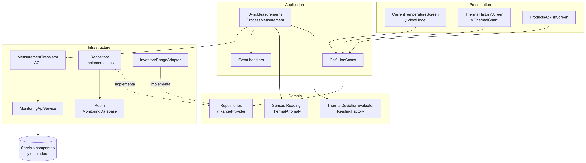</div>

<p><strong><em>Nota.</em></strong> La ACL es la única parte que conoce el formato externo de las mediciones. Elaboración propia.</p>

#### 2.6.3.6. Code Level Diagrams

##### 2.6.3.6.1. Domain Layer Class Diagrams

La <strong>Figura 33</strong> presenta las clases centrales del dominio de Monitoring. Su propósito es mostrar cómo `ThermalDeviationEvaluator` combina `Temperature` y `ThermalRange` para clasificar una `Reading`, y cómo `ReadingFactory` protege el historial de datos inválidos. Las clases restantes (`ThermalAnomalyRepository`, `WarningTolerance`, `TimePeriod` y `RejectionReason`) se describen en las tablas de la sección 2.6.3.1.

<p><strong>Figura 33.</strong> <em>Diagrama de clases del dominio de Environmental Monitoring</em></p>

<div align="center">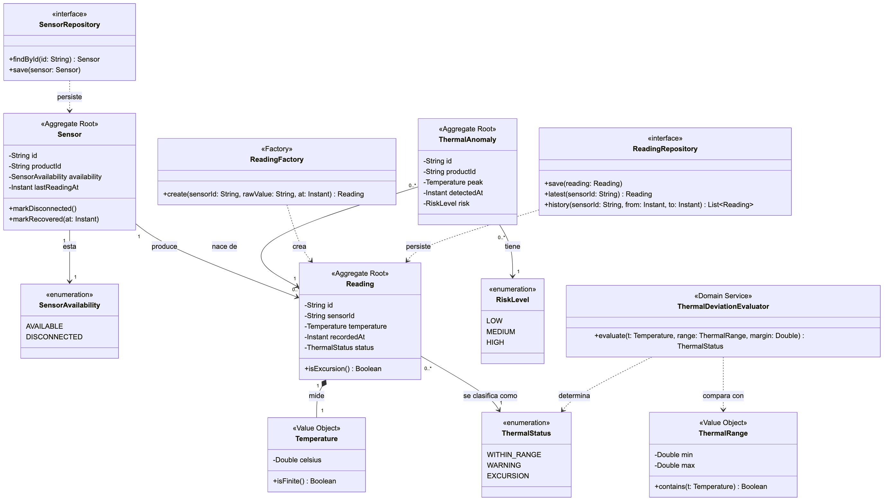</div>

<p><strong><em>Nota.</em></strong> El diagrama se limita a 12 clases para conservar la legibilidad. Elaboración propia.</p>

La <strong>Tabla 62</strong> documenta las clases de la figura.

<p><strong>Tabla 62.</strong> <em>Diccionario de clases del dominio de Monitoring</em></p>

| Clase | Propósito | Atributos | Métodos | Relaciones |
|---|---|---|---|---|
| `Sensor` | Sensor con disponibilidad y última lectura. | `id`, `productId`, `availability`, `lastReadingAt` | `markDisconnected`, `markRecovered` | Produce `Reading`; asocia `SensorAvailability` |
| `SensorAvailability` | Disponibilidad del sensor. | `AVAILABLE`, `DISCONNECTED` | Ninguno | Asociado a `Sensor` |
| `Reading` | Lectura válida e inmutable. | `id`, `sensorId`, `temperature`, `recordedAt`, `status` | `isExcursion` | Compone `Temperature`; asocia `ThermalStatus` |
| `Temperature` | Valor numérico en °C. | `celsius` | `isFinite` | Compuesto en `Reading` |
| `ThermalStatus` | Resultado de la evaluación. | `WITHIN_RANGE`, `WARNING`, `EXCURSION` | Ninguno | Asociado a `Reading` |
| `ThermalRange` | Rango del producto (solo lectura). | `min`, `max` | `contains` | Usado por el evaluador |
| `ThermalAnomaly` | Excursión o advertencia con riesgo. | `id`, `productId`, `peak`, `detectedAt`, `risk` | Ninguno | Nace de `Reading`; asocia `RiskLevel` |
| `RiskLevel` | Nivel de riesgo. | `LOW`, `MEDIUM`, `HIGH` | Ninguno | Asociado a `ThermalAnomaly` |
| `ThermalDeviationEvaluator` | Clasifica una lectura. | Ninguno | `evaluate` | Usa `ThermalRange`; determina `ThermalStatus` |
| `ReadingFactory` | Crea lecturas válidas o rechaza. | Ninguno | `create` | Crea `Reading` |
| `SensorRepository` | Contrato de sensores. | Ninguno | `findById`, `save` | Persiste `Sensor` |
| `ReadingRepository` | Contrato de lecturas e historial. | Ninguno | `save`, `latest`, `history` | Persiste `Reading` |

<p><strong><em>Nota.</em></strong> Elaboración propia.</p>

##### 2.6.3.6.2. Database Design Diagram

La base local de Monitoring guarda el historial de lecturas válidas, las mediciones rechazadas (para auditoría, sin mezclarlas con el historial), las anomalías y una copia del rango térmico del producto. La <strong>Figura 34</strong> muestra las tablas y sus relaciones; el índice por sensor y fecha respalda la consulta por periodo.

<p><strong>Figura 34.</strong> <em>Diagrama de base de datos local de Environmental Monitoring</em></p>

<div align="center">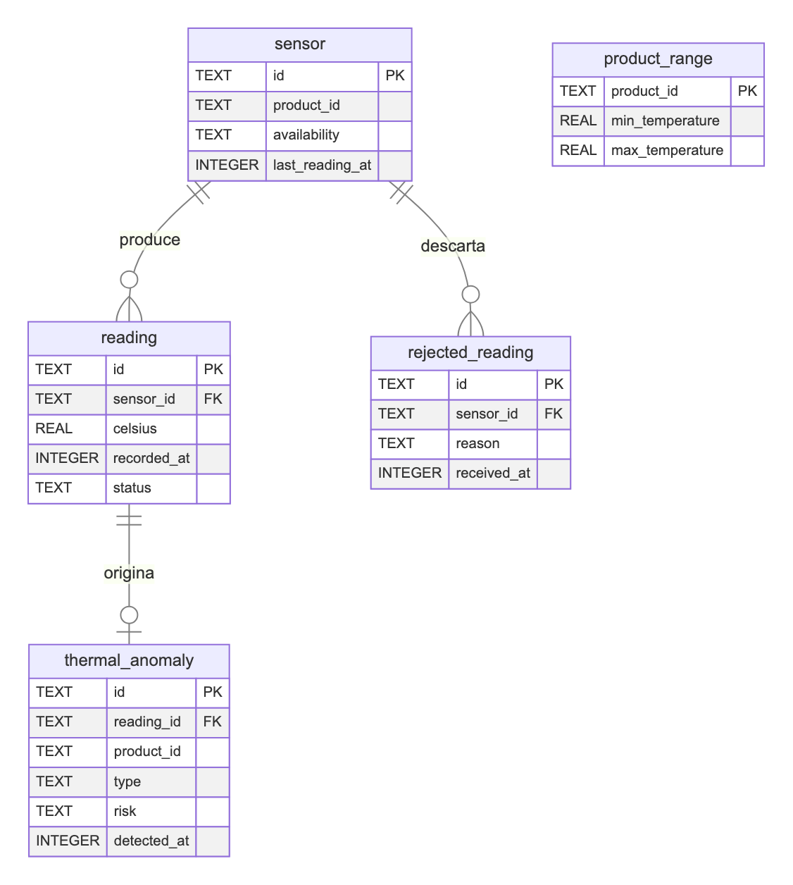</div>

<p><strong><em>Nota.</em></strong> <code>product_range</code> es una copia de solo lectura del rango de Inventory y se relaciona con <code>sensor.product_id</code> sin clave foránea, porque el producto pertenece a otro contexto. Índice sugerido en <code>reading</code> por <code>sensor_id</code> y <code>recorded_at</code>. Elaboración propia.</p>

### 2.6.4 Alerts Bounded Context

Alerts es el contexto que convierte las anomalías térmicas detectadas por Monitoring en incidencias atendibles. Su propósito es generar una alerta única por anomalía, agrupar las repeticiones para evitar avisos innecesarios, avisar en el dispositivo móvil a los usuarios autorizados, permitir al SUPERVISOR priorizar las alertas activas según su severidad y registrar acciones correctivas que resuelven la alerta y conservan su historial. Atiende las historias US-05 (recibir avisos de anomalías térmicas), US-06 (resolver alertas mediante acciones correctivas) y US-55 (consultar alertas activas y distinguir su severidad).

Las reglas de negocio clave son cuatro. Primero, cada anomalía produce una sola alerta con estado activo; las repeticiones de la misma anomalía se agrupan en esa alerta y no generan una nueva. Segundo, la alerta solo se resuelve cuando se registra una acción correctiva con autor, fecha y hora, y descripción. Tercero, la recuperación de un sensor no resuelve automáticamente la alerta: la incidencia sigue activa hasta que exista una acción correctiva. Cuarto, solo los usuarios con permiso reciben avisos y consultan o resuelven alertas; la aplicación representa los permisos recibidos de IAM (Open Host Service) y se conforma a ellos (Conformist), mientras que la autorización definitiva corresponde al servicio compartido.

#### 2.6.4.1 Domain Layer

La capa de dominio de Alerts es Kotlin puro, sin dependencias de Android. Su núcleo es el agregado `Alert`, que protege las reglas de agrupación y resolución. Como muestra la Tabla 63, el contexto distingue una raíz de agregado, una entidad interna, varios objetos de valor, un servicio de dominio, una fábrica y los contratos que el dominio necesita de su entorno.

<p><strong>Tabla 63.</strong> <em>Elementos del Domain Layer de Alerts</em></p>

| Elemento | Categoría | Propósito | Atributos / contrato principal |
|---|---|---|---|
| `Alert` | Aggregate Root / Entity | Incidencia térmica con su estado y su historial de acciones | `id: AlertId`, `anomalyKey: AnomalyKey`, `severity: Severity`, `status: AlertStatus`, `location: Location`, `description: String`, `occurrences: Int`, `firstDetectedAt: Instant`, `lastDetectedAt: Instant`, `actions: List<CorrectiveAction>` |
| `CorrectiveAction` | Entity | Acción registrada para atender una alerta | `id: ActionId`, `authorId: UserId`, `description: String`, `recordedAt: Instant` |
| `AlertId`, `ActionId`, `UserId` | Value Object | Identificadores tipados | `value: String` |
| `AnomalyKey` | Value Object | Identifica la anomalía de origen para agrupar repeticiones | `sensorId: SensorId`, `type: AnomalyType` |
| `AnomalyType` | Value Object (enumeración) | Tipo de anomalía que origina la alerta | `EXCURSION`, `WARNING`, `SENSOR_DISCONNECTED` |
| `Severity` | Value Object (enumeración) | Nivel de riesgo de la alerta | `WARNING`, `CRITICAL` |
| `AlertStatus` | Value Object (enumeración) | Ciclo de vida de la alerta | `ACTIVE`, `RESOLVED` |
| `Location` | Value Object | Ubicación donde ocurre la anomalía | `name: String` |
| `AlertGroupingPolicy` | Domain Service | Decide si una señal de Monitoring crea una alerta o se agrupa en una activa | `register(signal, activeAlert): GroupingDecision` |
| `AlertFactory` | Factory | Crea una alerta activa a partir de una señal válida | `create(signal): Alert` |
| `AlertRepository` | Repository interface | Contrato de persistencia del agregado | `findActiveByKey`, `findById`, `observeActive`, `observeHistory`, `save` |
| `AlertNotifier` | Contrato de dominio (puerto) | Emite el aviso móvil a usuarios autorizados | `notify(alert)` |
| `MonitoringSignalSource` | Contrato de dominio (puerto) | Entrega a Alerts las señales de Monitoring en un modelo propio | `observeSignals(): Flow<MonitoringSignal>` |

<p><strong><em>Nota.</em></strong> Los nombres de clase están en inglés y corresponden al Ubiquitous Language del contexto. Los contratos de dominio se implementan en infraestructura.</p>

Las invariantes del agregado `Alert` son las siguientes.

- Una anomalía identificada por `AnomalyKey` tiene como máximo una alerta con estado `ACTIVE`.
- Una repetición de una anomalía con alerta activa incrementa `occurrences` y actualiza `lastDetectedAt`; no crea otra alerta.
- Una alerta pasa a `RESOLVED` únicamente al registrar una `CorrectiveAction` con autor, fecha y hora, y descripción no vacía.
- Una alerta resuelta no admite nuevas acciones ni vuelve a `ACTIVE`; una nueva ocurrencia de la anomalía genera una alerta distinta.
- El historial de acciones solo crece: no se elimina ni se edita una acción registrada.
- La señal `SensorRecovered` no modifica el estado de ninguna alerta.

Los eventos del contexto se resumen en la Tabla 64. Alerts emite cuatro eventos propios y consume cuatro eventos de Monitoring, que recibe a través del contrato `MonitoringSignalSource` sin importar clases de otro contexto.

<p><strong>Tabla 64.</strong> <em>Eventos de dominio de Alerts</em></p>

| Evento | Clase | Sentido | Condición | Datos principales |
|---|---|---|---|---|
| Alerta generada | `AlertGenerated` | Emitido | Una anomalía sin alerta activa produce una nueva alerta | `alertId`, `severity`, `location`, `detectedAt` |
| Alerta agrupada | `AlertGrouped` | Emitido | Una repetición se suma a una alerta activa | `alertId`, `occurrences`, `lastDetectedAt` |
| Acción correctiva registrada | `CorrectiveActionRecorded` | Emitido | El SUPERVISOR autorizado registra una acción | `alertId`, `authorId`, `recordedAt` |
| Alerta resuelta | `AlertResolved` | Emitido | La acción correctiva cierra la alerta activa | `alertId`, `resolvedAt` |
| Excursión térmica detectada | `ThermalExcursionDetected` | Consumido | Monitoring detecta una temperatura fuera de rango | `sensorId`, `value`, `detectedAt` |
| Advertencia térmica detectada | `ThermalWarningDetected` | Consumido | Monitoring detecta una advertencia | `sensorId`, `value`, `detectedAt` |
| Sensor desconectado | `SensorDisconnected` | Consumido | Monitoring pierde la comunicación con el sensor | `sensorId`, `detectedAt` |
| Sensor recuperado | `SensorRecovered` | Consumido | El sensor vuelve a reportar; no resuelve alertas | `sensorId`, `recoveredAt` |

<p><strong><em>Nota.</em></strong> Los cuatro primeros eventos pertenecen a Alerts; los cuatro últimos son eventos de Monitoring que Alerts consume como Customer del contexto.</p>

#### 2.6.4.2 Interface Layer

En una aplicación Android la capa de interfaz es la capa Presentation: pantallas Compose, ViewModels y estado observable con `StateFlow`, que la interfaz recoge con `collectAsStateWithLifecycle()`. Los ViewModels solo invocan casos de uso; no conocen Retrofit, Room ni repositorios concretos. La Tabla 65 lista los componentes.

<p><strong>Tabla 65.</strong> <em>Componentes de presentación de Alerts</em></p>

| Componente | Tipo | Responsabilidad | Historia |
|---|---|---|---|
| `AlertsScreen` | Compose screen | Lista las alertas activas ordenadas por severidad y permite alternar a su historial | US-55, US-06 |
| `AlertDetailScreen` | Compose screen | Muestra descripción, severidad, fecha, ubicación, ocurrencias y acciones de la incidencia | US-06, US-55 |
| `CorrectiveActionForm` | Composable | Captura la descripción de la acción correctiva y habilita su registro solo a usuarios autorizados | US-06 |
| `AlertSeverityBadge` | Composable | Distingue visualmente `WARNING` y `CRITICAL` con los colores semánticos de `core/ui` | US-55 |
| `AlertsViewModel` | ViewModel | Expone `AlertsUiState` con alertas activas, historial y estados de carga o vacío | US-55, US-05 |
| `AlertDetailViewModel` | ViewModel | Expone el detalle y ejecuta el registro de la acción correctiva | US-06 |
| `AlertsUiState` | Estado de UI | Modela `Loading`, `Content`, `NoActiveAlerts` y `Error` | US-55 |

<p><strong><em>Nota.</em></strong> Las pantallas reutilizan `SafeFlowListCard`, `SafeFlowChip`, `SafeFlowCallout` y `SafeFlowButton` de `core/ui`; no duplican estilos.</p>

#### 2.6.4.3 Application Layer

La capa de aplicación orquesta los flujos de Alerts con casos de uso `suspend operator fun invoke()` y manejadores que reaccionan a los eventos de Monitoring. Como muestra la Tabla 66, los manejadores de eventos delegan en un único caso de uso de generación para que la regla de agrupación viva en un solo lugar.

<p><strong>Tabla 66.</strong> <em>Casos de uso y manejadores de Alerts</em></p>

| Componente | Tipo | Responsabilidad | US |
|---|---|---|---|
| `GenerateAlertUseCase` | Command handler | Crea una alerta única o agrupa la repetición según `AlertGroupingPolicy`; luego solicita el aviso | US-05 |
| `NotifyAuthorizedUsersUseCase` | Command handler | Emite el aviso móvil solo si el usuario de la sesión tiene permiso para recibirlo | US-05 |
| `RecordCorrectiveActionUseCase` | Command handler | Registra la acción con autor y fecha, resuelve la alerta y conserva el historial | US-06 |
| `GetActiveAlertsUseCase` | Query handler | Devuelve las alertas activas ordenadas por severidad | US-55 |
| `GetAlertHistoryUseCase` | Query handler | Devuelve alertas resueltas y sus acciones, incluso sin alertas activas | US-06 |
| `GetAlertDetailUseCase` | Query handler | Devuelve la información de una incidencia para atenderla | US-55, US-06 |
| `ThermalExcursionDetectedHandler` | Event handler | Convierte la excursión en una señal de alerta crítica y delega en `GenerateAlertUseCase` | US-05 |
| `ThermalWarningDetectedHandler` | Event handler | Convierte la advertencia en una señal de alerta de advertencia | US-05 |
| `SensorDisconnectedHandler` | Event handler | Genera la alerta por desconexión del sensor | US-05 |
| `SensorRecoveredHandler` | Event handler | Registra la recuperación sin cambiar el estado de las alertas pendientes | US-06 |

<p><strong><em>Nota.</em></strong> Los casos de uso devuelven resultados con éxito o falla de negocio y preservan la cancelación de corrutinas.</p>

#### 2.6.4.4 Infrastructure Layer

La capa de infraestructura implementa los contratos del dominio y traduce DTO y entidades locales a modelos de dominio. Alerts usa Retrofit para sincronizar con el servicio compartido, Room como caché local para consultar alertas sin conexión y un adaptador de avisos del sistema Android. La Tabla 67 resume las clases.

<p><strong>Tabla 67.</strong> <em>Componentes de infraestructura de Alerts</em></p>

| Componente | Tipo | Responsabilidad |
|---|---|---|
| `AlertRepositoryImpl` | Repository implementation | Implementa `AlertRepository` combinando fuente remota y caché Room |
| `AlertApiService` | Retrofit service | Consulta alertas y registra acciones correctivas en el servicio compartido |
| `AlertDto`, `CorrectiveActionDto` | DTO remoto | Representan la alerta y sus acciones en la comunicación con el servicio |
| `AlertEntity`, `CorrectiveActionEntity` | Room entity | Persisten alerta y acciones en la base local |
| `AlertDao` | Room DAO | Consultas de alertas activas, historial y acciones |
| `AlertMapper` | Mapper | Transforma DTO y entidades en `Alert` y `CorrectiveAction` |
| `AlertNotificationAdapter` | Adaptador de plataforma | Implementa `AlertNotifier` con notificaciones del sistema Android |
| `MonitoringSignalSourceImpl` | Adaptador de eventos | Implementa `MonitoringSignalSource` y traduce los eventos de Monitoring a `MonitoringSignal` |
| `AlertsModule` | Módulo Hilt | Enlaza contratos con implementaciones en `infrastructure/di` |

<p><strong><em>Nota.</em></strong> Los DTO no llegan a la capa de presentación; solo los mappers conocen ambos modelos.</p>

#### 2.6.4.5 Component Level Diagrams

La Figura 35 descompone la aplicación Android en los componentes de Alerts. Su propósito es mostrar que las dependencias apuntan hacia el dominio: presentación consume casos de uso, y la infraestructura implementa los contratos del dominio.

<p><strong>Figura 35.</strong> <em>Diagrama de componentes del bounded context Alerts</em></p>

<div align="center">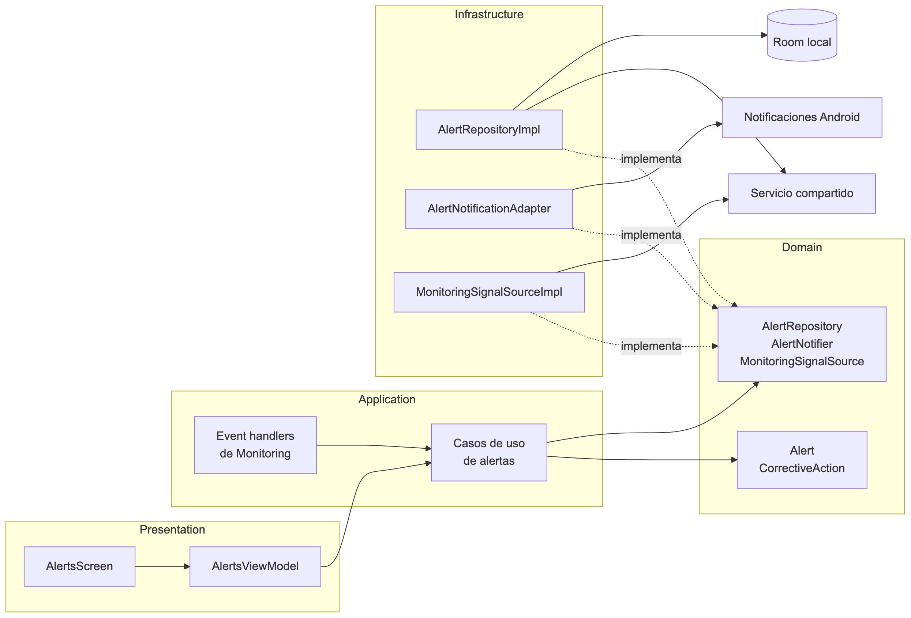</div>

<p><strong><em>Nota.</em></strong> Las flechas continuas indican uso; las punteadas, implementación de un contrato del dominio. El servicio compartido es un sistema externo a la aplicación.</p>

En el diagrama se observa que `AlertsViewModel` y los manejadores de eventos comparten los mismos casos de uso, y que ningún componente de presentación conoce el servicio compartido ni Room. El aviso móvil y la entrada de eventos de Monitoring quedan aislados en adaptadores reemplazables.

#### 2.6.4.6 Code Level Diagrams

##### 2.6.4.6.1 Domain Layer Class Diagrams

La Figura 36 presenta las clases del dominio de Alerts con sus miembros, visibilidad y relaciones calificadas con multiplicidad. El agregado `Alert` contiene las acciones correctivas y se apoya en objetos de valor y en un servicio de dominio.

<p><strong>Figura 36.</strong> <em>Diagrama de clases del Domain Layer de Alerts</em></p>

<div align="center">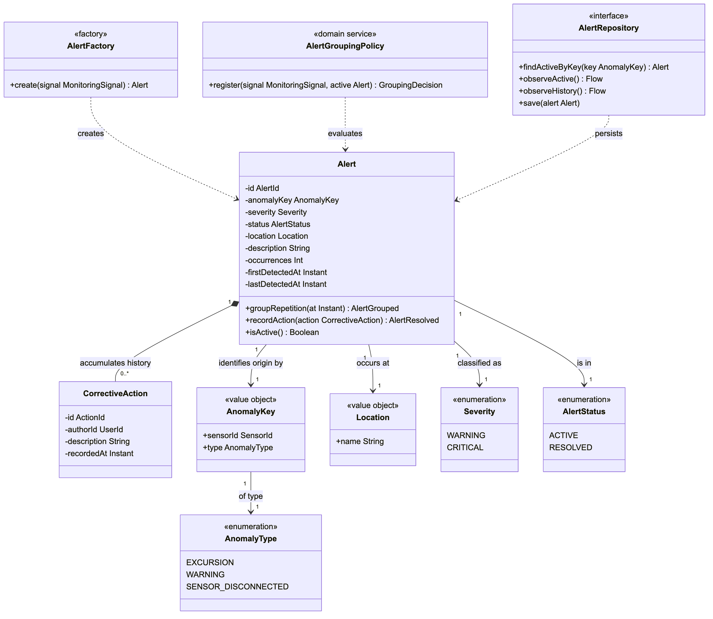</div>

<p><strong><em>Nota.</em></strong> Notación UML: `-` privado, `+` público, `#` protegido. `Flow` representa un flujo de corrutinas de Kotlin. Los contratos `AlertNotifier` y `MonitoringSignalSource` se describen en la Tabla 63 y se omiten aquí para conservar la legibilidad.</p>

El diccionario de la Tabla 68 detalla el propósito de cada clase de la figura.

<p><strong>Tabla 68.</strong> <em>Diccionario de clases del Domain Layer de Alerts</em></p>

| Clase | Propósito | Miembros y relaciones destacadas |
|---|---|---|
| `Alert` | Representa la incidencia y garantiza agrupación y resolución | `groupRepetition` suma una ocurrencia; `recordAction` resuelve; contiene 0..* `CorrectiveAction` |
| `CorrectiveAction` | Registra quién atendió la incidencia, cuándo y qué hizo | Atributos privados `authorId`, `description`, `recordedAt` |
| `AnomalyKey` | Clave de agrupación por sensor y tipo de anomalía | Igualdad por valor; compone `AnomalyType` |
| `Location` | Ubicación de la anomalía | `name` |
| `Severity` | Nivel de riesgo | Enumeración `WARNING`, `CRITICAL` |
| `AlertStatus` | Estado de la alerta | Enumeración `ACTIVE`, `RESOLVED` |
| `AnomalyType` | Origen de la anomalía | Enumeración `EXCURSION`, `WARNING`, `SENSOR_DISCONNECTED` |
| `AlertGroupingPolicy` | Decide crear o agrupar | `register` devuelve `GroupingDecision` (nueva o agrupada) |
| `AlertFactory` | Crea alertas activas | `create` asigna severidad según el tipo de anomalía |
| `AlertRepository` | Contrato de persistencia | Operaciones de consulta reactiva y `save` |

<p><strong><em>Nota.</em></strong> La visibilidad de cada miembro se muestra en la Figura 36.</p>

##### 2.6.4.6.2 Database Design Diagram

La Figura 37 muestra la base local Room de Alerts. Es una caché de las alertas sincronizadas con el servicio compartido que permite consultarlas y ver su historial; el estado definitivo se conserva en el servicio. Cada alerta tiene cero o más acciones correctivas.

<p><strong>Figura 37.</strong> <em>Diagrama de base de datos local de Alerts</em></p>

<div align="center">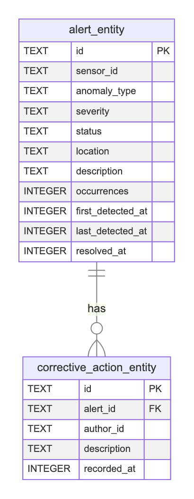</div>

<p><strong><em>Nota.</em></strong> Las fechas se almacenan como marcas de tiempo en milisegundos. `alert_id` tiene clave foránea con eliminación en cascada y un índice por `status` y `severity` acelera la consulta de alertas activas.</p>

La clave de agrupación se obtiene de `sensor_id` y `anomaly_type`. Un índice sobre `status`, `severity` y `last_detected_at` sostiene el orden por severidad y reciente que exige la consulta de alertas activas.

---

### 2.6.5 Logistics Bounded Context

Logistics gestiona el ciclo de vida de los despachos, desde su registro hasta la entrega. Su propósito es permitir al OPERADOR registrar un despacho con producto, lote, cantidad, destino y sensor; comprobar las condiciones térmicas antes del envío; hacer seguimiento por estado; consultar las lecturas vinculadas al despacho y confirmar la entrega. Atiende las historias US-61 (registrar un despacho), US-47 (consultar si la temperatura permite continuar con el envío), US-25 (consultar el estado de los despachos), US-07 (consultar lecturas vinculadas a un despacho) y US-24 (confirmar la entrega).

Las reglas de negocio clave son las siguientes. Un despacho se registra en preparación con cantidad mayor que cero y no superior al stock disponible, con producto, lote y sensor existentes y con un lote que pertenece al producto; registrarlo no inicia el envío. Antes de enviar se valida la condición térmica con tres resultados posibles: continuar, requerir confirmación autorizada o quedar bloqueado por falta de datos. La entrega solo la confirma un usuario con permiso, sobre un despacho en tránsito, y no puede confirmarse dos veces. El estado avanza de preparación a validación, a en tránsito y a entregado, con bloqueado como estado alterno. Logistics es Customer de Inventory (productos, lotes y stock) y de Monitoring (condición térmica), y usa una capa anticorrupción (ACL) para traducir las lecturas de Monitoring a su propio modelo.

#### 2.6.5.1 Domain Layer

El dominio de Logistics se centra en el agregado `Shipment` (despacho), cuya máquina de estados concentra las reglas de transición. La Tabla 69 lista sus elementos.

<p><strong>Tabla 69.</strong> <em>Elementos del Domain Layer de Logistics</em></p>

| Elemento | Categoría | Propósito | Atributos / contrato principal |
|---|---|---|---|
| `Shipment` | Aggregate Root / Entity | Despacho de una carga con su estado, validación térmica y entrega | `id: ShipmentId`, `product: ProductRef`, `batch: BatchRef`, `quantity: Quantity`, `destination: Destination`, `sensor: SensorRef`, `status: ShipmentStatus`, `thermalCheck: ThermalCheck?`, `authorizedBy: UserId?`, `startedAt: Instant?`, `delivery: DeliveryConfirmation?`, `createdAt: Instant` |
| `ShipmentId` | Value Object | Identificador del despacho | `value: String` |
| `ProductRef`, `BatchRef`, `SensorRef` | Value Object | Referencias por identificador a datos de otros contextos | `id`, `displayName` |
| `Quantity` | Value Object | Cantidad a despachar | `units: Int` (mayor que cero) |
| `Destination` | Value Object | Destino del envío | `name: String` |
| `ShipmentStatus` | Value Object (enumeración) | Estados del despacho | `PREPARATION`, `VALIDATION`, `IN_TRANSIT`, `DELIVERED`, `BLOCKED` |
| `ThermalVerdict` | Value Object (enumeración) | Resultado de la validación térmica | `CAN_CONTINUE`, `REQUIRES_CONFIRMATION`, `BLOCKED_NO_DATA` |
| `ThermalCheck` | Value Object | Resultado fechado de la comprobación térmica | `verdict`, `checkedAt`, `readingCount` |
| `ThermalReading` | Value Object | Lectura en el modelo de Logistics, traducida por la ACL | `value: Double`, `recordedAt: Instant`, `status` |
| `DeliveryConfirmation` | Value Object | Constancia de la entrega | `confirmedBy: UserId`, `confirmedAt: Instant` |
| `ThermalDispatchPolicy` | Domain Service | Determina el veredicto a partir de lecturas y rango del producto | `evaluate(readings, range): ThermalCheck` |
| `ShipmentRegistrationPolicy` | Domain Service | Verifica cantidad, stock y consistencia de referencias | `validate(draft, references): RegistrationResult` |
| `ShipmentFactory` | Factory | Crea un despacho en preparación a partir de un borrador validado | `create(draft): Shipment` |
| `ShipmentRepository` | Repository interface | Persistencia y consulta por estado | `save`, `findById`, `observeAll`, `observeByStatus` |
| `InventoryReferencePort` | Contrato de dominio | Producto, lote, stock disponible y rango térmico | `findProduct`, `findBatch`, `availableStock`, `thermalRange` |
| `SensorReferencePort` | Contrato de dominio | Existencia del sensor | `exists(sensorId)` |
| `ThermalReadingsPort` | Contrato de dominio (ACL) | Lecturas del sensor del despacho en el modelo de Logistics | `readingsFor(sensor): List<ThermalReading>` |

<p><strong><em>Nota.</em></strong> Los puertos de dominio expresan lo que Logistics necesita de Inventory y Monitoring; sus implementaciones residen en infraestructura.</p>

Las invariantes del agregado son las siguientes.

- `quantity` es mayor que cero y no supera el stock disponible del lote al registrar.
- Producto, lote y sensor existen, y el lote pertenece al producto indicado.
- Un despacho nace en `PREPARATION`; registrarlo no lo envía ni sustituye la validación térmica.
- Solo un despacho en `PREPARATION` puede pasar a `VALIDATION`, y solo uno con veredicto `CAN_CONTINUE`, o con `REQUIRES_CONFIRMATION` ya autorizado, puede pasar a `IN_TRANSIT`.
- El veredicto `BLOCKED_NO_DATA` deja el despacho en `BLOCKED`; sin datos térmicos no se envía.
- La confirmación de riesgo exige un usuario autorizado, que queda registrado en `authorizedBy`.
- Solo un despacho `IN_TRANSIT` puede entregarse y una entrega confirmada no se repite; la fecha y hora quedan en `DeliveryConfirmation`.

La Figura 38 resume el ciclo de vida que protegen estas invariantes.

<p><strong>Figura 38.</strong> <em>Estados del agregado Shipment</em></p>

<div align="center">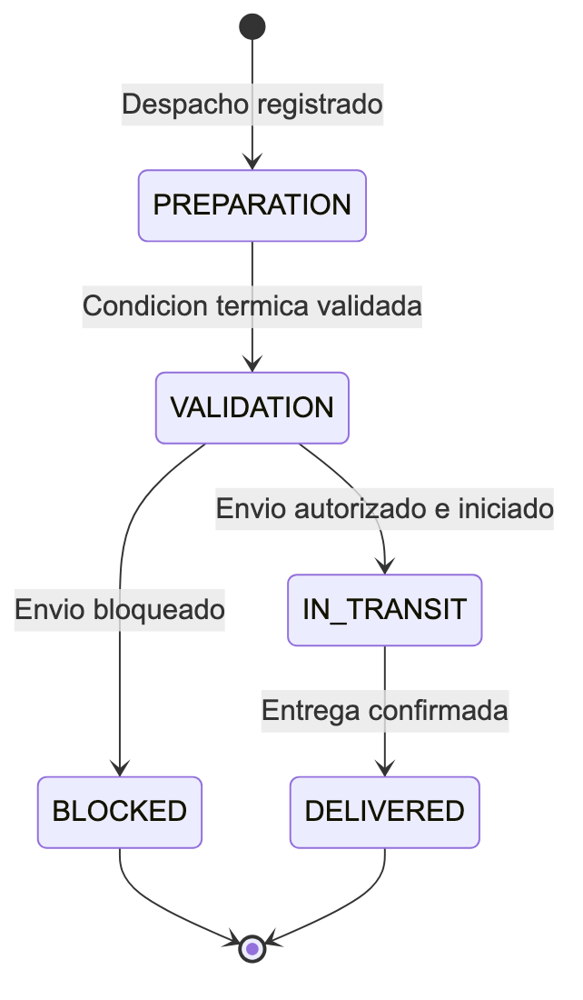</div>

<p><strong><em>Nota.</em></strong> Cada transición corresponde a un evento de dominio. El envío autorizado puede deberse a un veredicto de continuar o a una confirmación autorizada ante riesgo.</p>

Los eventos de Logistics se presentan en la Tabla 70.

<p><strong>Tabla 70.</strong> <em>Eventos de dominio de Logistics</em></p>

| Evento | Clase | Condición | Datos principales |
|---|---|---|---|
| Despacho registrado | `ShipmentRegistered` | Se crea el despacho en preparación | `shipmentId`, `productId`, `batchId`, `quantity`, `destination`, `sensorId` |
| Condición térmica validada | `ThermalConditionValidated` | Se completa la comprobación previa al envío | `shipmentId`, `verdict`, `checkedAt` |
| Envío bloqueado | `ShipmentBlocked` | La validación no tiene datos térmicos | `shipmentId`, `reason` |
| Envío autorizado | `ShipmentAuthorized` | El veredicto permite continuar o un usuario autorizado confirma el riesgo | `shipmentId`, `authorizedBy` |
| Envío iniciado | `ShipmentStarted` | El despacho pasa a tránsito | `shipmentId`, `startedAt` |
| Entrega confirmada | `DeliveryConfirmed` | El OPERADOR autorizado confirma la entrega | `shipmentId`, `confirmedBy`, `confirmedAt` |

<p><strong><em>Nota.</em></strong> Logistics no consume eventos de otros contextos: consulta sus datos mediante puertos.</p>

#### 2.6.5.2 Interface Layer

La capa Presentation de Logistics agrupa el listado con filtro por estado, el registro, la validación térmica previa al envío y el seguimiento con lecturas. La Tabla 71 describe cada componente.

<p><strong>Tabla 71.</strong> <em>Componentes de presentación de Logistics</em></p>

| Componente | Tipo | Responsabilidad | Historia |
|---|---|---|---|
| `ShipmentListScreen` | Compose screen | Lista despachos con estado, producto y temperatura; filtra por estado e informa cuando no hay despachos | US-25 |
| `RegisterShipmentScreen` | Compose screen | Formulario de producto, lote, cantidad, destino y sensor; muestra errores de datos incompletos o inconsistentes y conserva lo ingresado | US-61 |
| `ThermalValidationScreen` | Compose screen | Presenta el veredicto, solicita confirmación autorizada ante riesgo y bloquea el envío sin datos | US-47 |
| `ShipmentDetailScreen` | Compose screen | Muestra el estado, las lecturas del despacho en orden cronológico y la acción de confirmar la entrega | US-07, US-24 |
| `ShipmentListViewModel` | ViewModel | Expone `ShipmentListUiState` y el filtro seleccionado | US-25 |
| `RegisterShipmentViewModel` | ViewModel | Gestiona el formulario y los errores por campo | US-61 |
| `ThermalValidationViewModel` | ViewModel | Ejecuta la validación y la confirmación de envío | US-47 |
| `ShipmentDetailViewModel` | ViewModel | Carga lecturas y ejecuta la confirmación de entrega | US-07, US-24 |

<p><strong><em>Nota.</em></strong> La visibilidad de acciones se basa en los permisos de la sesión, pero ocultar un control no sustituye la autorización del servicio compartido.</p>

#### 2.6.5.3 Application Layer

Los casos de uso de Logistics encadenan el flujo registrar, validar, iniciar y entregar. La Tabla 72 los detalla.

<p><strong>Tabla 72.</strong> <em>Casos de uso de Logistics</em></p>

| Componente | Tipo | Responsabilidad | US |
|---|---|---|---|
| `RegisterShipmentUseCase` | Command handler | Obtiene referencias y stock, aplica `ShipmentRegistrationPolicy`, crea el despacho en preparación y lo guarda | US-61 |
| `ValidateShipmentThermalConditionUseCase` | Command handler | Pasa a validación, lee la condición térmica y aplica `ThermalDispatchPolicy`; bloquea si faltan datos | US-47 |
| `AuthorizeShipmentUseCase` | Command handler | Registra la confirmación autorizada cuando el veredicto exige confirmación | US-47 |
| `StartShipmentUseCase` | Command handler | Inicia el envío de un despacho autorizado | US-47 |
| `ConfirmDeliveryUseCase` | Command handler | Verifica permiso y estado, registra la entrega con fecha y hora y rechaza la repetición | US-24 |
| `GetShipmentsUseCase` | Query handler | Devuelve los despachos, con filtro opcional por estado | US-25 |
| `GetShipmentDetailUseCase` | Query handler | Devuelve el despacho con su condición térmica | US-25, US-47 |
| `GetShipmentReadingsUseCase` | Query handler | Devuelve las lecturas del sensor del despacho ordenadas por fecha y hora, con aviso de desconexión | US-07 |

<p><strong><em>Nota.</em></strong> El permiso se evalúa con el contrato de sesión de IAM; Logistics no importa clases de IAM.</p>

#### 2.6.5.4 Infrastructure Layer

La infraestructura implementa `ShipmentRepository` y los puertos hacia Inventory y Monitoring. El adaptador de lecturas hace de ACL: traduce el modelo de Monitoring al `ThermalReading` de Logistics. La Tabla 73 resume las clases.

<p><strong>Tabla 73.</strong> <em>Componentes de infraestructura de Logistics</em></p>

| Componente | Tipo | Responsabilidad |
|---|---|---|
| `ShipmentRepositoryImpl` | Repository implementation | Implementa `ShipmentRepository` con servicio remoto y caché Room |
| `ShipmentApiService` | Retrofit service | Registra, consulta, valida, inicia y entrega despachos en el servicio compartido |
| `ShipmentDto`, `RegisterShipmentRequestDto` | DTO remoto | Representan el despacho y la solicitud de registro |
| `ShipmentReadingDto` | DTO remoto | Lectura recibida para el despacho |
| `ShipmentEntity`, `ShipmentReadingEntity` | Room entity | Persisten despacho y lecturas en caché |
| `ShipmentDao` | Room DAO | Consulta por estado y lecturas ordenadas por fecha |
| `ShipmentMapper` | Mapper | Transforma DTO y entidades en `Shipment` y `ThermalReading` |
| `InventoryReferenceAdapter` | Adaptador | Implementa `InventoryReferencePort` con su propio servicio de consulta |
| `SensorReferenceAdapter` | Adaptador | Implementa `SensorReferencePort` |
| `ThermalReadingsAdapter` | Adaptador ACL | Implementa `ThermalReadingsPort` y traduce las lecturas de Monitoring |
| `LogisticsModule` | Módulo Hilt | Enlaza contratos con implementaciones |

<p><strong><em>Nota.</em></strong> Ningún adaptador usa repositorios, DTO ni ViewModels de Inventory o Monitoring.</p>

#### 2.6.5.5 Component Level Diagrams

La Figura 39 muestra los componentes de Logistics y sus dependencias. Destaca el adaptador ACL que aísla el modelo de Monitoring y los adaptadores de referencia de Inventory.

<p><strong>Figura 39.</strong> <em>Diagrama de componentes del bounded context Logistics</em></p>

<div align="center">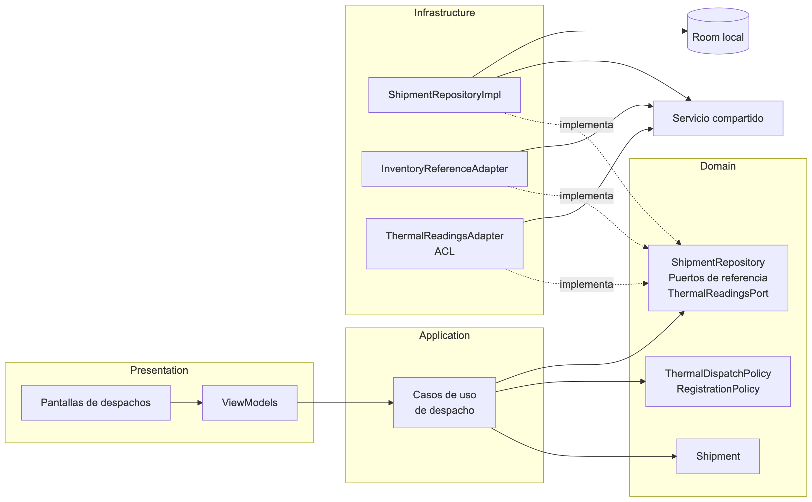</div>

<p><strong><em>Nota.</em></strong> `ThermalReadingsAdapter` es la ACL del contexto Customer/Supplier con Monitoring. Las flechas punteadas indican implementación de contratos del dominio.</p>

El diagrama evidencia que el flujo completo del despacho se orquesta desde la capa de aplicación y que las reglas térmicas residen en el dominio; los adaptadores solo traducen datos.

#### 2.6.5.6 Code Level Diagrams

##### 2.6.5.6.1 Domain Layer Class Diagrams

El dominio de Logistics se divide en dos figuras para mantener la legibilidad. La Figura 40 muestra el agregado `Shipment` y sus objetos de valor; la Figura 41 muestra políticas, fábrica y contratos.

<p><strong>Figura 40.</strong> <em>Diagrama de clases del agregado Shipment</em></p>

<div align="center">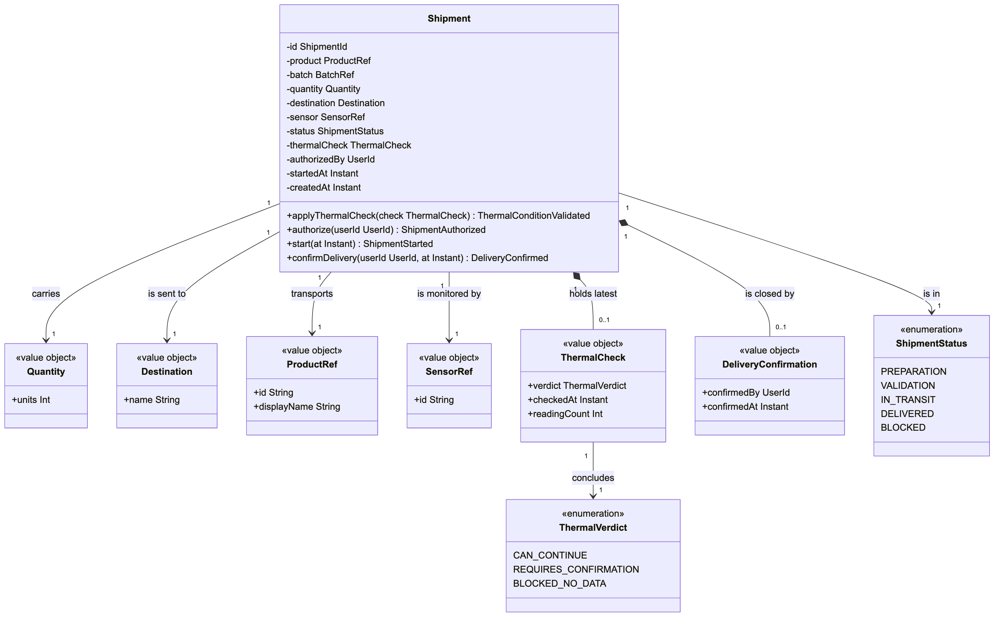</div>

<p><strong><em>Nota.</em></strong> `BatchRef` y los identificadores se omiten por brevedad; siguen el mismo patrón de `ProductRef`. `-` es privado y `+` público.</p>

<p><strong>Figura 41.</strong> <em>Diagrama de clases de políticas, fábrica y contratos de Logistics</em></p>

<div align="center">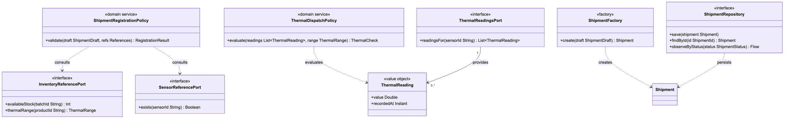</div>

<p><strong><em>Nota.</em></strong> `Flow` es un flujo de corrutinas de Kotlin. `ThermalRange` es un objeto de valor con límites mínimo y máximo obtenido de Inventory.</p>

La Tabla 74 resume el propósito de las clases presentadas en ambas figuras.

<p><strong>Tabla 74.</strong> <em>Diccionario de clases del Domain Layer de Logistics</em></p>

| Clase | Propósito | Miembros y relaciones destacadas |
|---|---|---|
| `Shipment` | Despacho y máquina de estados | `applyThermalCheck`, `authorize`, `start`, `confirmDelivery`; compone `ThermalCheck` y `DeliveryConfirmation` |
| `Quantity` | Cantidad positiva | `units` |
| `Destination` | Destino | `name` |
| `ProductRef`, `SensorRef` | Referencias por identificador a otros contextos | `id`, `displayName` |
| `ThermalCheck` | Resultado de la validación previa | `verdict`, `checkedAt`, `readingCount` |
| `DeliveryConfirmation` | Constancia de entrega | `confirmedBy`, `confirmedAt` |
| `ShipmentStatus` | Estados del despacho | Enumeración de cinco estados |
| `ThermalVerdict` | Resultado de la validación | Continuar, requiere confirmación o bloqueado sin datos |
| `ShipmentRegistrationPolicy` | Valida cantidad, stock y referencias | Consulta los puertos de Inventory y sensor |
| `ThermalDispatchPolicy` | Calcula el veredicto térmico | Sin lecturas devuelve `BLOCKED_NO_DATA` |
| `ShipmentFactory` | Crea despachos en preparación | Recibe un borrador validado |
| `ThermalReading` | Lectura traducida por la ACL | `value`, `recordedAt` |
| `ShipmentRepository` | Persistencia y consulta por estado | Contrato implementado en infraestructura |
| `InventoryReferencePort`, `SensorReferencePort`, `ThermalReadingsPort` | Contratos hacia Inventory y Monitoring | Implementados por adaptadores |

<p><strong><em>Nota.</em></strong> El diccionario cubre las dos figuras de clases de Logistics.</p>

##### 2.6.5.6.2 Database Design Diagram

La Figura 42 describe la base local Room de Logistics. Guarda el despacho con su estado, su veredicto térmico y los datos de entrega, y las lecturas recientes asociadas que permiten consultar el seguimiento.

<p><strong>Figura 42.</strong> <em>Diagrama de base de datos local de Logistics</em></p>

<div align="center">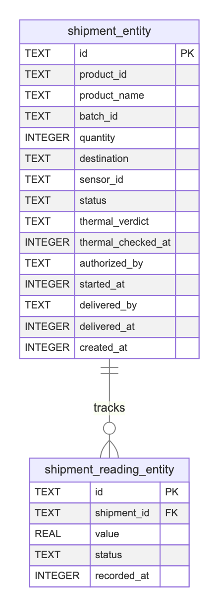</div>

<p><strong><em>Nota.</em></strong> `shipment_id` es clave foránea con eliminación en cascada. Un índice sobre `status` sostiene el filtro por estado y otro sobre `shipment_id` y `recorded_at` el orden cronológico de las lecturas.</p>

---

### 2.6.6 Reporting Bounded Context

Reporting ofrece al SUPERVISOR una vista consolidada de la situación operativa. Es un modelo de lectura: reúne indicadores de productos, alertas y despachos y muestra únicamente los autorizados para el rol del usuario. No emite eventos de dominio ni modifica datos operativos, y es Conformist de los contextos que lo alimentan (Inventory, Monitoring, Alerts y Logistics) y de IAM para los permisos. Atiende la historia US-13 (consultar los indicadores consolidados).

Las reglas de negocio son tres. Un usuario con permisos limitados obtiene solo los indicadores autorizados para su rol. Si no hay datos operativos, el contexto informa esa ausencia y sugiere una acción pertinente, como registrar productos o despachos. Los indicadores se derivan de datos de otros contextos y no se editan desde Reporting.

#### 2.6.6.1 Domain Layer

El dominio de Reporting es un modelo de solo lectura. Como muestra la Tabla 75, no tiene agregados que protejan transiciones de estado; el elemento central es el resumen operativo, construido a partir de instantáneas de los contextos origen.

<p><strong>Tabla 75.</strong> <em>Elementos del Domain Layer de Reporting</em></p>

| Elemento | Categoría | Propósito | Atributos / contrato principal |
|---|---|---|---|
| `OperationalSummary` | Entity (modelo de lectura) | Resumen consolidado con los indicadores visibles | `capturedAt: Instant`, `scope: ReportingScope`, `indicators: List<Indicator>` |
| `Indicator` | Value Object | Valor de un indicador | `group: IndicatorGroup`, `code: IndicatorCode`, `value: Double` |
| `IndicatorGroup` | Value Object (enumeración) | Familia del indicador | `PRODUCTS`, `ALERTS`, `SHIPMENTS` |
| `IndicatorCode` | Value Object (enumeración) | Indicador concreto | `TOTAL_PRODUCTS`, `STOCK_UNITS`, `ACTIVE_ALERTS`, `CRITICAL_ALERTS`, `SHIPMENTS_IN_TRANSIT`, `SHIPMENTS_DELIVERED`, `SHIPMENTS_BLOCKED` |
| `ReportingScope` | Value Object | Grupos autorizados para el rol de la sesión | `allowedGroups: Set<IndicatorGroup>` |
| `IndicatorAccessPolicy` | Domain Service | Filtra los indicadores según el alcance del rol | `restrict(summary, scope): OperationalSummary` |
| `OperationalSummaryFactory` | Factory | Ensambla el resumen desde las instantáneas | `build(products, alerts, shipments): OperationalSummary` |
| `OperationalSummaryRepository` | Repository interface | Lectura del resumen | `observeSummary(): Flow<OperationalSummary>`, `refresh()` |
| `ProductSnapshotSource`, `AlertSnapshotSource`, `ShipmentSnapshotSource` | Contrato de dominio | Instantáneas consolidadas de cada contexto origen, consumidas tal como las publica (Conformist) | `snapshot()` |

<p><strong><em>Nota.</em></strong> Reporting no define comandos ni agregados propios porque no modifica datos operativos.</p>

Las invariantes del contexto son las siguientes.

- Un resumen no contiene indicadores de grupos fuera del `ReportingScope` del usuario.
- Un resumen sin ningún indicador con datos se considera vacío y exige mostrar la ausencia con una acción sugerida.
- Ningún componente de Reporting escribe en datos de Inventory, Monitoring, Alerts o Logistics.
- Reporting no emite eventos de dominio.

Reporting no emite eventos, pero refleja el efecto de los que publican otros contextos, como se ve en la Tabla 76.

<p><strong>Tabla 76.</strong> <em>Eventos que Reporting refleja en sus indicadores</em></p>

| Evento origen | Contexto | Indicador afectado |
|---|---|---|
| Producto registrado, Stock actualizado | Inventory | `TOTAL_PRODUCTS`, `STOCK_UNITS` |
| Alerta generada, Alerta resuelta | Alerts | `ACTIVE_ALERTS`, `CRITICAL_ALERTS` |
| Envío iniciado, Entrega confirmada, Envío bloqueado | Logistics | `SHIPMENTS_IN_TRANSIT`, `SHIPMENTS_DELIVERED`, `SHIPMENTS_BLOCKED` |

<p><strong><em>Nota.</em></strong> La app no incorpora un bus de eventos local; los cambios llegan como datos consolidados del servicio compartido, que son el efecto de esos eventos.</p>

#### 2.6.6.2 Interface Layer

La capa Presentation de Reporting es una única pantalla de resumen con tarjetas por grupo de indicadores. La Tabla 77 la describe.

<p><strong>Tabla 77.</strong> <em>Componentes de presentación de Reporting</em></p>

| Componente | Tipo | Responsabilidad | Historia |
|---|---|---|---|
| `SummaryScreen` | Compose screen | Presenta los indicadores consolidados autorizados para el rol | US-13 |
| `IndicatorGroupCard` | Composable | Muestra los indicadores de un grupo con `SafeFlowListCard` | US-13 |
| `EmptySummaryCallout` | Composable | Informa la ausencia de datos y sugiere una acción | US-13 |
| `SummaryViewModel` | ViewModel | Expone `SummaryUiState` y solicita la actualización | US-13 |
| `SummaryUiState` | Estado de UI | Modela `Loading`, `Content`, `LimitedScope`, `Empty` y `Error` | US-13 |

<p><strong><em>Nota.</em></strong> La pantalla solo lee; no incluye acciones que modifiquen productos, alertas o despachos.</p>

#### 2.6.6.3 Application Layer

La aplicación de Reporting contiene consultas y un manejador de actualización. La Tabla 78 los detalla.

<p><strong>Tabla 78.</strong> <em>Casos de uso de Reporting</em></p>

| Componente | Tipo | Responsabilidad | US |
|---|---|---|---|
| `GetOperationalSummaryUseCase` | Query handler | Obtiene el resumen y aplica `IndicatorAccessPolicy` según el rol; devuelve resultado completo, de alcance limitado o vacío | US-13 |
| `RefreshOperationalSummaryUseCase` | Query handler | Solicita la actualización de las instantáneas de origen | US-13 |
| `UpstreamChangeHandler` | Event handler | Reconstruye el resumen cuando llegan cambios derivados de eventos de otros contextos | US-13 |

<p><strong><em>Nota.</em></strong> Ningún componente de esta capa es un command handler porque Reporting no modifica el estado operativo.</p>

#### 2.6.6.4 Infrastructure Layer

La infraestructura obtiene los datos consolidados del servicio compartido y los guarda en Room para consultarlos sin conexión. La Tabla 79 resume las clases.

<p><strong>Tabla 79.</strong> <em>Componentes de infraestructura de Reporting</em></p>

| Componente | Tipo | Responsabilidad |
|---|---|---|
| `OperationalSummaryRepositoryImpl` | Repository implementation | Implementa `OperationalSummaryRepository` con servicio remoto y caché |
| `ReportingApiService` | Retrofit service | Obtiene los indicadores consolidados |
| `SummaryDto`, `IndicatorDto` | DTO remoto | Representan el resumen recibido |
| `SummarySnapshotEntity`, `IndicatorSnapshotEntity` | Room entity | Persisten la última instantánea |
| `ReportingDao` | Room DAO | Lee y reemplaza la instantánea vigente |
| `SummaryMapper` | Mapper | Transforma DTO y entidades en `OperationalSummary` |
| `ReportingModule` | Módulo Hilt | Enlaza contratos con implementaciones |

<p><strong><em>Nota.</em></strong> Las implementaciones de las fuentes de instantáneas usan el mismo servicio de consulta y no importan clases de otros contextos.</p>

#### 2.6.6.5 Component Level Diagrams

La Figura 43 muestra los componentes de Reporting. Su propósito es evidenciar un flujo de solo lectura desde el servicio compartido hasta la pantalla.

<p><strong>Figura 43.</strong> <em>Diagrama de componentes del bounded context Reporting</em></p>

<div align="center">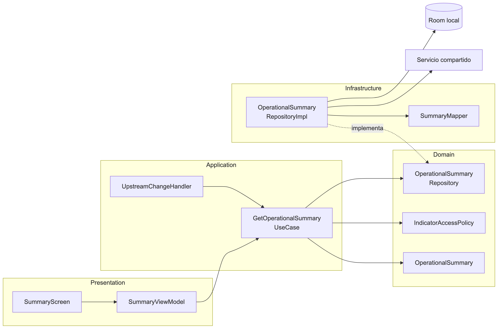</div>

<p><strong><em>Nota.</em></strong> No hay flechas de escritura hacia otros contextos: Reporting solo consume. La flecha punteada indica implementación del contrato del dominio.</p>

El diagrama confirma que el filtrado por rol ocurre en el dominio y que la infraestructura se limita a leer, traducir y almacenar la instantánea.

#### 2.6.6.6 Code Level Diagrams

##### 2.6.6.6.1 Domain Layer Class Diagrams

La Figura 44 presenta las clases del dominio de Reporting. El resumen se compone de indicadores y se restringe mediante un servicio de dominio según el alcance del rol.

<p><strong>Figura 44.</strong> <em>Diagrama de clases del Domain Layer de Reporting</em></p>

<div align="center">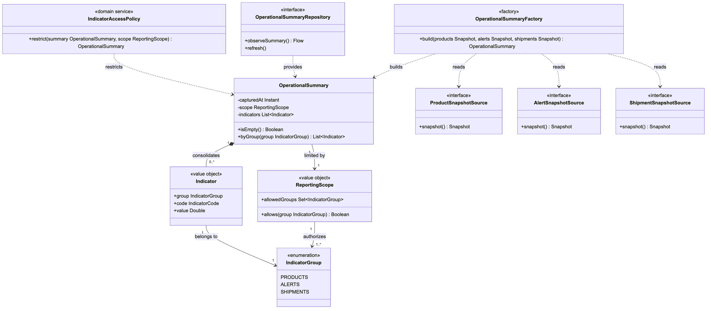</div>

<p><strong><em>Nota.</em></strong> `Snapshot` es el modelo de instantánea publicado por cada contexto origen; `IndicatorCode` se detalla en la Tabla 75.</p>

El diccionario de la Tabla 80 resume cada clase.

<p><strong>Tabla 80.</strong> <em>Diccionario de clases del Domain Layer de Reporting</em></p>

| Clase | Propósito | Miembros y relaciones destacadas |
|---|---|---|
| `OperationalSummary` | Resumen consolidado de solo lectura | `isEmpty`, `byGroup`; agrega 0..* `Indicator` |
| `Indicator` | Valor de un indicador | `group`, `code`, `value` |
| `ReportingScope` | Alcance autorizado para el rol | `allows(group)` |
| `IndicatorGroup` | Familia de indicadores | `PRODUCTS`, `ALERTS`, `SHIPMENTS` |
| `IndicatorAccessPolicy` | Restringe el resumen al alcance | `restrict` |
| `OperationalSummaryFactory` | Ensambla el resumen | `build` a partir de las tres instantáneas |
| `OperationalSummaryRepository` | Contrato de lectura | `observeSummary`, `refresh` |
| `ProductSnapshotSource`, `AlertSnapshotSource`, `ShipmentSnapshotSource` | Fuentes de cada contexto, consumidas como Conformist | `snapshot` |

<p><strong><em>Nota.</em></strong> Ninguna clase de Reporting expone operaciones de escritura sobre datos operativos.</p>

##### 2.6.6.6.2 Database Design Diagram

La Figura 45 muestra la base local Room de Reporting, que conserva la última instantánea consolidada. Una instantánea agrupa los indicadores que el rol puede ver.

<p><strong>Figura 45.</strong> <em>Diagrama de base de datos local de Reporting</em></p>

<div align="center">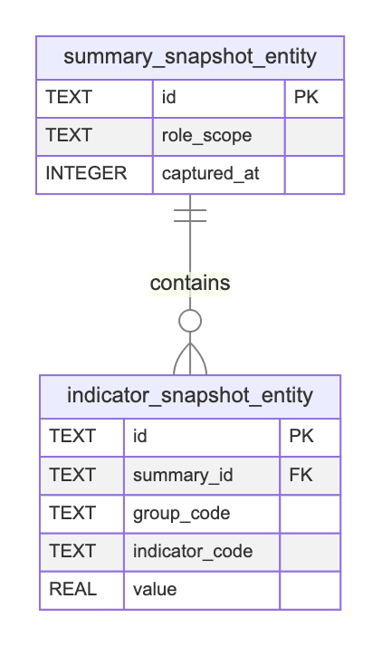</div>

<p><strong><em>Nota.</em></strong> `summary_id` es clave foránea con eliminación en cascada. Al sincronizar se reemplaza la instantánea vigente y sus indicadores.</p>

La tabla se trata como una caché de lectura: no contiene datos operativos editables y se reconstruye con cada sincronización.

<div style="page-break-after: always;"></div>

# Capítulo III: Solution UI/UX Design

Este capítulo documenta cómo SafeFlow traduce el dominio de la cadena de frío y las historias de usuario del Capítulo II en una interfaz móvil concreta. Primero se fijan las guías de estilo (marca, tipografía, color, espaciado, iconografía, tono y componentes), después se define la arquitectura de información (cómo se organiza, rotula, busca y recorre el contenido) y, por último, se presentan los wireframes, wireflows, mock-ups, flujos de usuario y el prototipo de la aplicación móvil Android. Todo el diseño visual vive en un único archivo de Figma ([SafeFlow en Figma](https://www.figma.com/design/ebf6YJVRmfKTHq2EDicpix/Safeflow)), que es la fuente de verdad de la que se derivan tanto las figuras de este capítulo como los componentes reutilizables de Jetpack Compose del módulo `core/ui`.

## 3.1. Product design

El diseño de producto de SafeFlow describe una aplicación Android para celular y tableta que permite a tres roles (OPERADOR, SUPERVISOR y ADMIN) supervisar la temperatura de productos farmacéuticos y alimenticios, gestionar inventario, atender alertas y validar despachos. El producto se concibe como una herramienta operativa: quien la usa está en un almacén o en tránsito, con poco tiempo y con el costo de una decisión equivocada medido en producto perdido o en riesgo sanitario. Por ello el diseño prioriza la lectura inmediata del estado térmico, la reducción de pasos en las tareas frecuentes y la claridad en los mensajes de error.

Las decisiones de diseño se apoyan en tres criterios. Primero, una sola aplicación con navegación inferior adaptada al rol, de modo que cada usuario ve únicamente lo que su responsabilidad le permite. Segundo, un sistema visual minimalista (blanco, grises y acentos verdes) con colores semánticos de advertencia y criticidad reservados para el estado térmico. Tercero, un diseño reutilizable: las pantallas se construyen con instancias de un conjunto de 13 componentes genéricos `SafeFlow*`, el mismo que se implementa en Android. La aplicación emuladora de sensores es un producto aparte y no se trata en este capítulo.

### 3.1.1. Style Guidelines

Las guías de estilo constituyen el repositorio común del equipo para el diseño: reúnen las decisiones de marca, las fuentes, los tokens de color, las medidas y los componentes, de modo que diseño y código hablen el mismo lenguaje. Como la entrega se limita a la aplicación móvil Android, se documentan las guías generales que aplican a todo el producto; las guías específicas de web quedan fuera de alcance porque no existe una experiencia web.

#### 3.1.1.1. General Style Guidelines

Las guías generales se definieron en el archivo de diseño `safeflow_system_design` de Figma, adaptando como referencia las pautas de Material Design 3 para Android (iconografía, objetivos táctiles y estructura de la navegación inferior) y reemplazando su paleta por una propia. El producto se implementa únicamente en modo claro: no se usan colores dinámicos ni se define una paleta oscura, porque un tema adicional introduciría combinaciones de contraste no validadas para estados críticos.

**Branding.** El producto se llama **SafeFlow**. Su logotipo combina un símbolo de copo de nieve estilizado en verde (alusión directa al frío y a la protección del producto) con el nombre en tipografía Display en negrita, como se aprecia en las pantallas de acceso. La frase de apoyo (tagline) que acompaña a la marca en la pantalla de inicio de sesión es *«Supervisa la cadena de frío de tus productos.»*. El estilo general es minimalista: fondos blancos y gris muy claro, texto en tonos casi negros, y el verde como único acento de marca y de acción.

**Tipografía.** Se usa la familia **Inter**, incluida como recurso local de la aplicación (pesos Regular 400, Medium 500, SemiBold 600 y Bold 700, licencia SIL OFL), por su legibilidad en tamaños pequeños y su buen comportamiento con cifras, esenciales para leer temperaturas como «5.1 °C». La escala tiene ocho estilos, que se muestran en la Figura 46 y se resumen en la Tabla 81.

<p><strong>Figura 46.</strong> <em>Escala tipográfica de SafeFlow</em></p>

<div align="center">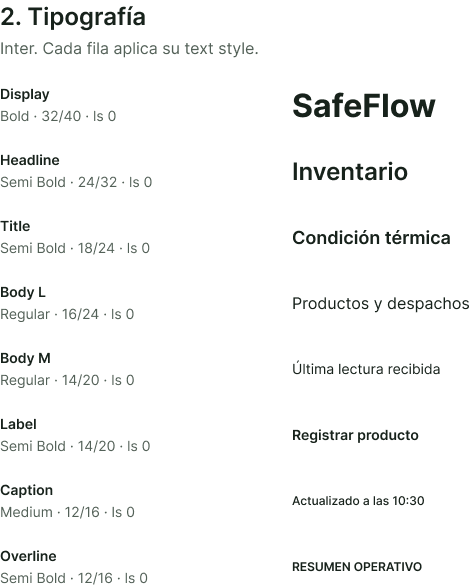</div>

<p><strong><em>Nota.</em></strong> Captura de la página de sistema de diseño de Figma (safeflow_system_design). Cada fila indica peso, tamaño e interlineado del estilo y un ejemplo con texto real del producto.</p>

<p><strong>Tabla 81.</strong> <em>Estilos tipográficos y su uso</em></p>

| Estilo | Peso | Tamaño / interlineado (sp) | Uso en la aplicación |
|---|---|---|---|
| Display | Bold 700 | 32/40 | Nombre de marca en pantallas de acceso |
| Headline | SemiBold 600 | 24/32 | Título de contenido de pantalla («Productos registrados») |
| Title | SemiBold 600 | 18/24 | Título de tarjeta («Vacuna A», «Condición térmica») |
| Body L | Regular 400 | 16/24 | Texto de lectura y valores en campos |
| Body M | Regular 400 | 14/20 | Detalle secundario («Última lectura recibida») |
| Label | SemiBold 600 | 14/20 | Etiquetas de campos y botones |
| Caption | Medium 500 | 12/16 | Metadatos («Actualizado a las 10:30») |
| Overline | SemiBold 600 | 12/16 | Rótulos de sección en mayúsculas («RESUMEN OPERATIVO») |

<p><strong><em>Nota.</em></strong> Valores definidos en el sistema de diseño y replicados en el tema de la aplicación Android.</p>

La Tabla 81 muestra que la jerarquía se construye con pocos pesos y tamaños, lo que mantiene la coherencia entre pantallas y facilita que el estado y las cifras térmicas se lean primero.

**Colores.** La paleta se organiza en tokens semánticos (superficie, texto, primario, borde, advertencia, crítico e icono), de modo que ninguna pantalla usa valores hexadecimales sueltos. El verde primario `#15803D` expresa acción y estado normal; el ámbar `#B45309` expresa advertencia y el rojo `#B91C1C` criticidad, cada uno con un contenedor tenue para fondos de avisos. La Figura 47 presenta las muestras y la Tabla 82 lista los valores.

<p><strong>Figura 47.</strong> <em>Tokens de color semánticos de SafeFlow</em></p>

<div align="center">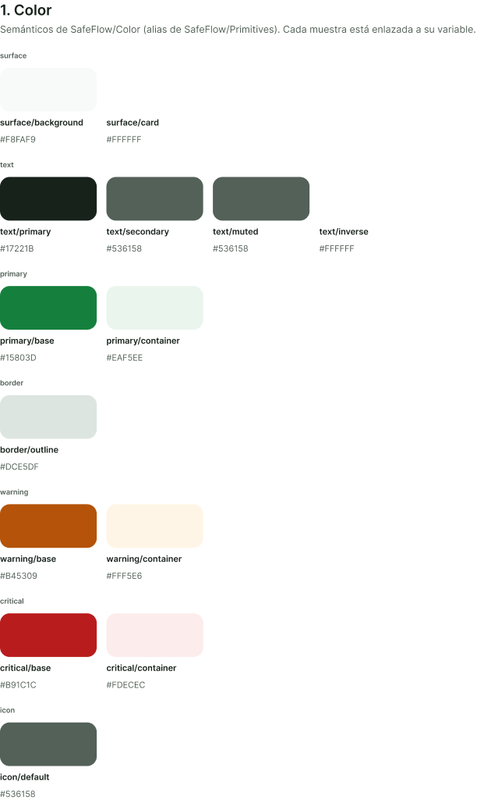</div>

<p><strong><em>Nota.</em></strong> Captura del sistema de diseño de Figma. Cada muestra está enlazada a una variable de color de SafeFlow/Color, alias de las primitivas.</p>

<p><strong>Tabla 82.</strong> <em>Tokens de color y su función</em></p>

| Token | Valor | Función |
|---|---|---|
| surface/background | `#F8FAF9` | Fondo de pantalla |
| surface/card | `#FFFFFF` | Superficie de tarjetas, campos y barra inferior |
| text/primary | `#17221B` | Texto principal |
| text/secondary, text/muted, icon/default | `#536158` | Texto secundario e iconos |
| text/inverse | `#FFFFFF` | Texto sobre fondos de acento |
| primary/base | `#15803D` | Acciones principales, estado normal, elemento activo |
| primary/container | `#EAF5EE` | Fondo de elemento seleccionado y avisos informativos |
| border/outline | `#DCE5DF` | Bordes de tarjetas, campos y botones secundarios |
| warning/base | `#B45309` | Estado «En riesgo» y advertencia térmica |
| warning/container | `#FFF5E6` | Fondo de avisos de advertencia |
| critical/base | `#B91C1C` | Estado «Crítico», excursión térmica y errores |
| critical/container | `#FDECEC` | Fondo de avisos críticos |

<p><strong><em>Nota.</em></strong> Los valores corresponden a los tokens implementados en la aplicación.</p>

Como se observa en la Tabla 82, el color nunca es la única señal de estado: cada estado térmico va acompañado de una etiqueta textual («Normal», «En riesgo», «Crítico») y de un icono, de modo que la información se entiende también sin percibir el color.

**Espaciado, radios e iconografía.** El espaciado sigue una escala de 4, 8, 12, 16, 24, 32 y 48 dp, y los radios de esquina son 8 dp (pequeño), 12 dp (mediano), 20 dp (grande) y completo para chips y píldoras. La Figura 48 los ilustra. Los iconos provienen de Material Symbols Rounded en formato local (peso 400, FILL 0, GRAD 0, tamaño óptico 24), con la licencia Apache 2.0; los recursos son locales y no se descargan en tiempo de ejecución.

<p><strong>Figura 48.</strong> <em>Radios de esquina y escala de espaciado</em></p>

<div align="center">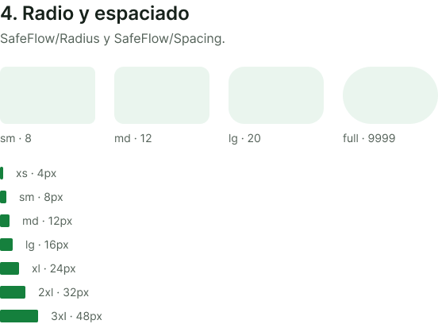</div>

<p><strong><em>Nota.</em></strong> Captura del sistema de diseño de Figma (SafeFlow/Radius y SafeFlow/Spacing).</p>

La Figura 48 permite verificar que el ritmo de la interfaz descansa en múltiplos de 4 dp y en tres radios, suficientes para distinguir campos, tarjetas y chips sin ornamentos adicionales.

**Tono de voz.** El enunciado propone cuatro ejes para el tono de comunicación. SafeFlow adopta la siguiente posición, justificada por el dominio:

| Eje | Posición | Justificación |
|---|---|---|
| Divertido / Serio | **Serio** | Se comunican temperaturas, riesgos y bloqueos de envío con consecuencias sanitarias y económicas; el humor restaría credibilidad. |
| Formal / Casual | **Formal** | Los usuarios son personal de logística y calidad en un contexto laboral; se usan frases completas, términos del dominio y sin coloquialismos. |
| Respetuoso / Irreverente | **Respetuoso** | Los errores se formulan sin culpar («Ingresa una cantidad positiva») y las acciones críticas explican su motivo. |
| Entusiasta / Sereno | **Sereno** | Ante una excursión térmica se necesita calma para decidir; los avisos informan hechos y siguiente paso, sin exclamaciones ni alarmismo. |

<p><strong>Tabla 83.</strong> <em>Tono de comunicación de SafeFlow</em></p>

<p><strong><em>Nota.</em></strong> Posición elegida en cada eje propuesto por el enunciado.</p>

La Tabla 83 resume un tono serio, formal, respetuoso y sereno, coherente con ejemplos reales de la interfaz como «Las mediciones disponibles permiten continuar con el envío».

**Principios de diseño y accesibilidad.** El diseño aplica cuatro principios. (1) *Jerarquía visual*: la temperatura actual se muestra en tamaño Headline o Title, por encima del detalle secundario. (2) *Consistencia*: un único conjunto de componentes y tokens para todas las pantallas. (3) *Retroalimentación*: cada estado (datos completos, vacío, error) tiene un diseño propio y los botones deshabilitados no ejecutan acciones. (4) *Diseño inclusivo*: los objetivos táctiles miden al menos 48 dp (los chips de Figma tienen 44 dp visuales y en Android se amplía el área de interacción a 48 dp), los controles significativos exponen una descripción accesible y los iconos decorativos no se anuncian, y el estado no depende solo del color. Las medidas se adaptan al contenido, sin alturas fijas que recorten texto con tamaños de fuente grandes.

**Componentes.** El sistema define 13 familias de componentes genéricos, que reciben texto y callbacks y no conocen la lógica de negocio. La Tabla 84 las lista con su contrato público en Android.

<p><strong>Tabla 84.</strong> <em>Familias de componentes SafeFlow</em></p>

| Familia | Composable | Propósito |
|---|---|---|
| Icon | `SafeFlowIcon` | Icono con descripción accesible opcional |
| Typography | `SafeFlowText` | Texto con variante de la escala tipográfica |
| Button | `SafeFlowButton` | Acción principal, tonal, secundaria, crítica o de texto |
| Icon Button | `SafeFlowIconButton` | Acción compacta con icono (volver, cuenta) |
| Text Field | `SafeFlowTextField` | Campo con etiqueta, ayuda, error y modo contraseña |
| Checkbox | `SafeFlowCheckbox` | Selección binaria (términos, permisos) |
| Chip | `SafeFlowChip` | Filtro seleccionable |
| List Card | `SafeFlowListCard` | Tarjeta de producto, lote, alerta, despacho o lectura |
| Callout | `SafeFlowCallout` | Aviso informativo, de advertencia o crítico |
| Nav Item | `SafeFlowNavItem` | Elemento de navegación con icono y etiqueta |
| App Header | `SafeFlowAppHeader` | Encabezado con título, volver y cuenta |
| Brand | `SafeFlowBrand` | Logotipo con tagline opcional |
| Bottom Navigation | `SafeFlowBottomNavigation` | Barra inferior por rol |

<p><strong><em>Nota.</em></strong> Contratos definidos en el módulo `core/ui` de la aplicación. El gráfico térmico no forma parte de este conjunto porque depende de datos del contexto Environmental Monitoring.</p>

Dos componentes merecen detalle. Los botones, mostrados en la Figura 49, miden 48 dp de alto y tienen cinco variantes: primaria (relleno verde), tonal (contenedor verde claro), secundaria (borde), crítica (relleno rojo) y de texto. La barra de navegación inferior, en la Figura 50, es una barra fija compartida por rol: sus destinos son instancias configurables y no concede permisos adicionales.

<p><strong>Figura 49.</strong> <em>Variantes del componente Button</em></p>

<div align="center">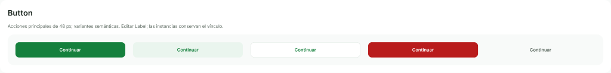</div>

<p><strong><em>Nota.</em></strong> Captura del sistema de diseño de Figma. Las instancias conservan el vínculo con el componente y solo se edita la etiqueta.</p>

<p><strong>Figura 50.</strong> <em>Navegación inferior por rol</em></p>

<div align="center">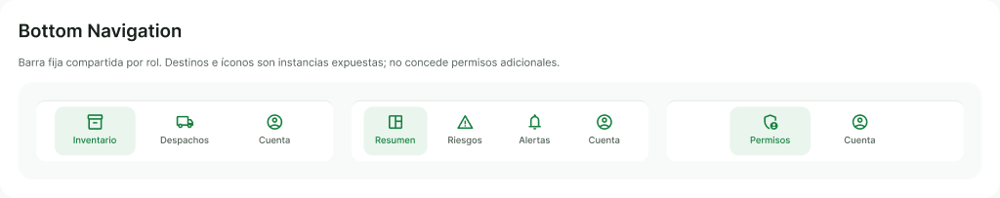</div>

<p><strong><em>Nota.</em></strong> Captura del sistema de diseño de Figma. De izquierda a derecha, las barras de OPERADOR, SUPERVISOR y ADMIN, con el destino activo resaltado en contenedor verde.</p>

La Figura 49 y la Figura 50 cierran las guías de estilo mostrando los dos componentes de mayor recurrencia: el botón, que codifica la jerarquía de acciones, y la barra inferior, que codifica el alcance de cada rol.

### 3.1.2. Information Architecture

La arquitectura de información define cómo se agrupa, nombra, busca y recorre el contenido de la aplicación para que cada rol encuentre lo que necesita sin esfuerzo. Se derivó de las 17 pantallas diseñadas, de los permisos de cada rol y de los flujos de las historias de usuario. Al ser una aplicación de tareas operativas, la estructura sigue el vocabulario del dominio (producto, lote, despacho, alerta) y evita jerarquías profundas: la mayoría de las tareas se alcanzan en dos o tres toques desde la barra inferior.

#### 3.1.2.1. Organization Systems

El contenido se organiza con tres esquemas visuales y cuatro de categorización, aplicados según el grupo de información, como resume la Tabla 85.

<p><strong>Tabla 85.</strong> <em>Sistemas de organización por grupo de información</em></p>

| Grupo de información | Organización visual | Categorización | Ejemplo |
|---|---|---|---|
| Destinos de la aplicación | Jerárquica (barra inferior y pantalla de detalle) | Según audiencia (rol) | OPERADOR: Inventario, Despachos; SUPERVISOR: Resumen, Riesgos, Alertas |
| Contenido de una pantalla | Jerárquica (título, filtros, acción principal, lista) | Por tópicos | Inventario: título, chips, «Registrar producto», tarjetas |
| Registro de datos | Secuencial (paso a paso) | Por tópicos | Registrar producto, luego lote, luego ingreso de stock |
| Despacho | Secuencial | Por estado | Registro, validación térmica, envío, entrega |
| Lecturas de temperatura | Jerárquica (gráfico y lista) | Cronológica | Historial térmico por «Hoy» o «Periodo» |
| Alertas | Jerárquica | Por estado y severidad | Activas e Historial; crítica y advertencia |
| Permisos | Matricial (rol por operación) | Según audiencia | Casillas por operación para OPERADOR y SUPERVISOR |
| Productos y despachos | Jerárquica (lista a detalle) | Por estado | Normal, En riesgo, Crítico; En tránsito, Entregados |

<p><strong><em>Nota.</em></strong> Elaboración propia a partir de las pantallas de Figma.</p>

La Tabla 85 muestra que la audiencia es el primer criterio de organización (cada rol tiene su propia barra inferior) y que, dentro de cada destino, prima el estado del dato (Normal, En riesgo, Crítico) sobre un orden alfabético, porque la prioridad del usuario es identificar qué requiere atención. Las listas de lecturas son cronológicas porque la causalidad térmica depende del orden temporal. Los registros se presentan como formularios cortos de un solo paso para no fragmentar tareas frecuentes, y el despacho es secuencial por naturaleza del proceso de negocio.

#### 3.1.2.2. Labelling Systems

Las etiquetas usan el lenguaje del dominio, en español, con el mínimo de palabras y de manera consistente entre botones, encabezados y filtros. La Tabla 86 recoge las etiquetas principales y lo que representan.

<p><strong>Tabla 86.</strong> <em>Etiquetas principales de la interfaz</em></p>

| Etiqueta | Dónde aparece | Qué representa |
|---|---|---|
| Inventario | Barra inferior (OPERADOR) | Productos, lotes y stock |
| Despachos | Barra inferior (OPERADOR) | Seguimiento de envíos |
| Resumen | Barra inferior (SUPERVISOR) | Indicadores consolidados |
| Riesgos | Barra inferior (SUPERVISOR) | Productos en riesgo y su historial térmico |
| Alertas | Barra inferior (SUPERVISOR) | Incidencias activas e historial |
| Permisos | Barra inferior (ADMIN) | Operaciones permitidas por rol |
| Cuenta | Barra inferior e icono de encabezado | Datos de la sesión y cierre de sesión |
| Registrar producto / lote / ingreso / despacho | Botones | Comandos en imperativo que crean un registro |
| Normal · En riesgo · Crítico | Chips y estados de tarjeta | Estado de conservación según el rango del producto |
| Activas · Historial | Chips de Alertas | Alertas pendientes o ya atendidas |
| Todos · En tránsito · Entregados | Chips de Despachos | Estado del despacho |
| Hoy · Periodo | Chips de Historial térmico | Ventana de consulta de lecturas |
| Excursión térmica · Advertencia térmica | Tarjetas de alerta | Temperatura fuera del rango o cerca del límite |
| Continuar con el despacho | Validación del despacho | Autoriza el envío cuando la condición térmica es admisible |

<p><strong><em>Nota.</em></strong> Elaboración propia; los términos coinciden con el lenguaje ubicuo del dominio.</p>

La Tabla 86 evidencia dos reglas: los botones usan verbos en imperativo y los estados usan sustantivos o adjetivos cortos. Las asociaciones se mantienen mediante etiquetas coherentes: «Registrar lote» y «Registrar ingreso» se ofrecen en el detalle de un producto, donde el usuario ya tiene el contexto.

#### 3.1.2.3. SEO Tags and Meta Tags

SafeFlow se distribuye como aplicación Android, por lo que el equivalente a las etiquetas SEO son los elementos de App Store Optimization (ASO) de su ficha en la tienda. La Tabla 87 propone los valores. Aunque en esta entrega ya se presenta el diseño de la landing page en la sección 3.1.3, sus etiquetas Title, Description, Keywords y Author quedan pendientes de definición para la implementación web.

<p><strong>Tabla 87.</strong> <em>Elementos ASO de la ficha de SafeFlow</em></p>

| Elemento | Valor propuesto |
|---|---|
| App Title | SafeFlow: Cadena de frío |
| App Subtitle (descripción corta) | Supervisa temperaturas, alertas y despachos de tus productos sensibles. |
| App Keywords | cadena de frío, monitoreo de temperatura, supervisión térmica, inventario, despachos, alertas, productos farmacéuticos, alimentos perecederos, trazabilidad, logística |
| App Description | SafeFlow te ayuda a proteger la cadena de frío de medicamentos y alimentos. Registra productos y lotes con su rango de temperatura, consulta la última lectura de cada sensor y recibe avisos cuando una temperatura sale del rango. Los supervisores priorizan las alertas por severidad, registran la acción correctiva y revisan el historial térmico. Los operadores registran despachos, validan la condición térmica antes del envío y confirman la entrega. Los administradores definen qué operaciones puede realizar cada rol. Disponible para celulares y tabletas Android. |
| Categoría sugerida | Negocios (herramientas de logística) |

<p><strong><em>Nota.</em></strong> Textos propuestos por el equipo para la publicación futura; el título y el subtítulo respetan los límites habituales de la tienda.</p>

> Pendiente: SEO Tags y Meta Tags de la landing page (Title, Description, Keywords, Author), que se definirán junto con su implementación web.

La Tabla 87 mantiene coherencia con el producto real: menciona únicamente capacidades diseñadas (inventario, monitoreo, alertas, despachos y permisos) y usa el vocabulario del dominio para que los términos de búsqueda coincidan con lo que el usuario espera encontrar.

#### 3.1.2.4. Searching Systems

La aplicación no ofrece búsqueda de texto libre en esta versión: el volumen de datos por rol es acotado y el diseño favorece el filtrado por estado, que responde directamente a la pregunta operativa «qué requiere atención». Los filtros se implementan con chips seleccionables (de selección única) ubicados bajo el título de la pantalla; después de filtrar, la lista se actualiza conservando el mismo formato de tarjeta y, si no hay resultados, se muestra un estado vacío con un mensaje explicativo. La Tabla 88 resume los medios de búsqueda por pantalla.

<p><strong>Tabla 88.</strong> <em>Filtros y ayudas de búsqueda por pantalla</em></p>

| Pantalla | Filtro | Opciones | Resultado |
|---|---|---|---|
| Inventario | Estado de conservación | Todos, Normal, En riesgo | Tarjetas de producto con temperatura y rango |
| Despachos | Estado del despacho | Todos, En tránsito, Entregados | Tarjetas de despacho con producto, destino y sensor |
| Alertas | Estado de la alerta | Activas, Historial | Tarjetas ordenadas con severidad, producto y hora |
| Historial térmico | Periodo | Hoy, Periodo | Gráfico y lecturas en orden cronológico |
| Permisos por rol | Rol | OPERADOR, SUPERVISOR | Casillas de operaciones del rol elegido |
| Registrar despacho | Selección guiada | Seleccionar producto, Seleccionar sensor | Valores asociados al nuevo despacho |

<p><strong><em>Nota.</em></strong> Elaboración propia a partir de los chips y selectores de las pantallas de Figma.</p>

Según la Tabla 88, los filtros reemplazan a la búsqueda abierta en las listas principales y la selección guiada evita errores de transcripción al registrar un despacho.

#### 3.1.2.5. Navigation Systems

La navegación combina tres técnicas: navegación inferior global por rol, navegación jerárquica de lista a detalle con botón de retorno, y acceso a la cuenta mediante icono en el encabezado. La barra inferior se muestra siempre en las pantallas autenticadas y su contenido depende del rol: OPERADOR (Inventario, Despachos, Cuenta), SUPERVISOR (Resumen, Riesgos, Alertas, Cuenta) y ADMIN (Permisos, Cuenta), como se vio en la Figura 50. En una tableta se mantiene la misma barra y las listas se reorganizan en dos columnas.

Las pantallas de detalle y de registro (Detalle de producto, Registrar lote, Validación del despacho) conservan el destino activo de la barra y añaden un botón de retorno en el encabezado. El estado de acceso determina el punto de entrada: un VISITANTE solo ve Iniciar sesión y Crear cuenta; al autenticarse, la aplicación lleva al primer destino de su rol. Desde Cuenta se cierra la sesión, y una sesión cerrada o expirada devuelve al estado de VISITANTE. El diagrama de la Figura 51 resume el sistema.

<p><strong>Figura 51.</strong> <em>Mapa de navegación por estado de acceso y rol</em></p>

<div align="center">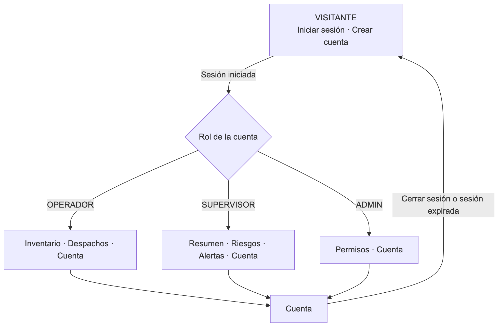</div>

<p><strong><em>Nota.</em></strong> Elaboración propia. Los destinos entre paréntesis de la barra inferior dependen del rol; Cuenta está disponible en los tres.</p>

La Figura 51 confirma que existe una sola salida común (Cuenta) y que el rol define el alcance, lo que evita que el usuario encuentre opciones sobre las que no tiene permiso.

### 3.1.3. Landing Page UI Design

La landing page de SafeFlow presenta la propuesta de valor de la solución para empresas farmacéuticas, alimentarias y operadores logísticos que necesitan controlar su cadena de frío. Su arquitectura de información organiza el contenido en una navegación principal, una sección hero, la propuesta de valor, las funcionalidades, el flujo de uso, la tecnología, los planes, los beneficios, el equipo, los sectores beneficiados, las preguntas frecuentes y un formulario de contacto. El diseño mantiene el lenguaje visual definido en la sección 3.1.1 y utiliza llamadas a la acción orientadas a solicitar una demostración o iniciar una conversación comercial.

#### 3.1.3.1. Wireframe

Los wireframes de la landing page representan la estructura, la jerarquía y la distribución de los contenidos antes de aplicar colores, fotografías e iconografía. Se definieron siete bloques de baja fidelidad para comprobar el recorrido completo de la página: encabezado y hero, propuesta de valor, funcionalidades y proceso, tecnología y confianza, planes, beneficios y equipo, y preguntas frecuentes con contacto y pie de página. La navegación superior permanece visible como referencia y las llamadas a la acción se ubican en los puntos de conversión principales.

La Figura 52 presenta el wireframe general de la landing page: encabezado, hero, tarjetas de funcionalidades, bloque de preguntas frecuentes y pie de página.

<p><strong>Figura 52.</strong> <em>Wireframe general de la landing page</em></p>

<div align="center">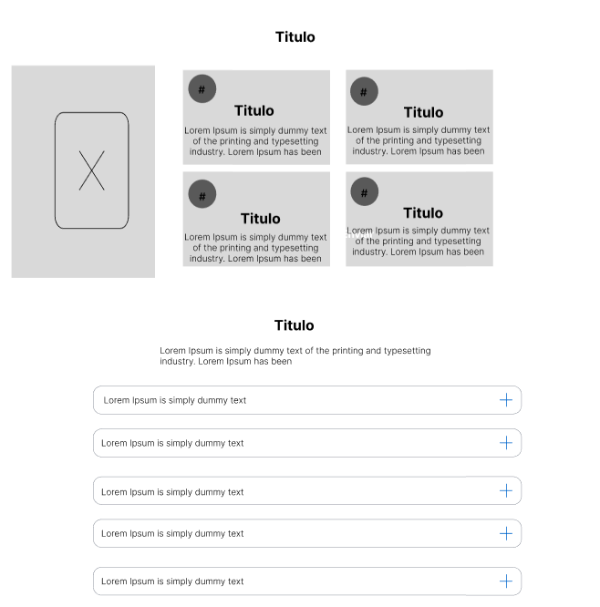</div>

<p><strong><em>Nota.</em></strong> Elaboración propia a partir de la estructura de la landing page de SafeFlow.</p>

La Figura 53 muestra el bloque de contacto, con un formulario de datos a la izquierda y la información de contacto junto con un espacio para mapa o ubicación a la derecha.

<p><strong>Figura 53.</strong> <em>Wireframe del formulario de contacto</em></p>

<div align="center">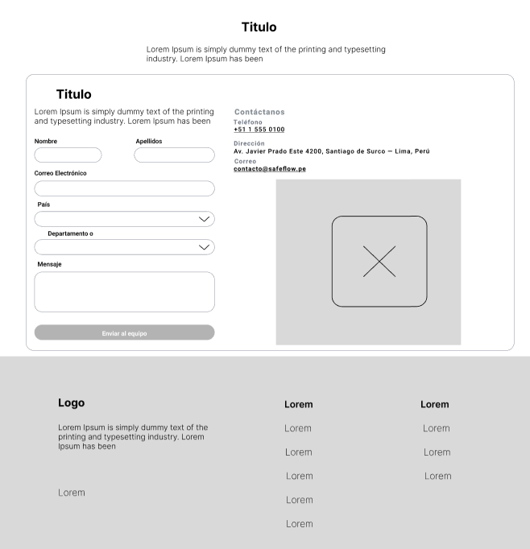</div>

<p><strong><em>Nota.</em></strong> Elaboración propia a partir de la estructura de la landing page de SafeFlow.</p>

La Figura 54 organiza la propuesta de valor y la vista de plataforma mediante tarjetas informativas, una imagen de apoyo y una galería de dispositivos o pantallas.

<p><strong>Figura 54.</strong> <em>Wireframe de la propuesta de valor y la plataforma</em></p>

<div align="center">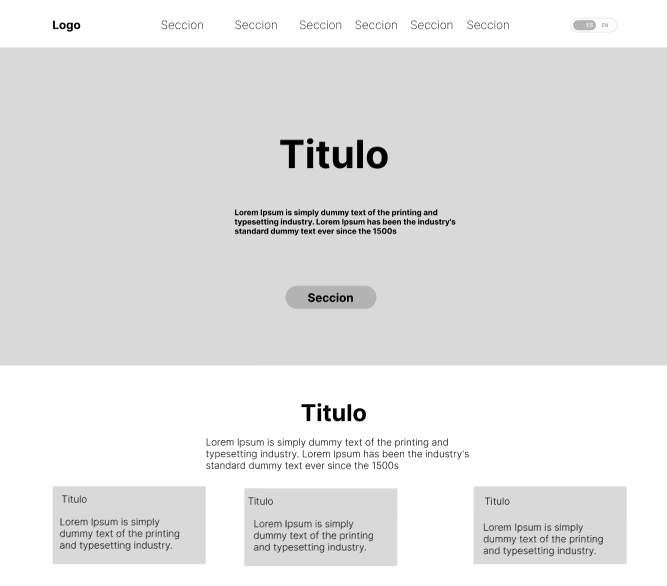</div>

<p><strong><em>Nota.</em></strong> Elaboración propia a partir de la estructura de la landing page de SafeFlow.</p>

La Figura 55 presenta la distribución de las funcionalidades, el proceso de uso y los elementos de confianza, con tarjetas repetibles y una imagen destacada.

<p><strong>Figura 55.</strong> <em>Wireframe de funcionalidades, proceso y tecnología</em></p>

<div align="center">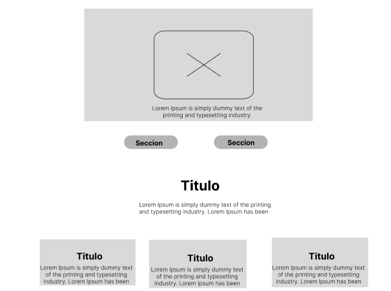</div>

<p><strong><em>Nota.</em></strong> Elaboración propia a partir de la estructura de la landing page de SafeFlow.</p>

La Figura 56 muestra la sección de planes, con tres alternativas de servicio y sus respectivas listas de beneficios y llamadas a la acción.

<p><strong>Figura 56.</strong> <em>Wireframe de planes comerciales</em></p>

<div align="center">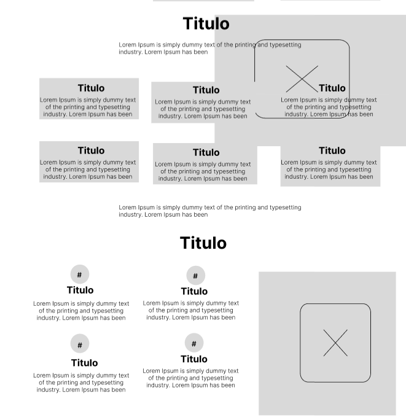</div>

<p><strong><em>Nota.</em></strong> Elaboración propia a partir de la estructura de la landing page de SafeFlow.</p>

La Figura 57 presenta los beneficios de SafeFlow, la descripción del equipo y los sectores que pueden utilizar la solución, organizados en bloques comparables.

<p><strong>Figura 57.</strong> <em>Wireframe de beneficios, equipo y sectores</em></p>

<div align="center">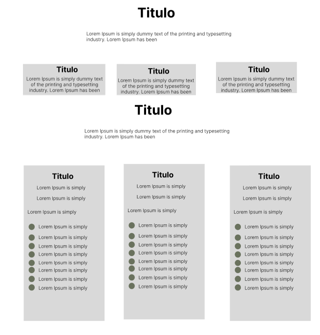</div>

<p><strong><em>Nota.</em></strong> Elaboración propia a partir de la estructura de la landing page de SafeFlow.</p>

La Figura 58 cierra el recorrido con las preguntas frecuentes, la llamada a la acción final, el formulario de contacto y el pie de página con enlaces de navegación.

<p><strong>Figura 58.</strong> <em>Wireframe de preguntas frecuentes y cierre</em></p>

<div align="center">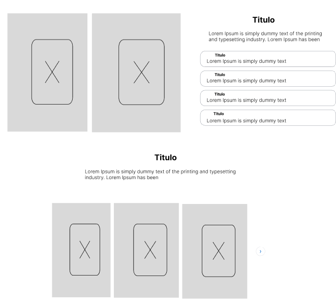</div>

<p><strong><em>Nota.</em></strong> Elaboración propia a partir de la estructura de la landing page de SafeFlow.</p>

#### 3.1.3.2. Mock-up

Los mock-ups aplican el sistema visual de SafeFlow a la estructura definida en los wireframes. La propuesta utiliza una base clara, azul como color de acción y confianza, naranja para destacar llamadas de atención y fotografías relacionadas con almacenes, transporte y operaciones de cadena de frío. Las composiciones priorizan una lectura progresiva: primero se comunica el problema y la propuesta de valor, luego se explican las capacidades y finalmente se facilita la conversión mediante planes, preguntas frecuentes y contacto.

La Figura 59 muestra la sección de funcionalidades y el proceso de uso de SafeFlow, con tarjetas para el monitoreo, las alertas, el inventario, la trazabilidad, la aplicación móvil y la seguridad.

<p><strong>Figura 59.</strong> <em>Mock-up de funcionalidades y proceso de uso</em></p>

<div align="center">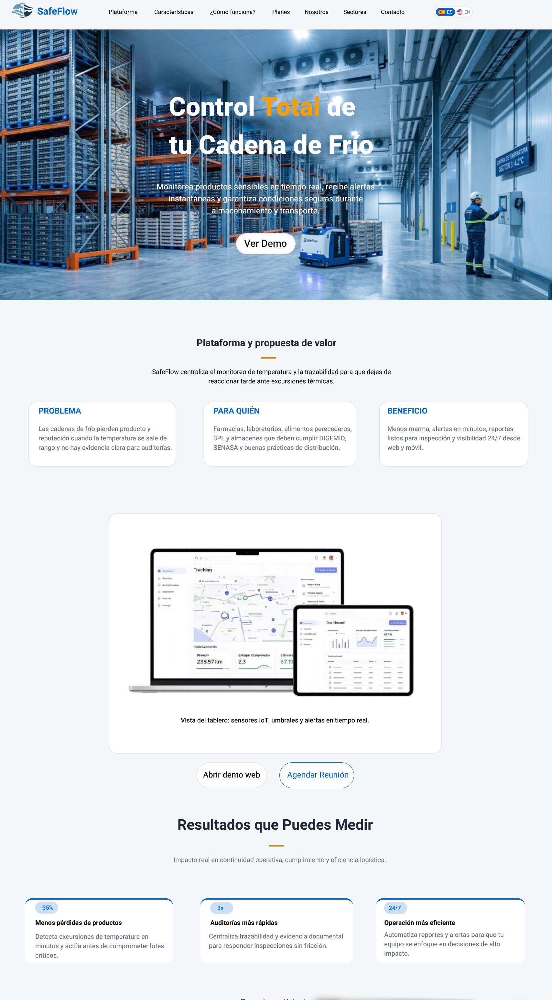</div>

<p><strong><em>Nota.</em></strong> Elaboración propia. La composición aplica el sistema visual de SafeFlow a la landing page.</p>

La Figura 60 presenta el hero de la landing page y la propuesta de valor: el mensaje principal, la llamada a ver una demostración, los segmentos atendidos, los resultados esperados y una vista de la plataforma.

<p><strong>Figura 60.</strong> <em>Mock-up del hero y la propuesta de valor</em></p>

<div align="center">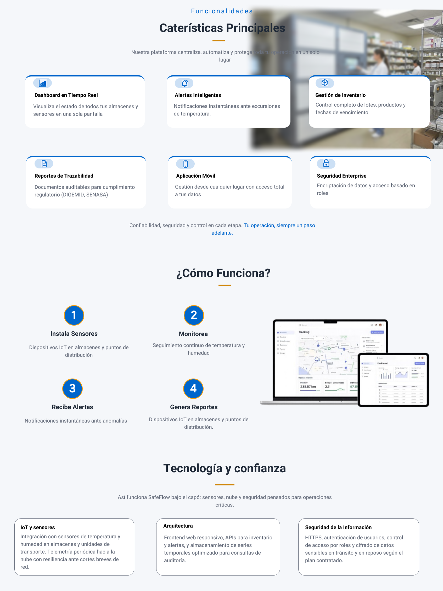</div>

<p><strong><em>Nota.</em></strong> Elaboración propia. La composición aplica el sistema visual de SafeFlow a la landing page.</p>

La Figura 61 muestra las preguntas frecuentes y el cierre de conversión, incluyendo el formulario para dejar los datos, los canales de contacto, la ubicación y el pie de página.

<p><strong>Figura 61.</strong> <em>Mock-up de preguntas frecuentes y contacto</em></p>

<div align="center">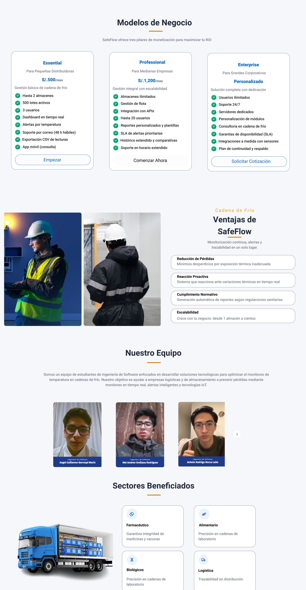</div>

<p><strong><em>Nota.</em></strong> Elaboración propia. La composición aplica el sistema visual de SafeFlow a la landing page.</p>

La Figura 62 presenta los modelos de negocio y los planes comerciales, junto con los beneficios, el equipo y los sectores beneficiados por SafeFlow.

<p><strong>Figura 62.</strong> <em>Mock-up de planes, beneficios y sectores</em></p>

<div align="center">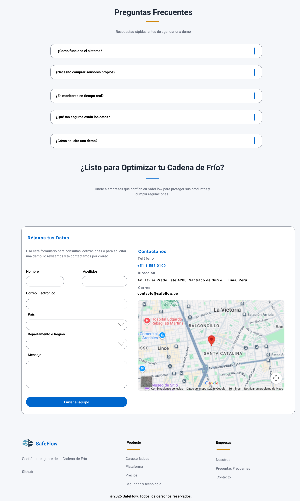</div>

<p><strong><em>Nota.</em></strong> Elaboración propia. La composición aplica el sistema visual de SafeFlow a la landing page.</p>

### 3.1.4. Mobile Applications UX/UI Design

Esta sección presenta la propuesta visual y de interacción de la aplicación móvil principal de SafeFlow, diseñada para celular (390 x 844 dp) y tableta (768 x 1024 dp). El diseño en Figma está organizado por actor de acceso y por dispositivo: las secciones 01 VISITANTE, 02 USUARIO AUTENTICADO, 03 OPERADOR, 04 SUPERVISOR y 05 ADMIN. Cada pantalla se numera del 1 al 17 (1 Iniciar sesión, 2 Crear cuenta, 3 Resumen, 4 Inventario, 5 Registrar producto, 6 Detalle de producto, 7 Registrar lote, 8 Registrar ingreso, 9 Historial térmico, 10 Productos en riesgo, 11 Alertas, 12 Detalle de incidente, 13 Despachos, 14 Detalle de despacho, 15 Validación del despacho, 16 Permisos por rol, 17 Registrar despacho) y se declina en estados (datos completos, vacío, error y confirmación), con lo que suma 118 marcos por dispositivo.

#### 3.1.4.1. Wireframes

Los wireframes representan la estructura de cada pantalla sin color de marca ni imágenes: bloques de encabezado, filtros, tarjetas, campos y barra inferior, ubicados según la arquitectura de información de 3.1.2. Existe un wireframe por cada mock-up y estado, en la página de wireframes de Figma, organizada por actor (VISITANTE, USUARIO AUTENTICADO, OPERADOR, SUPERVISOR, ADMIN) y por dispositivo (celular de 390 x 844 dp y tableta de 768 x 1024 dp) sobre una grilla de cinco columnas. Los wireframes aplican el principio de consistencia (misma posición del encabezado, el filtro y la acción principal en todas las pantallas), el diseño inclusivo (objetivos táctiles de 48 dp y etiquetas visibles) y la jerarquía de la información (el valor térmico se destaca sobre el detalle). Las figuras siguientes muestran una pantalla representativa por cada tarea principal; el conjunto completo está en el archivo de Figma [SafeFlow](https://www.figma.com/design/ebf6YJVRmfKTHq2EDicpix/Safeflow?node-id=3-3705).

La Figura 63 presenta el wireframe de Iniciar sesión (VISITANTE, US-31): campos de correo y contraseña, acción principal y acceso a la recuperación de acceso.

<p><strong>Figura 63.</strong> <em>Wireframe Iniciar sesión</em></p>

<div align="center">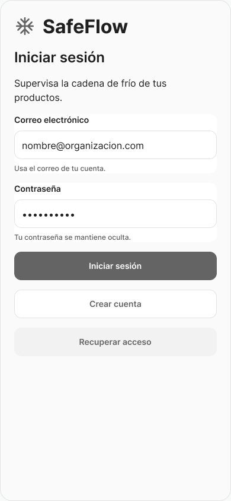</div>

<p><strong><em>Nota.</em></strong> Marco de la página safeflow_wireframes de Figma, sección VISITANTE.</p>

La Figura 64 presenta el wireframe de Crear cuenta (VISITANTE, US-30): campos de registro, aceptación de términos y acción principal.

<p><strong>Figura 64.</strong> <em>Wireframe Crear cuenta</em></p>

<div align="center">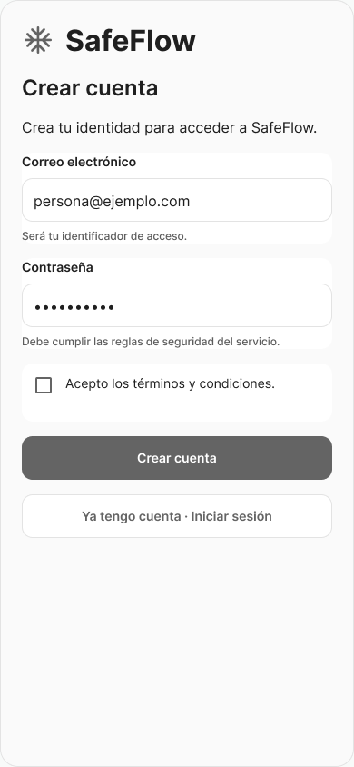</div>

<p><strong><em>Nota.</em></strong> Marco de la página safeflow_wireframes de Figma, sección VISITANTE.</p>

La Figura 65 presenta el wireframe de Resumen (SUPERVISOR, US-13): indicadores consolidados de productos, alertas y despachos.

<p><strong>Figura 65.</strong> <em>Wireframe Resumen</em></p>

<div align="center">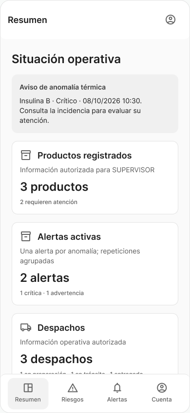</div>

<p><strong><em>Nota.</em></strong> Marco de la página safeflow_wireframes de Figma, sección SUPERVISOR.</p>

La Figura 66 presenta el wireframe de Inventario (OPERADOR, US-10): chips de filtro por estado, acción Registrar producto y tarjetas con temperatura, rango y estado.

<p><strong>Figura 66.</strong> <em>Wireframe Inventario</em></p>

<div align="center">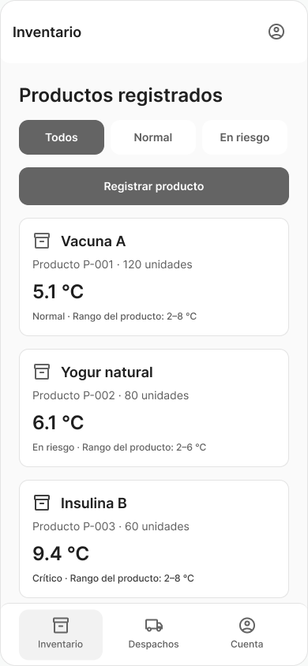</div>

<p><strong><em>Nota.</em></strong> Marco de la página safeflow_wireframes de Figma, sección OPERADOR.</p>

La Figura 67 presenta el wireframe de Registrar producto (OPERADOR, US-01): campos de nombre y rango térmico mínimo y máximo, con acción de guardado.

<p><strong>Figura 67.</strong> <em>Wireframe Registrar producto</em></p>

<div align="center">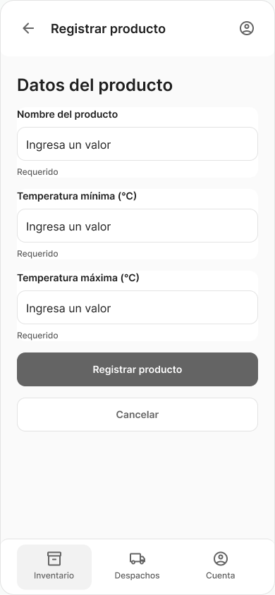</div>

<p><strong><em>Nota.</em></strong> Marco de la página safeflow_wireframes de Figma, sección OPERADOR.</p>

La Figura 68 presenta el wireframe de Detalle de producto (OPERADOR, US-03): temperatura actual, disponibilidad del sensor y datos del producto.

<p><strong>Figura 68.</strong> <em>Wireframe Detalle de producto</em></p>

<div align="center">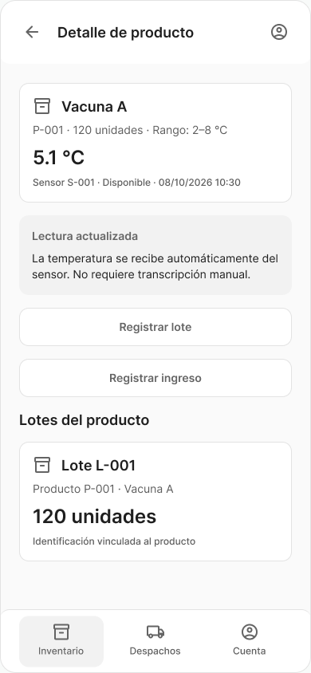</div>

<p><strong><em>Nota.</em></strong> Marco de la página safeflow_wireframes de Figma, sección OPERADOR.</p>

La Figura 69 presenta el wireframe de Registrar lote (OPERADOR, US-19): campo de identificación del lote y producto al que se asocia.

<p><strong>Figura 69.</strong> <em>Wireframe Registrar lote</em></p>

<div align="center">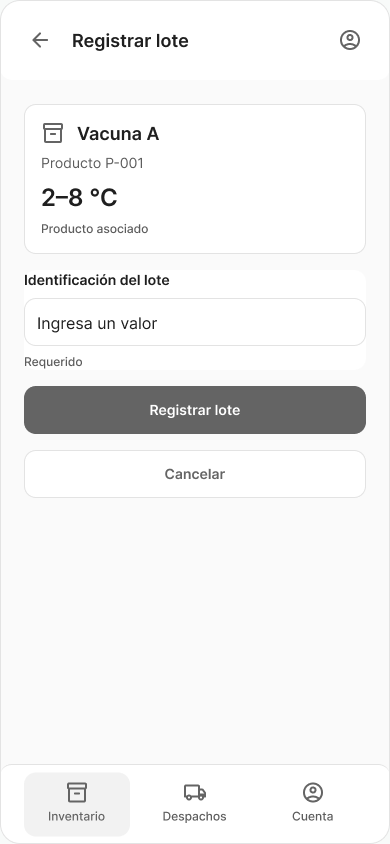</div>

<p><strong><em>Nota.</em></strong> Marco de la página safeflow_wireframes de Figma, sección OPERADOR.</p>

La Figura 70 presenta el wireframe de Registrar ingreso (OPERADOR, US-02): stock actual y campo de cantidad de unidades que ingresan.

<p><strong>Figura 70.</strong> <em>Wireframe Registrar ingreso</em></p>

<div align="center">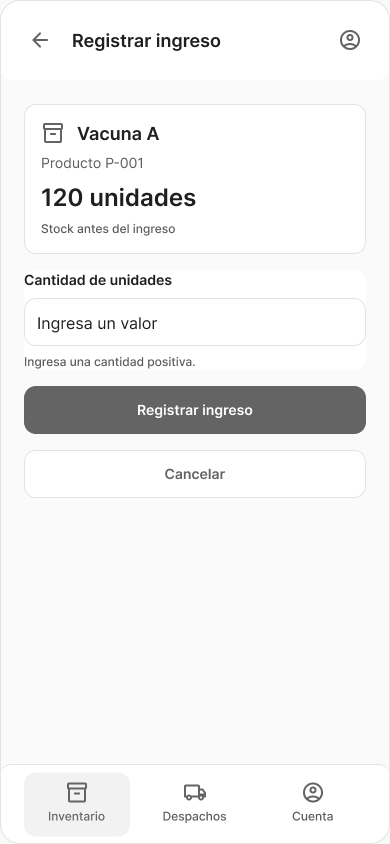</div>

<p><strong><em>Nota.</em></strong> Marco de la página safeflow_wireframes de Figma, sección OPERADOR.</p>

La Figura 71 presenta el wireframe de Historial térmico (SUPERVISOR, US-17): selector de periodo y lista de lecturas con fecha, hora y estado.

<p><strong>Figura 71.</strong> <em>Wireframe Historial térmico</em></p>

<div align="center">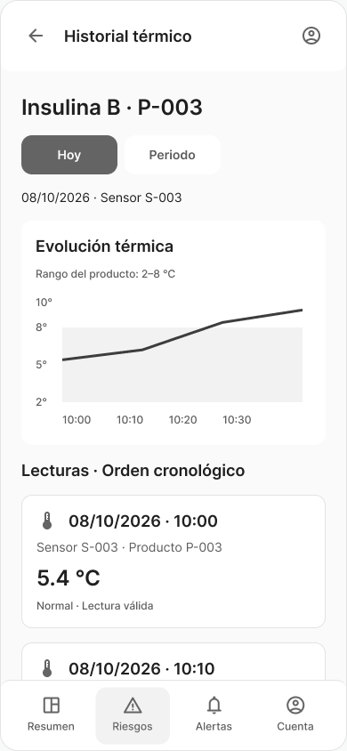</div>

<p><strong><em>Nota.</em></strong> Marco de la página safeflow_wireframes de Figma, sección SUPERVISOR.</p>

La Figura 72 presenta el wireframe de Alertas (SUPERVISOR, US-55): alertas activas con severidad y acceso al detalle del incidente.

<p><strong>Figura 72.</strong> <em>Wireframe Alertas</em></p>

<div align="center">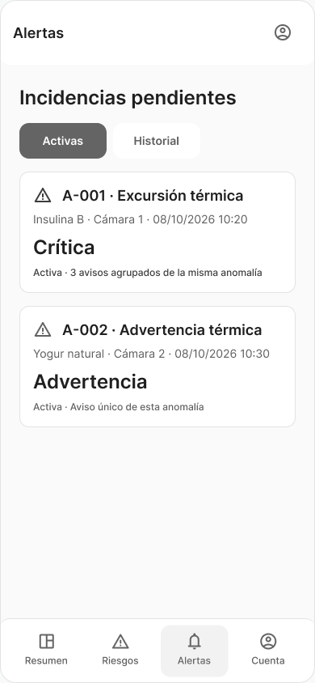</div>

<p><strong><em>Nota.</em></strong> Marco de la página safeflow_wireframes de Figma, sección SUPERVISOR.</p>

La Figura 73 presenta el wireframe de Despachos (OPERADOR, US-25): chips por estado, acción Registrar despacho y tarjetas de cada despacho.

<p><strong>Figura 73.</strong> <em>Wireframe Despachos</em></p>

<div align="center">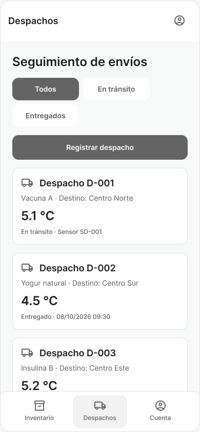</div>

<p><strong><em>Nota.</em></strong> Marco de la página safeflow_wireframes de Figma, sección OPERADOR.</p>

La Figura 74 presenta el wireframe de Validación del despacho (OPERADOR, US-47): resultado de la condición térmica y acciones para continuar, confirmar o volver.

<p><strong>Figura 74.</strong> <em>Wireframe Validación del despacho</em></p>

<div align="center">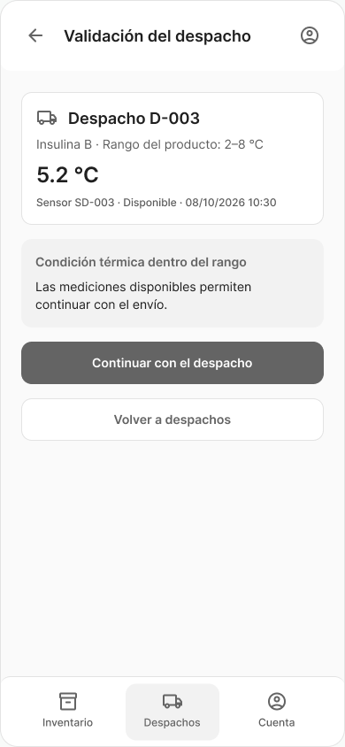</div>

<p><strong><em>Nota.</em></strong> Marco de la página safeflow_wireframes de Figma, sección OPERADOR.</p>

La Figura 75 presenta el wireframe de Permisos por rol (ADMIN, US-18): operaciones configurables por rol y acción de guardado.

<p><strong>Figura 75.</strong> <em>Wireframe Permisos por rol</em></p>

<div align="center">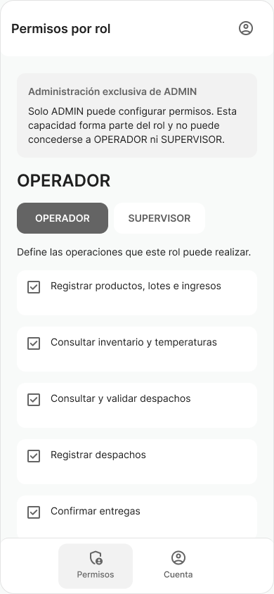</div>

<p><strong><em>Nota.</em></strong> Marco de la página safeflow_wireframes de Figma, sección ADMIN.</p>

La Figura 76 presenta el wireframe de Registrar despacho (OPERADOR, US-61): selección de producto, lote, cantidad, destino y sensor.

<p><strong>Figura 76.</strong> <em>Wireframe Registrar despacho</em></p>

<div align="center">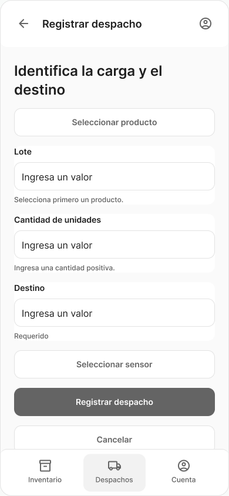</div>

<p><strong><em>Nota.</em></strong> Marco de la página safeflow_wireframes de Figma, sección OPERADOR.</p>

La Figura 77 presenta el wireframe de Inventario en tableta (OPERADOR, US-34): la misma pantalla de inventario adaptada al ancho de 768 dp.

<p><strong>Figura 77.</strong> <em>Wireframe Inventario en tableta</em></p>

<div align="center">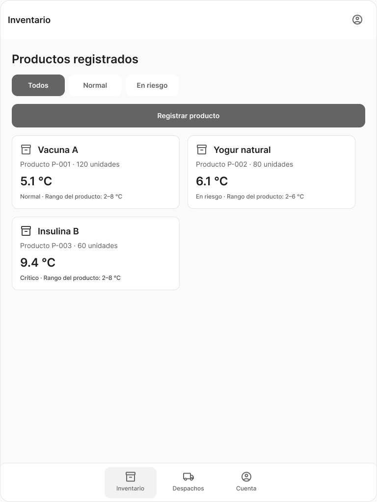</div>

<p><strong><em>Nota.</em></strong> Marco de la página safeflow_wireframes de Figma, sección OPERADOR.</p>

#### 3.1.4.2. Wireflow Diagrams

Los wireflows enlazan los wireframes de una misma tarea para mostrar cómo cambia la pantalla tras cada interacción. Cada wireflow parte de un actor y de una pantalla de inicio, representa las decisiones del sistema con nodos de decisión y recorre tanto la ruta esperada como las alternativas de error, vacío o bloqueo, de modo que cada estado diseñado queda alcanzable desde su inicio. Se elaboró un wireflow por objetivo de usuario (17 en total, versión celular), en una sola página de Figma ([SafeFlow](https://www.figma.com/design/ebf6YJVRmfKTHq2EDicpix/Safeflow?node-id=3-3704)). Las figuras siguientes los presentan en el orden de la página.

Por ejemplo, la Figura 89 muestra el flujo de validación previa al envío: el operador revisa un despacho en preparación y el sistema evalúa la condición térmica. Si está dentro del rango, el despacho puede continuar; si está en riesgo, exige una confirmación autorizada que conserva la advertencia térmica; y si no hay datos térmicos, el envío se impide y no puede confirmarse ni omitirse la validación.

La Figura 78 corresponde al wireflow de Crear cuenta (VISITANTE; cobertura de US-30).

<p><strong>Figura 78.</strong> <em>Wireflow Crear cuenta</em></p>

<div align="center">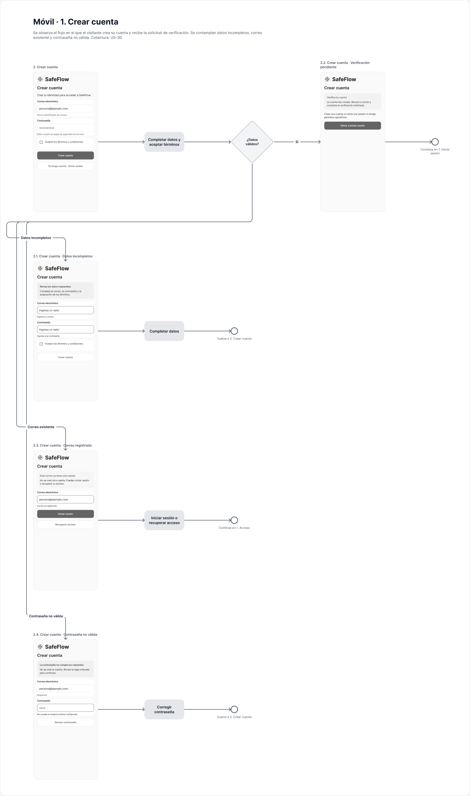</div>

<p><strong><em>Nota.</em></strong> Página safeflow_wireflows de Figma. Flujo de Crear cuenta para el actor VISITANTE.</p>

La Figura 79 corresponde al wireflow de Iniciar sesión (VISITANTE; cobertura de US-31).

<p><strong>Figura 79.</strong> <em>Wireflow Iniciar sesión</em></p>

<div align="center">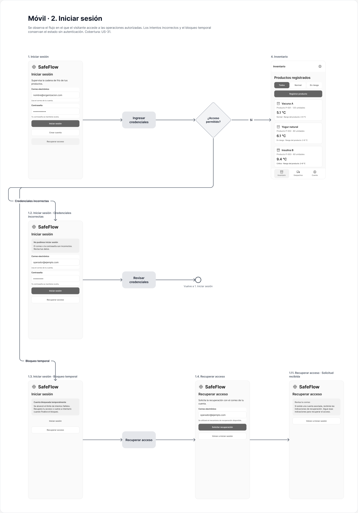</div>

<p><strong><em>Nota.</em></strong> Página safeflow_wireflows de Figma. Flujo de Iniciar sesión para el actor VISITANTE.</p>

La Figura 80 corresponde al wireflow de Productos e inventario (OPERADOR; cobertura de US-01 y US-10).

<p><strong>Figura 80.</strong> <em>Wireflow Productos e inventario</em></p>

<div align="center">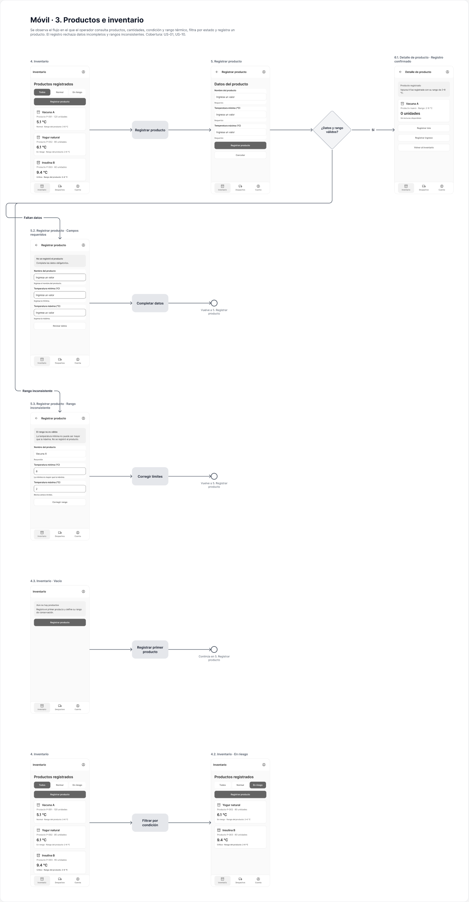</div>

<p><strong><em>Nota.</em></strong> Página safeflow_wireflows de Figma. Flujo de Productos e inventario para el actor OPERADOR.</p>

La Figura 81 corresponde al wireflow de Lotes (OPERADOR; cobertura de US-19).

<p><strong>Figura 81.</strong> <em>Wireflow Lotes</em></p>

<div align="center">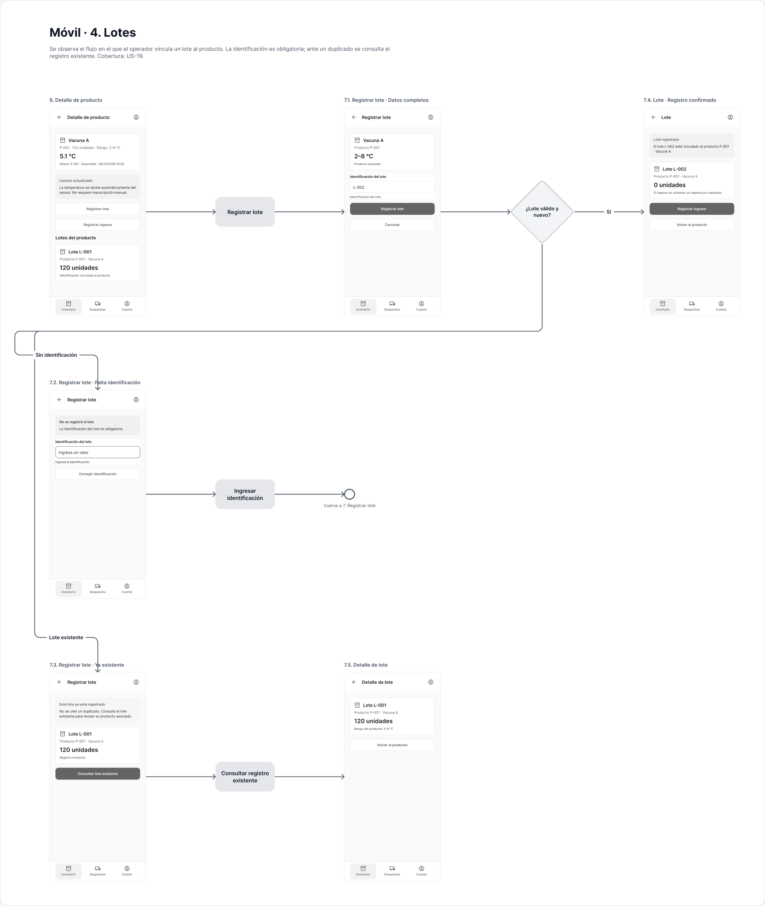</div>

<p><strong><em>Nota.</em></strong> Página safeflow_wireflows de Figma. Flujo de Lotes para el actor OPERADOR.</p>

La Figura 82 corresponde al wireflow de Ingresos de stock (OPERADOR; cobertura de US-02).

<p><strong>Figura 82.</strong> <em>Wireflow Ingresos de stock</em></p>

<div align="center">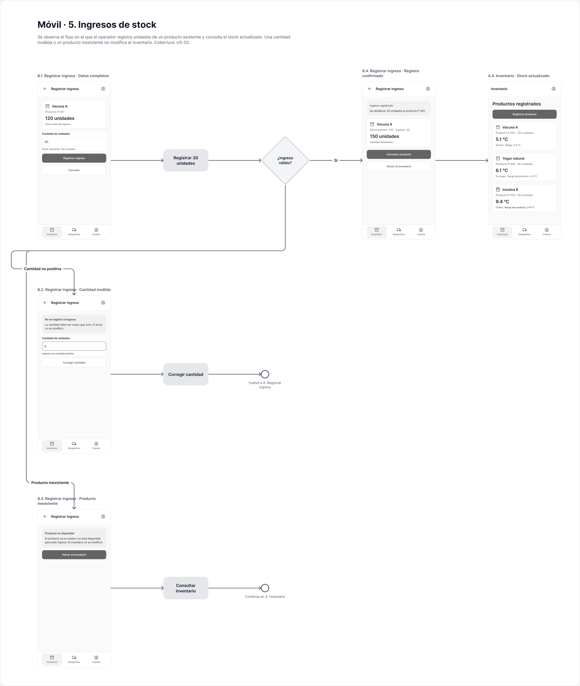</div>

<p><strong><em>Nota.</em></strong> Página safeflow_wireflows de Figma. Flujo de Ingresos de stock para el actor OPERADOR.</p>

La Figura 83 corresponde al wireflow de Monitoreo térmico (OPERADOR; cobertura de US-03 y US-52).

<p><strong>Figura 83.</strong> <em>Wireflow Monitoreo térmico</em></p>

<div align="center">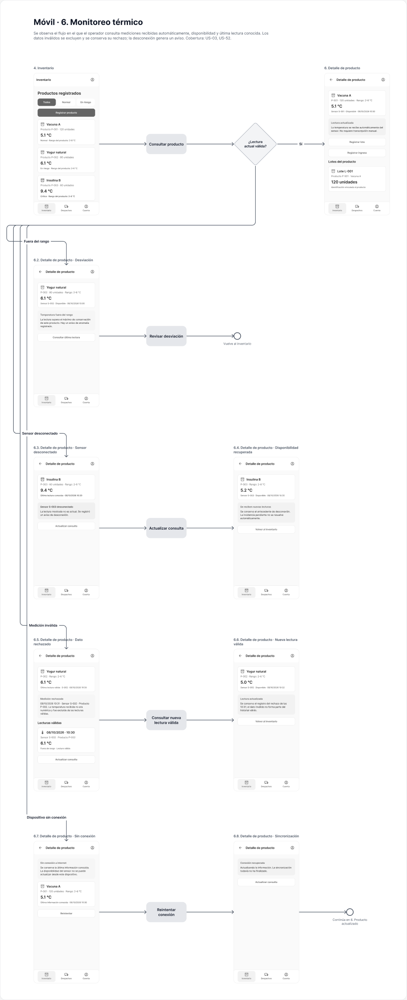</div>

<p><strong><em>Nota.</em></strong> Página safeflow_wireflows de Figma. Flujo de Monitoreo térmico para el actor OPERADOR.</p>

La Figura 84 corresponde al wireflow de Riesgos y anomalías (SUPERVISOR; cobertura de US-04 y US-20).

<p><strong>Figura 84.</strong> <em>Wireflow Riesgos y anomalías</em></p>

<div align="center">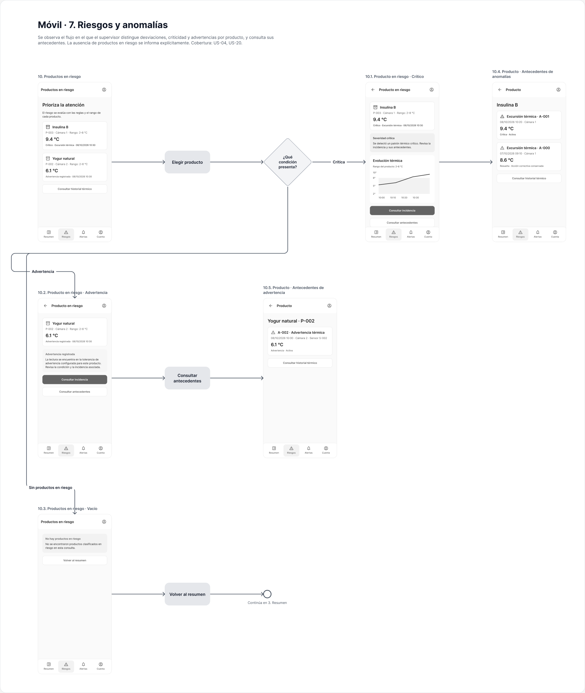</div>

<p><strong><em>Nota.</em></strong> Página safeflow_wireflows de Figma. Flujo de Riesgos y anomalías para el actor SUPERVISOR.</p>

La Figura 85 corresponde al wireflow de Historial térmico (SUPERVISOR; cobertura de US-17).

<p><strong>Figura 85.</strong> <em>Wireflow Historial térmico</em></p>

<div align="center">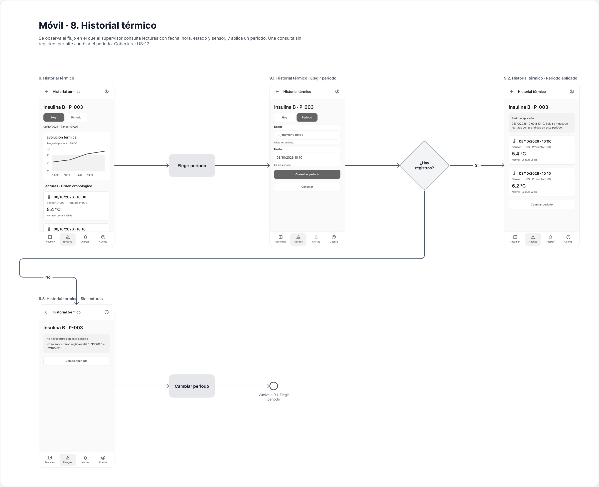</div>

<p><strong><em>Nota.</em></strong> Página safeflow_wireflows de Figma. Flujo de Historial térmico para el actor SUPERVISOR.</p>

La Figura 86 corresponde al wireflow de Alertas e incidencias (SUPERVISOR; cobertura de US-05, US-06 y US-55).

<p><strong>Figura 86.</strong> <em>Wireflow Alertas e incidencias</em></p>

<div align="center">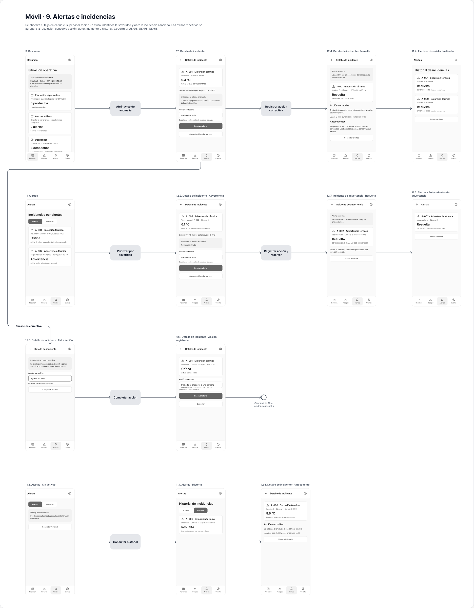</div>

<p><strong><em>Nota.</em></strong> Página safeflow_wireflows de Figma. Flujo de Alertas e incidencias para el actor SUPERVISOR.</p>

La Figura 87 corresponde al wireflow de Seguimiento de despachos (OPERADOR; cobertura de US-07 y US-25).

<p><strong>Figura 87.</strong> <em>Wireflow Seguimiento de despachos</em></p>

<div align="center">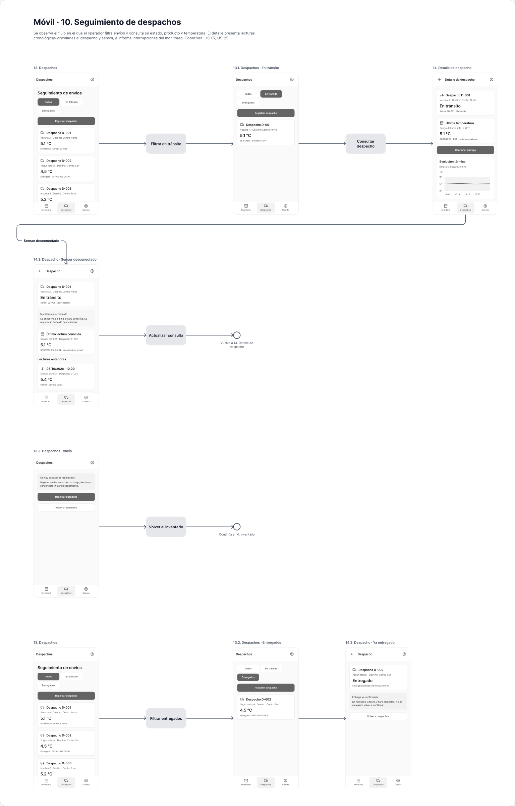</div>

<p><strong><em>Nota.</em></strong> Página safeflow_wireflows de Figma. Flujo de Seguimiento de despachos para el actor OPERADOR.</p>

La Figura 88 corresponde al wireflow de Confirmar entrega (OPERADOR; cobertura de US-24).

<p><strong>Figura 88.</strong> <em>Wireflow Confirmar entrega</em></p>

<div align="center">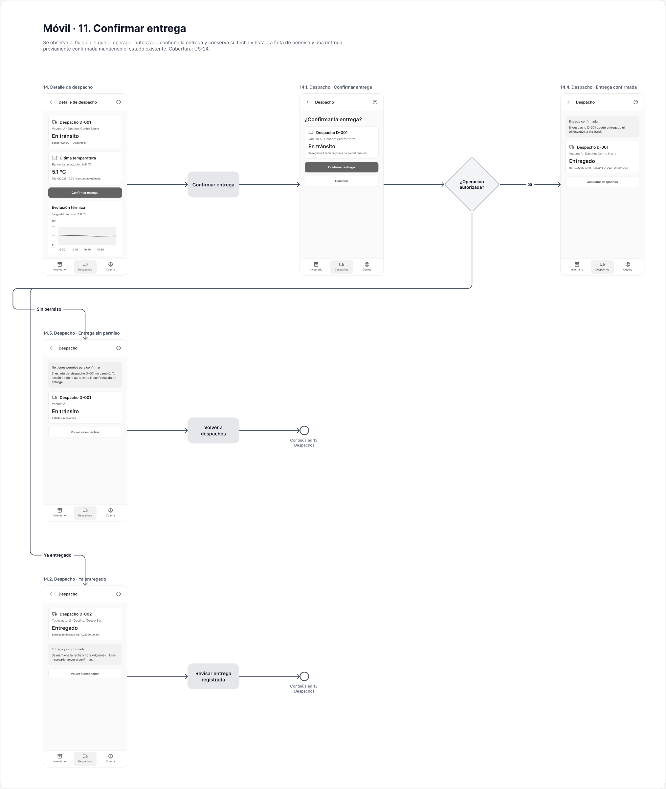</div>

<p><strong><em>Nota.</em></strong> Página safeflow_wireflows de Figma. Flujo de Confirmar entrega para el actor OPERADOR.</p>

La Figura 89 corresponde al wireflow de Validación previa al envío (OPERADOR; cobertura de US-47).

<p><strong>Figura 89.</strong> <em>Wireflow Validación previa al envío</em></p>

<div align="center">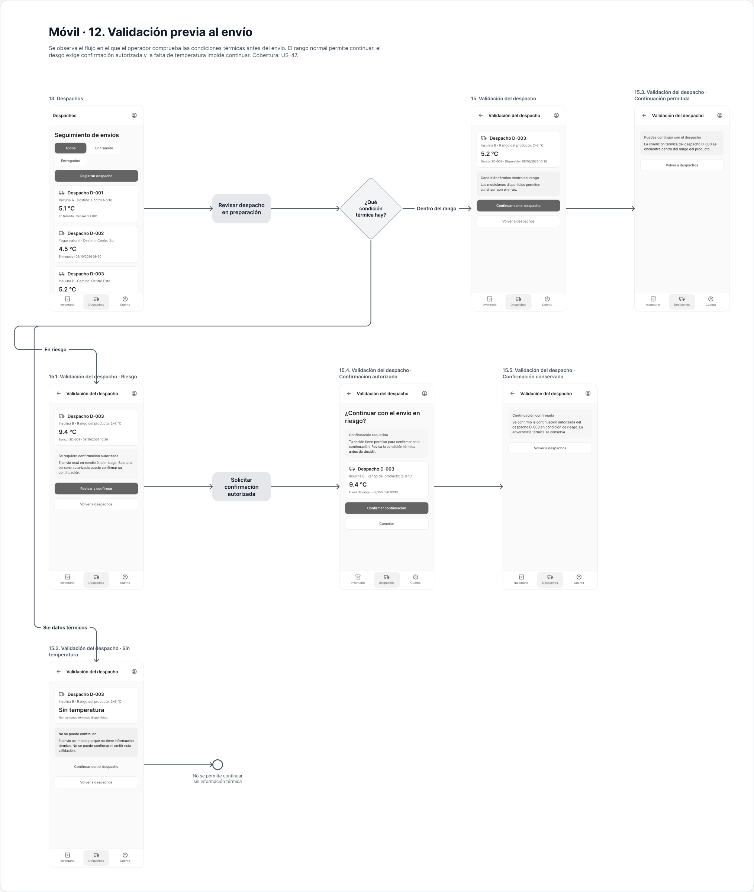</div>

<p><strong><em>Nota.</em></strong> Página safeflow_wireflows de Figma. Flujo de Validación previa al envío para el actor OPERADOR.</p>

La Figura 90 corresponde al wireflow de Resumen operativo (SUPERVISOR; cobertura de US-13).

<p><strong>Figura 90.</strong> <em>Wireflow Resumen operativo</em></p>

<div align="center">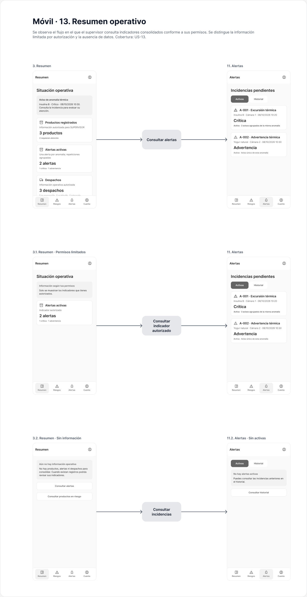</div>

<p><strong><em>Nota.</em></strong> Página safeflow_wireflows de Figma. Flujo de Resumen operativo para el actor SUPERVISOR.</p>

La Figura 91 corresponde al wireflow de Permisos por rol (ADMIN; cobertura de US-18).

<p><strong>Figura 91.</strong> <em>Wireflow Permisos por rol</em></p>

<div align="center">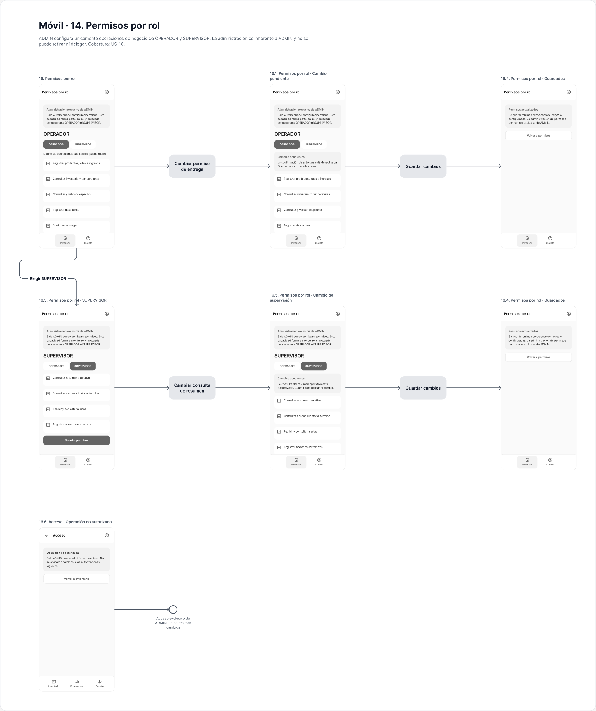</div>

<p><strong><em>Nota.</em></strong> Página safeflow_wireflows de Figma. Flujo de Permisos por rol para el actor ADMIN.</p>

La Figura 92 corresponde al wireflow de Cuenta y sesión compartida (USUARIO AUTENTICADO; cobertura de US-42).

<p><strong>Figura 92.</strong> <em>Wireflow Cuenta y sesión compartida</em></p>

<div align="center">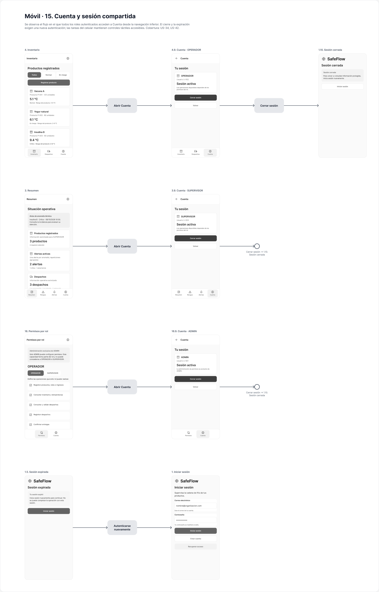</div>

<p><strong><em>Nota.</em></strong> Página safeflow_wireflows de Figma. Flujo de Cuenta y sesión compartida para el actor USUARIO AUTENTICADO.</p>

La Figura 93 corresponde al wireflow de Uso móvil en tableta (USUARIO AUTENTICADO; cobertura de US-34).

<p><strong>Figura 93.</strong> <em>Wireflow Uso móvil en tableta</em></p>

<div align="center">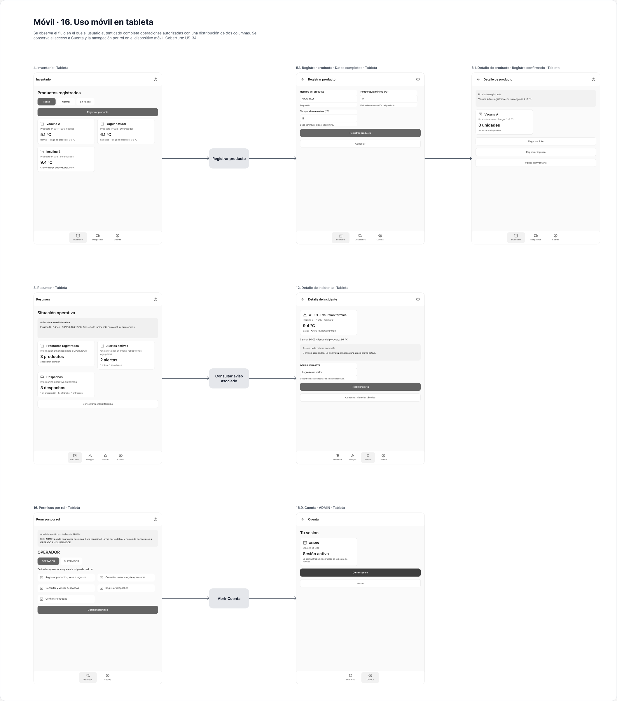</div>

<p><strong><em>Nota.</em></strong> Página safeflow_wireflows de Figma. Flujo de Uso móvil en tableta para el actor USUARIO AUTENTICADO.</p>

La Figura 94 corresponde al wireflow de Registrar despacho (OPERADOR; cobertura de US-61).

<p><strong>Figura 94.</strong> <em>Wireflow Registrar despacho</em></p>

<div align="center">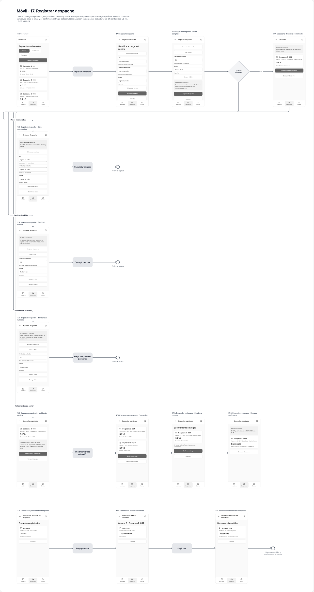</div>

<p><strong><em>Nota.</em></strong> Página safeflow_wireflows de Figma. Flujo de Registrar despacho para el actor OPERADOR.</p>

#### 3.1.4.3. Mock-ups

Los mock-ups aplican el sistema visual de 3.1.1 a las 17 pantallas. A continuación se presentan 15 capturas representativas, agrupadas por actor, con las historias de usuario que cada una atiende. Todas se construyeron con instancias de componentes SafeFlow y con variables de color y tipografía, de modo que un cambio en el sistema se propaga a todas las pantallas. Los marcos reales de Figma incluyen para cada pantalla variantes de estado: datos completos, vacío (sin registros), error de validación y, donde aplica, estados de bloqueo o confirmación.

##### VISITANTE

El visitante aún no tiene sesión y solo accede a dos pantallas, con la marca y la frase de apoyo como encabezado.

La Figura 95 muestra la pantalla Iniciar sesión (US-31): correo y contraseña con texto de ayuda, el botón primario «Iniciar sesión», el secundario «Crear cuenta» y el tonal «Recuperar acceso». Sus estados cubren datos completos, credenciales incorrectas (error en el campo) y bloqueo temporal.

<p><strong>Figura 95.</strong> <em>Mock-up Iniciar sesión</em></p>

<div align="center">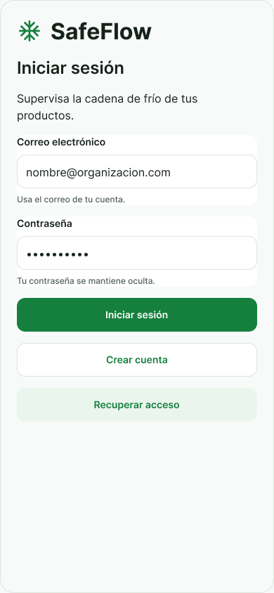</div>

<p><strong><em>Nota.</em></strong> Marco de celular de la sección 01 VISITANTE en Figma.</p>

La Figura 96 presenta Crear cuenta (US-30): correo, contraseña con la indicación de reglas de seguridad y casilla de aceptación de términos. Los estados incluyen correo ya existente y contraseña no admisible.

<p><strong>Figura 96.</strong> <em>Mock-up Crear cuenta</em></p>

<div align="center">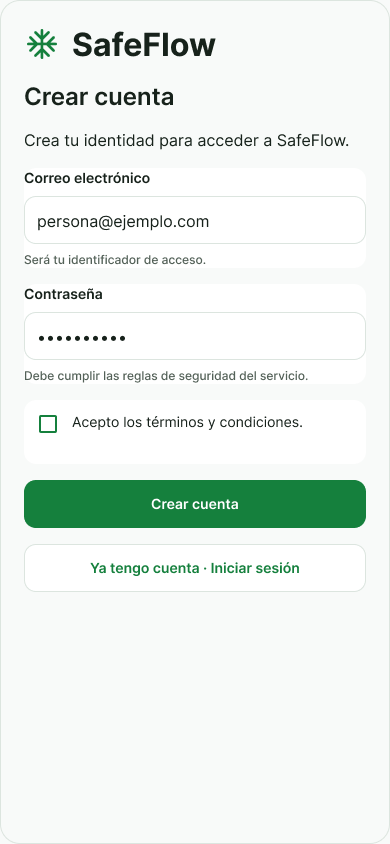</div>

<p><strong><em>Nota.</em></strong> Marco de celular de la sección 01 VISITANTE en Figma.</p>

##### OPERADOR

El OPERADOR gestiona inventario y despachos con la barra inferior Inventario, Despachos y Cuenta.

La Figura 97 muestra Inventario (US-10): título «Productos registrados», chips Todos, Normal y En riesgo, el botón «Registrar producto» y tarjetas con nombre, código, unidades, temperatura actual y rango del producto. El color del icono y de la etiqueta (verde, ámbar y rojo) acompaña al texto de estado. Tiene estados con datos completos, inventario vacío y consulta por estado.

<p><strong>Figura 97.</strong> <em>Mock-up Inventario</em></p>

<div align="center">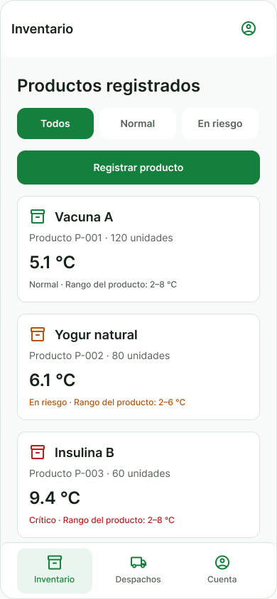</div>

<p><strong><em>Nota.</em></strong> Marco de celular de la sección 03 OPERADOR en Figma.</p>

La Figura 98 presenta Registrar producto (US-01), con nombre y rango de temperatura mínima y máxima, cada campo marcado como requerido. Sus estados incluyen datos incompletos y rango invertido.

<p><strong>Figura 98.</strong> <em>Mock-up Registrar producto</em></p>

<div align="center">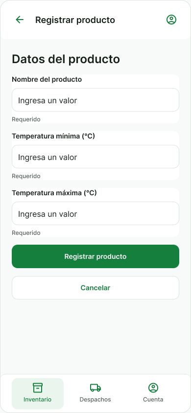</div>

<p><strong><em>Nota.</em></strong> Marco de celular de la sección 03 OPERADOR en Figma.</p>

La Figura 99 muestra Detalle de producto (US-03 y US-10): temperatura actual, sensor, disponibilidad y hora, un aviso «Lectura actualizada» que indica que no se requiere transcripción manual, accesos a «Registrar lote» y «Registrar ingreso» y la lista de lotes. Sus estados incluyen sensor desconectado, sin lotes y excursión térmica.

<p><strong>Figura 99.</strong> <em>Mock-up Detalle de producto</em></p>

<div align="center">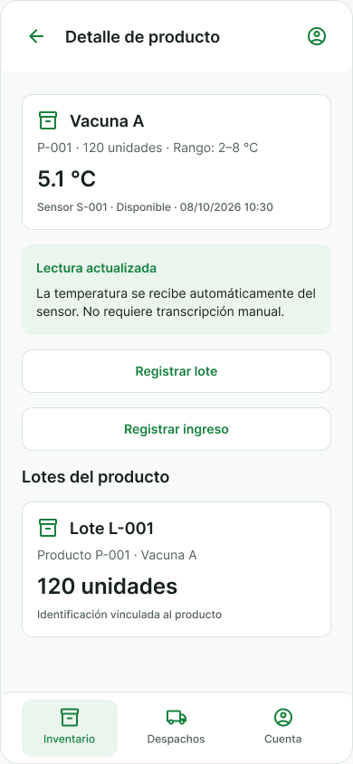</div>

<p><strong><em>Nota.</em></strong> Marco de celular de la sección 03 OPERADOR en Figma.</p>

La Figura 100 corresponde a Registrar lote (US-19): una tarjeta del producto asociado y el campo de identificación del lote. Sus estados incluyen identificación vacía y lote existente.

<p><strong>Figura 100.</strong> <em>Mock-up Registrar lote</em></p>

<div align="center">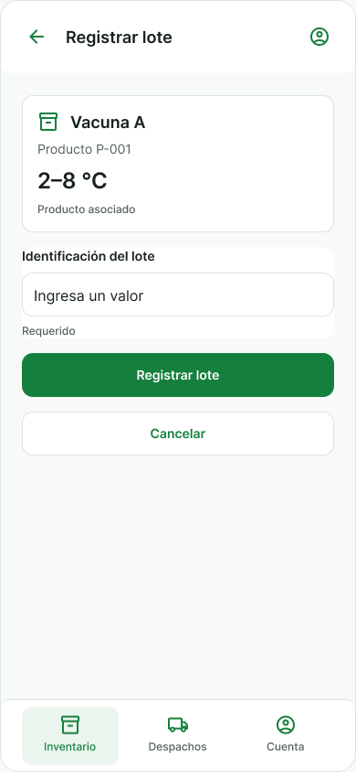</div>

<p><strong><em>Nota.</em></strong> Marco de celular de la sección 03 OPERADOR en Figma.</p>

La Figura 101 muestra Registrar ingreso (US-02): el stock antes del ingreso («120 unidades») y el campo de cantidad. Sus estados incluyen cantidad no positiva y producto inexistente.

<p><strong>Figura 101.</strong> <em>Mock-up Registrar ingreso</em></p>

<div align="center">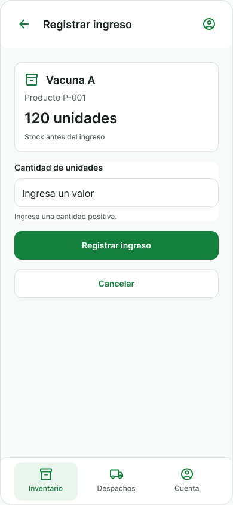</div>

<p><strong><em>Nota.</em></strong> Marco de celular de la sección 03 OPERADOR en Figma.</p>

La Figura 102 presenta Despachos (US-25): chips Todos, En tránsito y Entregados, el botón «Registrar despacho» y tarjetas con producto, destino, temperatura, estado y sensor. Admite estados con datos completos, sin envíos y consulta por estado.

<p><strong>Figura 102.</strong> <em>Mock-up Despachos</em></p>

<div align="center">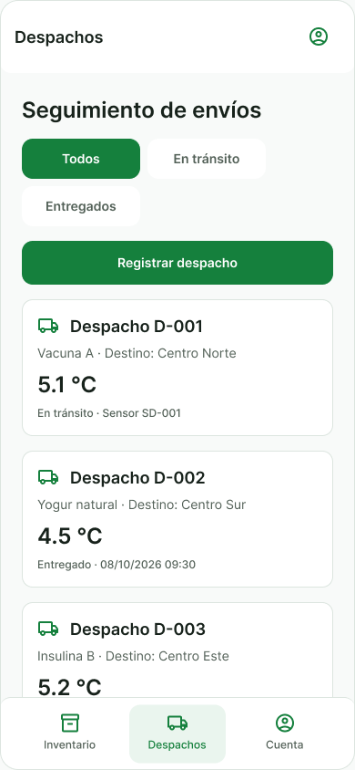</div>

<p><strong><em>Nota.</em></strong> Marco de celular de la sección 03 OPERADOR en Figma.</p>

La Figura 103 muestra Registrar despacho (US-61): selectores de producto y de sensor, campos de lote, cantidad y destino, y los botones de registro y cancelación. El despacho queda en preparación hasta validar su condición térmica. Sus estados incluyen datos incompletos, cantidad no válida y referencias inconsistentes.

<p><strong>Figura 103.</strong> <em>Mock-up Registrar despacho</em></p>

<div align="center">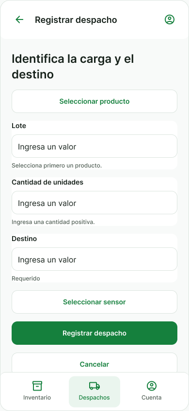</div>

<p><strong><em>Nota.</em></strong> Marco de celular de la sección 03 OPERADOR en Figma.</p>

La Figura 104 presenta Validación del despacho (US-47): el producto, su rango, la última temperatura y un aviso verde «Condición térmica dentro del rango» con el botón «Continuar con el despacho». Los demás estados cubren riesgo con confirmación autorizada y bloqueo por falta de datos, y desde allí la entrega se confirma (US-24).

<p><strong>Figura 104.</strong> <em>Mock-up Validación del despacho</em></p>

<div align="center">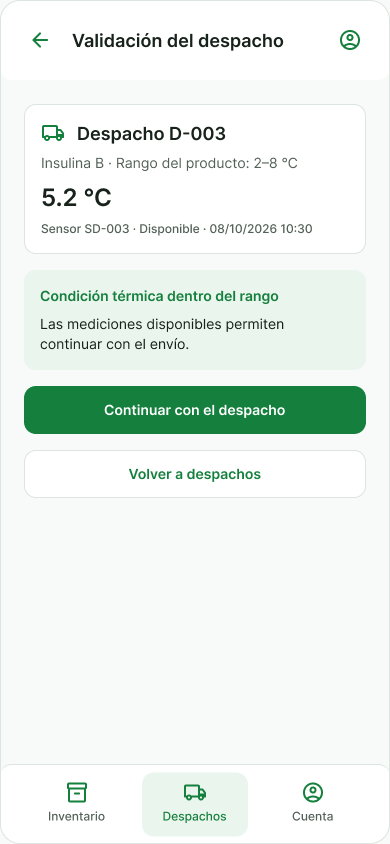</div>

<p><strong><em>Nota.</em></strong> Marco de celular de la sección 03 OPERADOR en Figma.</p>

##### SUPERVISOR

El SUPERVISOR evalúa la situación operativa con la barra Resumen, Riesgos, Alertas y Cuenta.

La Figura 105 muestra Resumen (US-13): un aviso crítico con la última anomalía y tarjetas de indicadores de productos, alertas activas y despachos. Tiene estados con datos, alcance por rol y ausencia de datos.

<p><strong>Figura 105.</strong> <em>Mock-up Resumen</em></p>

<div align="center">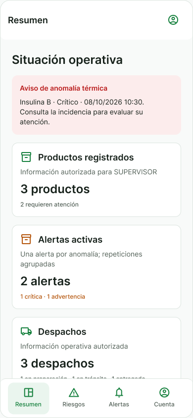</div>

<p><strong><em>Nota.</em></strong> Marco de celular de la sección 04 SUPERVISOR en Figma.</p>

La Figura 106 presenta Alertas (US-55 y US-05): chips Activas e Historial y tarjetas que distinguen la severidad (crítica y advertencia) e indican que se agrupan los avisos repetidos de una misma anomalía. Al abrir una alerta se llega al detalle de incidente, donde se registra la acción correctiva (US-06). Sus estados incluyen ausencia de alertas activas y alerta resuelta.

<p><strong>Figura 106.</strong> <em>Mock-up Alertas</em></p>

<div align="center">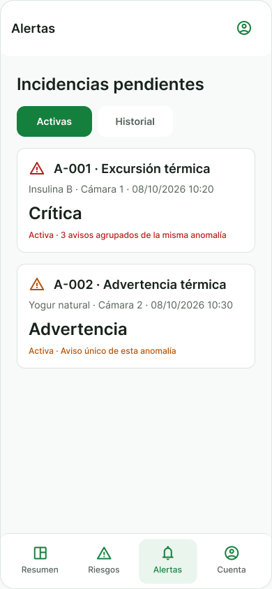</div>

<p><strong><em>Nota.</em></strong> Marco de celular de la sección 04 SUPERVISOR en Figma.</p>

La Figura 107 muestra Historial térmico (US-17): el gráfico de evolución con la banda del rango del producto sombreada y la lista de lecturas en orden cronológico, con filtros Hoy y Periodo. Sus estados incluyen historial completo, ausencia de registros y consulta por periodo.

<p><strong>Figura 107.</strong> <em>Mock-up Historial térmico</em></p>

<div align="center">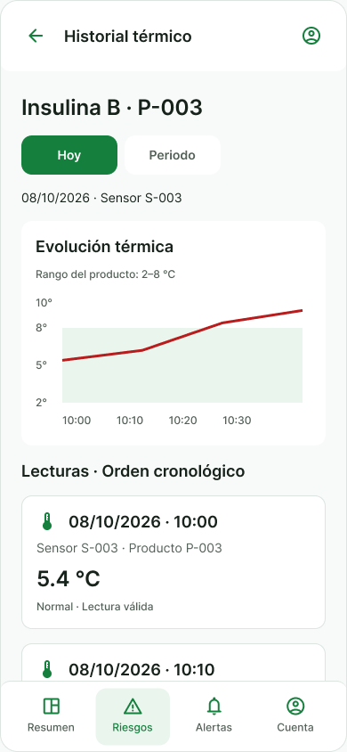</div>

<p><strong><em>Nota.</em></strong> Marco de celular de la sección 04 SUPERVISOR en Figma.</p>

##### ADMIN

La Figura 108 presenta Permisos por rol (US-18): un aviso que declara que la administración de permisos es exclusiva de ADMIN y no puede concederse a OPERADOR ni a SUPERVISOR, un selector de rol y casillas con las operaciones permitidas. Sus estados incluyen cambios guardados y rechazo de cambios no autorizados.

<p><strong>Figura 108.</strong> <em>Mock-up Permisos por rol</em></p>

<div align="center">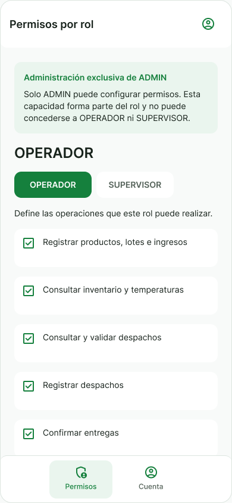</div>

<p><strong><em>Nota.</em></strong> Marco de celular de la sección 05 ADMIN en Figma.</p>

##### Versión de tableta

La Figura 109 muestra Inventario en tableta (US-34). La estructura es idéntica a la del celular; las tarjetas se distribuyen en dos columnas y la barra inferior se centra, para aprovechar el ancho sin cambiar el modelo mental del usuario. Las pantallas de tableta existen para los 17 destinos y sus estados.

<p><strong>Figura 109.</strong> <em>Mock-up Inventario en tableta</em></p>

<div align="center">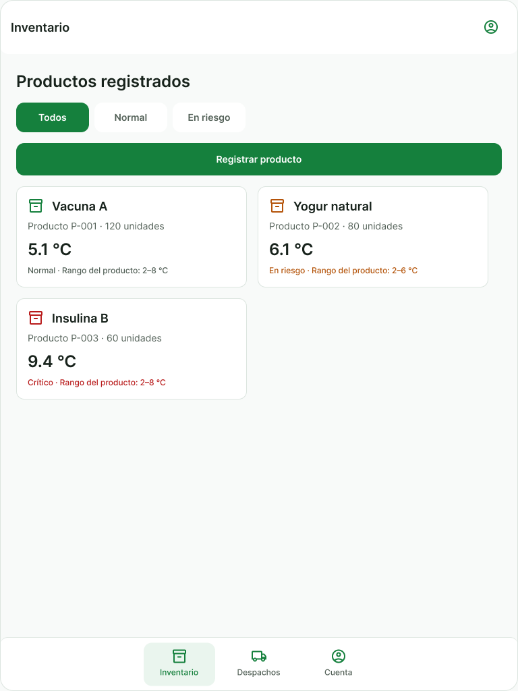</div>

<p><strong><em>Nota.</em></strong> Marco de tableta (768 x 1024 dp) de la sección 03 OPERADOR en Figma.</p>

Como conjunto, los 15 mock-ups muestran que los tres roles comparten encabezado, tarjetas, chips y botones, y que la diferencia entre ellos está en los destinos y operaciones disponibles, no en el aspecto.

#### 3.1.4.4. User Flow Diagrams

Los flujos de usuario describen, para un objetivo concreto, la ruta esperada (happy path) y las rutas alternativas (unhappy paths) entre las pantallas diseñadas y los estados de sus marcos. Se presentan cuatro objetivos de usuario; los nodos de pantalla coinciden con los nombres de los mock-ups de 3.1.4.3.

**Objetivo 1: Registrar producto y lote (OPERADOR).** El OPERADOR quiere dejar un producto con su rango de temperatura y un lote asociado para que pueda monitorearse. Parte de Inventario, abre el formulario, y el sistema valida que el nombre exista y que el rango sea coherente (mínima menor que máxima). Si falla, permanece en el formulario con el error; si tiene éxito, se emite Producto registrado y puede registrar el lote desde el detalle, donde una identificación vacía o repetida produce error. La Figura 110 lo resume.

<p><strong>Figura 110.</strong> <em>User flow: Registrar producto y lote</em></p>

<div align="center">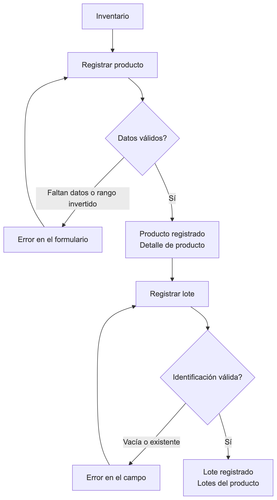</div>

<p><strong><em>Nota.</em></strong> Elaboración propia a partir de los mock-ups Registrar producto, Detalle de producto y Registrar lote.</p>

**Objetivo 2: Registrar despacho, validar la condición térmica y confirmar la entrega (OPERADOR).** El OPERADOR quiere enviar una carga con la seguridad de que su temperatura es admisible. Registra el despacho (queda en preparación), solicita la validación y la aplicación evalúa las mediciones del sensor: si están dentro del rango, se puede continuar con el envío; si hay riesgo, solo un usuario autorizado puede confirmar la continuación; si no hay datos, el envío se bloquea. Luego del envío, el OPERADOR confirma la entrega. La Figura 111 muestra el recorrido.

<p><strong>Figura 111.</strong> <em>User flow: Registrar despacho y confirmar entrega</em></p>

<div align="center">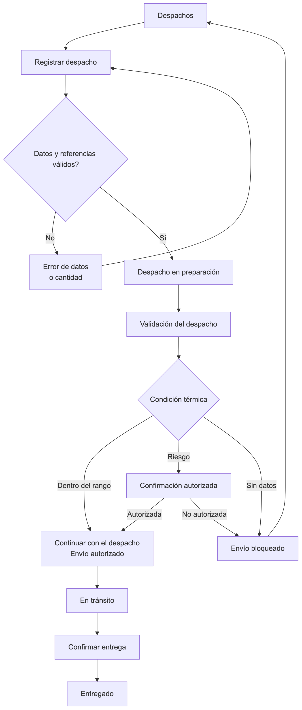</div>

<p><strong><em>Nota.</em></strong> Elaboración propia. Los estados de condición térmica proceden de los marcos de Validación del despacho.</p>

**Objetivo 3: Atender una alerta (SUPERVISOR).** El SUPERVISOR quiere resolver una incidencia térmica y dejar constancia. Recibe el aviso, abre Alertas, distingue la severidad y entra al detalle del incidente; allí registra la acción correctiva. Si no la completa, la alerta permanece activa; si la registra, queda resuelta y pasa al Historial. Si no hay alertas activas, se muestra un estado vacío. La Figura 112 describe el flujo.

<p><strong>Figura 112.</strong> <em>User flow: Atender una alerta</em></p>

<div align="center">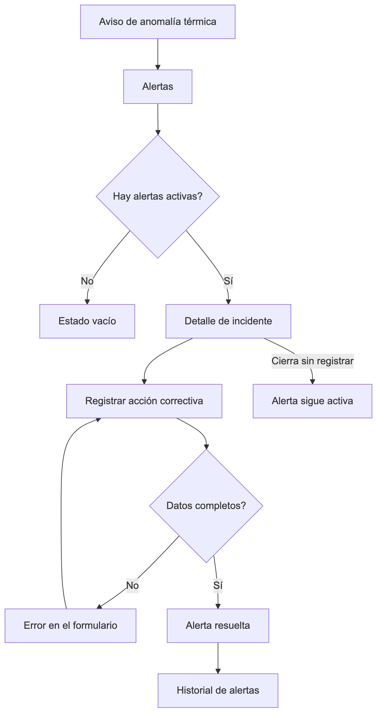</div>

<p><strong><em>Nota.</em></strong> Elaboración propia a partir de los mock-ups Alertas y Detalle de incidente.</p>

**Objetivo 4: Iniciar sesión (VISITANTE).** El VISITANTE quiere acceder con su cuenta. Si las credenciales son correctas, pasa a USUARIO AUTENTICADO y entra al primer destino de su rol. Si fallan, se muestra el error; tras intentos fallidos repetidos, la cuenta queda bloqueada temporalmente. Más adelante, si la sesión se cierra o expira, vuelve a Iniciar sesión. La Figura 113 lo resume.

<p><strong>Figura 113.</strong> <em>User flow: Iniciar sesión, bloqueo temporal y sesión expirada</em></p>

<div align="center">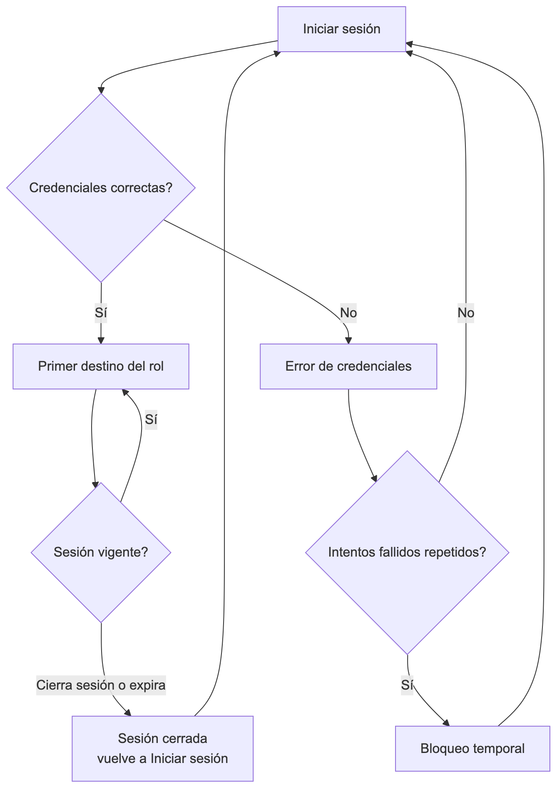</div>

<p><strong><em>Nota.</em></strong> Elaboración propia. Cubre los estados de credenciales incorrectas y bloqueo temporal y el cierre o expiración de la sesión.</p>

Los cuatro flujos son consistentes con los wireflows de 3.1.4.2: cada nodo de pantalla existe como mock-up y cada ruta alternativa corresponde a un estado de error, vacío o bloqueo diseñado.

#### 3.1.4.5. Prototyping

El prototipo de Figma conecta los marcos de celular y tableta para simular la navegación real: la barra inferior cambia de destino según el rol, los chips filtran las listas, las tarjetas abren su detalle y los botones de registro llevan a sus formularios y de vuelta con su estado resultante. Las interacciones siguen las decisiones de arquitectura de información: navegación inferior por rol, navegación jerárquica con retorno y acceso a Cuenta desde el encabezado. El prototipo incluye los recorridos de los flujos de 3.1.4.4, entre ellos el despacho conectado hasta la entrega con sus errores de datos, cantidad y referencias, y se verificó que no existan enlaces rotos, taps sin destino ni escenarios inalcanzables desde sus puntos de partida. El prototipo está disponible en el archivo [SafeFlow](https://www.figma.com/design/ebf6YJVRmfKTHq2EDicpix/Safeflow).

**Video de demostración:** [Ver video de prueba](https://upcedupe-my.sharepoint.com/:v:/g/personal/u202123362_upc_edu_pe/IQBOGScGWfb5SLhtzpTS27uxAZd_MAZNwiqPsrOLz1ZA2YY?nav=eyJyZWZlcnJhbEluZm8iOnsicmVmZXJyYWxBcHAiOiJPbmVEcml2ZUZvckJ1c2luZXNzIiwicmVmZXJyYWxBcHBQbGF0Zm9ybSI6IldlYiIsInJlZmVycmFsTW9kZSI6InZpZXciLCJyZWZlcnJhbFZpZXciOiJNeUZpbGVzTGlua0NvcHkifX0&e=scIjL5)

<div style="page-break-after: always;"></div>

# Capítulo IV: Product Implementation & Validation

Este capítulo documenta cómo el equipo implementa, comprueba, despliega y valida SafeFlow, la aplicación móvil Android que supervisa la cadena de frío de productos farmacéuticos y alimenticios. Reúne las decisiones de gestión de la configuración del software, la planificación y ejecución del Sprint 1 (entrega del Trabajo Parcial TB1) y el diseño de las validaciones con usuarios de los segmentos objetivo. La solución se compone de la aplicación Android principal, una aplicación emuladora que alimenta el servicio compartido y ese servicio remoto; este informe se centra en la aplicación principal, cuya base técnica ya existe, y deja señalado de forma explícita lo que aún no cuenta con evidencia.

## 4.1. Software Configuration Management

La gestión de la configuración del software establece las herramientas, las reglas de control de versiones, las convenciones de código y el mecanismo de despliegue que mantienen la consistencia del producto durante su ciclo de vida. Las secciones siguientes describen cada una de estas decisiones y las razones por las que se adoptaron en un equipo de cuatro integrantes que trabaja por Sprints.

### 4.1.1. Software Development Environment Configuration

El equipo usa un conjunto reducido de productos de software para cubrir todas las actividades del ciclo de vida: gestión del proyecto, gestión de requisitos, diseño UX/UI, desarrollo, pruebas, despliegue y documentación. La Tabla 89 lista cada producto con su propósito, su ruta de referencia o descarga y el tipo de actividad que soporta, de modo que cualquier integrante pueda reproducir el entorno de trabajo. Las versiones de las herramientas de construcción corresponden a las que el proyecto Android verifica hoy mediante `assembleDebug`, `testDebugUnitTest` y `lintDebug`.

<p><strong>Tabla 89.</strong> <em>Productos de software del entorno de desarrollo</em></p>

| Producto | Propósito en el proyecto | Ruta de referencia o descarga | Tipo de actividad |
|:---|:---|:---|:---|
| Android Studio | IDE oficial para desarrollar, depurar y ejecutar la aplicación Android | https://developer.android.com/studio | Software Development |
| Gradle 9.6.0 con Android Gradle Plugin 9.4.1 | Construcción del módulo `:app`, gestión de dependencias y tareas de verificación | https://gradle.org | Software Development, Software Deployment |
| Kotlin 2.4.20 | Lenguaje de programación de la aplicación | https://kotlinlang.org | Software Development |
| Jetpack Compose (BOM 2026.09.00) | Interfaz declarativa de la capa de presentación | https://developer.android.com/compose | Software Development, Product UX/UI Design |
| Hilt y KSP | Inyección de dependencias y procesamiento de símbolos en tiempo de compilación | https://dagger.dev/hilt | Software Development |
| Retrofit y Gson | Consumo del servicio compartido vía REST sobre HTTPS | https://square.github.io/retrofit | Software Development |
| Room 3 | Persistencia local estructurada | https://developer.android.com/training/data-storage/room | Software Development |
| DataStore | Persistencia local de preferencias y datos de sesión | https://developer.android.com/topic/libraries/architecture/datastore | Software Development |
| Coil | Carga de imágenes en Compose | https://coil-kt.github.io/coil | Software Development |
| JUnit y herramientas de prueba de Android | Pruebas unitarias (`testDebugUnitTest`) y análisis estático (`lintDebug`) | https://developer.android.com/training/testing | Software Testing |
| Figma | Diseño de mockups, sistema visual y prototipos navegables | https://www.figma.com | Product UX/UI Design |
| EventStorming | Descubrimiento de eventos, comandos y límites de contexto | https://www.eventstorming.com | Requirements Management |
| Mermaid | Diagramas como código dentro de los documentos Markdown | https://mermaid.js.org | Software Documentation |
| Structurizr (modelo C4) | Referencia para los diagramas de contexto, contenedores y componentes | https://structurizr.com | Software Documentation |
| Firebase App Distribution | Distribución de compilaciones a los usuarios de validación | https://firebase.google.com/docs/app-distribution | Software Deployment |
| GitHub | Repositorios, ramas, Pull Requests y analíticas de commits | https://github.com | Project Management, Source Code Management |
| Markdown | Formato de este informe y de la documentación técnica | https://commonmark.org | Software Documentation |

<p><strong><em>Nota.</em></strong> Elaboración propia. Las versiones de Gradle, Android Gradle Plugin, Kotlin y Compose BOM corresponden a la configuración vigente del proyecto Android.</p>

Como muestra la Tabla 89, las herramientas de desarrollo se concentran en el ecosistema oficial de Android, mientras que el diseño y la documentación usan herramientas que producen artefactos versionables, lo que facilita la revisión por pares dentro del repositorio.

### 4.1.2. Source Code Management

El código y la documentación se alojan en repositorios Git en GitHub, bajo la organización del equipo. Se gestiona un repositorio por producto digital: la aplicación Android principal, la aplicación emuladora y, cuando exista, el servicio compartido. El repositorio de la aplicación Android aún no está inicializado como repositorio Git, por lo que la adopción de las prácticas descritas aquí es el primer paso del Sprint 1.

> Pendiente: URL del repositorio de la aplicación Android, de la aplicación emuladora y del servicio compartido (organización GitHub del equipo).

El equipo adopta GitFlow como estrategia de ramas. La Figura 114 resume el flujo: el trabajo diario nace en ramas `feature/*` desde `develop`; las ramas `release/*` estabilizan una entrega antes de integrarla en `main`; y las ramas `hotfix/*` corrigen defectos de producción directamente desde `main` y se reintegran a `develop`.

<p><strong>Figura 114.</strong> <em>Flujo de ramas GitFlow del proyecto</em></p>

<div align="center">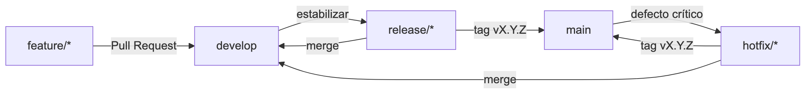</div>

<p><strong><em>Nota.</em></strong> Elaboración propia a partir del modelo de ramas GitFlow descrito por Driessen (2010).</p>

Las reglas de gestión de versiones y de mensajes son las siguientes. La Tabla 90 las resume con ejemplos del dominio de SafeFlow.

<p><strong>Tabla 90.</strong> <em>Reglas de ramas, versiones y mensajes de commit</em></p>

| Práctica | Regla | Ejemplo |
|:---|:---|:---|
| Ramas de funcionalidad | `feature/<bounded-context>-<descripcion>` en inglés, creadas desde `develop` | `feature/inventory-register-product` |
| Ramas de entrega | `release/<version>` creada desde `develop` | `release/0.1.0` |
| Ramas de corrección | `hotfix/<descripcion>` creada desde `main` | `hotfix/session-token-expiry` |
| Semantic Versioning | `MAJOR.MINOR.PATCH`: cambios incompatibles, funcionalidad nueva compatible, correcciones | `0.1.0` al cerrar el Sprint 1 |
| Conventional Commits | `<tipo>(<alcance>): <descripcion>` en imperativo e inglés; tipos `feat`, `fix`, `docs`, `test`, `refactor`, `chore` | `feat(inventory): register product with thermal range` |
| Commit de prueba | Tipo `test` con el contexto afectado | `test(iam): cover invalid credentials on sign in` |
| Integración | Pull Request hacia `develop` con al menos una revisión de otro integrante | Revisión de `feature/iam-sign-in` |

<p><strong><em>Nota.</em></strong> Elaboración propia. Los ejemplos son ilustrativos de la convención y no corresponden a commits ya realizados.</p>

La combinación de las dos primeras prácticas de la Tabla 90 con los prefijos de alcance por Bounded Context permite rastrear cada cambio hasta la historia de usuario que lo originó.

### 4.1.3. Source Code Style Guide & Conventions

El código sigue las Kotlin coding conventions y la Android Kotlin style guide, y se organiza con la arquitectura vigente de la aplicación: un paquete por Bounded Context bajo `features/<contexto>/`, con las capas `domain`, `application`, `infrastructure` y `presentation`, además de `core/ui` para el sistema visual compartido. Las convenciones se aplican a todo el código del proyecto, y la revisión de Pull Requests verifica su cumplimiento. La Tabla 91 resume las reglas.

<p><strong>Tabla 91.</strong> <em>Convenciones de código y estructura</em></p>

| Ámbito | Convención |
|:---|:---|
| Idioma de los identificadores | Clases, funciones, variables y paquetes en inglés; términos del Ubiquitous Language mapeados 1:1 (por ejemplo, `ProductRegistered`, `StockEntryRegistered`) |
| Nombres de clases | `PascalCase`; casos de uso con verbo en imperativo (`RegisterProductUseCase`); ViewModels terminados en `ViewModel` |
| Funciones y propiedades | `camelCase`; constantes en `UPPER_SNAKE_CASE` |
| Paquetes | Minúsculas, uno por Bounded Context: `iam`, `inventory`, `monitoring`, `alerts`, `logistics`, `reporting` |
| Capas | `domain` sin dependencias de Android; `application` depende de contratos del dominio; `infrastructure` implementa repositorios y transforma DTO y entidades locales a modelos del dominio; `presentation` usa Compose, ViewModel y StateFlow |
| Aislamiento entre contextos | Ningún contexto importa repositorios, DTO ni ViewModels de otro |
| Interfaz | Composables reutilizables en `core/ui`; tokens de color, tipografía, radio y espaciado centralizados |
| Pruebas de aceptación | Escenarios en Gherkin (`Given`, `When`, `Then`) con los criterios de aceptación de cada historia |
| Formato | Indentación de 4 espacios, líneas de hasta 120 caracteres, sin código comentado |

<p><strong><em>Nota.</em></strong> Elaboración propia a partir de Kotlin Foundation (s. f.), Google (s. f.-a) y la arquitectura vigente de la aplicación.</p>

Según la Tabla 91, la regla de mayor impacto es el aislamiento entre contextos, porque evita que los límites definidos en el diseño estratégico se erosionen durante la implementación.

### 4.1.4. Software Deployment Configuration

La aplicación Android se construye con Gradle y, durante el desarrollo, se genera como APK de depuración en `app/build/outputs/apk/debug/app-debug.apk` mediante la tarea `assembleDebug`. Para las sesiones de validación con usuarios, el equipo distribuirá las compilaciones a los dispositivos de prueba a través de Firebase App Distribution, de modo que cada participante instale la versión vigente sin necesidad de publicar la aplicación en una tienda. Antes de cada distribución se ejecutan `testDebugUnitTest` y `lintDebug`, y solo una compilación que pasa ambas tareas se publica a los evaluadores.

El servicio compartido, que recibe las mediciones simuladas de la aplicación emuladora y las sirve a la aplicación principal, se desplegará como servicio remoto accesible por HTTPS.

> Pendiente: plataforma, URL base y procedimiento de despliegue del servicio compartido.

### 4.1.5. Consideraciones éticas, i18n y accesibilidad

SafeFlow gestiona información operativa de empresas y datos de cuentas de usuario, por lo que el equipo adopta los principios del código de ética de ingeniería de software de ACM/IEEE y del Colegio de Ingenieros del Perú: veracidad en lo que se afirma del producto, respeto a la privacidad de los usuarios y responsabilidad por la calidad de lo entregado. Los términos y condiciones de servicio se muestran durante el registro de la cuenta, tal como lo contempla la historia US-30.

> Pendiente: texto de los términos y condiciones de servicio.

En internacionalización, la aplicación define como idiomas base el español latinoamericano (es_419) y el inglés (en_US), con los textos de interfaz en recursos de cadenas y no incrustados en el código. En accesibilidad, los componentes de `core/ui` exigen descripción de contenido (`contentDescription`) en íconos y botones de ícono, contraste suficiente en la paleta de colores semánticos y un objetivo táctil mínimo de 48 dp en los controles interactivos. Estas decisiones ya forman parte del sistema visual compartido, por lo que cada pantalla las hereda sin trabajo adicional.

<div style="page-break-after: always;"></div>

## 4.2. Landing Page, Services & Applications Implementation

Esta sección registra la implementación de los productos de la solución por Sprint. Para la entrega TB1 el alcance es la aplicación Android principal; el Landing Page, el servicio compartido y la aplicación emuladora se abordan en entregas posteriores. Cada Sprint se presenta con su planificación, la matriz de responsabilidades, el Sprint Backlog y las evidencias de desarrollo, pruebas, ejecución, documentación de servicios, despliegue y colaboración.

### 4.2.1. Sprint 1

El Sprint 1 construye el primer incremento funcional de la aplicación: el acceso de los usuarios (registro, inicio de sesión y control por rol) y los datos maestros del inventario (productos con su rango térmico, lotes, ingresos de stock y consulta). Se eligieron estas historias porque son la base de las demás: sin identidad y sin productos no es posible monitorear, alertar ni despachar.

#### 4.2.1.1. Sprint Planning 1

El Sprint Planning 1 fija el objetivo del Sprint, las historias comprometidas y la capacidad del equipo. La Tabla 92 reúne el resumen de la reunión. Los datos de fecha, hora, lugar y asistentes se completarán con el acta real de la reunión.

<p><strong>Tabla 92.</strong> <em>Resumen del Sprint Planning 1</em></p>

| Campo | Valor |
|:---|:---|
| Sprint | Sprint 1 |
| Date | Pendiente |
| Time | Pendiente |
| Location | Pendiente |
| Prepared By | Pendiente |
| Attendees | Pendiente |
| Sprint 0 Review Summary | No aplica: es el primer Sprint del proyecto. La base técnica Android (estructura por Bounded Context, sistema visual y verificación de compilación) se preparó antes del Sprint. |
| Sprint 0 Retrospective Summary | No aplica: no existe Sprint anterior. |
| Sprint 1 Goal | Ver el Sprint Goal inmediatamente debajo de esta tabla. |
| Sprint 1 Velocity | 21 Story Points |
| Sum of Story Points | 21 Story Points |

<p><strong><em>Nota.</em></strong> Elaboración propia. Los campos marcados como Pendiente requieren el acta de la reunión; la velocidad es la capacidad que el equipo se compromete a aceptar y coincide con la suma de la Tabla 93.</p>

> Pendiente: fecha, hora, lugar, responsable de preparación y asistentes del Sprint Planning 1.

El Sprint Goal se redactó con la plantilla de Scrum.org y con criterios SMART:

- **Our focus is on** que un usuario pueda registrarse, iniciar sesión y acceder solo a las funciones de su rol, y que el operador logístico pueda registrar productos con su rango de temperatura, lotes e ingresos de stock y consultar el inventario desde su celular.
- **We believe it delivers** a los operadores logísticos un control confiable de los productos sensibles a la temperatura desde el primer día de uso, y a los administradores una base de acceso que protege la información de la empresa.
- **This will be confirmed when** las siete historias del Sprint cumplen sus criterios de aceptación, un OPERADOR completa el flujo de registrar producto, lote e ingreso y lo ve reflejado en el inventario, y la compilación pasa `assembleDebug`, `testDebugUnitTest` y `lintDebug` sin errores al cierre del Sprint.

El objetivo es específico (siete historias nombradas), medible (criterios de aceptación y tareas de verificación), alcanzable (21 puntos), relevante (base de las demás entregas) y acotado en el tiempo (la duración del Sprint).

La Tabla 93 detalla las historias comprometidas y sus Story Points, según la estimación del backlog del producto.

<p><strong>Tabla 93.</strong> <em>Historias de usuario del Sprint 1</em></p>

| Id | Título | Bounded Context | Story Points |
|:---|:---|:---|:---:|
| US-31 | Iniciar sesión | IAM | 2 |
| US-18 | Controlar acceso por rol | IAM | 5 |
| US-30 | Registrarse en la aplicación | IAM | 3 |
| US-01 | Registrar producto | Inventory | 3 |
| US-19 | Registrar lote de producto | Inventory | 3 |
| US-02 | Registrar ingreso de stock | Inventory | 3 |
| US-10 | Consultar inventario | Inventory | 2 |
| **Total** | | | **21** |

<p><strong><em>Nota.</em></strong> Elaboración propia a partir del Product Backlog del Capítulo III.</p>

#### 4.2.1.2. Aspect Leaders and Collaborators

La matriz Leadership-and-Collaboration Matrix (LACX) indica, para cada aspecto del Sprint, quién lidera y quiénes colaboran. Los aspectos del Sprint 1 siguen las capas de la arquitectura: Domain y Application, Infrastructure, Presentation (UI), Pruebas y Documentación. La Tabla 94 muestra una propuesta neutra que reparte el liderazgo entre los cuatro integrantes según los perfiles declarados en el Capítulo I.

<p><strong>Tabla 94.</strong> <em>Leadership-and-Collaboration Matrix del Sprint 1 (propuesta)</em></p>

| Team Member | GitHub Username | Domain y Application | Infrastructure | Presentation (UI) | Pruebas | Documentación |
|:---|:---|:---:|:---:|:---:|:---:|:---:|
| Acosta Elera, Abraam Bernabe | Pendiente | L | C | C | C | C |
| Bustinza Muñoz, Sebastian Alonso | Pendiente | C | C | L | C | C |
| Mio Mejia, Andy Alejandro | Pendiente | C | L | C | C | C |
| Morales Yapuchura, Jefferson Bayron | Pendiente | C | C | C | L | L |

<p><strong><em>Nota.</em></strong> Elaboración propia. L indica líder y C colaborador. La asignación es una propuesta basada en los perfiles del equipo.</p>

> Pendiente: confirmar la asignación L/C con el equipo y completar los nombres de usuario de GitHub.

Como muestra la Tabla 94, todos colaboran en todos los aspectos y cada aspecto tiene un líder, lo que cumple con la regla del curso de que cada integrante participe en la implementación.

#### 4.2.1.3. Sprint Backlog 1

El Sprint Backlog 1 descompone cada historia del Sprint en tareas técnicas alineadas con las capas de la arquitectura. La Tabla 95 presenta las tareas con su estimación en horas, que es una propuesta inicial sujeta a ajuste en el Sprint Planning. La asignación y el estado se actualizarán a medida que avance el trabajo.

> Pendiente: captura del tablero del Sprint 1 y URL público del tablero.

<p><strong>Tabla 95.</strong> <em>Sprint Backlog 1: historias y tareas</em></p>

| US Id | US Título | Task Id | Task Título | Descripción | Estimación (h) | Assigned To | Status |
|:---|:---|:---|:---|:---|:---:|:---|:---|
| US-31 | Iniciar sesión | T-01 | Modelar sesión | Definir el modelo de sesión y el contrato del repositorio de sesión en `iam/domain` | 3 | Pendiente | To-do |
| US-31 | Iniciar sesión | T-02 | Caso de uso de inicio de sesión | Implementar `SignInUseCase` con manejo de credenciales inválidas | 4 | Pendiente | To-do |
| US-31 | Iniciar sesión | T-03 | Autenticación remota y sesión local | Implementar el adaptador Retrofit y el almacenamiento de sesión en DataStore | 6 | Pendiente | To-do |
| US-31 | Iniciar sesión | T-04 | Pantalla de inicio de sesión | Construir la pantalla Compose y su ViewModel con estados de carga y error | 6 | Pendiente | To-do |
| US-30 | Registrarse en la aplicación | T-05 | Modelar cuenta | Definir la cuenta de usuario y validaciones de correo y contraseña | 3 | Pendiente | To-do |
| US-30 | Registrarse en la aplicación | T-06 | Caso de uso de registro | Implementar `SignUpUseCase` con aceptación de términos y correo duplicado | 4 | Pendiente | To-do |
| US-30 | Registrarse en la aplicación | T-07 | Registro remoto | Implementar el adaptador de registro y la transformación de DTO a dominio | 4 | Pendiente | To-do |
| US-30 | Registrarse en la aplicación | T-08 | Pantalla de crear cuenta | Construir la pantalla Compose del mockup de crear cuenta con validación de campos | 6 | Pendiente | To-do |
| US-18 | Controlar acceso por rol | T-09 | Modelar roles y permisos | Definir los roles ADMIN, OPERADOR y SUPERVISOR y la política de permisos | 4 | Pendiente | To-do |
| US-18 | Controlar acceso por rol | T-10 | Autorización en casos de uso | Aplicar la verificación de permisos de la sesión en la capa de aplicación | 5 | Pendiente | To-do |
| US-18 | Controlar acceso por rol | T-11 | Navegación por rol | Mostrar solo las opciones permitidas y mensaje de acceso denegado en Compose | 6 | Pendiente | To-do |
| US-18 | Controlar acceso por rol | T-12 | Pantalla de permisos por rol | Construir la pantalla de permisos por rol para ADMIN según el mockup | 6 | Pendiente | To-do |
| US-01 | Registrar producto | T-13 | Modelar producto y rango térmico | Definir `Product` y `TemperatureRange` con reglas de validez | 4 | Pendiente | To-do |
| US-01 | Registrar producto | T-14 | Caso de uso de registro de producto | Implementar `RegisterProductUseCase` con campos obligatorios | 4 | Pendiente | To-do |
| US-01 | Registrar producto | T-15 | Persistencia de productos | Implementar entidad Room y repositorio de productos | 5 | Pendiente | To-do |
| US-01 | Registrar producto | T-16 | Formulario de producto | Construir la pantalla Compose de registrar producto | 6 | Pendiente | To-do |
| US-19 | Registrar lote de producto | T-17 | Modelar lote | Definir `Batch` vinculado al producto y regla de lote no vacío | 3 | Pendiente | To-do |
| US-19 | Registrar lote de producto | T-18 | Caso de uso de registro de lote | Implementar `RegisterBatchUseCase` con detección de lote duplicado | 4 | Pendiente | To-do |
| US-19 | Registrar lote de producto | T-19 | Persistencia de lotes | Implementar entidad Room y repositorio de lotes | 4 | Pendiente | To-do |
| US-19 | Registrar lote de producto | T-20 | Formulario de lote | Construir la pantalla Compose de registrar lote | 5 | Pendiente | To-do |
| US-02 | Registrar ingreso de stock | T-21 | Modelar ingreso de stock | Definir el ingreso y la regla de cantidad mayor que cero | 3 | Pendiente | To-do |
| US-02 | Registrar ingreso de stock | T-22 | Caso de uso de ingreso | Implementar `RegisterStockEntryUseCase` que actualiza el stock del producto | 4 | Pendiente | To-do |
| US-02 | Registrar ingreso de stock | T-23 | Persistencia de stock | Implementar actualización de stock en Room dentro de una transacción | 4 | Pendiente | To-do |
| US-02 | Registrar ingreso de stock | T-24 | Formulario de ingreso | Construir la pantalla Compose de registrar ingreso | 5 | Pendiente | To-do |
| US-10 | Consultar inventario | T-25 | Consulta de inventario | Implementar `GetInventoryUseCase` que entrega nombre, cantidad, estado y rango | 4 | Pendiente | To-do |
| US-10 | Consultar inventario | T-26 | Lista y estado vacío | Construir la pantalla Compose de inventario con estado vacío y acción de registro | 6 | Pendiente | To-do |
| US-10 | Consultar inventario | T-27 | Adaptación a tableta | Adaptar la lista del inventario a ancho de tableta con el sistema visual compartido | 4 | Pendiente | To-do |

<p><strong><em>Nota.</em></strong> Elaboración propia. Las estimaciones en horas son una propuesta; la asignación y el estado se actualizarán durante el Sprint.</p>

La Tabla 95 contiene 27 tareas que cubren las cuatro capas en cada historia, de modo que ninguna historia queda con trabajo solo de interfaz o solo de dominio.

#### 4.2.1.4. Development Evidence for Sprint Review

Esta sección debe evidenciar, por repositorio, los commits relacionados con la implementación del Sprint 1. Estado actual: el proyecto Android contiene la base técnica sobre la que se implementarán las historias, es decir, la estructura de los seis Bounded Contexts por capas, el sistema visual compartido en `core/ui` y una compilación verificada con `assembleDebug`. Todavía no hay funcionalidades de negocio implementadas y el proyecto aún no está inicializado como repositorio Git, por lo que no existen commits que registrar. La Tabla 96 queda lista para completarse.

<p><strong>Tabla 96.</strong> <em>Commits de implementación del Sprint 1</em></p>

| Repository | Branch | Commit Id | Commit Message | Commit Message Body | Committed on (Date) |
|:---|:---|:---|:---|:---|:---|
| Pendiente | Pendiente | Pendiente | Pendiente | Pendiente | Pendiente |

<p><strong><em>Nota.</em></strong> Se completará con los commits reales una vez inicializados los repositorios.</p>

> Pendiente: inicializar el repositorio Git de la aplicación Android y registrar los commits del Sprint 1.

#### 4.2.1.5. Testing Suite Evidence for Sprint Review

Esta sección presenta las pruebas automatizadas asociadas a las historias del Sprint: pruebas unitarias de los casos de uso y del dominio, y escenarios de aceptación en Gherkin derivados de los criterios de aceptación de cada historia. Estado actual: la tarea `testDebugUnitTest` se ejecuta correctamente sobre la base del proyecto, pero aún no existen pruebas de las historias porque no hay funcionalidades implementadas. La Tabla 97 registrará los commits de pruebas.

<p><strong>Tabla 97.</strong> <em>Commits de pruebas del Sprint 1</em></p>

| Repository | Branch | Commit Id | Commit Message | Commit Message Body | Committed on (Date) |
|:---|:---|:---|:---|:---|:---|
| Pendiente | Pendiente | Pendiente | Pendiente | Pendiente | Pendiente |

<p><strong><em>Nota.</em></strong> Se completará con los commits de tipo `test` y la relación entre pruebas y historias.</p>

> Pendiente: relación de pruebas unitarias, archivos `.feature` en Gherkin con sus Steps y commits de pruebas.

#### 4.2.1.6. Execution Evidence for Sprint Review

Esta sección debe mostrar capturas de las vistas implementadas en el emulador o en un dispositivo, junto con un video que ilustre la navegación lograda en el Sprint. Hasta que existan las pantallas funcionales, el diseño de referencia de cada vista son los mockups del Capítulo III. La Tabla 98 organiza la evidencia por historia.

<p><strong>Tabla 98.</strong> <em>Evidencia de ejecución por historia del Sprint 1</em></p>

| Historia | Vista implementada | Captura | Estado |
|:---|:---|:---|:---|
| US-31 Iniciar sesión | Iniciar sesión | Pendiente | Por implementar |
| US-30 Registrarse en la aplicación | Crear cuenta | Pendiente | Por implementar |
| US-18 Controlar acceso por rol | Permisos por rol | Pendiente | Por implementar |
| US-01 Registrar producto | Registrar producto | Pendiente | Por implementar |
| US-19 Registrar lote de producto | Registrar lote | Pendiente | Por implementar |
| US-02 Registrar ingreso de stock | Registrar ingreso | Pendiente | Por implementar |
| US-10 Consultar inventario | Inventario | Pendiente | Por implementar |

<p><strong><em>Nota.</em></strong> Elaboración propia. Las capturas se agregarán cuando cada vista esté implementada.</p>

> Pendiente: capturas de pantalla de las vistas implementadas y URL del video de la navegación del Sprint 1.

#### 4.2.1.7. Services Documentation Evidence for Sprint Review

Esta sección documenta los endpoints del servicio compartido que consume la aplicación en el Sprint 1 (autenticación y registro de cuentas, y datos de inventario cuando corresponda), en formato OpenAPI, con método, ruta, parámetros y respuestas. El servicio compartido aún no tiene contrato publicado, por lo que no se documentan endpoints en este informe.

> Pendiente: contrato OpenAPI del servicio compartido y relación de endpoints utilizados en el Sprint 1.

#### 4.2.1.8. Software Deployment Evidence for Sprint Review

Esta sección debe evidenciar los pasos del despliegue del Sprint 1: construcción del APK de depuración, ejecución de las verificaciones y distribución a los evaluadores. Estado actual: la compilación `assembleDebug` genera el APK en `app/build/outputs/apk/debug/app-debug.apk`, y las tareas `testDebugUnitTest` y `lintDebug` terminan sin errores sobre la base del proyecto. La distribución por Firebase App Distribution y la publicación del servicio compartido aún no se ejecutan.

> Pendiente: capturas de la compilación, de la distribución en Firebase App Distribution y del despliegue del servicio compartido.

#### 4.2.1.9. Team Collaboration Insights during Sprint 1

Esta sección presenta las analíticas de colaboración del repositorio (commits por integrante, líneas modificadas y Pull Requests) y la interpretación del equipo. Su objetivo es comprobar que los cuatro integrantes participan en la implementación. Como el repositorio Git aún no existe, no hay analíticas que mostrar.

> Pendiente: capturas de las analíticas de GitHub por integrante y redacción de su interpretación al cierre del Sprint 1.

<div style="page-break-after: always;"></div>

## 4.3. Validation Interviews

Las entrevistas de validación comprueban con usuarios reales de los segmentos objetivo (empresas del sector farmacéutico y operadores logísticos) que la aplicación resuelve sus tareas con claridad. En esta etapa el equipo definió el diseño de las entrevistas y la plantilla de evaluación; las sesiones se realizarán cuando existan flujos funcionales instalables.

### 4.3.1. Diseño de Entrevistas

Cada sesión se realiza con un usuario del segmento, con una compilación instalada mediante Firebase App Distribution, y se registra en video. El participante ejecuta tareas guiadas mientras el equipo observa y anota. La Tabla 99 define, por segmento, los elementos a validar y los flujos de usuario del Sprint 1.

<p><strong>Tabla 99.</strong> <em>Diseño de las sesiones de validación por segmento</em></p>

| Segmento | Elementos a validar | Flujos de usuario del Sprint 1 | Pregunta guía |
|:---|:---|:---|:---|
| Empresas del sector farmacéutico | Claridad del rango de temperatura del producto, trazabilidad por lote, control de acceso por rol | Inicio de sesión; registro de producto con rango térmico; registro de lote; consulta de inventario | ¿Se identifica con claridad qué productos y lotes están registrados y bajo qué condiciones deben conservarse? |
| Operadores logísticos | Rapidez del registro desde el celular, facilidad del ingreso de stock, lectura del inventario | Inicio de sesión; registro de ingreso de stock; consulta de inventario; registro de lote | ¿Puede registrar un ingreso y verificarlo en el inventario sin ayuda y con pocos pasos? |

<p><strong><em>Nota.</em></strong> Elaboración propia. El Landing Page se incorporará a las sesiones cuando esté disponible.</p>

Como muestra la Tabla 99, ambos segmentos recorren el inicio de sesión y la consulta de inventario, lo que permite comparar la percepción de dos perfiles sobre las mismas pantallas.

### 4.3.2. Registro de Entrevistas

Para cada segmento se realizarán de 3 a 5 entrevistas. Cada registro incluirá nombres, apellidos, edad, distrito, una captura del video, el URL del video con el minuto de inicio y su duración, y un resumen de las apreciaciones del entrevistado sobre las tareas asignadas. La Tabla 100 queda preparada para completarse.

<p><strong>Tabla 100.</strong> <em>Registro de entrevistas de validación</em></p>

| Segmento | Nombres y apellidos | Edad | Distrito | Captura | URL del video, inicio y duración | Resumen |
|:---|:---|:---:|:---|:---|:---|:---|
| Pendiente | Pendiente | Pendiente | Pendiente | Pendiente | Pendiente | Pendiente |

<p><strong><em>Nota.</em></strong> Se agregará una fila por entrevista realizada.</p>

> Pendiente: realizar las entrevistas (3 a 5 por segmento) y completar el registro con su evidencia en video.

### 4.3.3. Evaluaciones según heurísticas

La evaluación según heurísticas analiza lo observado en las sesiones desde la usabilidad, la arquitectura de información y el diseño inclusivo, con el formato del Anexo B. La siguiente ficha identifica la evaluación y las tareas que alcanza.

**Carrera:** Ingeniería de Software · **Curso:** 1ACC0238 Aplicaciones para Plataformas Móviles · **NRC:** Pendiente · **Profesores:** Todos · **Auditor:** Equipo de SafeFlow · **Cliente(s):** Pendiente (participantes de las sesiones)

**App a evaluar:** SafeFlow (aplicación Android)

**Tareas a evaluar:**

1. Registro de una cuenta nueva
2. Inicio de sesión
3. Registro de un producto con su rango de temperatura
4. Registro de un lote
5. Registro de un ingreso de stock
6. Consulta del inventario

**Tareas no incluidas en esta versión:** monitoreo térmico, alertas, despachos y reportes, previstos para Sprints posteriores.

Los problemas se puntúan con la escala de severidad de la Tabla 101.

<p><strong>Tabla 101.</strong> <em>Escala de severidad de los problemas de usabilidad</em></p>

| Nivel | Descripción |
|:---:|:---|
| 1 | Problema superficial: el usuario lo supera con facilidad y ocurre con muy poca frecuencia. Se corrige solo si hay tiempo disponible. |
| 2 | Problema menor: ocurre algo más seguido o es algo más difícil de superar. Prioridad baja para el siguiente release. |
| 3 | Problema mayor: ocurre con frecuencia o los usuarios no logran resolverlo. Debe corregirse con prioridad alta. |
| 4 | Problema muy grave: impide continuar con el uso de la herramienta. Debe corregirse antes del lanzamiento. |

<p><strong><em>Nota.</em></strong> Escala del formato de evaluación de User Experience según heurísticas del curso.</p>

La Tabla 102 resume los problemas encontrados; se completará con una fila por problema tras las sesiones.

<p><strong>Tabla 102.</strong> <em>Tabla resumen de problemas detectados</em></p>

| # | Problema | Escala de severidad | Heurística o principio violado |
|:---:|:---|:---:|:---|
| Pendiente | Pendiente | Pendiente | Pendiente |

<p><strong><em>Nota.</em></strong> Las heurísticas se tomarán de las categorías Usability, Inclusive Design e Information Architecture.</p>

> Pendiente: completar la tabla resumen y las descripciones de problemas (formato en el Anexo B) con las observaciones de las sesiones de validación.

<div style="page-break-after: always;"></div>

# Conclusiones y recomendaciones

Esta conclusión es parcial y corresponde a la entrega TB1: contrasta lo logrado hasta ahora con el problema y las hipótesis del Capítulo I, señala los límites del avance y propone los siguientes pasos. Las hipótesis de prevención, trazabilidad, eficiencia e integridad aún no pueden confirmarse ni refutarse, porque dependen de monitoreo, alertas y despachos funcionando y de validaciones con usuarios.

**Resultados a la fecha.** El problema planteado es la falta de monitoreo continuo y de trazabilidad integrada en la cadena de frío. Frente a él, el equipo cuenta con los requisitos y las historias de usuario priorizadas, el diseño estratégico de Domain-Driven Design con seis Bounded Contexts y su Context Map, el diseño táctico de los agregados, los mockups de las pantallas principales con su sistema visual, y una base técnica Android con la estructura por contextos y capas, un sistema visual compartido y compilación verificada. Esa base cubre el soporte técnico de las hipótesis de trazabilidad (Inventory y Logistics) y de prevención (Monitoring y Alerts), sin implementarlas todavía.

**Límites.** No hay funcionalidades de negocio implementadas, no existe aún el repositorio Git ni las pruebas de las historias, no se realizaron entrevistas de validación y las métricas de las hipótesis (reducción de pérdidas, tiempo de respuesta, uso de herramientas externas) no se han medido. Además, el alcance trabaja con mediciones simuladas y no con hardware físico, por lo que los resultados se interpretarán como validación del flujo y no de sensores reales.

**Próximos pasos (roadmap propuesto).** La Tabla 103 propone la distribución por Sprint, sujeta a ajuste en cada Sprint Planning.

<p><strong>Tabla 103.</strong> <em>Roadmap propuesto por Sprint</em></p>

| Sprint | Enfoque | Historias | Resultado esperado |
|:---|:---|:---|:---|
| Sprint 1 | Acceso e inventario | US-01, 02, 10, 18, 19, 30, 31 | Registro, sesión, roles e inventario operativos |
| Sprint 2 | Monitoreo térmico | US-03, 04, 17, 20, 52 | Lecturas, historial y detección de excursiones |
| Sprint 3 | Alertas y despachos | US-05, 06, 55, 07, 24, 25, 47, 61 | Alertas con acción correctiva y despachos con condición térmica |
| Sprint 4 | Reportes, adaptación y validación | US-13, 34 | Reportes consolidados, adaptación a tableta y validación con usuarios |

<p><strong><em>Nota.</em></strong> Elaboración propia. Las fechas y la asignación definitiva de historias se confirmarán en cada Sprint Planning.</p>

Como indica la Tabla 103, el orden sigue las dependencias entre contextos: primero identidad e inventario, luego el monitoreo que consume el rango térmico, y después las alertas y despachos que consumen sus eventos. Se recomienda ejecutar las entrevistas de validación en cuanto el flujo de inventario del Sprint 1 sea instalable, para incorporar el feedback antes del Sprint 2.

<div style="page-break-after: always;"></div>

# Videos

Esta sección describe los tres videos del proyecto. Para cada uno se indica su propósito; los enlaces y la evidencia se completarán cuando los videos estén producidos.

## Video About-the-Product

El video presenta a los visitantes y a los usuarios de la aplicación el modelo de negocio de SafeFlow y sus características principales: registro de productos con rango térmico, supervisión y alertas, y trazabilidad de los despachos. Mantiene el tono del producto e incluirá el testimonio de un usuario que participó en las entrevistas de validación.

> Pendiente: captura representativa, URL (OneDrive o YouTube) y duración del video.

## Video App Validation

El video documenta la prueba de la aplicación con usuarios, instalada a través de Firebase App Distribution, e integra la evaluación según heurísticas descrita en 4.3.3.

> Pendiente: captura representativa, URL (OneDrive o YouTube) y duración del video.

## Video About-the-Team

El video resume el proceso de trabajo del equipo, con escenas de sesiones reales de trabajo y los testimonios de los integrantes, y se acompañará de la pauta de secuencias con el tiempo de inicio de cada sección.

> Pendiente: captura representativa, URLs de Microsoft Stream y de YouTube, pauta de secuencias (hh:mm:ss) y duración del video.

<div style="page-break-after: always;"></div>

# Glosario

El glosario define los términos y acrónimos usados en el informe, para facilitar su lectura a públicos técnicos y no técnicos. La Tabla 104 los ordena alfabéticamente.

<p><strong>Tabla 104.</strong> <em>Glosario de términos y acrónimos</em></p>

| Término | Definición |
|:---|:---|
| a11y | Accesibilidad: diseño que permite el uso del producto a personas con distintas capacidades. |
| ACL | Anti-Corruption Layer: capa que traduce el modelo de otro sistema o contexto al modelo propio. |
| Aggregate | Agrupación de entidades y objetos de valor que se modifica como una unidad consistente. |
| APK | Android Package: archivo de instalación de una aplicación Android. |
| Bounded Context (BC) | Límite dentro del cual un modelo de dominio y su lenguaje son consistentes. |
| C4 | Modelo de diagramas de arquitectura en cuatro niveles: contexto, contenedores, componentes y código. |
| Cadena de frío | Conjunto de procesos de almacenamiento y transporte que mantienen un producto dentro de un rango de temperatura. |
| Conformist | Patrón de relación en el que el contexto downstream adopta el modelo del upstream sin traducirlo. |
| Context Map | Diagrama que describe las relaciones entre Bounded Contexts. |
| Conventional Commits | Convención para redactar mensajes de commit con tipo, alcance y descripción. |
| Customer/Supplier | Patrón de relación en el que el contexto upstream atiende las necesidades del downstream. |
| DDD | Domain-Driven Design: enfoque de diseño que centra el software en el modelo del dominio. |
| Domain Event | Hecho relevante del dominio ocurrido en el pasado, por ejemplo Lote registrado. |
| DoD | Definition of Done: criterios para considerar terminado un trabajo. |
| EventStorming | Taller colaborativo para descubrir eventos, comandos y límites de un dominio. |
| Excursión térmica | Condición en la que la temperatura de un producto sale de su rango permitido. |
| GitFlow | Estrategia de ramas basada en `main`, `develop`, `feature/*`, `release/*` y `hotfix/*`. |
| Heurística | Principio de evaluación de la experiencia de usuario, como los de usabilidad de Nielsen. |
| i18n | Internacionalización: preparación del producto para varios idiomas y regiones. |
| LACX | Leadership-and-Collaboration Matrix: matriz de líderes y colaboradores por aspecto. |
| Lean UX | Enfoque de diseño de experiencia basado en hipótesis y aprendizaje rápido. |
| MoSCoW | Técnica de priorización: Must, Should, Could y Won't have. |
| MVVM | Model-View-ViewModel: patrón que separa la vista, el estado y la lógica de presentación. |
| OHS | Open Host Service: servicio con protocolo bien definido que ofrece un contexto a otros. |
| Published Language | Lenguaje documentado y compartido para intercambiar información entre contextos. |
| SMART | Criterios de un objetivo: Specific, Measurable, Attainable, Relevant y Time-bound. |
| Scrum | Marco de trabajo ágil que organiza el trabajo en Sprints. |
| Semantic Versioning | Esquema de versiones MAJOR.MINOR.PATCH según el tipo de cambio. |
| Sprint Backlog | Historias y tareas que el equipo se compromete a trabajar en un Sprint. |
| Sprint Goal | Objetivo único del Sprint que da coherencia al trabajo. |
| Story Point | Unidad relativa para estimar el esfuerzo de una historia de usuario. |
| Ubiquitous Language | Vocabulario común entre el equipo y el negocio que se usa también en el código. |
| US | User Story: historia de usuario que describe una necesidad desde la perspectiva del usuario. |
| Velocity | Cantidad de Story Points que el equipo puede aceptar en un Sprint. |

<p><strong><em>Nota.</em></strong> Elaboración propia.</p>

<div style="page-break-after: always;"></div>

# Bibliografía

Las referencias siguen el formato APA 7 y se agrupan en las tres categorías del Anexo G. La primera agrupa las fuentes del dominio de negocio, que sustentan la problemática de la cadena de frío y la supervisión térmica; la segunda reúne los métodos y técnicas de ingeniería de software, como Domain-Driven Design, EventStorming, el modelo C4, Scrum y las heurísticas de usabilidad; la tercera incluye los lenguajes, frameworks y herramientas utilizados en la implementación. Los cuatro artículos académicos fueron verificados en la página del editor o en el registro del DOI; su cuartil SCImago no se afirma porque no fue verificado.

> Pendiente: completar papers Q1/Q2 (4 verificados de 4 en título, autores, año, revista y DOI; falta verificar el cuartil SCImago de cada revista).

## Dominio de negocio

- FAO. (2019). *The state of food and agriculture 2019: Moving forward on food loss and waste reduction*. Food and Agriculture Organization of the United Nations. https://www.fao.org/3/ca6030en/ca6030en.pdf
- Informes de Expertos. (2026). *Mercado logístico de la cadena de frío en Perú, 2026-2035*. https://www.informesdeexpertos.com/informes/mercado-de-logistico-de-la-cadena-de-frio-en-peru
- Matthias, D. M., Robertson, J., Garrison, M. M., Newland, S., & Nelson, C. (2007). Freezing temperatures in the vaccine cold chain: A systematic literature review. *Vaccine, 25*(20), 3980-3986. https://doi.org/10.1016/j.vaccine.2007.02.052
- Müller, W. A., Ferreira, S. B., & da Silva, S. B. (2026). Enhancing food safety in the cold chain through Internet of Things and artificial intelligence. *Journal of Food Science, 91*(2), Article e70871. https://doi.org/10.1111/1750-3841.70871
- Perú Retail. (2024, 10 de diciembre). *Sector farmacéutico peruano proyecta crecimiento del 4 % para el 2025*. https://www.peru-retail.com/sector-farmaceutico-peruano-proyecta-crecimiento-del-4-para-el-2025/
- Taguta, J., Nturambirwe, J. F. I., & Nyirenda, C. N. (2026). Towards IoT-Fog-ML integration for temperature break detection and prediction in fresh produce cold chains: A systematic review and architectural framework. *Frontiers in Artificial Intelligence, 9*, Article 1830032. https://doi.org/10.3389/frai.2026.1830032
- United Nations Environment Programme. (2024). *Food waste index report 2024*. https://www.unep.org/resources/publication/food-waste-index-report-2024
- White, C. (2020, 24 de enero). Investing in supply chain visibility can save billions in pharmaceutical logistics. *FreightWaves*. https://www.freightwaves.com/news/investing-in-supply-chain-visibility-can-save-billions-in-pharmaceutical-logistics

## Métodos y técnicas de ingeniería de software

- Özkan, O., Babur, Ö., & van den Brand, M. (2025). Domain-driven design in software development: A systematic literature review on implementation, challenges, and effectiveness. *Journal of Systems and Software, 230*, Article 112537. https://doi.org/10.1016/j.jss.2025.112537
- Suarez-Carvajal, F.-E., Lobo-Quintero, R., Santoyo, J., Pinzon-Castellanos, J., & Gamba-Gonzalez, Y. (2026). MVVM in the era of modern Android: A systematic literature review and taxonomy of architectural trade-offs. *CLEI Electronic Journal, 29*(2). https://doi.org/10.19153/cleiej.29.2.8
- Brandolini, A. (2013). *Introducing EventStorming*. Leanpub.
- Brown, S. (s. f.). *The C4 model for visualising software architecture*. https://c4model.com
- DDD Crew. (s. f.). *Domain-Driven Design Crew* [Repositorios]. GitHub. https://github.com/ddd-crew
- Driessen, V. (2010). *A successful Git branching model*. https://nvie.com/posts/a-successful-git-branching-model/
- Evans, E. (2003). *Domain-driven design: Tackling complexity in the heart of software*. Addison-Wesley.
- Nielsen, J. (1994). *10 usability heuristics for user interface design*. Nielsen Norman Group. https://www.nngroup.com/articles/ten-usability-heuristics/
- Preston-Werner, T. (s. f.). *Semantic versioning 2.0.0*. https://semver.org
- Schwaber, K., & Sutherland, J. (2020). *The Scrum Guide*. https://scrumguides.org
- Conventional Commits. (s. f.). *Conventional Commits 1.0.0*. https://www.conventionalcommits.org/en/v1.0.0/

## Lenguajes, frameworks y herramientas

- Figma. (s. f.). *Figma developer documentation*. https://www.figma.com/developers
- Google. (s. f.-a). *Kotlin style guide*. Android Developers. https://developer.android.com/kotlin/style-guide
- Google. (s. f.-b). *Jetpack Compose*. Android Developers. https://developer.android.com/compose
- Google. (s. f.-c). *Firebase App Distribution*. Firebase. https://firebase.google.com/docs/app-distribution
- Google. (s. f.-d). *Google Stitch*. https://stitch.withgoogle.com
- Kotlin Foundation. (s. f.). *Coding conventions*. Kotlin Documentation. https://kotlinlang.org/docs/coding-conventions.html

<div style="page-break-after: always;"></div>

# Anexos

## Anexo A. Videos de Exposiciones

Este anexo reúne los enlaces a los videos de las exposiciones del proyecto. La Tabla 105 los organiza por entrega.

<p><strong>Tabla 105.</strong> <em>Videos de exposiciones por entrega</em></p>

| Entrega | Contenido de la exposición | Enlace |
|:---|:---|:---|
| TB1 (Sprint 1) | Presentación del informe, el diseño y la base técnica de la aplicación | Pendiente |
| TB2 | Avance de implementación y validaciones | Pendiente |
| TF | Exposición final del producto | Pendiente |

<p><strong><em>Nota.</em></strong> Los enlaces corresponden a videos privados alojados en OneDrive.</p>

> Pendiente: enlaces privados de los videos de exposición.

<div style="page-break-after: always;"></div>

## Anexo B. Formato de evaluación heurística

Este anexo contiene el formato para describir cada problema detectado en la evaluación según heurísticas de 4.3.3. Se agrega una ficha por cada fila de la Tabla 102, con la estructura de la Tabla 106.

<p><strong>Tabla 106.</strong> <em>Ficha de descripción de un problema</em></p>

| Campo | Contenido |
|:---|:---|
| Problema # | Pendiente |
| Título | Pendiente |
| Severidad | Pendiente (1 a 4, según la Tabla 101) |
| Heurística violada | Pendiente (Usability, Inclusive Design o Information Architecture) |
| Problema | Pendiente: descripción de lo observado y de la tarea en la que ocurrió |
| Recomendación | Pendiente: acción propuesta para corregirlo |
| Evidencia | Pendiente: captura de pantalla o minuto del video |

<p><strong><em>Nota.</em></strong> Estructura del formato de evaluación de User Experience según heurísticas del curso; se completa tras las sesiones de validación.</p>
